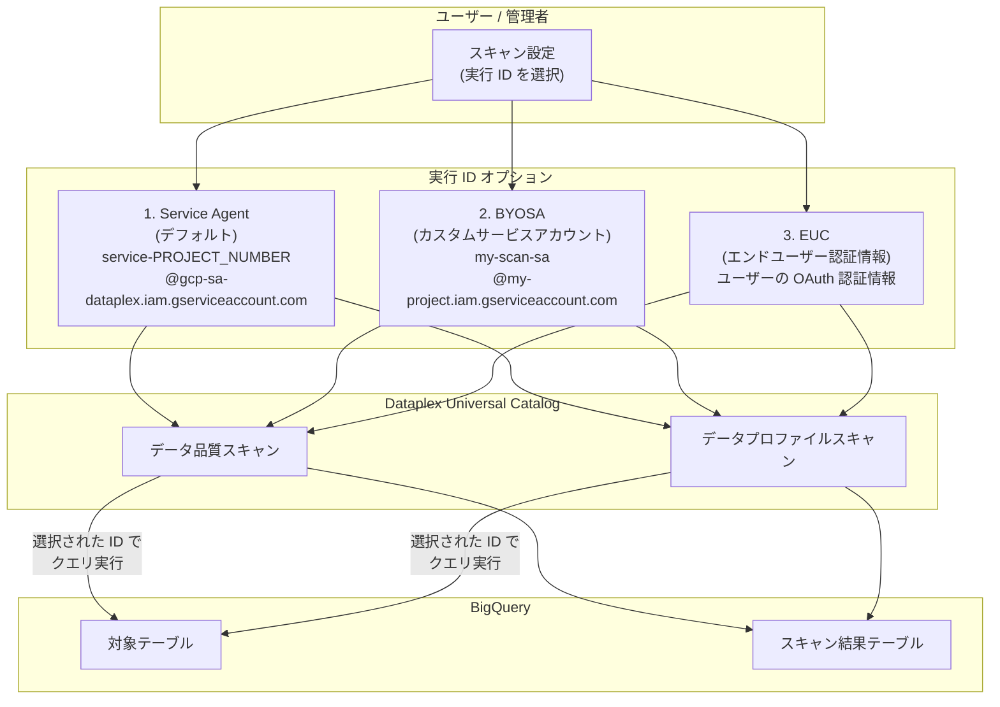

# Dataplex: データ品質スキャン・データプロファイルスキャンにカスタム実行 ID を指定可能に

**リリース日**: 2026-04-09

**サービス**: Dataplex Universal Catalog

**機能**: データ品質スキャン・データプロファイルスキャンのカスタム実行 ID (Custom Execution Identity)

**ステータス**: GA (一般提供)

[このアップデートのインフォグラフィックを見る](https://takech9203.github.io/google-cloud-news-summary/20260409-dataplex-custom-execution-identity.html)

## 概要

Dataplex Universal Catalog のデータ品質スキャン (Data Quality Scan) およびデータプロファイルスキャン (Data Profile Scan) において、カスタム実行 ID (Custom Execution Identity) を指定できるようになりました。これにより、スキャン実行時に使用される認証情報を、従来のデフォルトである Dataplex Service Agent 以外の ID に変更することが可能になります。

新たに利用可能な実行 ID オプションは、カスタムサービスアカウント (Bring Your Own Service Account: BYOSA) とエンドユーザー認証情報 (End-User Credentials: EUC) の 2 つです。これらのオプションにより、最小権限の原則の適用、BigQuery のきめ細かなアクセス制御の活用、スキャン処理コストの BigQuery への直接的な統合が実現されます。

このアップデートは、データガバナンスやセキュリティのベストプラクティスを重視する組織にとって重要な改善です。特にマルチテナント環境や、厳格なアクセス制御が求められるデータ基盤を運用しているチームにとって、スキャンの実行権限を細かく管理できるようになる点が大きなメリットとなります。

**アップデート前の課題**

- データ品質スキャンおよびデータプロファイルスキャンは、常に Dataplex Service Agent (`service-PROJECT_NUMBER@gcp-sa-dataplex.iam.gserviceaccount.com`) を使用して実行されていた
- Service Agent に対して広範な権限 (BigQuery Data Viewer、BigQuery Job User など) を付与する必要があり、最小権限の原則の適用が困難だった
- BigQuery の行レベルセキュリティや列レベルセキュリティなどのきめ細かなアクセス制御を、スキャン実行に対して適用することが難しかった
- スキャン処理に伴う BigQuery のコストが Service Agent のプロジェクトに紐付けられ、コスト配分の管理が煩雑だった

**アップデート後の改善**

- Service Agent に加えて、カスタムサービスアカウント (BYOSA) またはエンドユーザー認証情報 (EUC) を実行 ID として指定可能になった
- 各スキャンに対して必要最小限の権限を持つサービスアカウントを割り当てることで、最小権限の原則を適用できるようになった
- BigQuery の行レベルセキュリティ・列レベルセキュリティと連携した、きめ細かなアクセス制御が可能になった
- スキャン処理コストをカスタムサービスアカウントのプロジェクトや、エンドユーザーのプロジェクトに直接紐付けることで、コスト配分が明確になった

## アーキテクチャ図



Dataplex のデータ品質スキャンおよびデータプロファイルスキャンの実行時に、3 つの実行 ID オプション (Service Agent、BYOSA、EUC) から選択可能になりました。選択された ID の権限に基づいて BigQuery テーブルへのアクセスとクエリ実行が行われます。

## サービスアップデートの詳細

### 主要機能

1. **Service Agent (デフォルト)**
   - 従来と同様に、Dataplex Service Agent を使用してスキャンを実行する
   - サービスアカウントのメールアドレスは `service-PROJECT_NUMBER@gcp-sa-dataplex.iam.gserviceaccount.com` の形式
   - 追加の設定なしで利用可能

2. **BYOSA (Bring Your Own Service Account)**
   - ユーザーが作成・管理するカスタムサービスアカウントを実行 ID として使用する
   - スキャン対象のテーブルに対して必要最小限の権限のみを付与できる
   - BigQuery のジョブコストがカスタムサービスアカウントのプロジェクトに紐付けられる
   - BigQuery の行レベルセキュリティ・列レベルセキュリティと連携可能

3. **EUC (End-User Credentials)**
   - スキャンを作成・実行するユーザー自身の OAuth 認証情報を使用する
   - ユーザーのアクセス権限の範囲内でスキャンが実行される
   - BigQuery のジョブコストがエンドユーザーのプロジェクトに直接紐付けられる
   - ユーザーごとのアクセス制御が自動的に反映される

## 技術仕様

### 実行 ID オプションの比較

| 項目 | Service Agent (デフォルト) | BYOSA | EUC |
|------|--------------------------|-------|-----|
| 認証主体 | Dataplex Service Agent | カスタムサービスアカウント | エンドユーザー |
| 権限管理 | Service Agent に一括付与 | サービスアカウントごとに個別設定 | ユーザーの既存権限を利用 |
| コスト帰属 | Dataplex プロジェクト | カスタム SA のプロジェクト | ユーザーのプロジェクト |
| 行レベルセキュリティ | Service Agent の権限に依存 | SA ごとに細かく制御可能 | ユーザーの権限に自動連動 |
| 列レベルセキュリティ | Service Agent の権限に依存 | SA ごとに細かく制御可能 | ユーザーの権限に自動連動 |
| 管理の複雑さ | 低 | 中 | 低 |

### 必要な IAM ロール

BYOSA を使用する場合、カスタムサービスアカウントに以下のロールが必要です。

| ロール | リソースレベル | 用途 |
|--------|-------------|------|
| `roles/bigquery.jobUser` | プロジェクト | BigQuery ジョブの実行 |
| `roles/bigquery.dataViewer` | テーブル / データセット | スキャン対象テーブルの読み取り |
| `roles/bigquery.dataEditor` | データセット / テーブル | スキャン結果のエクスポート |
| `roles/dataplex.metadataReader` | プロジェクト / Lake | Dataplex メタデータの読み取り |
| `roles/dataplex.viewer` | プロジェクト / Lake | Dataplex リソースの参照 |
| `roles/storage.objectViewer` | バケット | Cloud Storage 外部テーブルのスキャン (該当する場合) |

## 設定方法

### 前提条件

1. Dataplex Universal Catalog API が有効化されていること
2. スキャン対象の BigQuery テーブルが存在すること
3. BYOSA を使用する場合、カスタムサービスアカウントが作成済みであること

### 手順

#### ステップ 1: カスタムサービスアカウントの作成 (BYOSA の場合)

```bash
# サービスアカウントの作成
gcloud iam service-accounts create dataplex-scan-sa \
    --display-name="Dataplex Scan Custom SA" \
    --project=PROJECT_ID
```

#### ステップ 2: 必要な IAM ロールの付与 (BYOSA の場合)

```bash
# BigQuery Job User ロールの付与
gcloud projects add-iam-policy-binding PROJECT_ID \
    --member="serviceAccount:dataplex-scan-sa@PROJECT_ID.iam.gserviceaccount.com" \
    --role="roles/bigquery.jobUser"

# BigQuery Data Viewer ロールの付与 (テーブルレベル)
gcloud bigquery tables add-iam-policy-binding DATASET_ID.TABLE_ID \
    --member="serviceAccount:dataplex-scan-sa@PROJECT_ID.iam.gserviceaccount.com" \
    --role="roles/bigquery.dataViewer"

# BigQuery Data Editor ロールの付与 (結果エクスポート用)
gcloud bigquery datasets add-iam-policy-binding RESULTS_DATASET_ID \
    --member="serviceAccount:dataplex-scan-sa@PROJECT_ID.iam.gserviceaccount.com" \
    --role="roles/bigquery.dataEditor"
```

#### ステップ 3: スキャンの作成時に実行 ID を指定

データ品質スキャンまたはデータプロファイルスキャンの作成・更新時に、実行 ID オプションを設定します。Google Cloud コンソール、gcloud CLI、または REST API から設定が可能です。

詳細な手順については、以下の公式ドキュメントを参照してください。

- [データ品質スキャンの実行 ID 設定](https://cloud.google.com/dataplex/docs/use-auto-data-quality#configure-execution-identity)
- [データプロファイルスキャンの実行 ID 設定](https://cloud.google.com/dataplex/docs/use-data-profiling#configure-execution-identity)

## メリット

### ビジネス面

- **コスト可視化の向上**: BYOSA や EUC を使用することで、スキャン処理に伴う BigQuery コストを特定のプロジェクトやチームに直接帰属させることができ、チャージバックやコスト配分が容易になる
- **コンプライアンス要件への対応**: 最小権限の原則を厳格に適用できるため、SOC 2、ISO 27001 などのセキュリティ監査要件への対応が容易になる

### 技術面

- **最小権限の原則の適用**: スキャンごとに必要最小限の権限を持つサービスアカウントを割り当てることで、過剰な権限付与を防止できる
- **きめ細かなアクセス制御**: BigQuery の行レベルセキュリティや列レベルセキュリティとの連携により、スキャン実行時にもデータアクセスの制御が適用される
- **マルチテナント対応**: テナントごとに異なるサービスアカウントを使用することで、テナント間のデータアクセスを確実に分離できる

## デメリット・制約事項

### 制限事項

- BYOSA を使用する場合、カスタムサービスアカウントの作成・権限管理の運用負荷が増加する
- EUC を使用する場合、ユーザーの認証情報の有効期限やトークンリフレッシュの管理が必要になる場合がある
- カスタム実行 ID の設定を誤ると、スキャンが権限不足で失敗する可能性がある

### 考慮すべき点

- 既存のスキャンを Service Agent から BYOSA/EUC に移行する場合、カスタムサービスアカウントに適切な権限が付与されているか事前に検証する必要がある
- 行レベルセキュリティが設定されたテーブルをスキャンする場合、実行 ID に対して適切な行フィルタが設定されているか確認が必要
- 列レベルセキュリティで保護されたカラムをスキャンする場合、実行 ID に Data Catalog Fine-Grained Reader (`roles/datacatalog.fineGrainedReader`) ロールが付与されている必要がある

## ユースケース

### ユースケース 1: マルチテナント環境でのデータ品質管理

**シナリオ**: 複数の事業部門が同一の BigQuery インスタンスを共有しているが、各部門のデータは行レベルセキュリティで分離されている。各部門のデータ品質スキャンが、自部門のデータのみにアクセスするようにしたい。

**実装例**:
```
# 部門 A 用のサービスアカウント
dataplex-scan-dept-a@project.iam.gserviceaccount.com
  -> 行レベルセキュリティで部門 A のデータのみアクセス可能

# 部門 B 用のサービスアカウント
dataplex-scan-dept-b@project.iam.gserviceaccount.com
  -> 行レベルセキュリティで部門 B のデータのみアクセス可能
```

**効果**: 各部門のスキャンが自部門のデータのみにアクセスし、他部門のデータが意図せず参照されることを防止できる。また、BigQuery のクエリコストも部門ごとに分離・追跡が可能になる。

### ユースケース 2: セルフサービス型データ品質チェック

**シナリオ**: データアナリストが自身のアクセス権限の範囲内で、担当テーブルのデータ品質チェックやプロファイルスキャンを実行したい。管理者に Service Agent への権限追加を依頼せずに、自律的にスキャンを実行できるようにしたい。

**効果**: EUC を使用することで、アナリストは自身のアクセス権限の範囲内でスキャンを実行でき、管理者への依頼なしにセルフサービスでデータ品質を検証できる。スキャンのコストもアナリストのプロジェクトに帰属する。

### ユースケース 3: コスト配分の最適化

**シナリオ**: データプラットフォームチームが各プロジェクトチーム向けにデータ品質スキャンを設定しているが、スキャンの BigQuery コストをチームごとに正確に配分したい。

**効果**: BYOSA を使用して各チームのプロジェクトに紐付いたサービスアカウントでスキャンを実行することで、BigQuery のコストが自動的にチームのプロジェクトに計上され、正確なコスト配分が実現できる。

## 料金

カスタム実行 ID の機能自体に追加料金は発生しません。ただし、スキャン実行時に発生する BigQuery のクエリコストは、選択した実行 ID に応じて以下のように帰属が変わります。

| 実行 ID オプション | BigQuery コストの帰属先 |
|-------------------|----------------------|
| Service Agent (デフォルト) | Dataplex プロジェクト |
| BYOSA | カスタムサービスアカウントが BigQuery ジョブを実行するプロジェクト |
| EUC | エンドユーザーが BigQuery ジョブを実行するプロジェクト |

データ品質スキャンおよびデータプロファイルスキャンの料金の詳細については、[Dataplex Universal Catalog の料金ページ](https://cloud.google.com/dataplex/pricing)を参照してください。

## 関連サービス・機能

- **BigQuery 行レベルセキュリティ**: カスタム実行 ID と組み合わせることで、スキャン実行時にも行単位のアクセス制御が適用される
- **BigQuery 列レベルセキュリティ**: Data Catalog のポリシータグと連携し、列単位のアクセス制御がスキャンに反映される
- **Dataplex Auto Data Quality**: データ品質ルールの自動推奨機能と組み合わせて、カスタム実行 ID でルールベースのスキャンを実行可能
- **IAM (Identity and Access Management)**: カスタムサービスアカウントへの権限付与や、条件付き IAM ポリシーとの連携
- **Cloud Billing**: スキャンコストの帰属先変更により、プロジェクト・チーム単位の正確なコスト管理が可能

## 参考リンク

- [インフォグラフィック](https://takech9203.github.io/google-cloud-news-summary/20260409-dataplex-custom-execution-identity.html)
- [公式リリースノート](https://docs.cloud.google.com/release-notes#April_09_2026)
- [データ品質スキャンの実行 ID 設定 - ドキュメント](https://cloud.google.com/dataplex/docs/use-auto-data-quality#configure-execution-identity)
- [データプロファイルスキャンの実行 ID 設定 - ドキュメント](https://cloud.google.com/dataplex/docs/use-data-profiling#configure-execution-identity)
- [Dataplex Universal Catalog 料金ページ](https://cloud.google.com/dataplex/pricing)

## まとめ

Dataplex Universal Catalog のデータ品質スキャンおよびデータプロファイルスキャンにおいて、カスタム実行 ID (BYOSA、EUC) が利用可能になったことで、最小権限の原則の適用、BigQuery のきめ細かなアクセス制御との連携、スキャンコストの適切な帰属が実現されました。マルチテナント環境やセキュリティ要件の高い組織では、既存のスキャン設定を見直し、カスタム実行 ID の導入を検討することを推奨します。

---

**タグ**: #Dataplex #DataQuality #DataProfiling #BYOSA #EndUserCredentials #IAM #BigQuery #SecurityBestPractices #LeastPrivilege #CostManagement
