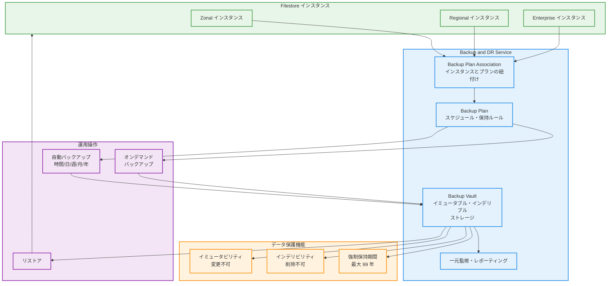

# Filestore: Backup and DR Service 統合による Enhanced Backups が GA

**リリース日**: 2026-04-09
**サービス**: Filestore
**機能**: Backup and DR Service との統合 (Enhanced Backups)
**ステータス**: GA (Generally Available)

[このアップデートのインフォグラフィックを見る](https://takech9203.github.io/google-cloud-news-summary/20260409-filestore-backup-dr-integration-ga.html)

## 概要

Filestore の Enhanced Backups 機能が GA (Generally Available) となりました。この機能により、Filestore インスタンスのバックアップを Google Cloud の Backup and DR Service と統合して一元管理できるようになります。Enhanced Backups では、バックアップデータが Backup and DR Service が管理する Backup Vault に保存され、イミュータブル (変更不可) かつインデリブル (削除不可) なバックアップによる高度なデータ保護が実現されます。

Backup and DR Service との統合により、Filestore のバックアップ管理は従来のオンデマンドバックアップに加え、時間単位・日次・週次・月次・年次の柔軟なスケジューリング、ソースプロジェクト削除からのバックアップ保護、プロジェクト横断での一元的なバックアップ管理といった高度な機能が利用可能になりました。

この機能は、Zonal、Regional、Enterprise ティアの Filestore インスタンスで利用可能であり、コンプライアンス要件の厳しいエンタープライズ環境やミッションクリティカルなワークロードにおけるデータ保護の強化に適しています。

**アップデート前の課題**

今回のアップデート以前は、以下の制限がありました。

- Filestore のバックアップは Filestore 自身が管理するオンデマンドバックアップのみであり、自動スケジュールの設定には Cloud Scheduler と Cloud Functions を組み合わせた独自の仕組みが必要だった
- バックアップデータはソースプロジェクト内に保存されるため、プロジェクト削除時にバックアップも失われるリスクがあった
- バックアップの不正な削除や変更に対する保護機能 (イミュータビリティ) がなく、ランサムウェア攻撃や内部不正からの保護が不十分だった
- 複数のプロジェクトにまたがる Filestore インスタンスのバックアップを横断的に管理する手段がなく、運用負荷が高かった
- 1 年を超える長期バックアップ保持のための仕組みが標準では提供されていなかった

**アップデート後の改善**

今回のアップデートにより、以下の改善が実現しました。

- Backup and DR Service の Backup Vault にバックアップが保存され、イミュータブル・インデリブルなバックアップにより不正な変更・削除からデータが保護されるようになった
- 時間単位・日次・週次・月次・年次の柔軟な自動バックアップスケジューリングが標準機能として利用可能になった
- ソースプロジェクトやソースインスタンスが削除されてもバックアップが保護されるようになった
- Backup and DR Service のコンソールから複数プロジェクトのバックアップを一元管理・監視・レポーティングできるようになった
- 最大 99 年の強制保持期間 (Enforced Retention Period) を設定でき、コンプライアンス要件に対応した長期保存が可能になった

## アーキテクチャ図



Filestore インスタンスが Backup Plan Association を通じて Backup and DR Service の Backup Plan に紐付けられ、自動またはオンデマンドのバックアップが Backup Vault に保存されるアーキテクチャを示しています。Backup Vault はイミュータブル・インデリブルなストレージとして機能し、強制保持期間によりデータ保護を実現します。

## サービスアップデートの詳細

### 主要機能

1. **Backup Vault によるイミュータブル・インデリブルバックアップ**
   - バックアップデータは Backup and DR Service が管理する Backup Vault に保存される
   - イミュータブル (変更不可): バックアップ作成後、内容を変更できない
   - インデリブル (削除不可): 強制保持期間が経過するまでバックアップを削除できない
   - ランサムウェア攻撃や不正アクセスからバックアップデータを保護

2. **柔軟な自動バックアップスケジューリング**
   - 時間単位、日次、週次、月次、年次の頻度でバックアップを自動実行
   - Backup Plan でスケジュールと保持ルールを定義し、Filestore インスタンスに適用
   - 複数の Backup Rule を組み合わせた多層的なバックアップ戦略が可能

3. **プロジェクト横断の一元管理**
   - 中央管理プロジェクトに Backup Vault と Backup Plan を作成し、複数のサービスプロジェクトの Filestore インスタンスを一括管理
   - Backup and DR Service のコンソールから全バックアップジョブの監視とレポーティングが可能
   - IAM 権限を通じてバックアップ管理の委任も可能

4. **ソースプロジェクト・インスタンス削除からの保護**
   - Filestore インスタンスやソースプロジェクトが削除されても、Backup Vault 内のバックアップは保護される
   - 強制保持期間中はいかなるユーザーもバックアップを削除不可
   - SEC の WORM (Write Once, Read Many) 要件に対応

5. **オンデマンドバックアップ**
   - スケジュール済みバックアップに加え、必要に応じて任意のタイミングでバックアップを作成可能
   - Backup Plan が関連付けられたインスタンスでオンデマンドバックアップが利用可能

## 技術仕様

### Standard Backups と Enhanced Backups の比較

| 項目 | Standard Backups (従来) | Enhanced Backups (今回の GA) |
|------|------------------------|---------------------------|
| バックアップ管理 | Filestore | Backup and DR Service |
| 対応ティア | Basic、Zonal、Regional、Enterprise | Zonal、Regional、Enterprise |
| 不正削除・変更からの保護 | なし | Backup Vault によるイミュータブル・インデリブルバックアップ |
| 自動バックアップ頻度 | なし (外部ツール連携が必要) | 時間・日次・週次・月次・年次 |
| ソースプロジェクト削除時の保護 | なし | あり |
| プロジェクト横断の一元管理 | なし | あり |
| 長期保持 (1年超) | なし | あり (最大 99 年) |
| ソースインスタンス削除時の保護 | あり | あり |
| CMEK 暗号化 | あり | 計画中 |
| マルチリージョンバックアップ | あり | 計画中 |
| クロスリージョンバックアップ | なし | 計画中 |

### 必要な IAM ロールと権限

| 操作 | 必要なロール |
|------|-------------|
| Backup Vault の作成・管理 | Backup and DR Admin (`roles/backupdr.admin`) |
| Backup Plan の作成・管理 | Backup and DR Admin (`roles/backupdr.admin`) |
| 他プロジェクトの Filestore バックアップ | Backup and DR Filestore Operator (`roles/backupdr.filestoreOperator`) |
| Filestore インスタンスの管理 | Cloud Filestore Editor (`roles/file.editor`) |

## 設定方法

### 前提条件

1. Filestore API と Backup and DR Service API が有効化されていること
2. Zonal、Regional、または Enterprise ティアの Filestore インスタンスが作成済みであること
3. Backup Vault が作成済みであること
4. Backup Plan が作成済みであること
5. 適切な IAM ロールが付与されていること

### 手順

#### ステップ 1: Backup Vault の作成

Backup Vault はバックアップデータを保存するセキュアなストレージです。

```bash
gcloud backup-dr backup-vaults create BACKUP_VAULT_NAME \
  --location=LOCATION \
  --backup-min-enforced-retention=RETENTION_PERIOD
```

- `BACKUP_VAULT_NAME`: Backup Vault の名前
- `LOCATION`: Backup Vault のロケーション
- `RETENTION_PERIOD`: 最小強制保持期間 (例: `30d` で 30 日)

#### ステップ 2: Backup Plan の作成

Backup Plan でバックアップスケジュールと保持ルールを定義します。

```bash
gcloud backup-dr backup-plans create BACKUP_PLAN_NAME \
  --location=LOCATION \
  --backup-vault=BACKUP_VAULT_NAME \
  --backup-rule-id=RULE_ID \
  --backup-rule-recurrence=RECURRENCE \
  --backup-rule-retention-days=RETENTION_DAYS
```

#### ステップ 3: Filestore インスタンスへの Backup Plan の適用

Backup Plan Association を作成して、Filestore インスタンスにバックアッププランを関連付けます。

```bash
gcloud backup-dr backup-plan-associations create ASSOCIATION_NAME \
  --location=LOCATION \
  --backup-plan=BACKUP_PLAN_NAME \
  --resource=projects/PROJECT_ID/locations/RESOURCE_LOCATION/instances/INSTANCE_NAME \
  --resource-type='file.googleapis.com/Instance'
```

- `RESOURCE_LOCATION`: Filestore インスタンスのロケーション (Zonal の場合はゾーン、Regional の場合はリージョン)

#### ステップ 4: 他プロジェクトの Filestore インスタンスをバックアップする場合

Backup Vault のサービスエージェントに対して、対象プロジェクトで Backup and DR Filestore Operator ロールを付与します。

```bash
gcloud projects add-iam-policy-binding TARGET_PROJECT_ID \
  --member=serviceAccount:BACKUP_VAULT_SERVICE_AGENT \
  --role=roles/backupdr.filestoreOperator
```

## メリット

### ビジネス面

- **コンプライアンス対応の強化**: イミュータブル・インデリブルなバックアップと最大 99 年の強制保持期間により、金融規制 (SEC WORM 要件) やデータ保持ポリシーに対応可能
- **ランサムウェア対策**: バックアップデータが改ざん・削除不可能な Backup Vault に保存されるため、ランサムウェア攻撃からの復旧手段として信頼性が高い
- **運用の一元化によるコスト削減**: 複数プロジェクトの Filestore バックアップを中央管理プロジェクトから一括管理でき、運用チームの管理負荷を軽減

### 技術面

- **ポリシーベースのバックアップ管理**: Backup Plan によりバックアップ戦略をコードとして定義・管理でき、Terraform や API による自動化が容易
- **プロジェクト分離によるセキュリティ強化**: バックアップデータがソースプロジェクトとは独立した Backup Vault に保存されるため、ソースプロジェクトの侵害がバックアップに影響しない
- **柔軟なスケジューリング**: 時間単位から年次まで、ワークロードの特性に応じた最適なバックアップ頻度を選択可能

## デメリット・制約事項

### 制限事項

- Enhanced Backups は Basic HDD / Basic SSD ティアでは利用不可 (Zonal、Regional、Enterprise ティアのみ対応)
- CMEK (Customer-Managed Encryption Keys) による暗号化は現時点では未対応 (計画中)
- マルチリージョンバックアップおよびクロスリージョンバックアップは現時点では未対応 (計画中)
- Backup Vault の強制保持期間は設定後に短縮できないため、設定時に慎重な検討が必要

### 考慮すべき点

- Backup and DR Service の料金が別途発生する (バックアップ管理料金、Backup Vault ストレージ料金)
- 既存の Standard Backups と Enhanced Backups は並行して利用可能だが、管理の二重化に注意が必要
- 強制保持期間中はバックアップを削除できないため、ストレージコストが継続的に発生する点を考慮すること

## ユースケース

### ユースケース 1: 金融機関におけるコンプライアンス対応

**シナリオ**: 金融機関が Filestore 上に保存する取引記録や監査ログについて、規制要件 (7 年保持) を満たすバックアップ体制を構築する。

**実装例**:

```bash
# 7 年間の強制保持期間を持つ Backup Vault を作成
gcloud backup-dr backup-vaults create compliance-vault \
  --location=asia-northeast1 \
  --backup-min-enforced-retention=2555d

# 日次バックアップと月次バックアップを組み合わせた Backup Plan を作成
gcloud backup-dr backup-plans create compliance-plan \
  --location=asia-northeast1 \
  --backup-vault=compliance-vault \
  --backup-rule-id=daily-rule \
  --backup-rule-recurrence=DAILY \
  --backup-rule-retention-days=90

# Filestore インスタンスに Backup Plan を適用
gcloud backup-dr backup-plan-associations create fs-compliance-assoc \
  --location=asia-northeast1 \
  --backup-plan=compliance-plan \
  --resource=projects/my-project/locations/asia-northeast1/instances/trading-data-fs \
  --resource-type='file.googleapis.com/Instance'
```

**効果**: イミュータブル・インデリブルなバックアップにより、規制当局の監査要件を満たすデータ保護体制が実現される。強制保持期間により、意図的・偶発的なデータ削除を防止できる。

### ユースケース 2: マルチプロジェクト環境のバックアップ一元管理

**シナリオ**: 開発・ステージング・本番の各プロジェクトにまたがる Filestore インスタンスを、中央管理プロジェクトから一括してバックアップ管理する。

**効果**: Backup and DR Service の中央管理モデルにより、複数プロジェクトの Filestore バックアップを単一のコンソールから監視・管理できる。バックアップの成功・失敗の一元的なレポーティングにより、運用チームの管理負荷が大幅に軽減される。

### ユースケース 3: ランサムウェアからの復旧

**シナリオ**: ランサムウェア攻撃により Filestore インスタンス上のデータが暗号化された場合に、Backup Vault から安全にデータを復元する。

**効果**: Backup Vault 内のバックアップはイミュータブルであるため、攻撃者がバックアップを改ざんまたは削除することができない。任意の復元ポイントからデータを復旧することで、被害を最小限に抑えられる。

## 料金

Backup and DR Service を利用した Filestore のバックアップには、以下の料金コンポーネントが発生します。

- **バックアップ管理料金**: Backup and DR Service によるバックアップ管理に対する料金
- **Backup Vault ストレージ料金**: Backup Vault に保存されるバックアップデータのストレージ料金
- **リージョン間データ転送料金**: クロスリージョンのネットワーク転送が発生する場合に適用

詳細な料金については [Backup and DR Service の料金ページ](https://cloud.google.com/backup-disaster-recovery/pricing) および [Filestore の料金ページ](https://cloud.google.com/filestore/pricing) を参照してください。

なお、Backup and DR Service には 30 日間の無料トライアルが提供されており、トライアル期間中はバックアップ管理料金と Backup Vault ストレージ料金が免除されます (リージョン間データ転送料金等は別途発生)。

## 利用可能リージョン

Backup Vault は Backup and DR Service がサポートするリージョンで作成可能です。Filestore インスタンスと同一リージョンまたは異なるリージョンに Backup Vault を配置できます。

Backup and DR Service のサポートリージョンの詳細は [Backup and DR Service のドキュメント](https://docs.cloud.google.com/backup-disaster-recovery/docs/concepts/backup-vault#locations) を参照してください。

## 関連サービス・機能

- **Backup and DR Service**: Filestore Enhanced Backups の基盤となるバックアップ管理サービス。Compute Engine、Cloud SQL、AlloyDB、VMware Engine など他の Google Cloud ワークロードのバックアップも一元管理可能
- **Filestore Standard Backups**: 従来のオンデマンドバックアップ機能。Enhanced Backups と並行して利用可能であり、Basic ティアでは引き続き Standard Backups を使用
- **Filestore Snapshots**: インスタンスのポイントインタイムスナップショット機能。バックアップとは異なり、インスタンスと同じストレージ上に保存されるため、インスタンス障害時には利用不可
- **Cloud Monitoring**: Backup and DR Service のバックアップジョブメトリクスを監視。バックアップの成功・失敗のアラート設定が可能
- **Cloud Logging**: バックアップ操作の監査ログを Cloud Logging に出力。コンプライアンス要件に対応した操作履歴の記録が可能

## 参考リンク

- [インフォグラフィック](https://takech9203.github.io/google-cloud-news-summary/20260409-filestore-backup-dr-integration-ga.html)
- [公式リリースノート](https://docs.cloud.google.com/release-notes#April_09_2026)
- [Filestore バックアップ概要 - ドキュメント](https://docs.cloud.google.com/filestore/docs/backups)
- [Filestore Enhanced Backups 概要](https://docs.cloud.google.com/filestore/docs/gcbdr-backups-overview)
- [Enhanced Backups の作成手順](https://docs.cloud.google.com/filestore/docs/gcbdr-enhanced-backups)
- [Backup and DR Service で Filestore をバックアップ](https://docs.cloud.google.com/backup-disaster-recovery/docs/cloud-console/filestore/filestore-instance-backup)
- [Backup and DR Service 概要](https://docs.cloud.google.com/backup-disaster-recovery/docs/concepts/backup-dr)
- [Backup Vault の概要](https://docs.cloud.google.com/backup-disaster-recovery/docs/concepts/backup-vault)
- [Backup and DR Service 料金](https://cloud.google.com/backup-disaster-recovery/pricing)
- [Filestore 料金](https://cloud.google.com/filestore/pricing)

## まとめ

Filestore の Enhanced Backups が GA となり、Backup and DR Service との統合によるイミュータブル・インデリブルなバックアップ管理が本番環境で利用可能になりました。Backup Vault による不正削除・変更からの保護、柔軟な自動スケジューリング、プロジェクト横断の一元管理により、エンタープライズレベルのデータ保護が実現されます。特にコンプライアンス要件が厳しい環境やランサムウェア対策を強化したい場合は、Backup Vault の作成と Backup Plan の適用を検討してください。

---

**タグ**: #Filestore #BackupAndDR #EnhancedBackups #BackupVault #GA #DataProtection #DisasterRecovery #Compliance #GoogleCloud
