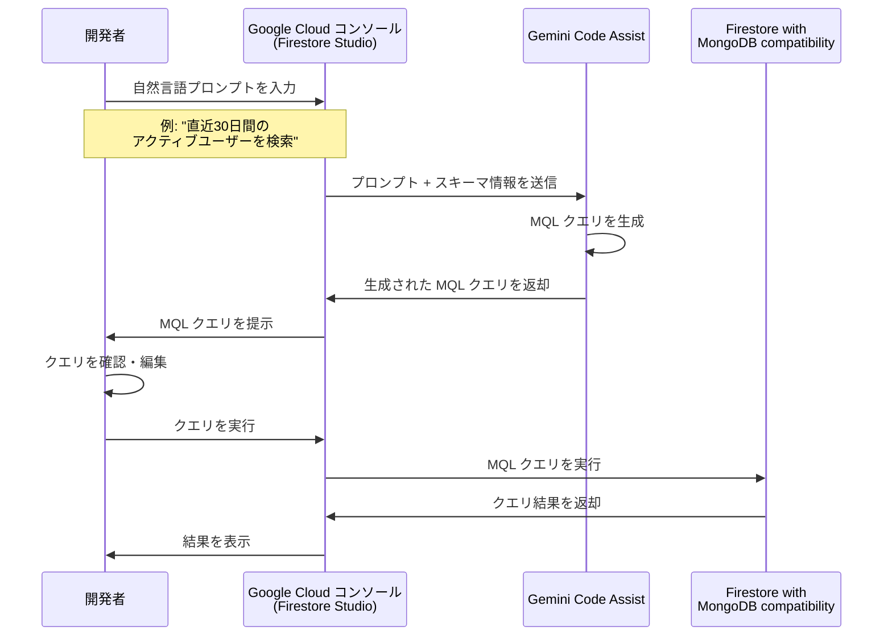

# Firestore with MongoDB compatibility: Gemini Code Assist による MQL クエリの自然言語生成

**リリース日**: 2026-04-09

**サービス**: Firestore with MongoDB compatibility

**機能**: Gemini Code Assist を使用した自然言語プロンプトによる MQL クエリ生成

**ステータス**: Preview

📊 [このアップデートのインフォグラフィックを見る](https://takech9203.github.io/google-cloud-news-summary/20260409-firestore-mongodb-gemini-mql.html)

## 概要

Firestore with MongoDB compatibility において、Gemini Code Assist を利用した AI アシスタント機能が Preview として提供開始されました。この機能により、自然言語のプロンプトを入力するだけで、MongoDB Query Language (MQL) のクエリを自動生成できるようになります。

Firestore with MongoDB compatibility は、既存の MongoDB アプリケーションコードやドライバー、ツール、MongoDB のオープンソースエコシステムを Firestore 上で活用できるサービスです。Firestore Enterprise edition の一部として提供されており、サーバーレス、事実上無制限のスケーラビリティ、最大 99.999% SLA の高可用性、ミリ秒単位の読み取りレイテンシといった特長を備えています。今回のアップデートにより、MQL の構文に精通していない開発者でも、自然言語で意図を伝えるだけでデータベースクエリを構築できるようになります。

この機能は、BigQuery や AlloyDB、Cloud SQL、Spanner など他の Google Cloud データベースサービスで既に提供されている Gemini によるクエリ生成支援機能と同様のアプローチを、Firestore with MongoDB compatibility にも展開したものです。

**アップデート前の課題**

- MQL クエリを記述するには MongoDB Query Language の構文を理解している必要があった
- 複雑な集約パイプラインやフィルタリング条件の構築には、MQL の演算子やステージに関する深い知識が求められた
- MQL に不慣れな開発者は、ドキュメントを参照しながら手動でクエリを作成する必要があり、開発効率が低下していた

**アップデート後の改善**

- 自然言語のプロンプトを入力するだけで、Gemini Code Assist が適切な MQL クエリを自動生成する
- MQL の構文を熟知していなくても、意図したデータ操作やクエリを実行できるようになった
- クエリ作成にかかる時間が短縮され、開発者はビジネスロジックの実装により集中できるようになった

## アーキテクチャ図



開発者が自然言語でクエリの意図を伝えると、Gemini Code Assist がデータベーススキーマのコンテキストを活用して MQL クエリを生成し、開発者は確認・編集した上で Firestore に対して実行できます。

## サービスアップデートの詳細

### 主要機能

1. **自然言語から MQL への変換**
   - 日常的な言葉でデータの検索・操作を記述すると、対応する MQL クエリが自動生成される
   - データベースのスキーマ情報を考慮した、コンテキストに即したクエリが生成される

2. **Google Cloud コンソールでの統合**
   - Firestore Studio のクエリエディタ内で Gemini Code Assist の機能を直接利用可能
   - 生成されたクエリの確認、編集、実行をシームレスに行える

3. **MQL クエリの学習支援**
   - 生成された MQL クエリを通じて、MQL の構文やベストプラクティスを学習できる
   - MQL に不慣れな開発者のオンボーディングを加速する

## 技術仕様

### Firestore with MongoDB compatibility の対応状況

| 項目 | 詳細 |
|------|------|
| ステータス | Preview |
| 対応エディション | Firestore Enterprise edition |
| データアクセスモード | Firestore with MongoDB compatibility |
| クエリ言語 | MongoDB Query Language (MQL) |
| AI エンジン | Gemini Code Assist |
| 利用環境 | Google Cloud コンソール (Firestore Studio) |

### Firestore with MongoDB compatibility がサポートする主な MQL 機能

Gemini Code Assist による MQL 生成は、Firestore with MongoDB compatibility がサポートする演算子やステージの範囲内でクエリを生成します。主なサポート対象は以下の通りです。

| カテゴリ | サポート例 |
|----------|-----------|
| 比較演算子 | `$eq`, `$gt`, `$gte`, `$lt`, `$lte`, `$ne`, `$in`, `$nin` |
| 論理演算子 | `$and`, `$or`, `$not`, `$nor` |
| 配列演算子 | `$all`, `$elemMatch`, `$size` |
| 要素演算子 | `$exists`, `$type` |
| 評価演算子 | `$expr`, `$mod`, `$regex` |
| 更新演算子 | `$inc`, `$set`, `$unset`, `$push`, `$pull` 等 |
| 集約パイプライン | `$match`, `$sort`, `$group`, `$lookup`, `$bucket` 等 |

## 設定方法

### 前提条件

1. Firestore Enterprise edition のデータベースが MongoDB compatibility モードで作成されていること
2. Gemini Code Assist が Google Cloud プロジェクトで有効化されていること
3. 適切な IAM 権限が付与されていること

### 手順

#### ステップ 1: Firestore with MongoDB compatibility データベースにアクセス

Google Cloud コンソールで Firestore の [Databases ページ](https://console.cloud.google.com/firestore/databases)に移動し、MongoDB compatibility モードのデータベースを選択します。

#### ステップ 2: Firestore Studio を開く

ナビゲーションメニューから **Firestore Studio** をクリックし、クエリエディタを表示します。

#### ステップ 3: Gemini Code Assist を使用して MQL クエリを生成

クエリエディタ内で Gemini Code Assist の機能を利用し、自然言語プロンプトを入力して MQL クエリを生成します。生成されたクエリを確認・編集した上で、**Run** をクリックしてクエリを実行します。

## メリット

### ビジネス面

- **開発速度の向上**: MQL クエリの手動記述が不要になり、データベース操作の開発時間を短縮できる
- **オンボーディングの短縮**: MongoDB や MQL に不慣れなチームメンバーでも、即座にデータベースクエリを構築できるようになる
- **エラー削減**: AI が生成するクエリにより、構文ミスや論理的な誤りが減少する

### 技術面

- **スキーマ対応のクエリ生成**: データベースのスキーマ情報を考慮した正確なクエリが生成される
- **MQL の幅広い演算子サポート**: Firestore with MongoDB compatibility がサポートする多数の MQL 演算子を活用したクエリが生成可能
- **他の Google Cloud データベースサービスとの一貫した体験**: BigQuery、AlloyDB、Cloud SQL、Spanner と同様の Gemini 統合体験が提供される

## デメリット・制約事項

### 制限事項

- 本機能は Preview ステータスであり、SLA の対象外である。「Pre-GA Offerings Terms」が適用される
- Firestore with MongoDB compatibility がサポートしていない MQL の演算子やコマンドに対応するクエリは生成できない
- AI が生成するクエリは常に正確であるとは限らないため、実行前に確認が必要

### 考慮すべき点

- 生成されたクエリのパフォーマンスは、インデックスの設定状況に依存する。Firestore Enterprise edition ではインデックスの手動管理が必要
- データ更新系のクエリ (DML) が生成された場合、意図しないデータ変更が発生しないよう十分な確認が求められる
- Gemini Code Assist の利用にはライセンスが必要な場合がある

## ユースケース

### ユースケース 1: MongoDB からの移行プロジェクトにおけるクエリ検証

**シナリオ**: MongoDB から Firestore with MongoDB compatibility への移行中に、既存のクエリが正しく動作するか確認したいが、MQL の一部構文が Firestore でサポートされているか不明な場合。

**実装例**:
```
自然言語プロンプト: "orders コレクションから、status が 'completed' で total が 100 以上のドキュメントを、created_at の降順で10件取得"

生成される MQL:
db.orders.find(
  { status: "completed", total: { $gte: 100 } }
).sort({ created_at: -1 }).limit(10)
```

**効果**: MQL 構文を手動で記述することなく、自然言語で意図を伝えるだけでクエリを素早く生成し、Firestore 上で動作検証できる。

### ユースケース 2: 複雑な集約パイプラインの構築

**シナリオ**: 売上データの月次集計レポートを作成するために、集約パイプラインを構築する必要があるが、MQL の集約ステージの構文に慣れていない場合。

**実装例**:
```
自然言語プロンプト: "sales コレクションから月ごとの売上合計を計算し、売上が高い順に並べ替え"

生成される MQL:
db.sales.aggregate([
  { $group: {
      _id: { $month: "$sale_date" },
      totalSales: { $sum: "$amount" }
  }},
  { $sort: { totalSales: -1 } }
])
```

**効果**: 複雑な集約パイプラインの構文を理解していなくても、自然言語で分析の意図を伝えるだけで適切なクエリが生成される。

## 料金

Gemini Code Assist による MQL クエリ生成機能の利用に関する料金は、以下の要素で構成されます。

- **Firestore Enterprise edition の利用料金**: 読み取りは Read Unit (4 KiB 単位)、書き込みは Write Unit (1 KiB 単位) で課金される (例: us-central1 リージョンで Read Unit $0.05/百万、Write Unit $0.26/百万)
- **Gemini Code Assist のライセンス料金**: Gemini Code Assist の利用にはサブスクリプションが必要な場合がある。詳細は [Gemini Code Assist の料金ページ](https://cloud.google.com/products/gemini/pricing)を参照

## 関連サービス・機能

- **[Firestore with MongoDB compatibility](https://docs.cloud.google.com/firestore/mongodb-compatibility/docs/overview)**: MongoDB 互換 API を提供する Firestore のデータアクセスモード
- **[Firestore Enterprise edition](https://docs.cloud.google.com/firestore/native/docs/editions-overview)**: 高度なクエリエンジンやカスタマイズ可能なインデックスを提供する Firestore の上位エディション
- **[Query Explain](https://docs.cloud.google.com/firestore/mongodb-compatibility/docs/query-explain)**: MQL クエリの実行計画を分析し、パフォーマンスを最適化するためのツール
- **[Gemini Code Assist](https://docs.cloud.google.com/gemini/docs/codeassist/overview)**: Google Cloud 全体で AI アシスタント機能を提供するサービス
- **[Gemini in Databases](https://docs.cloud.google.com/gemini/docs/databases/overview)**: BigQuery、AlloyDB、Cloud SQL、Spanner など他のデータベースサービスにおける Gemini 統合

## 参考リンク

- 📊 [インフォグラフィック](https://takech9203.github.io/google-cloud-news-summary/20260409-firestore-mongodb-gemini-mql.html)
- [公式リリースノート](https://docs.cloud.google.com/release-notes#April_09_2026)
- [ドキュメント: Write MQL with Gemini assistance](https://docs.cloud.google.com/firestore/mongodb-compatibility/docs/write-mql-gemini)
- [Firestore with MongoDB compatibility リリースノート](https://docs.cloud.google.com/firestore/mongodb-compatibility/docs/release-notes)
- [Firestore Enterprise edition 料金](https://cloud.google.com/firestore/enterprise/pricing)

## まとめ

Firestore with MongoDB compatibility における Gemini Code Assist による MQL クエリ生成機能は、データベース開発者の生産性を大幅に向上させる重要なアップデートです。自然言語から MQL クエリへの自動変換により、MongoDB Query Language に不慣れな開発者でも迅速にデータベース操作を実行でき、既存の MongoDB ワークロードを Firestore 上で運用するチームにとって特に有用です。現在 Preview ステータスのため、本番環境での利用前に十分な検証を行うことを推奨します。

---

**タグ**: #Firestore #MongoDB #GeminiCodeAssist #MQL #AI #Preview #Database #NaturalLanguageQuery
