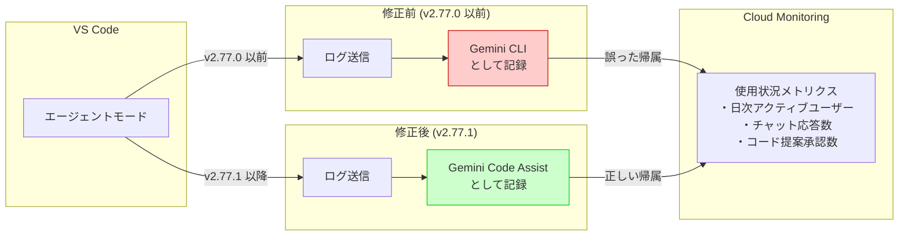

# Gemini Code Assist: エージェントモードのログ帰属先の修正

**リリース日**: 2026-04-09

**サービス**: Gemini (Gemini Code Assist)

**機能**: エージェントモードのログ帰属先修正

**ステータス**: Fixed (修正済み)

📊 [このアップデートのインフォグラフィックを見る](https://takech9203.github.io/google-cloud-news-summary/20260409-gemini-code-assist-agent-mode-fix.html)

## 概要

VS Code 向け Gemini Code Assist の拡張機能バージョン 2.77.1 において、エージェントモードのログ帰属先に関するバグが修正された。以前のバージョンでは、エージェントモードで生成されたログが Gemini Code Assist ではなく Gemini CLI に帰属されるという不具合が存在していた。この修正により、使用状況メトリクスが正しく報告されるようになった。

このバグは、組織における Gemini Code Assist の利用状況を Cloud Monitoring で追跡している管理者にとって特に影響が大きかった。エージェントモードの使用が Gemini CLI として記録されることにより、Gemini Code Assist のアクティブユーザー数やチャット応答数などのメトリクスが実際より少なく計上される一方、Gemini CLI のメトリクスが過大に計上されるという問題が生じていた。

Google は、正確な使用状況メトリクスを確保するために、バージョン 2.77.1 以上へのアップデートを推奨している。

**アップデート前の課題**

- エージェントモードのログが Gemini Code Assist ではなく Gemini CLI に誤って帰属されていた
- Cloud Monitoring ダッシュボードで Gemini Code Assist の使用状況メトリクス (日次アクティブユーザー数、チャット応答数、コード提案承認数など) が実際よりも少なく表示されていた
- Gemini CLI のメトリクスが過大に計上され、組織内のツール利用状況の分析に不正確なデータが使用されるリスクがあった

**アップデート後の改善**

- エージェントモードのログが正しく Gemini Code Assist に帰属されるようになった
- Cloud Monitoring のメトリクスが正確な使用状況を反映するようになった
- 組織の管理者が Gemini Code Assist と Gemini CLI それぞれの利用状況を正しく区別して把握できるようになった

## アーキテクチャ図



この図は、エージェントモードのログ帰属先が修正前と修正後でどのように変わったかを示している。修正前は Gemini CLI として誤って記録されていたが、修正後は正しく Gemini Code Assist として記録される。

## サービスアップデートの詳細

### 修正内容

1. **ログ帰属先の修正**
   - エージェントモードで発生するすべてのログが、Gemini CLI ではなく Gemini Code Assist に正しく帰属されるようになった
   - Cloud Logging に記録されるメタデータの `labels.product` フィールドが正しく `code_assist` として記録される

2. **影響を受けるメトリクス**
   - `code_assist/daily_active_users` (日次アクティブユーザー)
   - `code_assist/twenty_eight_day_active_users` (28 日間アクティブユーザー)
   - `chat_responses_count` (日次チャット応答数)
   - `code_assist/code_suggestions_accepted_count` (日次コード提案承認数)
   - `code_assist/code_lines_accepted_count` (日次コード行承認数)

## 技術仕様

### 対象バージョン

| 項目 | 詳細 |
|------|------|
| 対象プラットフォーム | VS Code |
| 修正バージョン | 2.77.1 |
| 影響を受けたバージョン | 2.77.0 以前のエージェントモード対応バージョン |
| リリース日 | 2026 年 4 月 8 日 (拡張機能リリース) |
| リリースノート記載日 | 2026 年 4 月 9 日 |

### エージェントモードとは

Gemini Code Assist のエージェントモードは、VS Code および IntelliJ で利用可能な AI ペアプログラミング機能である。通常のチャットモードとは異なり、エージェントモードでは以下の操作が可能である。

- ファイルの読み書きやターミナル操作などの組み込みツールの使用
- MCP サーバーを介した外部ツールとの連携
- 複数ステップにわたる複雑なタスクの実行
- 設計ドキュメントや Issue からのコード生成

## 設定方法

### 前提条件

1. VS Code がインストールされていること
2. Gemini Code Assist 拡張機能がインストールされていること

### 手順

#### ステップ 1: 拡張機能のバージョン確認

VS Code のコマンドパレット (`Ctrl+Shift+P` / `Cmd+Shift+P`) を開き、「Extensions: Show Installed Extensions」を選択して、Gemini Code Assist のバージョンを確認する。

#### ステップ 2: 拡張機能のアップデート

バージョンが 2.77.1 未満の場合、拡張機能の管理画面から「更新」ボタンをクリックしてアップデートする。または、コマンドパレットから「Extensions: Check for Extension Updates」を実行する。

#### ステップ 3: メトリクスの確認 (管理者向け)

Google Cloud コンソールの Gemini Code Assist 概要ページでメトリクスを確認し、アップデート後にログの帰属先が正しくなっていることを検証する。

```
Google Cloud コンソール > Gemini Code Assist > メトリクス
```

## メリット

### ビジネス面

- **正確な利用状況の把握**: 組織の Gemini Code Assist 導入効果を正確に測定できるようになる
- **ライセンス管理の改善**: 正しい使用状況データに基づいてライセンス数の最適化が可能になる

### 技術面

- **メトリクスの信頼性向上**: Cloud Monitoring ダッシュボードのデータが正確になり、運用判断の基盤が強化される
- **ツール別分析の正確性**: Gemini Code Assist と Gemini CLI の使用状況を正しく分離して分析できるようになる

## 関連サービス・機能

- **[Gemini Code Assist エージェントモード](https://developers.google.com/gemini-code-assist/docs/agent-mode)**: 今回のバグが発生していた機能。VS Code および IntelliJ で利用可能な AI ペアプログラミング機能
- **[Cloud Monitoring](https://docs.cloud.google.com/monitoring/docs)**: Gemini Code Assist のメトリクスが自動的に収集・保存されるサービス
- **[Gemini Code Assist ログ設定](https://docs.cloud.google.com/gemini/docs/configure-logging)**: Standard / Enterprise エディション向けのログ収集設定
- **[Gemini CLI](https://geminicli.com/)**: 今回のバグでログが誤って帰属されていた別プロダクト

## 参考リンク

- 📊 [インフォグラフィック](https://takech9203.github.io/google-cloud-news-summary/20260409-gemini-code-assist-agent-mode-fix.html)
- [公式リリースノート](https://docs.cloud.google.com/release-notes#April_09_2026)
- [Gemini Code Assist リリースノート](https://developers.google.com/gemini-code-assist/resources/release-notes)
- [Gemini Code Assist 使用状況の監視](https://docs.cloud.google.com/gemini/docs/codeassist/monitor-gemini-code-assist)
- [Gemini Code Assist ログ設定](https://docs.cloud.google.com/gemini/docs/configure-logging)
- [エージェントモードのドキュメント](https://developers.google.com/gemini-code-assist/docs/agent-mode)

## まとめ

今回のバグ修正は、Gemini Code Assist のエージェントモードにおけるログ帰属先の不具合を解消するものである。特に組織の管理者が Cloud Monitoring を通じて使用状況を追跡している場合、このバグにより不正確なデータが記録されていた可能性がある。VS Code で Gemini Code Assist を使用しているすべてのユーザーに対し、バージョン 2.77.1 以上へのアップデートを推奨する。

---

**タグ**: #GeminiCodeAssist #VSCode #BugFix #エージェントモード #CloudMonitoring #メトリクス #ログ帰属
