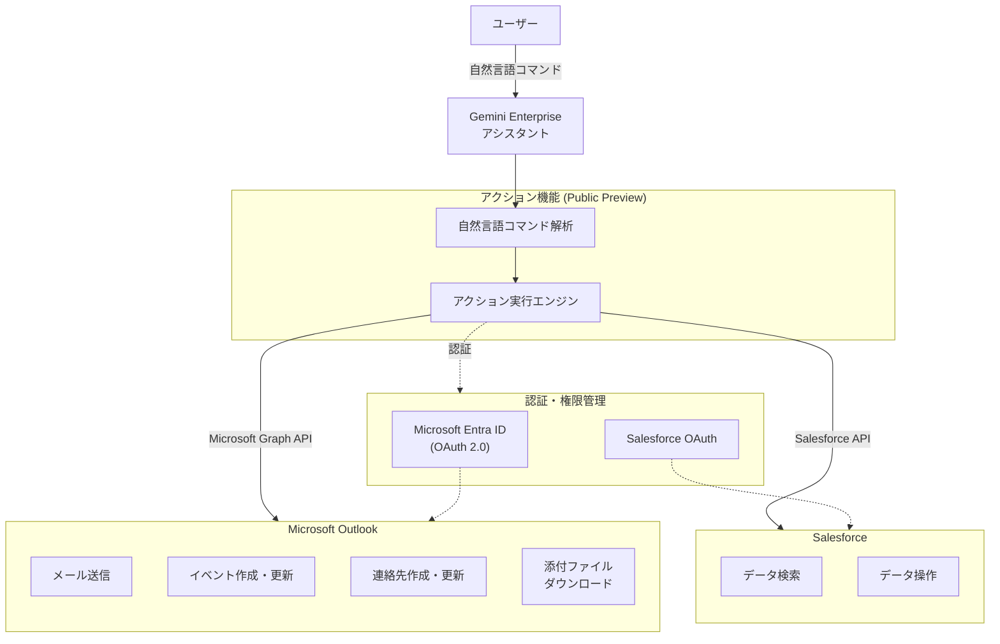

# Gemini Enterprise: Microsoft Outlook および Salesforce 向け新アクションのサポート (Preview)

**リリース日**: 2026-04-09

**サービス**: Gemini Enterprise

**機能**: Microsoft Outlook および Salesforce データストア向け新アクション

**ステータス**: Public Preview

[このアップデートのインフォグラフィックを見る](https://takech9203.github.io/google-cloud-news-summary/20260409-gemini-enterprise-outlook-salesforce-actions.html)

## 概要

Gemini Enterprise において、Microsoft Outlook および Salesforce のデータストアに対する新しいアクション機能が Public Preview として利用可能になりました。この機能により、Gemini Enterprise のアシスタントから自然言語コマンドを使用して、これらのサードパーティアプリケーション上で直接操作を実行できるようになります。

Gemini Enterprise のアクション機能は、2025 年 12 月に統合データソース作成フローの一部として初めて導入されました。その後、段階的に対応データストアが拡大されており、今回のアップデートでは Microsoft Outlook と Salesforce が新たに対象に追加されました。これにより、企業がすでに利用している主要な CRM およびコミュニケーションツールとの統合がさらに強化されます。

このアップデートは、営業チーム、カスタマーサポート、および日常的に Microsoft Outlook や Salesforce を使用するビジネスユーザーにとって特に有益です。Gemini Enterprise のアシスタントを通じて、アプリケーションを切り替えることなくメール送信やカレンダーイベントの作成、Salesforce データの操作が可能になります。

**アップデート前の課題**

- Microsoft Outlook と Salesforce のデータは Gemini Enterprise で検索（フェデレーション検索またはデータ取り込み）のみ可能で、データに対する書き込み操作はできなかった
- Outlook でのメール送信やカレンダーイベント作成のためには、別途 Outlook アプリケーションを開く必要があった
- Salesforce のデータ操作は Salesforce の管理画面から直接行う必要があり、ワークフローが分断されていた

**アップデート後の改善**

- Gemini Enterprise のアシスタントから自然言語で Microsoft Outlook のアクション（メール送信、イベント作成・更新、連絡先管理、添付ファイルのダウンロード）を実行可能になった
- Salesforce データストアに対してもアクションが利用可能になり、検索に加えてデータ操作が可能になった
- アプリケーションの切り替えなしに、一つのインターフェースから複数のサードパーティサービスへの操作が可能になった

## アーキテクチャ図



ユーザーが Gemini Enterprise アシスタントに自然言語でリクエストを送信すると、アクション実行エンジンが適切な API を呼び出し、Microsoft Outlook または Salesforce 上で操作を実行します。各データストアへの接続には、それぞれの認証プロバイダー（Microsoft Entra ID、Salesforce OAuth）を通じた認証が必要です。

## サービスアップデートの詳細

### 主要機能

1. **Microsoft Outlook アクション**
   - Gemini Enterprise のアシスタントから自然言語コマンドで Outlook の操作を実行可能
   - フェデレーション検索モードおよびデータ取り込みモードの両方でアクションをサポート
   - Microsoft Graph API v1.0 を使用した安全な操作

2. **Salesforce アクション**
   - Salesforce データストアに対するアクション機能が新たに利用可能
   - フェデレーション検索と組み合わせたデータ操作をサポート
   - Salesforce V2 コネクタ（推奨）を使用した接続

3. **統合アクション管理**
   - データストア作成時または作成後にアクションを追加可能
   - Google Cloud コンソールの「Actions」ページからアクションの有効化・無効化を管理
   - 再認証機能により、異なる認証情報でのアクション実行に対応

## 技術仕様

### Microsoft Outlook サポートアクション一覧

| アクション | 説明 | 初回リリース日 |
|------|------|------|
| Send mail | 添付ファイルを含むメールの送信 | 2025-12-12 |
| Create event | 新しいカレンダーイベントの作成 | 2025-12-12 |
| Update event | 既存カレンダーイベントの更新 | 2025-12-12 |
| Create contact | 新しい Outlook 連絡先の作成 | 2025-12-19 |
| Update contact | 既存 Outlook 連絡先の更新 | 2025-12-19 |
| Download attachment | メールの添付ファイルのダウンロード | 2026-01-23 |

### Microsoft Outlook 必要な権限

| 接続モード | 権限 | 用途 |
|------|------|------|
| フェデレーション検索 | Mail.Read, Calendars.Read, Contacts.Read (Delegated) | メール、カレンダー、連絡先の読み取り |
| アクション | Mail.Send (Delegated) | メール送信 |
| アクション | Calendars.ReadWrite (Delegated) | カレンダーイベントの作成・更新・削除、添付ファイルのダウンロード |
| アクション | Contacts.ReadWrite (Delegated) | 連絡先の作成・更新・削除 |
| アクション | User.Read (Delegated) | ユーザープロファイルの読み取り |

### Salesforce データストアの仕様

| 項目 | 詳細 |
|------|------|
| コネクタタイプ | Salesforce V2（推奨） |
| フェデレーション検索 | Public Preview |
| データ取り込み | Private Preview（許可リストが必要） |
| サポートリージョン | Global、US、EU |
| 認証方式 | OAuth（Client ID / Client Secret） |

## 設定方法

### 前提条件

1. Gemini Enterprise のライセンスが有効であること（Standard、Plus、または Business エディション）
2. Google Cloud プロジェクトで Gemini Enterprise が有効化されていること
3. Discovery Engine Editor ロール（`roles/discoveryengine.editor`）がユーザーに付与されていること
4. Microsoft Outlook の場合: Microsoft Entra ID でのアプリケーション登録と適切な API 権限の設定
5. Salesforce の場合: Salesforce OAuth 認証情報（Client ID、Client Secret）の取得

### 手順

#### ステップ 1: データストアの作成

1. Google Cloud コンソールで [Gemini Enterprise ページ](https://console.cloud.google.com/gemini-enterprise/) に移動
2. ナビゲーションメニューから「Data Stores」をクリック
3. 「Create Data Store」をクリック
4. データソース選択画面で「Microsoft Outlook」または「Salesforce V2」を選択

#### ステップ 2: 認証設定

**Microsoft Outlook の場合:**
- Client ID（Microsoft Entra ID で登録されたアプリケーションの ID）を入力
- Client Secret を入力
- Tenant ID を入力
- 「Login」をクリックして Microsoft Outlook にサインインし認証を完了

**Salesforce の場合:**
- Instance URL（Salesforce インスタンスのベース URL）を入力
- OAuth Client ID と Client Secret を入力
- 「Login」をクリックして Salesforce にサインインし認証を完了

#### ステップ 3: アクションの有効化

1. データストア作成フローの「Actions」セクションで、有効にするアクションを選択
2. フェデレーション検索モードの場合: アクションリストから直接選択
3. データ取り込みモードの場合: 追加の認証設定後にアクションを選択
4. 「Enable actions」をクリックして完了

#### ステップ 4: アプリとの接続

1. [アプリを作成](https://docs.cloud.google.com/gemini/enterprise/docs/create-app)し、作成したデータストアを接続
2. ユーザーがアクションを使用する前に、各サービスへのアクセスを[承認](https://docs.cloud.google.com/gemini/enterprise/docs/connect-existing-data-store#user_authorization)

## メリット

### ビジネス面

- **ワークフローの統合**: Gemini Enterprise の単一インターフェースから Outlook と Salesforce の操作を行うことで、アプリケーション間の切り替えが不要になり、業務効率が向上する
- **生産性の向上**: 自然言語でのコマンド実行により、技術的な知識がなくてもデータ操作が可能になる
- **営業プロセスの効率化**: Salesforce の CRM データ参照と Outlook でのメール送信やミーティング設定をシームレスに連携できる

### 技術面

- **API 統合の簡素化**: Microsoft Graph API や Salesforce API への直接的なプログラミングが不要になり、自然言語インターフェースでの操作に集約される
- **権限管理の一元化**: Google Cloud IAM と各サービスの OAuth 認証を組み合わせた統一的なアクセス管理が可能
- **拡張性**: 既存のデータストアに対して、データストア作成後でもアクションを追加できる柔軟な設計

## デメリット・制約事項

### 制限事項

- 本機能は Public Preview であり、「Pre-GA Offerings Terms」が適用される。限定的なサポートとなる可能性がある
- Salesforce のデータ取り込みモードは Private Preview であり、許可リストへの追加が必要
- Salesforce データストアは Global、US、EU ロケーションのみでサポートされている
- 既存の Salesforce データストアに対する VPC Service Controls の適用はサポートされていない。VPC Service Controls を有効にする場合、データストアの削除と再作成が必要
- 1 つのアプリケーションに対して、同じコネクタタイプの複数のデータストア（アクション付き）を関連付けることは推奨されていない

### 考慮すべき点

- Microsoft Outlook アクションの使用には、Microsoft Entra ID での適切な API 権限設定が必須
- フェデレーション検索使用時、クエリはサードパーティの検索バックエンドに送信されるため、データ処理に関する各サービスの利用規約やプライバシーポリシーに準拠する必要がある
- LLM によるクエリの書き換えが行われる場合があり、セッション履歴の一部がサードパーティ API に送信される可能性がある

## ユースケース

### ユースケース 1: 営業チームの顧客対応効率化

**シナリオ**: 営業担当者が Gemini Enterprise を使用して、Salesforce の顧客情報を検索しながら、同時に Microsoft Outlook でフォローアップメールを送信する。

**実装例**:
```
ユーザー: 「先週のミーティングで議論した案件 A について、担当の田中さんにフォローアップメールを送って。
次回のミーティングを来週火曜日の 14 時に設定して。」

Gemini Enterprise アシスタント:
1. Salesforce から案件 A の情報を検索
2. メールのドラフトを作成し、ユーザーに確認を求める
3. 承認後、Outlook 経由でメールを送信
4. カレンダーイベントを作成
```

**効果**: アプリケーション間の切り替えが不要になり、営業担当者の対応時間を短縮できる

### ユースケース 2: カスタマーサポートの一元管理

**シナリオ**: サポート担当者が顧客からの問い合わせに対応する際、Salesforce で顧客履歴を確認し、Outlook から回答メールを送信する。

**効果**: 複数のアプリケーションを行き来する必要がなくなり、対応品質の向上と応答時間の短縮が期待できる

## 料金

Gemini Enterprise のアクション機能は、Gemini Enterprise ライセンスに含まれています。ライセンスの種類によって利用可能な機能に違いがあります。

### エディション別機能比較

| エディション | 全データコネクタエコシステムへのアクセス | 権限対応エージェントアクション |
|--------|---------|---------|
| Business | 一部のコネクタのみ | 利用可能 |
| Standard | 利用可能 | 利用可能 |
| Plus | 利用可能 | 利用可能 |
| Frontline | 一部のコネクタのみ | 利用可能 |

ライセンスの取得と割り当てについての詳細は、[Get licenses for Gemini Enterprise](https://docs.cloud.google.com/gemini/enterprise/docs/licenses) を参照してください。

## 利用可能リージョン

- **Salesforce データストア**: Global、US、EU のみ
- **Microsoft Outlook データストア**: US または EU を選択した場合は暗号化設定（Google マネージド暗号化キーまたは Cloud KMS キー）が必要

## 関連サービス・機能

- **[Microsoft OneDrive コネクタ](https://docs.cloud.google.com/gemini/enterprise/docs/connectors/ms-onedrive)**: ファイルのアップロード・ダウンロード・コピー・フォルダ作成アクションをサポート
- **[Microsoft SharePoint コネクタ](https://docs.cloud.google.com/gemini/enterprise/docs/connectors/ms-sharepoint)**: ページ追加、ドキュメントのチェックイン・チェックアウト、移動・名前変更アクションをサポート
- **[NotebookLM Enterprise](https://docs.cloud.google.com/gemini/enterprise/notebooklm-enterprise/docs/set-up-notebooklm)**: Gemini Enterprise と統合された企業向けノートブック機能
- **[Agent Designer](https://docs.cloud.google.com/gemini/enterprise/docs/agent-designer)**: カスタムエージェントの作成ツール。データストアアクションと組み合わせた自動化ワークフローの構築が可能
- **[VPC Service Controls](https://docs.cloud.google.com/gemini/enterprise/docs/use-vpc-service-controls)**: データストアのセキュリティ境界設定（既存データストアへの適用には再作成が必要）

## 参考リンク

- [インフォグラフィック](https://takech9203.github.io/google-cloud-news-summary/20260409-gemini-enterprise-outlook-salesforce-actions.html)
- [公式リリースノート](https://docs.cloud.google.com/release-notes#April_09_2026)
- [Gemini Enterprise リリースノート](https://docs.cloud.google.com/gemini/enterprise/docs/release-notes)
- [Microsoft Outlook コネクタ ドキュメント](https://docs.cloud.google.com/gemini/enterprise/docs/connectors/ms-outlook)
- [Salesforce コネクタ ドキュメント](https://docs.cloud.google.com/gemini/enterprise/docs/connectors/salesforce)
- [サポートされるアクション一覧](https://docs.cloud.google.com/gemini/enterprise/docs/connect-third-party-data-source#supported_actions)
- [アクションの管理](https://docs.cloud.google.com/gemini/enterprise/docs/manage-actions)
- [Gemini Enterprise エディション](https://docs.cloud.google.com/gemini/enterprise/docs/editions)

## まとめ

今回のアップデートにより、Gemini Enterprise から Microsoft Outlook と Salesforce に対してアクションを直接実行できるようになりました。これは、エンタープライズ環境におけるサードパーティアプリケーション統合の重要な進展であり、営業やカスタマーサポートなどのビジネスワークフローの効率化に大きく貢献します。現時点では Public Preview のため、本番環境での利用前に十分なテストを行い、制限事項を確認することを推奨します。

---

**タグ**: #GeminiEnterprise #MicrosoftOutlook #Salesforce #DataConnectors #Actions #PublicPreview #ThirdPartyIntegration #EnterpriseAI
