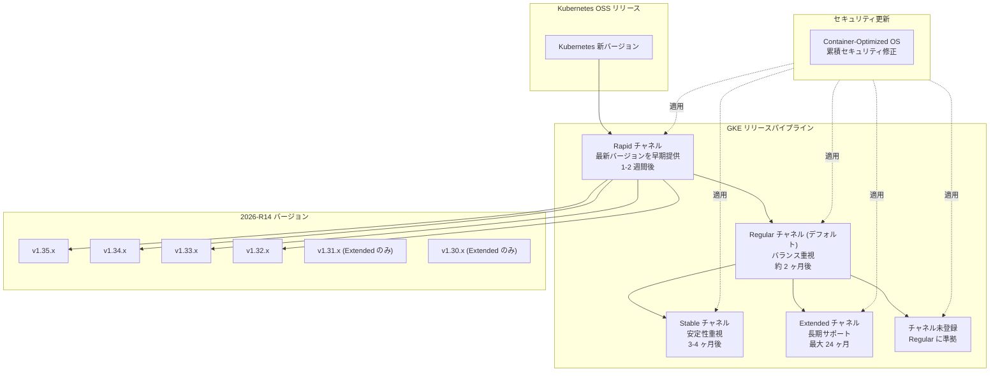

# Google Kubernetes Engine (GKE): クラスタバージョン更新 2026-R14 (セキュリティ修正含む)

**リリース日**: 2026-04-09

**サービス**: Google Kubernetes Engine (GKE)

**機能**: クラスタバージョン更新 2026-R14 (全リリースチャネルおよびチャネル未登録クラスタ)

**ステータス**: 利用可能

:bar_chart: [このアップデートのインフォグラフィックを見る](https://takech9203.github.io/google-cloud-news-summary/20260409-gke-2026-r14-version-security-updates.html)

## 概要

Google Kubernetes Engine (GKE) のクラスタバージョンが 2026-R14 として更新されました。今回のアップデートでは、Rapid、Regular、Stable、Extended、およびチャネル未登録の全チャネルにおいて新しいパッチバージョンが利用可能になっています。対象となるマイナーバージョンは 1.30 から 1.35 までの幅広い範囲に及びます。

本アップデートには、Container-Optimized OS (COS) イメージの累積セキュリティ修正も含まれています。GKE ノードの基盤となる COS イメージが更新され、既知の脆弱性に対するパッチが適用されています。セキュリティを確保するため、自動アップグレードが有効な場合でも、本番環境のクラスタについては計画的なアップグレードを検討することが推奨されます。

このバージョン更新は、GKE を利用する全てのユーザーに影響があります。特に、セキュリティコンプライアンス要件のある環境や、最新の Kubernetes 機能を活用したい開発チームにとって重要なアップデートです。

**アップデート前の課題**

- 以前のバージョンでは Container-Optimized OS に未修正のセキュリティ脆弱性が存在していた
- 一部の Kubernetes コンポーネントにおいてバグや安定性の問題があった
- 旧バージョンのノードイメージには最新のセキュリティパッチが適用されていなかった

**アップデート後の改善**

- Container-Optimized OS の累積セキュリティ修正が適用され、ノードのセキュリティが強化された
- 各リリースチャネルで最新のパッチバージョンが利用可能になり、安定性が向上した
- Kubernetes 1.35 系を含む最新バージョンが Rapid チャネルおよびチャネル未登録クラスタで利用可能になった

## アーキテクチャ図



このフローチャートは、GKE のリリースチャネルの構造とバージョン伝播の流れを示しています。Kubernetes のオープンソースリリースから Rapid チャネルに最初に提供され、その後 Regular、Stable、Extended の順に段階的に展開されます。全チャネルに対して Container-Optimized OS のセキュリティ修正が適用されています。

## サービスアップデートの詳細

### 主要機能

1. **全チャネルでのパッチバージョン更新**
   - Rapid、Regular、Stable、Extended、チャネル未登録の 5 つのチャネル全てで新しいパッチバージョンが利用可能
   - マイナーバージョン 1.30 から 1.35 までの広範囲をカバー
   - 各チャネルの特性に応じた適切なバージョンが配布されている

2. **Container-Optimized OS セキュリティ修正**
   - GKE ノードで使用される Container-Optimized OS イメージが更新
   - 累積的なセキュリティ修正が含まれており、既知の脆弱性に対処
   - COS イメージは Google のセキュリティチームによってメンテナンスされており、迅速なパッチ提供が行われる

3. **Kubernetes 1.35 系の提供拡大**
   - Rapid チャネルで 1.35.3-gke.1234000 が利用可能
   - Regular、Stable、Extended チャネルでも 1.35.2 系が利用可能
   - チャネル未登録クラスタでも 1.35.3 系が利用可能

## 技術仕様

### チャネル別バージョン一覧

#### Rapid チャネル

| マイナーバージョン | パッチバージョン |
|------|------|
| 1.35 | 1.35.3-gke.1234000 |
| 1.34 | 1.34.6-gke.1154000 |
| 1.33 | 1.33.10-gke.1115000 |
| 1.32 | 1.32.13-gke.1258000 |

#### Regular チャネル

| マイナーバージョン | パッチバージョン |
|------|------|
| 1.35 | 1.35.2-gke.1842000 |
| 1.34 | 1.34.5-gke.1208000 |
| 1.33 | 1.33.9-gke.1166000 |
| 1.32 | 1.32.13-gke.1147000 |

#### Stable チャネル

| マイナーバージョン | パッチバージョン |
|------|------|
| 1.35 | 1.35.2-gke.1269001 |
| 1.34 | 1.34.5-gke.1076000 |
| 1.33 | 1.33.9-gke.1060000 |
| 1.32 | 1.32.13-gke.1059000 |

#### Extended チャネル

| マイナーバージョン | パッチバージョン |
|------|------|
| 1.35 | 1.35.2-gke.1842000 |
| 1.34 | 1.34.5-gke.1208000 |
| 1.33 | 1.33.9-gke.1166000 |
| 1.32 | 1.32.13-gke.1147000 |
| 1.31 | 1.31.14-gke.1723000 |
| 1.30 | 1.30.14-gke.2320000 |

#### チャネル未登録

| マイナーバージョン | パッチバージョン |
|------|------|
| 1.35 | 1.35.3-gke.1234000 |
| 1.34 | 1.34.6-gke.1154000 |
| 1.33 | 1.33.10-gke.1115000 |
| 1.32 | 1.32.13-gke.1258000 |

### リリースチャネルの特性

| チャネル | 提供タイミング | 自動アップグレード対象化 | 推奨用途 |
|------|------|------|------|
| Rapid | OSS GA 後 1-2 週間 | リリース後 1-2 ヶ月 | 新機能の早期検証、プリプロダクション環境 |
| Regular (デフォルト) | Rapid 後 約 2 ヶ月 | Regular リリース後 約 3 ヶ月 | ほとんどのユーザーに推奨、バランス重視 |
| Stable | Regular 後 3-4 ヶ月 | Stable リリース後 約 2 ヶ月 | 安定性を最優先する本番環境 |
| Extended | Regular に準拠 | Regular に準拠 | 長期サポートが必要な環境 (最大 24 ヶ月) |
| チャネル未登録 | Regular に準拠 | Stable に準拠 | ノードの自動アップグレードを無効化したい場合 (非推奨) |

## 設定方法

### 前提条件

1. Google Cloud プロジェクトが作成済みであること
2. GKE クラスタが作成済みであること
3. `gcloud` CLI がインストールおよび設定済みであること
4. 適切な IAM 権限 (`container.clusters.update`) を持っていること

### 手順

#### ステップ 1: 利用可能なバージョンの確認

```bash
# クラスタのコントロールプレーンで利用可能なバージョンを確認
gcloud container get-server-config \
  --location=CONTROL_PLANE_LOCATION
```

利用可能なバージョンの一覧が表示されます。対象のリリースチャネルに応じたバージョンを確認してください。

#### ステップ 2: コントロールプレーンのアップグレード

```bash
# 特定のバージョンにアップグレード
gcloud container clusters upgrade CLUSTER_NAME \
  --master \
  --location=CONTROL_PLANE_LOCATION \
  --cluster-version=VERSION
```

`VERSION` には、ステップ 1 で確認したバージョン (例: `1.34.6-gke.1154000`) を指定します。

#### ステップ 3: ノードプールのアップグレード

```bash
# ノードプールを特定のバージョンにアップグレード
gcloud container clusters upgrade CLUSTER_NAME \
  --node-pool=NODE_POOL_NAME \
  --location=CONTROL_PLANE_LOCATION \
  --cluster-version=VERSION
```

コントロールプレーンのアップグレード完了後にノードプールをアップグレードします。ノードプールのアップグレードではノードが再作成されるため、ワークロードの一時的な再スケジューリングが発生します。

#### ステップ 4: アップグレード状態の確認

```bash
# クラスタのバージョンを確認
gcloud container clusters describe CLUSTER_NAME \
  --location=CONTROL_PLANE_LOCATION \
  --format="value(currentMasterVersion)"

# ノードプールのバージョンを確認
gcloud container clusters describe CLUSTER_NAME \
  --location=CONTROL_PLANE_LOCATION \
  --format="value(nodePools[].version)"
```

## メリット

### ビジネス面

- **セキュリティコンプライアンスの維持**: Container-Optimized OS の累積セキュリティ修正により、PCI DSS や SOC 2 などのコンプライアンス要件を満たすために必要な最新のセキュリティパッチが適用される
- **ダウンタイムリスクの低減**: 定期的なバージョン更新により、既知の脆弱性が放置されるリスクを最小限に抑えられる

### 技術面

- **最新の Kubernetes 機能へのアクセス**: Kubernetes 1.35 系を含む最新バージョンが利用可能になり、新しい API や機能を活用できる
- **ノードイメージのセキュリティ強化**: Container-Optimized OS の更新により、カーネルレベルのセキュリティ修正が適用される
- **チャネル間のパッチバージョン適用**: リリースチャネルに登録されたクラスタでも、より新しいチャネルのパッチバージョンを手動で適用可能。これにより、セキュリティ修正を待たずに適用できる

## デメリット・制約事項

### 制限事項

- Extended チャネルで延長サポート期間に入ったマイナーバージョンは、COS マイルストーンの更新に伴いノードの自動パッチアップグレードが一時停止される場合がある
- Extended チャネルは Autopilot クラスタ、アルファクラスタ、一部のマルチクラスタ機能では利用できない
- チャネル未登録クラスタは GKE SLA の対象外となる場合がある (Rapid チャネル同様)

### 考慮すべき点

- ノードプールのアップグレード時にはノードが再作成されるため、永続ディスクに保存されていないデータは失われる。アップグレード前にデータの永続化を確認すること
- 小規模なクラスタでは、アップグレード中にリソースが一時的に不足する可能性がある。PodDisruptionBudget の設定を確認すること
- メンテナンスウィンドウを設定して、ビジネスへの影響が少ない時間帯にアップグレードが実行されるようにすることを推奨
- Kubernetes のバージョンスキューポリシーに注意し、コントロールプレーンとノードのバージョン差が 2 マイナーバージョン以内に収まるようにすること

## ユースケース

### ユースケース 1: セキュリティパッチの計画的適用

**シナリオ**: 金融系サービスを運用する企業で、セキュリティコンプライアンス要件として月次のパッチ適用が求められている。Regular チャネルのクラスタを運用しているが、今回のセキュリティ修正を速やかに適用したい。

**実装例**:
```bash
# メンテナンスウィンドウを設定 (土曜 2:00-6:00 JST)
gcloud container clusters update my-cluster \
  --location=asia-northeast1 \
  --maintenance-window-start=2026-04-12T17:00:00Z \
  --maintenance-window-end=2026-04-12T21:00:00Z \
  --maintenance-window-recurrence="FREQ=WEEKLY;BYDAY=SA"

# コントロールプレーンをアップグレード
gcloud container clusters upgrade my-cluster \
  --master \
  --location=asia-northeast1 \
  --cluster-version=1.34.5-gke.1208000

# ノードプールをアップグレード
gcloud container clusters upgrade my-cluster \
  --node-pool=default-pool \
  --location=asia-northeast1 \
  --cluster-version=1.34.5-gke.1208000
```

**効果**: COS の累積セキュリティ修正が適用され、コンプライアンス要件を満たしつつ、メンテナンスウィンドウにより業務時間外にアップグレードが実行される。

### ユースケース 2: Extended チャネルによる長期安定運用

**シナリオ**: 医療系システムで Kubernetes 1.32 を長期間使用する必要がある。セキュリティパッチは適用しつつ、マイナーバージョンのアップグレードは避けたい。

**実装例**:
```bash
# Extended チャネルにクラスタを登録
gcloud container clusters update my-healthcare-cluster \
  --location=asia-northeast1 \
  --release-channel=extended

# マイナーバージョンアップグレードを除外
gcloud container clusters update my-healthcare-cluster \
  --location=asia-northeast1 \
  --add-maintenance-exclusion-name=no-minor-upgrades \
  --add-maintenance-exclusion-start=2026-04-09T00:00:00Z \
  --add-maintenance-exclusion-end=2027-04-09T00:00:00Z \
  --add-maintenance-exclusion-scope=no_minor_upgrades
```

**効果**: Extended チャネルにより最大 24 ヶ月間同一マイナーバージョンを維持しつつ、1.32.13-gke.1147000 のようなセキュリティパッチバージョンが自動的に適用される。

## 料金

GKE のバージョン更新自体に追加料金は発生しません。ただし、以下の料金体系が適用されます。

- **GKE クラスタ管理費**: GKE Standard および Autopilot の通常のクラスタ管理費が適用
- **Extended サポート料金**: Extended チャネルで延長サポート期間に入ったマイナーバージョンを使用する場合、従量課金制の追加料金が発生

詳細は [GKE の料金ページ](https://cloud.google.com/kubernetes-engine/pricing) をご確認ください。

## 利用可能リージョン

GKE のバージョン更新は全ての GKE 対応リージョンおよびゾーンで利用可能です。バージョンの展開は段階的に行われるため、一部のリージョンでは利用可能になるまでに時間差が生じる場合があります。

利用可能なリージョンとゾーンの一覧は [GKE のロケーション](https://cloud.google.com/kubernetes-engine/docs/concepts/types-of-clusters#availability) を参照してください。

## 関連サービス・機能

- **Container-Optimized OS**: GKE ノードのデフォルトイメージ。今回のアップデートでセキュリティ修正が適用されている
- **GKE リリースチャネル**: クラスタのアップグレードポリシーを管理する仕組み。Rapid、Regular、Stable、Extended の 4 チャネルが提供される
- **GKE セキュリティ速報**: GKE に影響するセキュリティ脆弱性の通知と修正バージョンの情報が公開される
- **メンテナンスウィンドウ**: アップグレードの実行タイミングを制御する機能。ビジネスへの影響を最小限に抑えるために活用できる
- **クラスタ通知**: バージョン更新やセキュリティ速報を Pub/Sub 経由で受信する機能

## 参考リンク

- :bar_chart: [インフォグラフィック](https://takech9203.github.io/google-cloud-news-summary/20260409-gke-2026-r14-version-security-updates.html)
- [公式リリースノート](https://docs.cloud.google.com/release-notes#April_09_2026)
- [GKE リリースチャネルの概要](https://docs.cloud.google.com/kubernetes-engine/docs/concepts/release-channels)
- [GKE クラスタのアップグレード手順](https://docs.cloud.google.com/kubernetes-engine/docs/how-to/upgrading-a-cluster)
- [GKE リリーススケジュール](https://docs.cloud.google.com/kubernetes-engine/docs/release-schedule)
- [GKE ノードイメージ](https://docs.cloud.google.com/kubernetes-engine/docs/concepts/node-images)
- [Container-Optimized OS リリースノート](https://docs.cloud.google.com/container-optimized-os/docs/release-notes)
- [GKE セキュリティ速報](https://docs.cloud.google.com/kubernetes-engine/security-bulletins)
- [GKE 料金](https://cloud.google.com/kubernetes-engine/pricing)

## まとめ

GKE 2026-R14 バージョン更新では、全リリースチャネルにおいて Kubernetes 1.30 から 1.35 までの最新パッチバージョンが提供され、Container-Optimized OS の累積セキュリティ修正が含まれています。セキュリティの観点から、現在のクラスタバージョンを確認し、計画的なアップグレードを実施することを推奨します。特にセキュリティコンプライアンス要件のある環境では、メンテナンスウィンドウを活用して早期にパッチを適用してください。

---

**タグ**: GKE, Google Kubernetes Engine, バージョン更新, セキュリティ, Container-Optimized OS, リリースチャネル, Rapid, Regular, Stable, Extended, Kubernetes 1.35, 2026-R14
