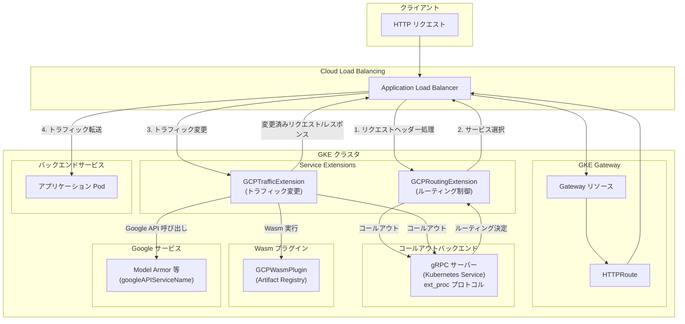

# Service Extensions: GKE Gateway でのコールアウトによるカスタムロジック挿入が一般提供 (GA) に

**リリース日**: 2026-04-09

**サービス**: Service Extensions

**機能**: GKE Gateway でのコールアウトを使用したロードバランシング処理パスへのカスタムロジック挿入の一般提供

**ステータス**: GA (一般提供)

:bar_chart: [このアップデートのインフォグラフィックを見る](https://takech9203.github.io/google-cloud-news-summary/20260409-service-extensions-gke-gateway-ga.html)

## 概要

Google Kubernetes Engine (GKE) Gateway で Service Extensions のコールアウト機能を使用してロードバランシング処理パスにカスタムロジックを挿入する機能が一般提供 (GA) となりました。これにより、GKE Gateway を利用するユーザーは、GCPRoutingExtension および GCPTrafficExtension リソースを使用して、Cloud Load Balancing のデータパスにカスタムコードを組み込むことが本番環境で正式にサポートされます。

Service Extensions は、Cloud Load Balancing や Media CDN のデータパスにカスタムロジックを挿入する拡張機能です。コールアウトは、ロードバランサーからユーザー管理のバックエンドサービスや Google サービスへ Envoy gRPC 呼び出しを行う仕組みで、トラフィックルーティングのカスタマイズ、リクエスト/レスポンスの変更、外部サービスとの統合が可能になります。

この機能は、GKE 上で高度なトラフィック管理、カスタム認証、リクエストロギングなどを実装する必要があるプラットフォームエンジニアやアプリケーション開発者に特に有用です。Kubernetes ネイティブなリソース定義 (CRD) を通じて、Gateway API と統合された形で Service Extensions を設定できます。

**アップデート前の課題**

- GKE Gateway 経由での Service Extensions コールアウトはプレビュー段階であり、本番環境での利用には制限やサポートの懸念があった
- ロードバランシング処理パスにカスタムロジックを挿入するには、サイドカーコンテナやカスタムプロキシなどの独自の仕組みを構築する必要があった
- トラフィックルーティングの高度なカスタマイズ (ヘッダーベースのルーティング、ペイロード検査など) を Kubernetes ネイティブに実現することが困難だった
- プレビュー段階のため SLA が適用されず、ミッションクリティカルなワークロードでの採用が難しかった

**アップデート後の改善**

- GA により SLA が適用され、本番環境での利用が正式にサポートされるようになった
- GCPRoutingExtension と GCPTrafficExtension の 2 種類のリソースを使い分けることで、ルーティングとトラフィック変更を Kubernetes ネイティブに設定可能になった
- コールアウト先として Kubernetes Service、GCPWasmPlugin、Google API サービス (例: Model Armor) の 3 つの参照方式が利用可能になった
- Autopilot クラスタおよび Standard クラスタの両方で利用可能になった

## アーキテクチャ図



このフローチャートは、GKE Gateway における Service Extensions のコールアウトフローを示しています。クライアントからのリクエストが Cloud Load Balancing を経由し、GCPRoutingExtension でルーティング決定、GCPTrafficExtension でトラフィック変更が行われた後、バックエンドサービスに転送されます。コールアウト先には Kubernetes Service、Wasm プラグイン、Google サービスの 3 つのオプションがあります。

## サービスアップデートの詳細

### 主要機能

1. **GCPRoutingExtension (ルーティング拡張)**
   - Cloud Load Balancing にカスタムロジックを挿入してトラフィックルーティングを制御する
   - リクエスト属性 (ヘッダー、URL など) に基づいて、元のルーティング先とは異なるバックエンドサービスへリクエストを転送可能
   - 各 ExtensionChain に 1 つの Extension のみ設定可能
   - Regional external Application Load Balancer および Regional internal Application Load Balancer で利用可能

2. **GCPTrafficExtension (トラフィック拡張)**
   - サービス選択後のトラフィックにカスタムロジックを適用し、リクエスト/レスポンスのヘッダーやペイロードを変更する
   - サービス選択やセキュリティポリシーには影響を与えない
   - 各 ExtensionChain に最大 3 つの Extension を設定可能
   - Regional external / Regional internal / Global external Application Load Balancer で利用可能

3. **3 つのバックエンド参照方式**
   - **Kubernetes Service 参照**: カスタムロジックを別の gRPC バックエンドアプリケーションとしてデプロイし、ロードバランサーからコールアウトする方式。GCPRoutingExtension と GCPTrafficExtension の両方で利用可能
   - **GCPWasmPlugin 参照**: WebAssembly (Wasm) モジュールをロードバランサーのデータパスに直接注入する高性能方式。GCPTrafficExtension と Global external Application Load Balancer でのみ利用可能
   - **Google API サービス参照**: googleAPIServiceName フィールドを使用して Model Armor 等の Google サービスを直接呼び出す方式。GCPTrafficExtension でのみ利用可能

## 技術仕様

### 対応 GatewayClass と拡張タイプ

| GatewayClass | GCPRoutingExtension | GCPTrafficExtension |
|------|------|------|
| gke-l7-regional-external-managed (Regional external ALB) | 対応 | 対応 |
| gke-l7-rilb (Regional internal ALB) | 対応 | 対応 |
| gke-l7-global-external-managed (Global external ALB) | 非対応 | 対応 |

### ExtensionChain の制限

| 項目 | 詳細 |
|------|------|
| GCPTrafficExtension の ExtensionChain あたり Extension 数 | 最大 3 |
| GCPRoutingExtension の ExtensionChain あたり Extension 数 | 最大 1 |
| Spec あたり ExtensionChain 数 | 最大 5 |
| MatchCondition あたり CELExpression 数 | 最大 10 |
| CELMatcher 文字列の最大長 | 512 文字 |
| ForwardHeaders リストの最大数 | 50 HTTP ヘッダー名 |
| Metadata マップの最大プロパティ数 | 16 |
| Extension タイムアウト | 10ms - 10,000ms |

### 通信プロトコル

| プロトコル | 説明 | 対応拡張タイプ |
|------|------|------|
| ext_proc (External Processing) | HTTP リクエストのライフサイクルイベントに応答し、ヘッダーやボディを検査・変更する | Route, Traffic, Authorization |
| ext_authz (External Authorization) | 受信リクエストの認可判断を外部サービスに委任する (プレビュー) | Authorization のみ |

### コールアウトバックエンドサービスの要件

```yaml
apiVersion: v1
kind: Service
metadata:
  name: extension-service
spec:
  ports:
    - port: 443
      targetPort: 443
      appProtocol: HTTP2  # 必須: HTTP/2 プロトコル
  selector:
    app: callout-backend
```

- バックエンドサービスは HTTP/2 プロトコルを使用する必要がある
- Extension と Gateway と同じ名前空間にデプロイする必要がある
- IAP、Cloud Armor セキュリティポリシー、Cloud CDN は使用不可
- gRPC レスポンスメッセージの最大サイズは 128 KB

## 設定方法

### 前提条件

1. GKE クラスタ (Autopilot または Standard) がセットアップ済みであること
2. GKE Gateway API に精通していること
3. Gateway リソースおよび HTTPRoute が設定済みであること
4. コールアウト用の gRPC サーバーアプリケーションが準備済みであること

### 手順

#### ステップ 1: コールアウトバックエンドサービスのデプロイ

```yaml
# extension-service-app.yaml
apiVersion: apps/v1
kind: Deployment
metadata:
  name: extension-service-app
spec:
  selector:
    matchLabels:
      app: store
  replicas: 1
  template:
    metadata:
      labels:
        app: store
    spec:
      containers:
        - name: serviceextensions
          image: us-docker.pkg.dev/service-extensions-samples/callouts/python-example-basic:main
          ports:
            - containerPort: 8080
            - containerPort: 443
          volumeMounts:
            - name: certs
              mountPath: "/etc/certs/"
              readOnly: true
          env:
            - name: TLS_SERVER_CERT
              value: "/etc/certs/tls.crt"
            - name: TLS_SERVER_PRIVKEY
              value: "/etc/certs/tls.key"
          resources:
            requests:
              cpu: 10m
      volumes:
        - name: certs
          secret:
            secretName: callout-tls-secret
            optional: false
---
apiVersion: v1
kind: Service
metadata:
  name: extension-service
spec:
  ports:
    - port: 443
      targetPort: 443
      appProtocol: HTTP2
  selector:
    app: store
```

```bash
kubectl apply -f extension-service-app.yaml
```

#### ステップ 2: HTTPRoute の更新

```yaml
# store-route.yaml
kind: HTTPRoute
apiVersion: gateway.networking.k8s.io/v1
metadata:
  name: store
spec:
  parentRefs:
    - kind: Gateway
      name: GATEWAY_NAME
  hostnames:
    - "store.example.com"
    - "service-extensions.example.com"
  rules:
    - backendRefs:
        - name: store-v1
          port: 8080
```

```bash
kubectl apply -f store-route.yaml
```

#### ステップ 3: GCPRoutingExtension または GCPTrafficExtension の定義

GCPTrafficExtension の例:

```yaml
# gcp-traffic-extension.yaml
kind: GCPTrafficExtension
apiVersion: networking.gke.io/v1
metadata:
  name: my-traffic-extension
  namespace: default
spec:
  targetRefs:
    - group: "gateway.networking.k8s.io"
      kind: Gateway
      name: GATEWAY_NAME
  extensionChains:
    - name: chain1
      matchCondition:
        celExpressions:
          - celMatcher: request.path.contains("serviceextensions")
      extensions:
        - name: ext1
          authority: "myext.com"
          timeout: 1s
          backendRef:
            group: ""
            kind: Service
            name: extension-service
            port: 443
          supportedEvents:
            - REQUEST_HEADERS
            - REQUEST_BODY
            - RESPONSE_HEADERS
            - RESPONSE_BODY
```

```bash
kubectl apply -f gcp-traffic-extension.yaml
```

GCPRoutingExtension の例:

```yaml
# gcp-routing-extension.yaml
kind: GCPRoutingExtension
apiVersion: networking.gke.io/v1
metadata:
  name: my-routing-extension
  namespace: default
spec:
  targetRefs:
    - group: "gateway.networking.k8s.io"
      kind: Gateway
      name: GATEWAY_NAME
  extensionChains:
    - name: chain1
      matchCondition:
        celExpressions:
          - celMatcher: request.path.contains("serviceextensions")
      extensions:
        - name: ext1
          authority: "myext.com"
          timeout: 1s
          backendRef:
            group: ""
            kind: Service
            name: extension-service
            port: 443
```

```bash
kubectl apply -f gcp-routing-extension.yaml
```

## メリット

### ビジネス面

- **本番環境への正式対応**: GA により SLA が適用され、ミッションクリティカルなワークロードで安心して利用できるようになった
- **開発コストの削減**: カスタムプロキシやサイドカーを独自に構築・運用する必要がなくなり、Google マネージドのロードバランサー上でカスタムロジックを実行可能
- **パートナー製品との統合**: API ゲートウェイセキュリティ、BOT 管理、WAF などのサードパーティ製品をロードバランシングパスに統合しやすくなった

### 技術面

- **Kubernetes ネイティブな設定**: GCPRoutingExtension / GCPTrafficExtension は Kubernetes CRD として定義され、kubectl で管理可能。GitOps ワークフローとの親和性が高い
- **柔軟なバックエンド参照**: Kubernetes Service、Wasm プラグイン、Google API サービスの 3 つの方式から要件に応じて選択可能
- **CEL 式によるマッチング**: Common Expression Language (CEL) を使用した柔軟なリクエストマッチングにより、特定のトラフィックのみにカスタムロジックを適用できる
- **Envoy ext_proc プロトコル対応**: 業界標準の Envoy External Processing プロトコルを使用しており、既存の gRPC サーバー実装を活用可能

## デメリット・制約事項

### 制限事項

- GCPRoutingExtension は Global external Application Load Balancer では利用できない
- GCPWasmPlugin は GCPTrafficExtension と Global external ALB の組み合わせでのみ利用可能
- コールアウトバックエンドサービスでは Cloud Armor、IAP、Cloud CDN ポリシーを使用できない
- コールアウトバックエンドサービスは HTTP/2 プロトコルを使用する必要がある
- gRPC レスポンスメッセージの最大サイズは 128 KB で、超過すると RESOURCE_EXHAUSTED エラーでストリームが閉じられる
- 一部のヘッダー (X-user-IP、CDN-Loop、X-Forwarded-* 等) の操作は制限されている
- Extension と Gateway は同じ名前空間にデプロイする必要がある

### 考慮すべき点

- コールアウトの追加によりリクエスト/レスポンスのレイテンシが増加する。処理するデータ種別 (ヘッダー、ボディ等) ごとにレイテンシが加算される
- レイテンシ最適化のため、コールアウトサービスはバックエンドサービスと同じゾーンにデプロイすることが推奨される
- コールアウトサービスのスケーラビリティと可用性はユーザー自身が管理する必要がある
- supportedEvents を必要最小限に設定し、不要なデータ処理によるレイテンシ増加を避けることが推奨される

## ユースケース

### ユースケース 1: カスタムトラフィックルーティング

**シナリオ**: マルチテナント SaaS アプリケーションで、リクエストヘッダー内のテナント ID に基づいて異なるバックエンドサービスにトラフィックをルーティングしたい。

**実装例**:
```yaml
kind: GCPRoutingExtension
apiVersion: networking.gke.io/v1
metadata:
  name: tenant-routing
spec:
  targetRefs:
    - group: "gateway.networking.k8s.io"
      kind: Gateway
      name: my-gateway
  extensionChains:
    - name: tenant-chain
      matchCondition:
        celExpressions:
          - celMatcher: "has(request.headers['x-tenant-id'])"
      extensions:
        - name: tenant-router
          authority: "tenant-router.internal"
          timeout: 500ms
          backendRef:
            kind: Service
            name: tenant-routing-service
            port: 443
```

**効果**: テナントごとに異なるバックエンドバージョンやリージョンへの動的ルーティングが実現でき、テナント分離とカスタマイズが容易になる。

### ユースケース 2: カスタム認証・認可

**シナリオ**: 社内の認証基盤と連携し、ロードバランサーレベルでカスタム認証トークンの検証やヘッダーの付与を行いたい。

**実装例**:
```yaml
kind: GCPTrafficExtension
apiVersion: networking.gke.io/v1
metadata:
  name: custom-auth
spec:
  targetRefs:
    - group: "gateway.networking.k8s.io"
      kind: Gateway
      name: my-gateway
  extensionChains:
    - name: auth-chain
      matchCondition:
        celExpressions:
          - celMatcher: "request.path.startsWith('/api/')"
      extensions:
        - name: auth-service
          authority: "auth.internal"
          timeout: 1s
          backendRef:
            kind: Service
            name: auth-callout-service
            port: 443
          supportedEvents:
            - REQUEST_HEADERS
```

**効果**: アプリケーションコードに認証ロジックを埋め込む必要がなくなり、認証の一元管理とセキュリティの強化が実現できる。

### ユースケース 3: AI 推論トラフィックのセキュリティ (Model Armor 統合)

**シナリオ**: GKE Inference Gateway を使用した AI 推論ワークロードで、プロンプトとレスポンスに対してセキュリティポリシーを適用したい。

**実装例**:
```yaml
kind: GCPTrafficExtension
apiVersion: networking.gke.io/v1
metadata:
  name: model-armor-extension
spec:
  targetRefs:
    - group: "gateway.networking.k8s.io"
      kind: Gateway
      name: inference-gateway
  extensionChains:
    - name: model-armor-chain
      matchCondition:
        celExpressions:
          - celMatcher: "request.path.startsWith('/')"
      extensions:
        - name: model-armor-service
          supportedEvents:
            - RequestHeaders
            - RequestBody
            - ResponseHeaders
            - ResponseBody
          timeout: 1s
          googleAPIServiceName: "modelarmor.us-central1.rep.googleapis.com"
```

**効果**: AI 推論トラフィックに対して、プロンプトインジェクション防止や不適切なコンテンツフィルタリングなどのセキュリティポリシーを一元的に適用できる。

## 料金

Service Extensions の GKE Gateway 統合に関する具体的な料金情報は、公式ドキュメントを参照してください。Service Extensions はコールアウトやプラグインの使用に応じた課金となり、Cloud Load Balancing の基本料金に加えて追加コストが発生する可能性があります。

また、コールアウトバックエンドサービスの実行に使用する GKE ノードのコンピューティングリソースについても、通常の GKE 料金が適用されます。

詳細は [Service Extensions の料金ページ](https://cloud.google.com/service-extensions/pricing) および [Cloud Load Balancing の料金ページ](https://cloud.google.com/vpc/network-pricing#lb) をご確認ください。

## 利用可能リージョン

GKE Gateway での Service Extensions は、対応する GatewayClass に基づき以下のスコープで利用可能です。

| GatewayClass | スコープ |
|------|------|
| gke-l7-regional-external-managed | リージョナル (各リージョンで利用可能) |
| gke-l7-rilb | リージョナル (各リージョンで利用可能) |
| gke-l7-global-external-managed | グローバル (GCPTrafficExtension のみ) |

具体的な利用可能リージョンについては [GKE のリージョンとゾーン](https://cloud.google.com/kubernetes-engine/docs/concepts/types-of-clusters#availability) を参照してください。

## 関連サービス・機能

- **Cloud Load Balancing**: Service Extensions のコールアウトが実行される基盤。Application Load Balancer がサポート対象
- **GKE Gateway API**: Gateway リソースと HTTPRoute を通じてトラフィック管理を行う Kubernetes ネイティブ API
- **Service Extensions (Cloud Load Balancing 直接)**: GKE Gateway を介さずに Cloud Load Balancing に直接 Service Extensions を設定する方式
- **Model Armor**: GCPTrafficExtension の googleAPIServiceName を通じて統合可能な AI セキュリティサービス
- **Artifact Registry**: GCPWasmPlugin で使用する Wasm モジュールイメージのホスティング先
- **Media CDN**: Service Extensions のプラグイン機能をサポートする別のプロダクト

## 参考リンク

- :bar_chart: [インフォグラフィック](https://takech9203.github.io/google-cloud-news-summary/20260409-service-extensions-gke-gateway-ga.html)
- [公式リリースノート](https://cloud.google.com/release-notes#April_09_2026)
- [GKE Service Extensions の設定ドキュメント](https://cloud.google.com/kubernetes-engine/docs/how-to/configure-gke-service-extensions)
- [Service Extensions 概要](https://cloud.google.com/service-extensions/docs/overview)
- [Cloud Load Balancing コールアウト概要](https://cloud.google.com/service-extensions/docs/callouts-overview)
- [GKE Gateway API ドキュメント](https://cloud.google.com/kubernetes-engine/docs/concepts/gateway-api)
- [Service Extensions 料金](https://cloud.google.com/service-extensions/pricing)

## まとめ

Service Extensions の GKE Gateway 統合が GA となったことで、GKE ユーザーはロードバランシング処理パスにカスタムロジックを本番環境で安心して挿入できるようになりました。GCPRoutingExtension と GCPTrafficExtension の 2 つのリソースタイプ、および Kubernetes Service / Wasm プラグイン / Google API サービスの 3 つのバックエンド参照方式により、カスタムルーティング、トラフィック変更、認証、AI セキュリティなど幅広いユースケースに対応できます。GKE Gateway を使用している場合は、まず既存のカスタムプロキシやサイドカーの処理を Service Extensions に移行できるか検討することをお勧めします。

---

**タグ**: Service Extensions, GKE, Gateway API, Cloud Load Balancing, コールアウト, GCPRoutingExtension, GCPTrafficExtension, Wasm, ext_proc, GA, Kubernetes, トラフィック管理
