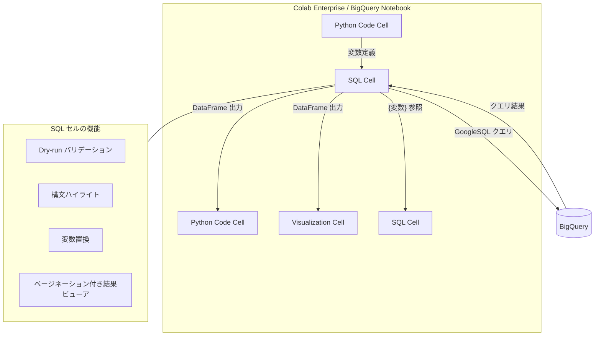

# BigQuery / Colab Enterprise: SQL セルが一般提供 (GA) に昇格

**リリース日**: 2026-04-10

**サービス**: BigQuery, Colab Enterprise

**機能**: SQL Cells (SQL セル)

**ステータス**: GA (一般提供)

[このアップデートのインフォグラフィックを見る](https://takech9203.github.io/google-cloud-news-summary/20260410-bigquery-colab-sql-cells-ga.html)

## 概要

BigQuery ノートブックおよび Colab Enterprise ノートブックにおける SQL セル機能が、一般提供 (GA) として正式にリリースされた。SQL セルを使用することで、ノートブック環境内から直接 SQL クエリの記述、編集、実行が可能になる。これにより、Python コードとSQL クエリを同一ノートブック内でシームレスに組み合わせたデータ分析ワークフローが実現する。

SQL セルは、従来の IPython Magics for BigQuery に代わる新しいワークフローとして位置付けられている。データアナリスト、データサイエンティスト、データエンジニアなど、BigQuery を活用するすべてのユーザーが対象であり、特に SQL と Python を組み合わせた探索的データ分析や機械学習ワークフローにおいて大きな価値を発揮する。

本機能は 2025 年 10 月 14 日に Preview としてリリースされ、約 6 か月間のプレビュー期間を経て GA に昇格した。GA 昇格により、本番環境での利用に対する SLA サポートが適用される。

**アップデート前の課題**

- ノートブック内で SQL クエリを実行するには IPython Magics (`%%bigquery`) を使用する必要があり、構文補完やバリデーションが限定的だった
- SQL クエリの結果を Python 変数として参照するには追加のコードが必要だった
- SQL の構文エラーをクエリ実行前に検出する仕組みが不十分だった
- SQL クエリ結果の可視化にはクエリ実行後に別途 Python コードで可視化処理を記述する必要があった

**アップデート後の改善**

- ノートブック内に専用の SQL セルを追加し、GoogleSQL クエリを直接記述・実行できるようになった
- SQL クエリの実行結果が自動的に BigQuery DataFrame として保存され、他のセルから変数名で参照可能になった
- ドライラン (Dry-run) による SQL 文のバリデーションと処理バイト数の概算が実行前に確認できるようになった
- Python 変数を SQL クエリ内で `{variable_name}` の形式で直接参照可能になった
- SQL セルの出力をビジュアライゼーションセルの入力として直接連携できるようになった

## アーキテクチャ図



SQL セルは BigQuery ノートブックおよび Colab Enterprise ノートブックの中核的なセルタイプとして機能し、Python セルやビジュアライゼーションセルとデータをシームレスに受け渡しできる。

## サービスアップデートの詳細

### 主要機能

1. **ドライラン (Dry-run) サポート**
   - SQL 文のバリデーションを実行前に実施
   - クエリが処理するバイト数の概算値を事前に表示
   - コスト管理とクエリの最適化に活用可能

2. **構文フォーマット**
   - SQL キーワードのリンティング (構文チェック)
   - シンタックスハイライトによるコードの可読性向上

3. **BigQuery DataFrame 出力変数**
   - SQL クエリの実行結果が自動的に BigQuery DataFrame として保存
   - セルのタイトルと同じ名前の変数に格納
   - 他のノートブックセルからこの変数を直接参照可能

4. **変数置換 (Variable Replacement)**
   - Python 変数を SQL クエリ内で `{variable_name}` の形式で参照可能
   - 前の SQL セルの結果 DataFrame をテーブルとして参照可能 (`{df}`)
   - パラメータ化されたクエリやクエリの反復的な改良が容易に

5. **結果セットビューア**
   - 軽量なテーブル形式の結果表示
   - 大規模な結果セットに対するページネーション対応

6. **ビジュアライゼーションセル連携**
   - SQL セルの出力をビジュアライゼーションセルの入力として直接利用可能
   - チャートタイプ、集計方法、カラー、ラベルなどのカスタマイズが可能

## 技術仕様

### サポートされる SQL 方言とデータソース

| 項目 | 詳細 |
|------|------|
| SQL 方言 | GoogleSQL |
| データソース | BigQuery データ |
| 1 セル内の SQL 文 | 複数の SQL 文を実行可能 (最後の文の結果のみ DataFrame に保存) |
| 変数参照 | `{python_variable}` 形式で Python 変数を SQL 式内で参照 |
| DataFrame 参照 | `{df}` 形式で前の SQL セルの結果を FROM 句で参照 |

### 必要な IAM ロール

| ロール | 説明 |
|--------|------|
| `roles/bigquery.user` (BigQuery User) | BigQuery データへのクエリ実行に必要 |
| `roles/aiplatform.colabEnterpriseUser` (Colab Enterprise User) | Colab Enterprise ノートブックの作成と実行に必要 |
| `roles/aiplatform.notebookRuntimeUser` (Notebook Runtime User) | ノートブックランタイムの使用に必要 (共有時) |

## 設定方法

### 前提条件

1. Google Cloud プロジェクトで BigQuery API が有効化されていること
2. 適切な IAM ロール (`roles/bigquery.user`, `roles/aiplatform.colabEnterpriseUser`) が付与されていること
3. BigQuery Studio が有効なリージョンを使用していること

### 手順

#### ステップ 1: SQL セルの作成 (Colab Enterprise)

Google Cloud コンソールから Colab Enterprise の My notebooks ページにアクセスし、ノートブックを開く。ツールバーで [Insert code cell options] メニューから [Add SQL cell] を選択する。

#### ステップ 2: SQL クエリの記述と実行

SQL セルに GoogleSQL クエリを記述する。Python 変数を参照する場合は `{variable_name}` の形式で記述する。

```sql
-- Python 変数 my_threshold を SQL 式内で参照
SELECT * FROM my_dataset.my_table WHERE x > {my_threshold};
```

セルにカーソルを合わせ、[Run cell] ボタンをクリックしてクエリを実行する。

#### ステップ 3: 結果の活用

クエリの実行結果は、SQL セルのタイトルと同名の BigQuery DataFrame として自動保存される。後続の Python セルや SQL セルから変数名で参照できる。

```sql
-- 前の SQL セルの結果 (DataFrame 名: df) をテーブルとして参照
SELECT * FROM {df};
```

#### ステップ 4: ビジュアライゼーションとの連携 (オプション)

SQL セルの結果を可視化する場合、ビジュアライゼーションセルを追加し、データソースとして SQL セルの出力 DataFrame を選択する。

## メリット

### ビジネス面

- **分析ワークフローの効率化**: SQL と Python を同一ノートブック内でシームレスに組み合わせることで、データ分析の生産性が向上
- **コスト管理の改善**: ドライラン機能によりクエリ実行前に処理バイト数を確認でき、意図しない高コストクエリの防止に寄与
- **コラボレーションの促進**: ノートブックの共有・バージョン管理機能と組み合わせることで、チーム内でのナレッジ共有が容易に

### 技術面

- **IPython Magics の代替**: `%%bigquery` マジックコマンドに比べ、構文補完やバリデーションが強化された標準的な SQL 記述環境を提供
- **型安全な変数参照**: Python 変数や DataFrame をクエリ内で直接参照でき、データパイプラインの構築が簡潔に
- **GA による SLA 保証**: Preview 期間の制限が解除され、本番ワークロードでの利用に対する SLA が適用

## デメリット・制約事項

### 制限事項

- 1 つの SQL セル内で複数の SQL 文を実行した場合、最後の SQL 文の結果のみが DataFrame に保存される
- SQL セル機能は Google Cloud コンソール内のノートブック環境でのみ利用可能

### 考慮すべき点

- ノートブックランタイムの使用には BigQuery Standard エディション以上のスロット消費が発生する (PAYG 課金)
- ノートブックの出力には、アクセス権のないテーブルのデータも含まれる可能性があるため、共有時にはセキュリティに注意が必要

## ユースケース

### ユースケース 1: 探索的データ分析 (EDA)

**シナリオ**: データサイエンティストが BigQuery 上のデータセットに対して探索的分析を行い、その結果を Python で統計処理・可視化する。

**実装例**:
```sql
-- SQL セル: データの概要を取得
SELECT
  column_name,
  COUNT(*) as row_count,
  COUNT(DISTINCT column_value) as unique_count
FROM my_dataset.my_table
GROUP BY column_name;
```

```python
# Python セル: SQL セルの結果 (DataFrame) を可視化
import matplotlib.pyplot as plt
df.plot(kind='bar', x='column_name', y='row_count')
plt.title('Row Count by Column')
plt.show()
```

**効果**: SQL でのデータ抽出から Python での可視化まで、同一ノートブック内で完結し、分析のイテレーションが高速化される。

### ユースケース 2: パラメータ化されたレポート生成

**シナリオ**: ビジネスアナリストが月次レポートを作成する際、対象月をパラメータとして渡し、SQL クエリで集計してレポートを自動生成する。

**実装例**:
```python
# Python セル: パラメータの定義
target_month = '2026-04'
```

```sql
-- SQL セル: パラメータを使用した集計クエリ
SELECT
  DATE_TRUNC(order_date, MONTH) as month,
  SUM(revenue) as total_revenue,
  COUNT(DISTINCT customer_id) as unique_customers
FROM sales.orders
WHERE FORMAT_DATE('%Y-%m', order_date) = '{target_month}'
GROUP BY month;
```

**効果**: パラメータを変更するだけで同じ分析を異なる条件で繰り返し実行でき、定型レポートの作成が効率化される。

## 料金

SQL セルの利用自体に追加料金は発生しない。ただし、以下の料金が適用される。

- **SQL クエリの実行**: BigQuery の標準的な料金体系 (オンデマンド課金またはキャパシティベース課金) に従う
- **ノートブックランタイム**: BigQuery Studio ノートブックのランタイム使用は、BigQuery Standard エディションの PAYG スロットとして課金される

詳細は [BigQuery 料金ページ](https://cloud.google.com/bigquery/pricing) を参照。

### 料金例 (BigQuery オンデマンド課金の場合)

| 使用量 | 月額料金 (概算) |
|--------|-----------------|
| 無料枠 (1 TiB/月まで) | 無料 |
| 10 TiB/月のクエリ処理 | 約 $75.00 |
| 100 TiB/月のクエリ処理 | 約 $750.00 |

※ 上記はオンデマンド課金 ($7.50/TiB、マルチリージョン US) の概算。実際の料金はリージョンおよび課金モデルにより異なる。

## 利用可能リージョン

BigQuery Studio ノートブックが利用可能な全リージョンで SQL セルを使用できる。主要なリージョンは以下の通り。

| リージョン | ロケーション |
|-----------|-------------|
| us-central1 | アイオワ |
| us-east4 | 北バージニア |
| europe-west1 | ベルギー |
| europe-west3 | フランクフルト |
| asia-northeast1 | 東京 |
| asia-northeast3 | ソウル |
| asia-southeast1 | シンガポール |
| australia-southeast1 | シドニー |

全リージョンの一覧は [BigQuery Studio ノートブックのドキュメント](https://docs.cloud.google.com/bigquery/docs/notebooks-introduction#supported_regions) を参照。

## 関連サービス・機能

- **[BigQuery DataFrames](https://docs.cloud.google.com/python/docs/reference/bigframes/latest)**: SQL セルの出力が BigQuery DataFrame として保存され、pandas 互換の API でデータ操作が可能
- **[ビジュアライゼーションセル](https://docs.cloud.google.com/colab/docs/visualization-cells)**: SQL セルの出力をインタラクティブなチャートとして可視化 (Preview)
- **[Data Science Agent](https://docs.cloud.google.com/colab/docs/use-data-science-agent)**: Colab Enterprise ノートブック内で自動的なデータ分析・ML タスクを実行する AI エージェント (Preview)
- **[Gemini in BigQuery](https://docs.cloud.google.com/bigquery/docs/write-sql-gemini)**: AI アシスタントによる SQL 記述支援
- **[BigQuery Studio](https://docs.cloud.google.com/bigquery/docs/query-overview#bigquery-studio)**: SQL、Python、ノートブックを統合したデータ分析環境

## 参考リンク

- [インフォグラフィック](https://takech9203.github.io/google-cloud-news-summary/20260410-bigquery-colab-sql-cells-ga.html)
- [公式リリースノート](https://docs.cloud.google.com/release-notes#April_10_2026)
- [SQL セルのドキュメント](https://docs.cloud.google.com/colab/docs/sql-cells)
- [BigQuery ノートブックの概要](https://docs.cloud.google.com/bigquery/docs/notebooks-introduction)
- [ノートブックの作成と管理](https://docs.cloud.google.com/bigquery/docs/create-notebooks)
- [BigQuery 料金ページ](https://cloud.google.com/bigquery/pricing)

## まとめ

BigQuery ノートブックおよび Colab Enterprise における SQL セルの GA 昇格は、データ分析ワークフローにおける SQL と Python のシームレスな統合を本番環境レベルで実現する重要なアップデートである。ドライランによるコスト事前確認、変数置換によるパラメータ化、ビジュアライゼーションセルとの連携など、生産性を大きく向上させる機能が GA として利用可能になった。BigQuery を活用したデータ分析を行っているチームは、IPython Magics からの移行を検討し、SQL セルを活用した効率的な分析ワークフローの構築を推奨する。

---

**タグ**: #BigQuery #ColabEnterprise #SQLCells #GA #Notebook #DataAnalysis #BigQueryStudio #GoogleSQL
