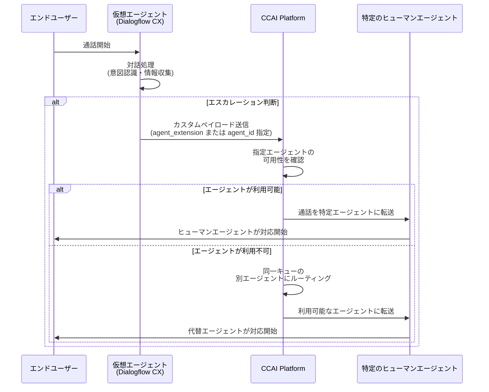

# Google Cloud Contact Center as a Service (CCaaS): 複数の新機能追加とバグ修正

**リリース日**: 2026-04-10

**サービス**: Google Cloud Contact Center as a Service (CCaaS) / CCAI Platform

**機能**: プレリリースノート、ダイレクトコール言語選択、予測キャンペーン改善コントロール、仮想エージェントから特定ヒューマンエージェントへの通話転送、バグ修正

**ステータス**: Announcement / Feature / Fixed

[このアップデートのインフォグラフィックを見る](https://takech9203.github.io/google-cloud-news-summary/20260410-ccaas-features-and-fixes.html)

## 概要

Google Cloud Contact Center as a Service (CCaaS) に複数の新機能とバグ修正が 2026 年 4 月 10 日付でリリースされた。本リリースには、次期バージョンのプレリリースノートの公開、ダイレクトコール (直通電話) における言語選択サポート、予測キャンペーンの改善コントロールのセルフサービス化、仮想エージェントから特定のヒューマンエージェントへの通話転送機能、およびチャットやメタデータに関する複数のバグ修正が含まれる。

特に注目すべきは 2 つの機能強化である。まず、エンドユーザーがエージェントの直通電話番号に発信する際に通話の冒頭で言語を選択できるようになった点は、多言語対応のコンタクトセンター運用において大きな改善である。次に、仮想エージェントが `agent_extension` または `agent_id` フィールドを使用して特定のヒューマンエージェントに通話を転送できるようになった点は、カスタマーサポートの精度とパーソナライゼーション向上に寄与する。

本アップデートの対象ユーザーは、CCAI Platform を利用するコンタクトセンターの管理者、スーパーバイザー、仮想エージェント設計者、およびアウトバウンドキャンペーン運用担当者である。

**アップデート前の課題**

- ダイレクトコール (直通電話) でエージェントに発信する際、エンドユーザーは言語を選択する手段がなく、デフォルト言語でしか対応できなかった
- 予測キャンペーンの改善コントロール (Max Calls Per Agent、Target Agent Occupancy) を使用するには、Google アカウントチームの支援が必要だった (2026 年 3 月 24 日の CCaaS 4.12 で発表)
- 仮想エージェントからヒューマンエージェントへの通話転送はキュー単位でのみ可能であり、特定のヒューマンエージェントを指定して転送することができなかった
- チャットでバックスラッシュが正しく表示されない問題があった
- 仮想エージェントのチャットトランスクリプトに不具合があった
- セッションメタデータの通話時間が不正確だった

**アップデート後の改善**

- エンドユーザーがダイレクトコールの開始時に言語を選択できるようになり、多言語対応の顧客体験が向上した
- 予測キャンペーンの改善コントロールが管理者のセルフサービスで利用可能になり、Google アカウントチームへの依頼が不要になった
- 仮想エージェントが `agent_extension` または `agent_id` フィールドを使用して特定のヒューマンエージェントに通話を直接転送できるようになった
- チャット表示、トランスクリプト、セッションメタデータに関する複数のバグが修正された

## アーキテクチャ図



仮想エージェントから特定のヒューマンエージェントへの通話転送フローを示す。仮想エージェントはカスタムペイロードで `agent_extension` または `agent_id` を指定し、CCAI Platform が該当エージェントの可用性を確認した上で転送を実行する。指定エージェントが利用不可の場合は、同一キューの利用可能なエージェントにフォールバックする。

## サービスアップデートの詳細

### 主要機能

1. **ダイレクトコール (直通電話) の言語選択サポート**
   - エンドユーザーがエージェントの直通電話番号に発信した際、通話の冒頭で言語を選択できるようになった
   - これにより、ダイレクトコールでも IVR 経由のコールと同様に多言語対応が可能になった
   - 設定は CCAI Platform ポータルの **Settings > Languages & Messages** で管理される言語選択メッセージ設定と連動する
   - ダイレクトコールのセッションタイプは「Voice Inbound (Direct)」として記録される

2. **予測キャンペーンの改善コントロールのセルフサービス化**
   - 2026 年 3 月 24 日の CCaaS 4.12 で発表された予測キャンペーンの改善コントロール (Max Calls Per Agent、Target Agent Occupancy) が、Google アカウントチームの支援なしで利用可能になった
   - **Max Calls Per Agent**: エージェント 1 人あたりにダイアラーが発信できる最大通話数を設定
   - **Target Agent Occupancy**: エージェント稼働率の目標パーセンテージを設定し、システムがダイヤルレートを自動調整
   - これらのコントロールにより、過剰ダイヤルによる通話放棄リスクを低減しつつ、ダイヤルレートを自然かつ一貫してランプアップ可能

3. **仮想エージェントから特定のヒューマンエージェントへの通話転送**
   - 仮想エージェントが `agent_extension` または `agent_id` フィールドを使用して、特定のヒューマンエージェントに通話を転送できるようになった
   - Dialogflow CX のカスタムペイロードで転送先エージェントを指定する
   - 従来のキュー単位のエスカレーション (`menu_id` を使用した転送) に加え、特定エージェントへのダイレクト転送が可能になった

4. **バグ修正**
   - チャットでバックスラッシュ (`\`) が正しく表示されない問題を修正
   - 仮想エージェントのチャットトランスクリプトに関する不具合を修正
   - セッションメタデータにおける通話時間の不正確さを修正

5. **次期バージョンのプレリリースノート公開**
   - CCaaS の次期バージョンに関するプレリリースノートが公開された

## 技術仕様

### 仮想エージェントから特定ヒューマンエージェントへの転送ペイロード

従来の仮想エージェントエスカレーションではキュー (`menu_id`) を指定していたが、今回のアップデートにより `agent_extension` または `agent_id` フィールドを使用して特定のヒューマンエージェントを指定できるようになった。

| 項目 | 詳細 |
|------|------|
| 転送方式 | Dialogflow CX カスタムペイロード |
| 新規フィールド | `agent_extension`, `agent_id` |
| フォールバック動作 | 指定エージェントが利用不可の場合、同一キューの利用可能なエージェントに転送 |
| 対象チャネル | 音声通話 (Voice) |
| 既存方式との互換性 | `menu_id` を使用したキュー単位のエスカレーションも引き続き利用可能 |

### 予測キャンペーン改善コントロール

| コントロール | 説明 | 用途 |
|------|------|------|
| Max Calls Per Agent | 利用可能なエージェント 1 人あたりのダイアラーの最大発信数 | 過剰ダイヤルの防止 |
| Target Agent Occupancy | エージェント稼働率の目標パーセンテージ | ダイヤルレートの自動最適化 |
| Max Abandonment | 放棄率の上限パーセンテージ (任意) | 法規制への準拠 (例: 米国では 30 日間で 3% 以下) |

### 従来のエスカレーションペイロード (キュー指定)

```json
{
  "ujet": {
    "type": "action",
    "action": "escalation",
    "escalation_reason": "by_virtual_agent",
    "menu_id": 100,
    "language": "ja"
  }
}
```

### 新機能: 特定エージェントへの転送ペイロード (概念例)

```json
{
  "ujet": {
    "type": "action",
    "action": "escalation",
    "escalation_reason": "by_virtual_agent",
    "agent_extension": "1234",
    "language": "ja"
  }
}
```

または `agent_id` を使用する場合:

```json
{
  "ujet": {
    "type": "action",
    "action": "escalation",
    "escalation_reason": "by_virtual_agent",
    "agent_id": "AGENT_ID",
    "language": "ja"
  }
}
```

## 設定方法

### 前提条件

1. CCAI Platform へのアクセス権限があること
2. 管理者ロールまたは適切な権限が付与されていること
3. 言語選択機能を使用する場合は、複数言語が設定済みであること
4. 予測キャンペーンを使用する場合は、キャンペーンマネージャーへのアクセス権限があること

### 手順

#### ステップ 1: ダイレクトコールの言語選択を設定

1. CCAI Platform ポータルで **Settings > Languages & Messages** を選択
2. **Language Selection Message** セクションで、言語選択メッセージを設定:
   - **Text-to-speech**: テキストを入力 (例: 「日本語は 1 を、英語は 2 を押してください」)
   - **Upload Audio Recording**: 事前録音した音声ファイルをアップロード
3. ダイレクトコールに使用する言語が **Live** ステータスになっていることを確認
4. **Save Languages** をクリック

#### ステップ 2: 予測キャンペーンの改善コントロールを設定

1. CCAI Platform ポータルで **Campaigns** を選択
2. **Add Campaign** をクリックし、**Mode** で **Predictive** を選択
3. 以下の新しいコントロールを設定:
   - **Max Calls Per Agent**: エージェント 1 人あたりの最大発信数を選択
   - **Target Agent Occupancy**: 目標エージェント稼働率をパーセンテージで入力
4. 必要に応じて **Max Abandonment** チェックボックスを有効化し、放棄率の上限を設定
5. **Create** をクリック

#### ステップ 3: 仮想エージェントから特定ヒューマンエージェントへの転送を設定

1. Dialogflow CX コンソールで対象の仮想エージェントを開く
2. エスカレーションフローのフルフィルメントでカスタムペイロードを設定
3. ペイロード内で `agent_extension` または `agent_id` フィールドに転送先ヒューマンエージェントの内線番号または ID を指定
4. フォールバック用のキュー設定を確認

## メリット

### ビジネス面

- **多言語顧客体験の向上**: ダイレクトコールの言語選択により、多言語対応のコンタクトセンターでエンドユーザーが自分の言語でサポートを受けられるようになり、顧客満足度の向上が見込まれる
- **キャンペーン運用の自律性向上**: 予測キャンペーンのコントロールがセルフサービスで利用可能になったことで、Google アカウントチームへの依頼を待たずに迅速なキャンペーン調整が可能になった
- **パーソナライズされた顧客対応**: 仮想エージェントが特定のヒューマンエージェントに通話を転送できることで、VIP 顧客や特定の案件担当者への直接ルーティングが実現し、顧客体験が向上する
- **運用効率の改善**: バグ修正によりチャット表示やトランスクリプトの信頼性が向上し、エージェントの業務効率が改善される

### 技術面

- **柔軟なルーティング制御**: `agent_extension` と `agent_id` フィールドにより、仮想エージェントのエスカレーションにおけるルーティングの粒度が向上
- **セルフサービス管理**: 予測キャンペーンのダイヤルレート制御をポータル上で直接管理でき、運用の俊敏性が向上
- **データ品質の向上**: セッションメタデータの通話時間修正により、レポーティングとアナリティクスの精度が改善

## デメリット・制約事項

### 制限事項

- ダイレクトコールの言語選択を利用するには、使用する言語が事前に CCAI Platform で設定され「Live」ステータスになっている必要がある
- 仮想エージェントからの特定エージェントへの転送は、指定エージェントが利用不可の場合にキュー内の他のエージェントにフォールバックするが、全エージェントが利用不可の場合は通話が終了する可能性がある
- 予測キャンペーンの Max Abandonment 設定は法規制 (国ごとに異なる放棄率制限) に準拠する必要がある

### 考慮すべき点

- 仮想エージェントの転送ペイロードを `agent_extension` や `agent_id` に変更する際は、既存のエスカレーションフローとの整合性を確認すること
- ダイレクトコールの言語選択メッセージを設定する際は、全てのサポート言語に対応する音声ガイダンスを準備する必要がある

## ユースケース

### ユースケース 1: VIP 顧客の専任エージェントへのダイレクト転送

**シナリオ**: 金融サービス企業のコンタクトセンターで、VIP 顧客が仮想エージェントと対話後、専任のアカウントマネージャーに転送されるフローを構築する。

**実装例**:
```json
{
  "ujet": {
    "type": "action",
    "action": "escalation",
    "escalation_reason": "by_virtual_agent",
    "agent_id": "VIP_ACCOUNT_MANAGER_ID",
    "language": "ja"
  }
}
```

**効果**: VIP 顧客が仮想エージェントで用件を伝えた後、自動的に専任エージェントに転送される。顧客は一般キューで待機する必要がなく、パーソナライズされたサービスを受けられる。

### ユースケース 2: 多言語コンタクトセンターのダイレクトコール運用

**シナリオ**: グローバル展開している企業のコンタクトセンターで、各国の顧客が担当エージェントの直通番号に電話をかける際に、自分の言語でサポートを受けたい。

**効果**: ダイレクトコールの言語選択機能により、エンドユーザーは通話の冒頭で希望言語を選択でき、IVR 経由の通話と同等の多言語対応体験を得られる。レポーティングでも言語別のデータが正確に記録される。

### ユースケース 3: 予測キャンペーンの放棄率最適化

**シナリオ**: テレマーケティング企業が予測キャンペーンの過剰ダイヤルによる通話放棄率を低減したい。米国の規制では 30 日間の放棄率を 3% 以下に抑える必要がある。

**効果**: Max Calls Per Agent と Target Agent Occupancy コントロールを管理ポータルから直接設定することで、Google アカウントチームへの依頼を待たずにダイヤルレートを迅速に調整できる。規制準拠を維持しつつ、エージェント稼働率を最適化できる。

## 関連サービス・機能

- **CCAI Platform 仮想エージェント (Dialogflow CX)**: 仮想エージェントのエスカレーションフローとカスタムペイロード設定の基盤。今回のアップデートで `agent_extension` / `agent_id` による特定エージェント転送が追加された
- **CCAI Platform 予測キャンペーン (Outbound Dialer)**: アウトバウンドダイヤラーの予測キャンペーン機能。改善コントロールがセルフサービスで利用可能になった
- **CCAI Platform ダイレクト電話番号**: エージェントまたはキューに割り当てられる直通電話番号機能。言語選択サポートが追加された
- **CCAI Platform Languages & Messages**: 多言語設定と IVR メッセージ管理。ダイレクトコールの言語選択メッセージ設定と連動する
- **CCAI Platform エージェント拡張番号**: エージェントに割り当てられる内線番号機能。仮想エージェントからの `agent_extension` 転送で使用される

## 参考リンク

- [インフォグラフィック](https://takech9203.github.io/google-cloud-news-summary/20260410-ccaas-features-and-fixes.html)
- [公式リリースノート](https://docs.cloud.google.com/release-notes#April_10_2026)
- [CCAI Platform リリースノート](https://docs.cloud.google.com/contact-center/ccai-platform/docs/release-notes)
- [予測キャンペーン ドキュメント](https://docs.cloud.google.com/contact-center/ccai-platform/docs/campaign-predictive)
- [仮想エージェント カスタムペイロード](https://docs.cloud.google.com/contact-center/ccai-platform/docs/va-custom-payload)
- [ダイレクト電話番号 ドキュメント](https://docs.cloud.google.com/contact-center/ccai-platform/docs/direct-phone-numbers)
- [言語とメッセージの設定](https://docs.cloud.google.com/contact-center/ccai-platform/docs/customizing_languages_recordings_messages)
- [仮想エージェント エスカレーション ガイド](https://docs.cloud.google.com/contact-center/ccai-platform/docs/iva-guide)

## まとめ

本リリースは Google Cloud CCaaS の利便性と柔軟性を大幅に強化するアップデートである。ダイレクトコールの言語選択サポートと仮想エージェントから特定ヒューマンエージェントへの転送機能は、多言語対応やパーソナライズされた顧客体験を実現する上で重要な機能追加であり、予測キャンペーンのセルフサービス化と合わせて、コンタクトセンター運用者の自律性と効率性を向上させる。CCAI Platform を利用している全てのコンタクトセンターに対して、新機能の活用とバグ修正の適用を推奨する。

---

**タグ**: #CCaaS #CCAI-Platform #Virtual-Agent #Human-Agent-Transfer #Predictive-Campaign #Direct-Call #Language-Selection #Agent-Extension #Bug-Fix #Contact-Center
