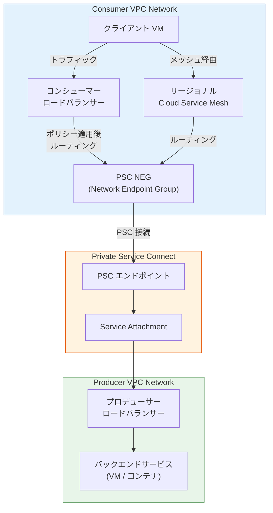

# Cloud Load Balancing / Virtual Private Cloud: Published Service Backends

**リリース日**: 2026-04-10

**サービス**: Cloud Load Balancing, Virtual Private Cloud (VPC)

**機能**: Published Service Backends (Private Service Connect エンドポイント経由のトラフィックルーティング)

**ステータス**: Preview

:bar_chart: [このアップデートのインフォグラフィックを見る](https://takech9203.github.io/google-cloud-news-summary/20260410-cloud-load-balancing-published-service-backends.html)

## 概要

Google Cloud は、Published Service Backends の Preview 提供を開始しました。この機能により、Private Service Connect (PSC) のコンシューマーが、対応するロードバランサーまたはリージョナル Cloud Service Mesh を構成して、PSC エンドポイントを介して公開サービス (Published Services) にトラフィックをルーティングできるようになります。

Published Service Backends は、ロードバランサに Private Service Connect ネットワーク エンドポイント グループ (NEG) バックエンドを構成する方式です。この構成により、コンシューマー側のロードバランサがセキュリティポリシー (Google Cloud Armor ポリシー、SSL ポリシーなど) やルーティングポリシー (URL マップなど) の集中的なポリシー適用ポイントとして機能します。さらに、公開サービスが提供しない可能性のある集中的なメトリクスとロギングも利用でき、コンシューマーが独自のルーティングとフェイルオーバーを制御できるようになります。

この機能は、マルチクラウドやマルチ VPC ネットワーク環境でサービス間接続を管理する Solutions Architect、ネットワークエンジニア、およびセキュリティチームに特に関連性が高いアップデートです。

**アップデート前の課題**

- PSC エンドポイント (転送ルールベース) を使用して公開サービスにアクセスする場合、コンシューマー側でトラフィック管理ポリシー (URL ベースのルーティング、セキュリティポリシーなど) を適用する手段が限られていた
- 公開サービスへのアクセスに対する集中的なメトリクスやロギングの取得が困難だった
- コンシューマー側でのルーティングやフェイルオーバーの制御が制限されていた
- Cloud Service Mesh を使用して PSC 経由で公開サービスにアクセスする統合的な構成が提供されていなかった

**アップデート後の改善**

- 対応するロードバランサまたはリージョナル Cloud Service Mesh を通じて、PSC エンドポイント経由で公開サービスへのトラフィックルーティングが可能になった
- コンシューマー側のロードバランサで Google Cloud Armor ポリシー、SSL ポリシー、URL マップなどのセキュリティ・ルーティングポリシーを集中的に適用できるようになった
- ロードバランサ経由の集中的なメトリクスとロギングが利用可能になった
- コンシューマーが独自のルーティングとフェイルオーバーを制御できるようになった
- 複数リージョンに跨るデプロイメントでの自動クロスリージョンフェイルオーバーが可能になった

## アーキテクチャ図



コンシューマー VPC 内のクライアントからのトラフィックが、ロードバランサーまたは Cloud Service Mesh を経由して PSC NEG に到達し、Private Service Connect を通じてプロデューサー VPC の公開サービスに接続される構成を示しています。

## サービスアップデートの詳細

### 主要機能

1. **Published Service Backends によるロードバランサー統合**
   - コンシューマー側のロードバランサーに PSC NEG バックエンドを追加して、公開サービスへのトラフィックをルーティング
   - ロードバランサーがセキュリティポリシー (Google Cloud Armor、SSL ポリシー) やルーティングポリシー (URL マップ) の集中ポリシー適用ポイントとして機能
   - 集中的なメトリクスとロギングの提供

2. **リージョナル Cloud Service Mesh 統合**
   - リージョナル Cloud Service Mesh を構成して PSC エンドポイント経由で公開サービスにアクセス可能
   - Envoy プロキシや gRPC クライアントなどのメッシュクライアントが PSC 経由でサービスに接続可能
   - Service Directory との統合により、PSC エンドポイントをサービスとして登録し、メッシュ経由でアクセス

3. **自動クロスリージョンフェイルオーバー**
   - グローバルまたはクロスリージョナルロードバランサーを使用する場合、自動クロスリージョンフェイルオーバーが利用可能
   - Outlier Detection によるフェイルオーバー: 5xx レスポンスコードなどの障害を検出し、正常なリージョンにトラフィックを自動リダイレクト
   - Private Service Connect Health による強化されたフェイルオーバー: プロデューサーがより詳細なヘルス信号を提供

## 技術仕様

### 対応するコンシューマーロードバランサー

| ロードバランサー | プロトコル | IP バージョン | クロスリージョン フェイルオーバー |
|---|---|---|---|
| Cross-region internal Application Load Balancer | HTTP, HTTPS, HTTP2 | IPv4 | 対応 |
| Cross-region internal proxy Network Load Balancer | TCP | IPv4 | 対応 |
| Global external Application Load Balancer | HTTP, HTTPS, HTTP2 | IPv4 | 対応 |
| Global external proxy Network Load Balancer | TCP/SSL | IPv4 | 対応 |
| Regional external Application Load Balancer | HTTP, HTTPS, HTTP2 | IPv4 | - |
| Regional external proxy Network Load Balancer | TCP | IPv4 | - |
| Regional internal Application Load Balancer | HTTP, HTTPS, HTTP2 | IPv4 | - |
| Regional internal proxy Network Load Balancer | TCP | IPv4 | - |

### 対応するプロデューサーロードバランサー

| プロデューサータイプ | 転送ルール プロトコル | 対応バックエンド |
|---|---|---|
| Cross-region internal Application Load Balancer | TCP, HTTP, HTTPS, HTTP/2, gRPC | Zonal NEG, Hybrid NEG, Serverless NEG, PSC NEG, Instance Group |
| Internal passthrough Network Load Balancer | TCP | Zonal NEG (GCE_VM_IP), Instance Group |
| Regional internal Application Load Balancer | HTTP, HTTPS, HTTP/2 | Zonal NEG, Hybrid NEG, Serverless NEG, PSC NEG, Instance Group |
| Regional internal proxy Network Load Balancer | TCP | Zonal NEG, Hybrid NEG, PSC NEG, Instance Group |

## 設定方法

### 前提条件

1. プロデューサー側でサービスアタッチメント URI が公開されていること
2. コンシューマー側で対応するロードバランサーが構成済みであること
3. `roles/compute.networkAdmin` IAM ロールが付与されていること

### 手順

#### ステップ 1: PSC NEG の作成

```bash
# サービスアタッチメントを指定して PSC NEG を作成
gcloud compute network-endpoint-groups create PSC_NEG_NAME \
  --network-endpoint-type=PRIVATE_SERVICE_CONNECT \
  --psc-target-service=SERVICE_ATTACHMENT_URI \
  --region=REGION \
  --network=NETWORK \
  --subnet=SUBNET
```

プロデューサーから提供されたサービスアタッチメント URI を使用して、Private Service Connect NEG を作成します。

#### ステップ 2: バックエンドサービスの作成と NEG の追加

```bash
# バックエンドサービスを作成 (例: リージョナル内部 Application Load Balancer)
gcloud compute backend-services create BACKEND_SERVICE_NAME \
  --load-balancing-scheme=INTERNAL_MANAGED \
  --protocol=HTTPS \
  --region=REGION

# PSC NEG をバックエンドとして追加
gcloud compute backend-services add-backend BACKEND_SERVICE_NAME \
  --network-endpoint-group=PSC_NEG_NAME \
  --network-endpoint-group-region=NEG_REGION \
  --region=REGION
```

ロードバランサーのバックエンドサービスに PSC NEG を追加して、公開サービスへのトラフィックルーティングを構成します。

## メリット

### ビジネス面

- **セキュリティポリシーの集中管理**: コンシューマー側のロードバランサーで Google Cloud Armor や SSL ポリシーなどのセキュリティポリシーを一元的に管理・適用でき、セキュリティガバナンスが向上する
- **可観測性の向上**: ロードバランサー経由の集中的なメトリクスとロギングにより、公開サービスへのアクセス状況を可視化でき、運用効率が向上する
- **マルチリージョン対応**: 自動クロスリージョンフェイルオーバーにより、高可用性アーキテクチャを構築でき、ビジネス継続性が確保される

### 技術面

- **トラフィック管理の柔軟性**: URL マップやトラフィック管理ポリシーを使用して、きめ細かなルーティング制御が可能になる
- **Cloud Service Mesh 統合**: サービスメッシュアーキテクチャの一部として PSC 経由の公開サービスアクセスを統合できる
- **VPC ネットワーク分離の維持**: Private Service Connect を通じたアクセスのため、VPC ネットワーク間の分離を維持しながらサービス間通信が可能

## デメリット・制約事項

### 制限事項

- 本機能は現在 Preview ステータスであり、本番環境での SLA は提供されていない
- Classic Application Load Balancer および Classic proxy Network Load Balancer は対応していない
- Global external Application Load Balancer からプロデューサーの Regional internal proxy Network Load Balancer への接続は対応していない
- グローバルまたはクロスリージョナルロードバランサーからのアクセスをサポートするには、プロデューサー側のロードバランサーでグローバルアクセスを有効にする必要がある

### 考慮すべき点

- コンシューマーとプロデューサーの双方でロードバランサーが必要となるため、構成の複雑さが増す可能性がある
- PSC NEG はリージョナルリソースであるため、マルチリージョン構成では各リージョンに NEG を作成する必要がある
- Preview から GA への移行時に、設定方法や対応構成に変更が発生する可能性がある

## ユースケース

### ユースケース 1: マルチテナント SaaS プラットフォームのセキュアなサービス利用

**シナリオ**: SaaS プロバイダーが Private Service Connect を通じてサービスを公開しており、コンシューマー企業がそのサービスにセキュリティポリシーを適用しながらアクセスしたい場合。

**効果**: コンシューマー側の Application Load Balancer に Google Cloud Armor ポリシーと SSL ポリシーを設定し、PSC NEG バックエンドを通じて SaaS サービスにアクセスすることで、独自のセキュリティ要件を満たしながらサービスを利用できる。

### ユースケース 2: マルチリージョン高可用性アーキテクチャ

**シナリオ**: 複数リージョンに展開されたマネージドサービスに対して、自動フェイルオーバーを備えた高可用性アクセスを構築したい場合。

**効果**: グローバルロードバランサーに複数リージョンの PSC NEG を追加し、Outlier Detection による自動クロスリージョンフェイルオーバーを利用することで、リージョン障害時にもサービスの継続利用が可能になる。

### ユースケース 3: サービスメッシュと PSC の統合

**シナリオ**: Cloud Service Mesh を使用したマイクロサービスアーキテクチャにおいて、外部の公開サービスをメッシュの一部として統合したい場合。

**効果**: リージョナル Cloud Service Mesh を構成して PSC エンドポイント経由で公開サービスにアクセスし、Envoy サイドカーや gRPC クライアントから統一的なサービスディスカバリとルーティングを利用できる。

## 料金

Private Service Connect の料金は [VPC 料金ページ](https://cloud.google.com/vpc/pricing#psc-forwarding-rule-service) に記載されています。Published Service Backends を使用する場合、コンシューマー側のロードバランサーの料金も別途発生します。詳細は各ロードバランサーの料金ページを参照してください。

## 関連サービス・機能

- **[Private Service Connect](https://docs.cloud.google.com/vpc/docs/private-service-connect)**: VPC ネットワーク間のプライベート接続を提供する基盤技術。Published Service Backends はこの上に構築される
- **[Cloud Service Mesh](https://docs.cloud.google.com/service-mesh/docs/regional-cloud-service-mesh)**: リージョナル Cloud Service Mesh との統合により、メッシュクライアントから PSC 経由の公開サービスアクセスが可能
- **[Google Cloud Armor](https://docs.cloud.google.com/armor/docs/security-policy-overview)**: コンシューマー側のロードバランサーで適用可能なセキュリティポリシー
- **[Service Directory](https://docs.cloud.google.com/service-directory)**: PSC エンドポイントをサービスとして登録し、Cloud Service Mesh と統合可能
- **[Cloud Monitoring / Cloud Logging](https://docs.cloud.google.com/monitoring)**: ロードバランサー経由の集中的なメトリクスとロギングで可観測性を提供

## 参考リンク

- :bar_chart: [インフォグラフィック](https://takech9203.github.io/google-cloud-news-summary/20260410-cloud-load-balancing-published-service-backends.html)
- [公式リリースノート](https://docs.cloud.google.com/release-notes#April_10_2026)
- [Published Service Backends - Cloud Load Balancing ドキュメント](https://docs.cloud.google.com/load-balancing/docs/backend-service#Published-service-backends)
- [PSC エンドポイント経由のアクセス - VPC ドキュメント](https://docs.cloud.google.com/vpc/docs/about-accessing-vpc-hosted-services-endpoints#published-service-backend-support)
- [リージョナル Cloud Service Mesh - Published Service Backends の構成](https://docs.cloud.google.com/service-mesh/docs/regional-cloud-service-mesh#configuring-published-service-backends)
- [Private Service Connect Backends 概要](https://docs.cloud.google.com/vpc/docs/private-service-connect-backends)
- [PSC バックエンドの構成手順](https://docs.cloud.google.com/vpc/docs/access-apis-managed-services-private-service-connect-backends)
- [VPC 料金ページ](https://cloud.google.com/vpc/pricing)

## まとめ

Published Service Backends (Preview) は、Private Service Connect のコンシューマーがロードバランサーや Cloud Service Mesh を通じて公開サービスにアクセスする際に、セキュリティポリシーの集中適用、トラフィック管理、自動フェイルオーバーなどの高度な制御を実現する重要な機能です。マルチ VPC ネットワーク環境やマルチテナント構成においてサービス間通信のセキュリティとガバナンスを強化するため、PSC を活用している組織は Preview 段階から検証を開始することを推奨します。

---

**タグ**: #CloudLoadBalancing #VPC #PrivateServiceConnect #CloudServiceMesh #ネットワーキング #セキュリティ #Preview
