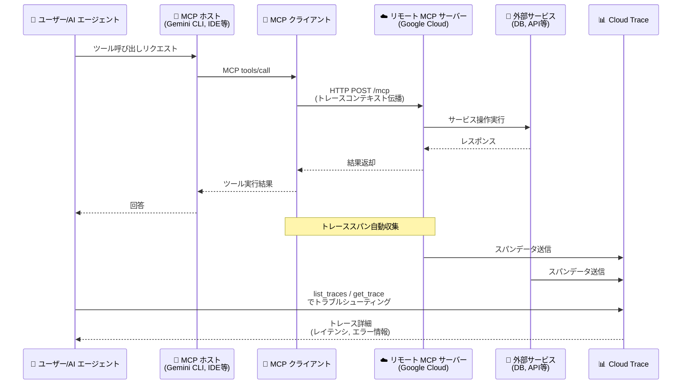

# Cloud Trace: MCP サーバー呼び出しのトレースによるトラブルシューティング

**リリース日**: 2026-04-10

**サービス**: Cloud Trace

**機能**: MCP サーバー呼び出しの調査・トラブルシューティング

**ステータス**: Feature

📊 [このアップデートのインフォグラフィックを見る](https://takech9203.github.io/google-cloud-news-summary/20260410-cloud-trace-mcp-server-troubleshooting.html)

## 概要

Cloud Trace を使用して、MCP (Model Context Protocol) サーバーの利用状況、ツール呼び出しの失敗、レイテンシの原因をトラブルシューティングできるようになった。MCP サーバーは、LLM やAI アプリケーションと外部サービス (データベース、Web サービスなど) を接続するプロキシとして機能するが、これまでその呼び出しの可観測性を確保することは容易ではなかった。

今回のアップデートにより、Cloud Trace の分散トレーシング機能を活用して、MCP サーバーへのリクエストがどのように処理されているかを詳細に可視化できるようになった。AI エージェントが MCP サーバー経由でツールを呼び出す際のレイテンシ分析、エラー原因の特定、パフォーマンスボトルネックの検出が可能になる。

この機能は、Google Cloud のリモート MCP サーバー (cloudtrace.googleapis.com/mcp などのエンドポイント) を利用している開発者やSRE チームにとって特に有用である。AI エージェントの本番運用が進む中で、MCP 呼び出しの信頼性とパフォーマンスを継続的に監視・改善するための重要な機能となる。

**アップデート前の課題**

- MCP サーバーへのツール呼び出しが失敗した場合、原因の特定が困難だった
- AI アプリケーションから MCP サーバーを経由した外部サービスへのリクエストのレイテンシ内訳を把握する手段が限られていた
- MCP サーバーの利用状況 (どのツールが呼ばれているか、どの程度の頻度か) を体系的に把握する方法がなかった

**アップデート後の改善**

- Cloud Trace を使用して MCP サーバー呼び出しのトレースを収集・分析し、失敗原因やレイテンシの原因を特定できるようになった
- 分散トレースにより、AI アプリケーション → MCP クライアント → MCP サーバー → 外部サービスという一連のリクエストフローを可視化できるようになった
- Cloud Trace の MCP サーバー (`cloudtrace.googleapis.com/mcp`) が提供する `list_traces` および `get_trace` ツールにより、AI エージェント自身がトレースデータを照会してトラブルシューティングを行うことも可能になった

## アーキテクチャ図



Cloud Trace による MCP サーバー呼び出しのトレーシングフローを示す。AI アプリケーションから MCP サーバーを経由した外部サービスへのリクエスト全体が分散トレースとして記録され、Cloud Trace で分析できる。

## サービスアップデートの詳細

### 主要機能

1. **MCP 呼び出しのトレース収集**
   - MCP サーバーへのリクエスト (tools/call) のトレーススパンが自動的に収集される
   - リクエストの開始・終了時刻、レイテンシ、エラー情報がスパンに記録される
   - 親子関係のあるスパンにより、MCP クライアントからサーバー、さらに外部サービスへの呼び出しチェーンが追跡可能

2. **Cloud Trace MCP サーバー (`cloudtrace.googleapis.com/mcp`)**
   - `list_traces`: プロジェクト内のトレースを一覧取得し、ルートスパンを返す。レイテンシの問題やマルチサービスワークフローのデバッグに使用する
   - `get_trace`: 特定のトレース ID のトレース詳細を取得する。`list_traces` で取得した ID を指定して、スパンの完全な情報を確認する

3. **ツール失敗の原因調査**
   - MCP ツール呼び出しが失敗した場合、トレースデータからエラーが発生したスパンを特定し、失敗の原因 (タイムアウト、認証エラー、バックエンドエラーなど) を調査できる

## 技術仕様

### Cloud Trace MCP サーバー

| 項目 | 詳細 |
|------|------|
| MCP エンドポイント | `https://cloudtrace.googleapis.com/mcp` |
| 提供ツール | `list_traces`, `get_trace` |
| 通信プロトコル | HTTP (JSON-RPC 2.0) |
| 認証 | OAuth 2.0 (Google Cloud 認証情報) |

### トレースデータの構造

| 項目 | 詳細 |
|------|------|
| トレース ID | 128 ビット数値 (32 バイト 16 進文字列) |
| スパン ID | 64 ビット整数 |
| スパン名の最大長 | 128 バイト |
| スパンあたりの最大ラベル数 | 32 |
| ラベルキーの最大サイズ | 128 バイト |
| ラベル値の最大サイズ | 256 バイト |
| スパンあたりの最大イベント数 | 128 |
| トレースデータの保持期間 | 30 日 |

### MCP ツールの呼び出し例

```bash
# Cloud Trace MCP サーバーのツール一覧を取得
curl --location 'https://cloudtrace.googleapis.com/mcp' \
  --header 'content-type: application/json' \
  --header 'accept: application/json, text/event-stream' \
  --data '{
    "method": "tools/list",
    "jsonrpc": "2.0",
    "id": 1
  }'
```

```bash
# list_traces ツールでトレースを一覧取得
curl --location 'https://cloudtrace.googleapis.com/mcp' \
  --header 'content-type: application/json' \
  --header 'accept: application/json, text/event-stream' \
  --data '{
    "method": "tools/call",
    "params": {
      "name": "list_traces",
      "arguments": {
        "projectId": "my-project-id"
      }
    },
    "jsonrpc": "2.0",
    "id": 1
  }'
```

```bash
# get_trace ツールで特定のトレース詳細を取得
curl --location 'https://cloudtrace.googleapis.com/mcp' \
  --header 'content-type: application/json' \
  --header 'accept: application/json, text/event-stream' \
  --data '{
    "method": "tools/call",
    "params": {
      "name": "get_trace",
      "arguments": {
        "projectId": "my-project-id",
        "traceId": "382d4f4c6b7bb2f4a972559d9085001d"
      }
    },
    "jsonrpc": "2.0",
    "id": 1
  }'
```

## 設定方法

### 前提条件

1. Google Cloud プロジェクトで Cloud Trace API が有効化されていること
2. MCP サーバーが有効化されていること ([MCP サーバーの有効化手順](https://docs.cloud.google.com/mcp/enable-disable-mcp-servers) を参照)
3. 認証が設定されていること ([MCP 認証の設定](https://docs.cloud.google.com/mcp/authenticate-mcp) を参照)

### 手順

#### ステップ 1: 必要な IAM ロールの付与

Cloud Trace MCP サーバーのツールを使用するプリンシパルに、以下のロールを付与する。

```bash
# MCP ツールユーザーロールの付与
gcloud projects add-iam-policy-binding PROJECT_ID \
  --member="user:USER_EMAIL" \
  --role="roles/mcp.toolUser"

# Cloud Trace ユーザーロールの付与
gcloud projects add-iam-policy-binding PROJECT_ID \
  --member="user:USER_EMAIL" \
  --role="roles/cloudtrace.user"
```

#### ステップ 2: MCP クライアントの設定

AI アプリケーションの MCP クライアント設定に、Cloud Trace MCP サーバーのエンドポイントを追加する。

```json
{
  "mcpServers": {
    "cloudtrace": {
      "url": "https://cloudtrace.googleapis.com/mcp"
    }
  }
}
```

#### ステップ 3: トレースデータの確認

Google Cloud コンソールの Trace Explorer ページでトレースデータを確認する。

```bash
# Google Cloud コンソールで Trace Explorer を開く
# https://console.cloud.google.com/traces/explorer
```

## メリット

### ビジネス面

- **AI エージェントの運用品質向上**: MCP サーバー呼び出しの成功率・レイテンシを監視することで、エンドユーザー体験の改善につなげられる
- **障害対応時間の短縮**: トレースデータにより、MCP ツール呼び出しの失敗原因を迅速に特定でき、平均復旧時間 (MTTR) を短縮できる

### 技術面

- **エンドツーエンドの可観測性**: AI アプリケーションから MCP サーバー、外部サービスまでの分散トレースにより、リクエストフロー全体を把握できる
- **AI エージェントによるセルフデバッグ**: Cloud Trace MCP サーバーの `list_traces`/`get_trace` ツールを AI エージェント自身が呼び出すことで、自律的なトラブルシューティングが可能になる
- **既存の Cloud Trace エコシステムとの統合**: Cloud Logging との連携、アラートポリシーの設定など、既存の Google Cloud Observability 機能とシームレスに統合できる

## デメリット・制約事項

### 制限事項

- Cloud Trace のデータ保持期間は 30 日間。それ以前のトレースデータは自動的に削除される
- Cloud Trace API の読み取りクォータは 60 秒あたり 300 ユニット (`ListTraces` は 25 ユニット/回、`GetTrace` は 1 ユニット/回)
- `ListTraces` の 1 回のレスポンスで返されるトレース数は最大 1,000 件 (ROOTSPAN/MINIMAL ビュー) または 100 件 (COMPLETE ビュー)
- スパンあたりのラベル/属性数は最大 32 個

### 考慮すべき点

- トレースデータの取り込み量に応じて Cloud Trace の料金が発生するため、サンプリングレートの適切な設定が重要
- 高トラフィックシステムでは、1,000 リクエストに 1 回、または 10,000 リクエストに 1 回程度のサンプリングレートが推奨される
- Telemetry API で送信されたスパンは Cloud Trace API からはアクセスできないという既知の制限がある

## ユースケース

### ユースケース 1: AI エージェントの MCP ツール呼び出し失敗の調査

**シナリオ**: AI エージェントが MCP サーバー経由で BigQuery や Firestore などのツールを呼び出す際に、間欠的にエラーが発生している。

**実装例**:
```bash
# Cloud Trace MCP サーバーでトレースを一覧取得
# AI エージェントに "最近の MCP 呼び出しで失敗したものを調査して" と指示

# 1. list_traces でエラーが含まれるトレースを検索
# 2. get_trace で該当トレースのスパン詳細を取得
# 3. エラーが発生したスパンのラベルからエラーコードやメッセージを確認
# 4. 親スパンをたどって呼び出しチェーン全体を把握
```

**効果**: エラーの発生箇所 (MCP クライアント側、MCP サーバー側、バックエンドサービス側) を正確に特定し、根本原因の解決を迅速化できる。

### ユースケース 2: MCP 呼び出しのレイテンシ最適化

**シナリオ**: AI エージェントのレスポンスが遅く、MCP サーバーへのツール呼び出しがボトルネックになっている可能性がある。

**効果**: トレースのスパンごとのレイテンシを分析することで、ネットワークレイテンシ、MCP サーバー処理時間、バックエンドサービス応答時間のそれぞれの寄与度を特定し、最適化すべき箇所を明確化できる。

## 料金

Cloud Trace の料金は Google Cloud Observability の料金体系に含まれる。詳細な料金情報は [Google Cloud Observability の料金ページ](https://cloud.google.com/products/observability/pricing) を参照。

トレースのコスト最適化のためには、サンプリングレートの調整が有効である。Cloud Trace クライアントライブラリでサンプリングレートを設定することで、取り込みスパン量を制御できる。

## 関連サービス・機能

- **Google Cloud MCP サーバー**: Cloud Trace の MCP サーバーは、Google Cloud が提供するリモート MCP サーバー群の 1 つ。BigQuery、Firestore、GKE、Cloud Monitoring など他の Google Cloud サービスも MCP サーバーを提供している
- **Cloud Logging**: Cloud Trace と Cloud Logging を統合することで、トレースとログを関連付けた根本原因分析が可能。`traceSampled=true` フィルタを使用してログとトレースを相関させることができる
- **Cloud Monitoring**: MCP サーバーの利用状況メトリクス (`mcp/request_count`、`mcp/request_latencies`) を Cloud Monitoring で監視できる。月次スパン取り込み量のアラートポリシーも設定可能
- **Model Armor**: MCP ツール呼び出しとレスポンスをスキャンして、プロンプトインジェクション、機密データ漏洩、ツールポイズニングなどのセキュリティリスクを軽減する

## 参考リンク

- 📊 [インフォグラフィック](https://takech9203.github.io/google-cloud-news-summary/20260410-cloud-trace-mcp-server-troubleshooting.html)
- [公式リリースノート](https://docs.google.com/release-notes#April_10_2026)
- [Investigate MCP calls using Trace](https://docs.google.com/trace/docs/trace-remote-mcp-server-calls)
- [Cloud Trace MCP サーバーリファレンス](https://docs.cloud.google.com/trace/docs/reference/mcp/mcp)
- [Google Cloud MCP サーバー概要](https://docs.cloud.google.com/mcp/overview)
- [Cloud Trace 概要](https://docs.cloud.google.com/trace/docs/overview)
- [Cloud Trace トラブルシューティング](https://docs.cloud.google.com/trace/docs/troubleshooting)
- [Cloud Trace クォータと制限](https://docs.cloud.google.com/trace/docs/quotas)
- [料金ページ](https://cloud.google.com/products/observability/pricing)

## まとめ

Cloud Trace による MCP サーバー呼び出しのトラブルシューティング機能は、AI エージェントの本番運用において不可欠な可観測性を提供する。MCP サーバーの利用が拡大する中で、ツール呼び出しの失敗やレイテンシの問題を迅速に特定・解決できる体制を整えることが重要である。Cloud Trace MCP サーバーの `list_traces`/`get_trace` ツールを AI エージェントの設定に追加し、運用監視体制に組み込むことを推奨する。

---

**タグ**: #CloudTrace #MCP #Observability #AI #トラブルシューティング #分散トレーシング #GoogleCloud
