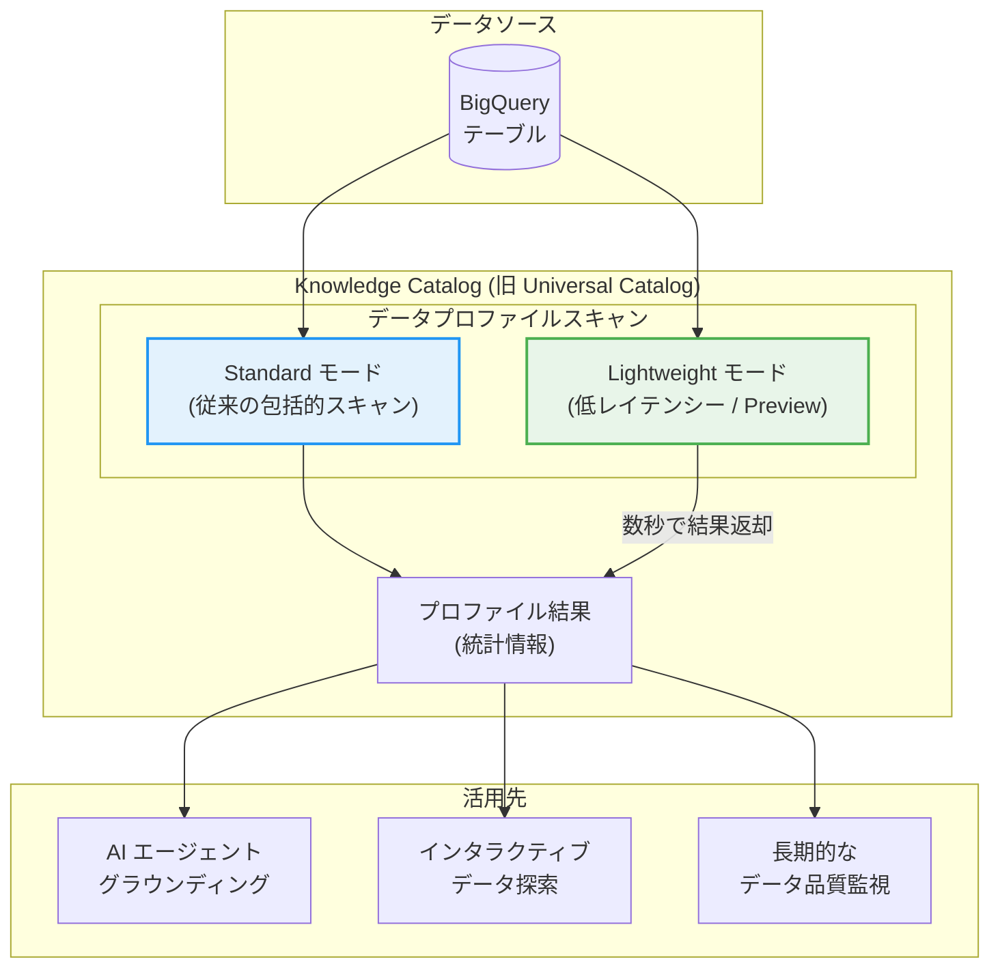

# Dataplex: Knowledge Catalog への名称変更とデータプロファイルスキャンの Lightweight モード (Preview)

**リリース日**: 2026-04-10

**サービス**: Dataplex

**機能**: Knowledge Catalog への名称変更 / Lightweight プロファイリングモード

**ステータス**: Announcement (名称変更) / Preview (Lightweight プロファイリングモード)

[このアップデートのインフォグラフィックを見る](https://takech9203.github.io/google-cloud-news-summary/20260410-dataplex-knowledge-catalog-lightweight-profiling.html)

## 概要

Dataplex に関する 2 つのアップデートが発表された。1 つ目は、これまで「Dataplex Universal Catalog」と呼ばれていたサービスが「Knowledge Catalog」に名称変更されたことである。API、クライアントライブラリ、CLI、および IAM の名前には変更がないため、既存のコードやワークフローへの影響はない。

2 つ目は、データプロファイルスキャンに新しい Lightweight プロファイリングモードが Preview として追加されたことである。Lightweight モードは、低レイテンシーのプロファイルスキャンを提供し、結果を数秒で返すことができる。AI エージェントのレスポンスのグラウンディングやインタラクティブなデータ探索に最適化されている。

これらのアップデートは、データガバナンス担当者、データエンジニア、AI エージェント開発者、およびデータプラットフォーム管理者を主な対象としている。特に Lightweight モードは、AI エージェントがリアルタイムにデータの特性を理解する必要があるユースケースにおいて、重要な機能追加となる。

**アップデート前の課題**

- データプロファイルスキャンは Standard モードのみであり、スキャンの完了まで一定の時間を要していたため、リアルタイムなデータ探索や AI エージェントのレスポンス生成には不向きだった
- 大規模なデータディスカバリーのためにプロファイルを事前生成する場合、コストと時間の両面で効率的な方法が限られていた
- 「Dataplex Universal Catalog」という名称が長く、サービスの本質的な価値であるナレッジ管理の側面が名前から直感的に伝わりにくかった

**アップデート後の改善**

- Lightweight モードにより、数秒でプロファイルスキャン結果を取得できるようになり、AI エージェントのグラウンディングやインタラクティブなデータ探索がリアルタイムで可能になった
- コスト効率の高い方法でプロファイルを大規模に事前生成し、グローバルなデータディスカバリーに活用できるようになった
- 「Knowledge Catalog」への名称変更により、サービスの目的であるナレッジ管理とデータガバナンスがより明確になった

## アーキテクチャ図



Standard モードは従来通りカスタマイズ可能な包括的プロファイリングを提供し、Lightweight モードは数秒で結果を返す低レイテンシースキャンを提供する。用途に応じてモードを選択できる。

## サービスアップデートの詳細

### 主要機能

1. **Knowledge Catalog への名称変更**
   - 「Dataplex Universal Catalog」が「Knowledge Catalog」に改称された
   - API エンドポイント、クライアントライブラリ、gcloud CLI コマンド、IAM ロール名はすべて変更なし
   - 既存のコード、スクリプト、IAM ポリシーはそのまま動作する
   - Google Cloud コンソール上の表記が順次更新される

2. **Lightweight プロファイリングモード (Preview)**
   - データプロファイルスキャンの新しい実行モードとして追加
   - 低レイテンシーでプロファイルスキャン結果を数秒以内に返却
   - AI エージェントのレスポンスのグラウンディングに最適
   - インタラクティブなデータ探索時の迅速な「ヘルスレポート」を提供
   - 大規模データディスカバリーのためのプロファイル事前生成をコスト効率よく実行可能

3. **Standard モードとの使い分け**
   - Standard モード: スコープ (全テーブル/インクリメンタル)、サンプリング、行フィルタ、列フィルタを柔軟に設定可能。詳細な分析や長期的なデータ品質監視に適している
   - Lightweight モード: スコープ、フィルタ、サンプリングサイズの変更は不可。速度とコスト効率を優先するユースケースに適している

## 技術仕様

### プロファイリングモードの比較

| 項目 | Standard モード | Lightweight モード (Preview) |
|------|----------------|---------------------------|
| レイテンシー | スキャン対象のデータ量に依存 | 数秒 |
| スコープ設定 | Full table / Incremental | 変更不可 |
| 行フィルタ | 対応 | 非対応 |
| 列フィルタ | 対応 | 非対応 |
| サンプリング | カスタム設定可能 | 変更不可 |
| BigQuery ビュー | 対応 | 非対応 |
| 外部テーブル | 対応 | 非対応 |
| ステータス | GA | Preview |

### 実行 ID (Execution Identity)

Knowledge Catalog では、データプロファイルスキャンの実行 ID として以下の 3 つの選択肢がある。

| 方式 | 説明 |
|------|------|
| デフォルトサービスエージェント | `service-PROJECT_NUMBER@gcp-sa-dataplex.iam.gserviceaccount.com` を使用 |
| カスタムサービスアカウント (BYOSA) | 最小権限の原則に基づいた専用サービスアカウントを指定 |
| エンドユーザー認証情報 (EUC) | ユーザー自身の認証情報を使用 |

### 必要な IAM ロール

```text
# データプロファイルスキャンの作成・実行・更新・削除
roles/dataplex.dataScanEditor

# データプロファイルスキャン結果の閲覧
roles/dataplex.dataScanViewer

# スキャン結果を Knowledge Catalog に公開する場合
roles/dataplex.catalogEditor
```

## 設定方法

### 前提条件

1. Dataplex API が有効化されていること
2. 対象の BigQuery テーブルへの読み取り権限があること
3. `roles/dataplex.dataScanEditor` ロールが付与されていること

### 手順

#### ステップ 1: Lightweight モードでデータプロファイルスキャンを作成 (Console)

1. Google Cloud コンソールで Knowledge Catalog の「Data profiling & quality」ページに移動
2. 「Create data profile scan」をクリック
3. プロファイリングモードとして「Lightweight」を選択
4. 対象の BigQuery テーブルを選択
5. スケジュールを設定 (オンデマンドまたはスケジュール実行)
6. 「Run scan」をクリック

#### ステップ 2: gcloud CLI でのスキャン作成

```bash
# データプロファイルスキャンの作成
gcloud dataplex datascans create \
  --location=LOCATION \
  --data-source-resource="//bigquery.googleapis.com/projects/PROJECT_ID/datasets/DATASET_ID/tables/TABLE_ID" \
  --type=PROFILE \
  DATASCAN_ID
```

#### ステップ 3: スキャン結果の確認

```bash
# 最新のスキャン結果を表示
gcloud dataplex datascans describe DATASCAN_ID \
  --location=LOCATION \
  --view=FULL
```

## メリット

### ビジネス面

- **AI エージェント活用の加速**: Lightweight モードにより、AI エージェントがデータの特性をリアルタイムに把握してレスポンスをグラウンディングできるため、データ駆動型の AI ソリューション構築が加速する
- **データディスカバリーの効率化**: 大量のテーブルに対して高速かつコスト効率よくプロファイルを事前生成できるため、組織全体のデータディスカバリーが改善される
- **ブランディングの明確化**: 「Knowledge Catalog」への改名により、サービスの価値提案がより直感的に理解しやすくなった

### 技術面

- **低レイテンシー応答**: 数秒でプロファイル結果が返却されるため、同期的なワークフローや API レスポンスに組み込みやすい
- **後方互換性の維持**: 名称変更にもかかわらず、API、CLI、IAM 名が変更されていないため、既存のインテグレーションに影響がない
- **インフラ不要**: Knowledge Catalog は Google テナントプロジェクト上でスキャンを実行するため、ユーザー側でのインフラ構築が不要

## デメリット・制約事項

### 制限事項

- Lightweight モードは現在 Preview であり、本番ワークロードでの SLA は提供されない
- Lightweight モードではスコープ、フィルタ、サンプリングサイズの変更ができないため、特定のカラムや行に絞ったプロファイリングはできない
- Lightweight モードは BigQuery ビューおよび外部テーブルをサポートしていない
- データプロファイリングは BigQuery テーブルを対象としており、BIGNUMERIC カラム型を含むテーブルはスキャンできない

### 考慮すべき点

- Lightweight モードは速度を優先するため、Standard モードほど詳細なカスタマイズはできない。包括的な分析が必要な場合は Standard モードを使用する必要がある
- Preview 段階の機能であるため、GA までに仕様が変更される可能性がある
- 名称変更に伴い、ドキュメントや社内資料の「Universal Catalog」への参照を「Knowledge Catalog」に更新する運用作業が発生する可能性がある

## ユースケース

### ユースケース 1: AI エージェントによるデータ品質のリアルタイムグラウンディング

**シナリオ**: データ分析チームが社内向けの AI チャットボットを開発しており、ユーザーが「このテーブルのデータは信頼できるか?」と質問した場合に、AI エージェントがリアルタイムでデータの品質状況を回答する必要がある。

**実装例**:
```python
from google.cloud import dataplex_v1

# Lightweight モードでオンデマンドスキャンを実行
client = dataplex_v1.DataScanServiceClient()
request = dataplex_v1.RunDataScanRequest(
    name="projects/my-project/locations/us-central1/dataScans/my-scan"
)
response = client.run_data_scan(request=request)

# 数秒で返却されるプロファイル結果を AI エージェントのコンテキストに含める
profile_results = response.result
```

**効果**: AI エージェントが数秒以内にデータの統計特性 (NULL 率、ユニーク率、値分布など) を取得し、信頼性の高いレスポンスを生成できる。

### ユースケース 2: データカタログの自動プロファイル生成

**シナリオ**: 数百のテーブルを持つデータウェアハウスにおいて、すべてのテーブルのプロファイルを効率的に生成し、データディスカバリーを促進したい。

**効果**: Lightweight モードのコスト効率と速度を活かして、大量のテーブルに対するプロファイルの事前生成が実用的になる。データアナリストがテーブルを検索する際に、即座にプロファイル情報を確認できる。

### ユースケース 3: インタラクティブなデータ探索

**シナリオ**: データサイエンティストが新しいデータセットを探索する際、まずデータの概要を素早く把握したい。

**効果**: Lightweight モードにより、テーブルの基本的な統計情報を数秒で取得でき、探索的データ分析の初期段階を大幅に効率化できる。

## 料金

データプロファイリングは Dataplex の Premium Processing SKU に該当し、Data Compute Unit (DCU) ベースで課金される。

### 料金体系

| 項目 | 料金 (us-central1) |
|------|-------------------|
| Premium Processing (デフォルト) | $0.089 / DCU 時間 |
| Premium Processing (BigQuery CUD 1 年) | $0.0801 / DCU 時間 |
| Premium Processing (BigQuery CUD 3 年) | $0.0712 / DCU 時間 |

DCU 消費量は、プロファイリングに関わるデータ処理量に比例する。具体的には、行数、カラム数、スキャンされたデータ量、テーブルのパーティショニングおよびクラスタリング設定、スキャン頻度に依存する。課金は秒単位で、最低 1 分から計算される。

Standard モードではサンプリング、インクリメンタルスキャン、カラムフィルタ、行フィルタによるコスト削減が可能である。

**Note**: Standard Processing の無料枠 (月 100 DCU 時間) は Premium Processing SKU には適用されない。

## 利用可能リージョン

Knowledge Catalog のデータプロファイリングは、Dataplex がサポートするすべてのリージョンで利用可能である。主なリージョンは以下の通り。

- アメリカ: us-central1, us-east1, us-east4, us-west1, us-west2 など
- ヨーロッパ: europe-west1, europe-west2, europe-west3, europe-west4, europe-north1 など
- アジア太平洋: asia-northeast1 (東京), asia-northeast2 (大阪), asia-southeast1, asia-south1 など

Lightweight モード (Preview) の利用可能リージョンについては、ドキュメントで最新情報を確認することを推奨する。

## 関連サービス・機能

- **BigQuery**: データプロファイルスキャンの対象データソース。BigQuery のガバナンスページからもデータプロファイルを管理可能
- **Auto Data Quality**: データプロファイリング結果に基づいてデータ品質チェックルールを自動推奨する機能
- **Data Lineage**: Knowledge Catalog のデータリネージ機能と組み合わせて、データの出所と品質を一元管理可能
- **Vertex AI**: AI エージェントの構築において、Lightweight モードのプロファイル結果をグラウンディングデータとして活用可能

## 参考リンク

- [インフォグラフィック](https://takech9203.github.io/google-cloud-news-summary/20260410-dataplex-knowledge-catalog-lightweight-profiling.html)
- [公式リリースノート](https://docs.cloud.google.com/release-notes#April_10_2026)
- [プロファイリングモードのドキュメント](https://cloud.google.com/dataplex/docs/data-profiling-overview#profiling_modes)
- [データプロファイリング概要](https://cloud.google.com/dataplex/docs/data-profiling-overview)
- [データプロファイリングの使用方法](https://cloud.google.com/dataplex/docs/use-data-profiling)
- [Knowledge Catalog の概要](https://cloud.google.com/dataplex/docs/introduction)
- [料金ページ](https://cloud.google.com/dataplex/pricing)

## まとめ

今回のアップデートにより、Dataplex Universal Catalog は「Knowledge Catalog」に改称され、データガバナンスプラットフォームとしてのブランドが刷新された。API や IAM の名前は変更されていないため、既存のインテグレーションへの影響はない。Lightweight プロファイリングモードの追加は、AI エージェントのグラウンディングやインタラクティブなデータ探索といった低レイテンシーが求められるユースケースにおいて大きな価値を提供する。AI ワークロードでデータ品質の即座な把握が必要な場合は、Preview 段階から評価を開始することを推奨する。

---

**タグ**: #Dataplex #KnowledgeCatalog #DataProfiling #Lightweight #Preview #DataGovernance #AIAgent #BigQuery
