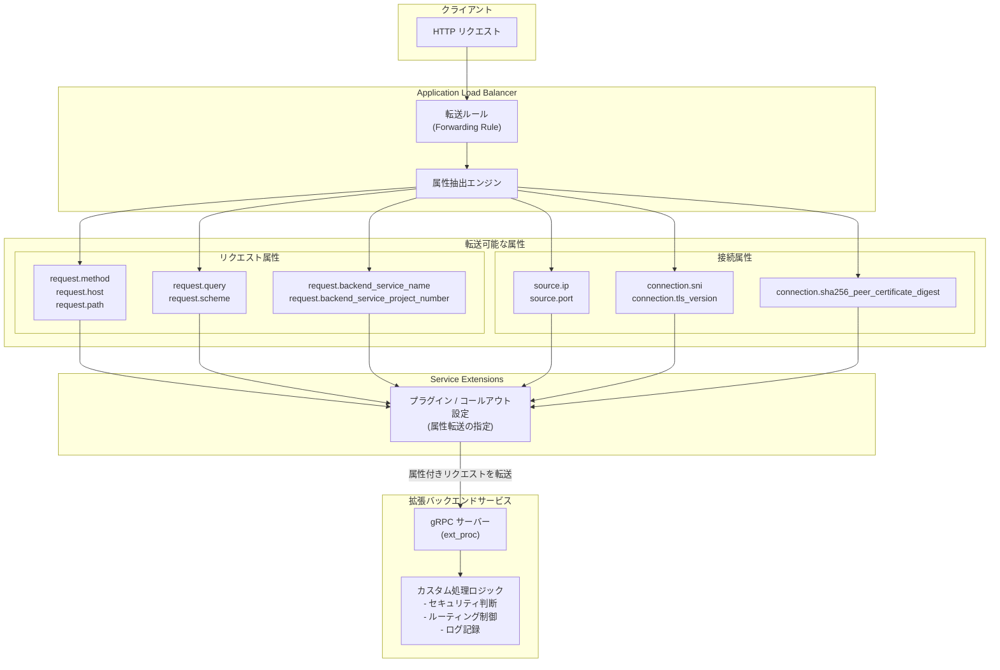

# Service Extensions: プラグイン/コールアウト設定時にリクエスト属性と接続属性をバックエンドサービスに転送可能に

**リリース日**: 2026-04-10

**サービス**: Service Extensions

**機能**: プラグインまたはコールアウトによる拡張設定時に、リクエスト属性および接続属性をバックエンドサービスに転送する機能

**ステータス**: Feature

:bar_chart: [このアップデートのインフォグラフィックを見る](https://takech9203.github.io/google-cloud-news-summary/20260410-service-extensions-attribute-forwarding.html)

## 概要

Service Extensions において、プラグインまたはコールアウトを使用して拡張を設定する際に、一部のリクエスト属性および接続属性をバックエンドサービスに転送 (フォワード) できるようになりました。これにより、拡張サービスはロードバランサーが抽出したリクエストや接続のコンテキスト情報を直接受け取り、より高度なカスタム処理を実現できます。

従来、Service Extensions の拡張サービスは HTTP ヘッダーやボディを通じてリクエスト情報を取得していましたが、ソース IP アドレスや TLS 接続情報、バックエンドサービス名といったロードバランサーレベルの属性にはアクセスが制限されていました。今回のアップデートにより、これらの属性を明示的に指定してバックエンドサービスへ転送できるようになり、セキュリティ判断やルーティングロジック、ログ記録などのユースケースがより柔軟に実装可能となります。

この機能は、Application Load Balancer 上で Service Extensions を使用してカスタム処理を行うプラットフォームエンジニア、セキュリティエンジニア、アプリケーション開発者に特に有用です。

**アップデート前の課題**

- 拡張サービスがリクエストのソース IP アドレスやクライアントポートなどの接続レベル情報を直接取得することが困難だった
- TLS バージョンやクライアント証明書のダイジェストなど、接続のセキュリティコンテキストを拡張サービスに渡す標準的な方法がなかった
- バックエンドサービス名やプロジェクト番号といったルーティングコンテキストを拡張サービスで利用するには、カスタムヘッダーを使った間接的な方法に頼る必要があった
- CEL マッチング条件で使用可能な属性データは、拡張サービスには送信されず、マッチング評価にのみ利用されていた

**アップデート後の改善**

- リクエスト属性 (HTTP メソッド、ホスト、パス、クエリ、スキーム、バックエンドサービス名など) を明示的に指定してバックエンドサービスに転送可能になった
- 接続属性 (ソース IP、ソースポート、SNI、TLS バージョン、クライアント証明書ダイジェストなど) を拡張サービスに渡せるようになった
- 拡張サービス側でよりリッチなコンテキスト情報に基づいた判断やロジックを実装できるようになった

## アーキテクチャ図



このフローチャートは、クライアントからのリクエストが Application Load Balancer を通過する際に、ロードバランサーがリクエスト属性と接続属性を抽出し、Service Extensions のプラグインまたはコールアウト設定に基づいて指定された属性をバックエンドの拡張サービスに転送するフローを示しています。

## サービスアップデートの詳細

### 主要機能

1. **リクエスト属性の転送**
   - HTTP リクエストから抽出される属性 (メソッド、ホスト、パス、クエリ、スキームなど) を拡張サービスに転送可能
   - `request.backend_service_name` を使用して、リクエストの転送先バックエンドサービス名を拡張サービスに通知可能
   - `request.backend_service_project_number` により、共有 VPC 環境でのバックエンドサービスのプロジェクト番号を転送可能

2. **接続属性の転送**
   - `source.ip` と `source.port` により、ダウンストリームクライアントのソース IP アドレスとポート情報を転送可能
   - `connection.sni` による TLS 接続の Server Name Indication (SNI) 情報の転送
   - `connection.tls_version` による TLS バージョン情報 (TLSv1, TLSv1.1, TLSv1.2, TLSv1.3) の転送
   - `connection.sha256_peer_certificate_digest` によるクライアント証明書のハッシュダイジェストの転送 (mTLS 環境で有用)

3. **プラグインとコールアウトの両方に対応**
   - Route Extensions と Traffic Extensions の両方で属性転送が設定可能
   - プラグイン (Wasm) とコールアウト (ext_proc gRPC) の両方の拡張タイプで利用可能
   - 同一の Extension Chain 内でプラグインとコールアウトを組み合わせた場合にも属性転送が機能

## 技術仕様

### 転送可能なリクエスト属性

| 属性名 | 型 | 説明 |
|------|------|------|
| `request.headers` | map{string, string} | HTTP リクエストヘッダーの文字列マップ。複数値を持つヘッダーはカンマ区切りの文字列となる。キーは小文字 |
| `request.method` | string | HTTP リクエストメソッド (GET, POST など) |
| `request.host` | string | リクエストのホスト名 (`request.headers['host']` と同等) |
| `request.path` | string | リクエストされた HTTP URL パス |
| `request.query` | string | HTTP URL クエリ文字列 (`name1=value&name2=value2` 形式、デコードなし) |
| `request.scheme` | string | HTTP URL スキーム (http, https。小文字) |
| `request.backend_service_name` | string | リクエストの転送先バックエンドサービス名 (Edge Extensions では利用不可) |
| `request.backend_service_project_number` | int | 共有 VPC 使用時のバックエンドサービスのプロジェクト番号 (Edge Extensions では利用不可) |

### 転送可能な接続属性

| 属性名 | 型 | 説明 |
|------|------|------|
| `source.ip` | string | リクエストのソース IP アドレス |
| `source.port` | int | ダウンストリームクライアントの接続ポート |
| `connection.sni` | string | ダウンストリーム TLS 接続の要求サーバー名 (SNI) |
| `connection.tls_version` | string | ダウンストリーム TLS 接続の TLS バージョン (TLSv1, TLSv1.1, TLSv1.2, TLSv1.3) |
| `connection.sha256_peer_certificate_digest` | string | ダウンストリーム TLS 接続のピア証明書の SHA256 ハッシュ (16 進エンコード、存在する場合) |

### 対応する拡張タイプ

| 拡張タイプ | プラグイン | コールアウト | 属性転送 |
|------|------|------|------|
| Route Extensions | 対応 | 対応 | 対応 |
| Traffic Extensions | 対応 | 対応 | 対応 |
| Authorization Extensions | - | 対応 | 公式ドキュメントを参照 |

## 設定方法

### 前提条件

1. Google Cloud プロジェクトで Service Extensions API が有効化されていること
2. サポート対象の Application Load Balancer が設定済みであること
3. プラグインまたはコールアウトバックエンドサービスが準備済みであること

### 手順

#### ステップ 1: 属性転送を含む拡張の設定 (gcloud CLI の例)

Route Extension でコールアウトを設定し、属性転送を指定する例です。

```bash
gcloud beta service-extensions route-extensions create my-route-extension \
    --location=REGION \
    --load-balancing-scheme=EXTERNAL_MANAGED \
    --forwarding-rules=FORWARDING_RULE \
    --extension-chains='[{
        "name": "chain1",
        "matchCondition": {
            "celExpression": "true"
        },
        "extensions": [{
            "name": "ext1",
            "authority": "myext.example.com",
            "service": "projects/PROJECT_ID/locations/REGION/backendServices/CALLOUT_BACKEND",
            "timeout": "1s",
            "failOpen": false
        }]
    }]'
```

属性転送の詳細な設定方法については、[公式ドキュメント](https://docs.cloud.google.com/service-extensions/docs/attributes)を参照してください。

#### ステップ 2: Google Cloud Console での設定

1. Google Cloud Console で **Service Extensions** に移動
2. 拡張 (Route Extension または Traffic Extension) を作成または編集
3. Extension Chain 内の Extension 設定で、転送する属性を指定
4. **Forward headers** セクションで転送するヘッダーを追加
5. **Metadata** セクションで追加のメタデータを設定 (必要に応じて)
6. 設定を保存

#### ステップ 3: 拡張サービス側での属性受信

コールアウトバックエンドサービス (ext_proc gRPC サーバー) は、`ProcessingRequest` メッセージ内で転送された属性を受信します。

```python
# ext_proc サーバーでの属性受信例 (概念コード)
def process(request_stream):
    for processing_request in request_stream:
        if processing_request.HasField("request_headers"):
            headers = processing_request.request_headers
            # 転送された属性にアクセス
            # ヘッダーやメタデータから属性情報を取得
            for header in headers.headers.headers:
                print(f"Header: {header.key} = {header.value}")
```

## メリット

### ビジネス面

- **セキュリティポリシーの高度化**: ソース IP や TLS 情報に基づくきめ細かなアクセス制御により、ゼロトラストセキュリティモデルの実装が容易になる
- **コンプライアンス対応の強化**: クライアント証明書情報やTLS バージョンを拡張サービスで検証でき、規制要件への準拠を支援
- **運用効率の向上**: ロードバランサーレベルの属性を拡張サービスに直接渡すことで、カスタムヘッダーの手動管理が不要になる

### 技術面

- **リッチなコンテキスト情報**: 拡張サービスがリクエストのヘッダーやボディだけでなく、接続レベルのメタデータにもアクセスできるようになった
- **mTLS 連携の強化**: クライアント証明書の SHA256 ダイジェストを拡張サービスに転送することで、証明書ベースの認証・認可ロジックの実装が容易に
- **マルチテナント対応の改善**: `request.backend_service_name` と `request.backend_service_project_number` により、共有 VPC 環境でのテナント識別が可能に

## デメリット・制約事項

### 制限事項

- Edge Extensions では `request.backend_service_name` と `request.backend_service_project_number` は利用不可
- `connection.sha256_peer_certificate_digest` はピア証明書が存在する場合のみ利用可能 (mTLS 設定が必要)
- 属性はコンテキストに依存するため、一部の属性は特定のタイミングや設定でのみ利用可能
- ヘッダー操作に関する既存の制限 (X-user-IP、CDN-Loop、X-Forwarded-* 等の操作制限) は引き続き適用される

### 考慮すべき点

- 転送する属性の数や種類が増えると、メタデータのサイズが増加し、わずかながらレイテンシに影響する可能性がある
- メタデータの合計サイズは 1 KiB 未満、キーの数は最大 16 (Traffic Extensions では最大 20) に制限されている
- 拡張サービス側で属性を適切に処理するロジックの実装が必要

## ユースケース

### ユースケース 1: IP ベースのアクセス制御

**シナリオ**: 拡張サービスでクライアントの実際のソース IP アドレスに基づいてアクセス制御を実施したい。地理的な制限やレート制限をカスタムロジックで実装する場合。

**実装例**:
```
拡張設定で source.ip 属性を転送するよう指定し、
ext_proc サーバー側でソース IP を受け取り、
カスタムの IP 許可/拒否リストと照合して
ImmediateResponse で 403 を返すか、リクエストを通過させる。
```

**効果**: Cloud Armor のルールだけでは対応しきれない複雑な IP ベースのアクセス制御ロジックを、拡張サービスで柔軟に実装できる。

### ユースケース 2: mTLS クライアント証明書の検証強化

**シナリオ**: mTLS 環境でクライアント証明書のダイジェストを拡張サービスに渡し、証明書のホワイトリストに基づくカスタム認可を行いたい。

**実装例**:
```
拡張設定で connection.sha256_peer_certificate_digest 属性を転送するよう指定し、
ext_proc サーバー側で証明書ダイジェストを受け取り、
内部の証明書管理システムと照合して認可判断を行う。
```

**効果**: TLS 終端後にも証明書情報を拡張サービスで利用でき、より厳密なクライアント認証が実現可能。

### ユースケース 3: マルチテナント環境でのバックエンドサービス識別

**シナリオ**: 共有 VPC 環境で複数のバックエンドサービスにトラフィックが分散される構成において、拡張サービスがどのバックエンドサービスにリクエストが転送されるかを把握してログ記録やメトリクス収集を行いたい。

**実装例**:
```
拡張設定で request.backend_service_name と
request.backend_service_project_number 属性を転送するよう指定し、
ext_proc サーバー側でバックエンドサービスの識別情報を取得して
Cloud Logging やカスタムメトリクスシステムに記録する。
```

**効果**: リクエストのルーティング先を拡張サービスで可視化でき、トラフィック分析やデバッグが容易になる。

## 料金

Service Extensions の属性転送機能自体に追加料金は発生しませんが、Service Extensions の利用には通常の料金が適用されます。コールアウトやプラグインの使用に応じた課金に加え、Cloud Load Balancing の基本料金が発生します。

詳細は [Service Extensions の料金ページ](https://cloud.google.com/service-extensions/pricing) をご確認ください。

## 関連サービス・機能

- **Cloud Load Balancing**: Service Extensions が動作する基盤。Application Load Balancer 上で拡張が実行される
- **Cloud Armor**: ロードバランサーレベルでのセキュリティポリシー適用。属性転送による拡張サービスでのカスタムセキュリティロジックと組み合わせて使用可能
- **Certificate Manager**: mTLS 設定に関連。`connection.sha256_peer_certificate_digest` 属性はクライアント証明書が設定された環境で利用可能
- **GKE Gateway**: Kubernetes 環境では GCPRoutingExtension / GCPTrafficExtension を通じて同様の属性転送が利用可能
- **Media CDN**: Service Extensions のプラグイン機能をサポートする別のプロダクト

## 参考リンク

- :bar_chart: [インフォグラフィック](https://takech9203.github.io/google-cloud-news-summary/20260410-service-extensions-attribute-forwarding.html)
- [公式リリースノート](https://docs.cloud.google.com/release-notes#April_10_2026)
- [属性転送ドキュメント](https://docs.cloud.google.com/service-extensions/docs/attributes)
- [Service Extensions 概要](https://docs.cloud.google.com/service-extensions/docs/overview)
- [CEL マッチャー言語リファレンス (属性一覧)](https://docs.cloud.google.com/service-extensions/docs/cel-matcher-language-reference)
- [Route Extensions の設定](https://docs.cloud.google.com/service-extensions/docs/configure-route-extensions)
- [Traffic Extensions の設定](https://docs.cloud.google.com/service-extensions/docs/configure-traffic-extensions)
- [コールアウト概要](https://docs.cloud.google.com/service-extensions/docs/callouts-overview)
- [Service Extensions 料金](https://cloud.google.com/service-extensions/pricing)

## まとめ

Service Extensions でプラグインやコールアウトを設定する際にリクエスト属性および接続属性をバックエンドサービスに転送できるようになったことで、拡張サービスはロードバランサーレベルのリッチなコンテキスト情報を活用した高度なカスタム処理を実装できるようになりました。ソース IP アドレス、TLS バージョン、クライアント証明書ダイジェスト、バックエンドサービス名などの属性を直接受け取れるため、セキュリティ判断の精度向上やトラフィック分析の強化が期待できます。Service Extensions を利用している場合は、属性転送を活用して既存のカスタムヘッダーベースの実装をよりシンプルかつ信頼性の高い方式に移行することを検討してください。

---

**タグ**: Service Extensions, Cloud Load Balancing, 属性転送, リクエスト属性, 接続属性, プラグイン, コールアウト, ext_proc, CEL, mTLS, Application Load Balancer
