# Google SecOps SOAR: Release 6.3.83 第 1 フェーズ展開開始

**リリース日**: 2026-04-12

**サービス**: Google SecOps SOAR

**機能**: Release 6.3.83

**ステータス**: GA (第 1 フェーズ リージョンへの展開中)

📊 [このアップデートのインフォグラフィックを見る](https://takech9203.github.io/google-cloud-news-summary/20260412-secops-soar-release-6-3-83.html)

## 概要

Google SecOps SOAR (Security Orchestration, Automation, and Response) の Release 6.3.83 が第 1 フェーズのリージョンへの展開を開始した。本リリースには内部バグ修正および顧客報告のバグ修正が含まれており、プラットフォームの安定性と信頼性の向上を目的としたメンテナンスリリースである。

同日、前バージョンの Release 6.3.82 が全リージョンへの展開を完了した。6.3.82 では Playbook Condition および Multi-Choice Question フローにおけるブランチの最大数が 6 から 20 に拡張される機能強化が含まれていた。今回の 6.3.83 は新機能の追加を含まないバグ修正中心のリリースとなる。

Google SecOps SOAR はセキュリティオーケストレーション、自動化、レスポンスを統合したプラットフォームであり、2025 年 3 月以降、段階的なリージョン展開モデル (2 フェーズ制) が採用されている。第 1 フェーズのリージョンに先行展開した後、約 1 週間後に残りのリージョンへ展開される。

## アーキテクチャ図

```mermaid
flowchart LR
    subgraph Phase1["第 1 フェーズ (2026-04-12)"]
        JP["日本"]
        IN["インド"]
        AU["オーストラリア"]
        CA["カナダ"]
        DE["ドイツ"]
        CH["スイス"]
    end

    subgraph Phase2["第 2 フェーズ (2026-04-19 予定)"]
        SG["シンガポール"]
        QA["カタール"]
        SA["サウジアラビア"]
        IL["イスラエル"]
        UK["英国 (ロンドン)"]
        IT["イタリア"]
        EU["EU マルチリージョン"]
        US["US マルチリージョン"]
    end

    Release["Release 6.3.83\n内部・顧客バグ修正"]
    Release -->|先行展開| Phase1
    Phase1 -->|約 1 週間後| Phase2
```

Release 6.3.83 の段階的リージョン展開フローを示す。第 1 フェーズで 6 リージョンに先行展開し、約 1 週間後に残りの 8 リージョンへ展開される。

## サービスアップデートの詳細

### リリース内容

1. **内部バグ修正**
   - Google 内部で検出されたバグの修正が含まれる
   - プラットフォームの安定性と信頼性の向上に寄与

2. **顧客報告のバグ修正**
   - 顧客から報告された不具合の修正が含まれる
   - プラットフォームの運用品質の改善

### 前バージョン (6.3.82) の展開完了

Release 6.3.82 は 2026 年 4 月 5 日に第 1 フェーズへの展開を開始し、4 月 12 日に全リージョンへの展開が完了した。6.3.82 に含まれていた主な変更点は以下の通り。

- Playbook Condition (条件分岐) のブランチ最大数を 6 から 20 に拡張
- Multi-Choice Question (多選択質問) の選択肢最大数を 6 から 20 に拡張
- 内部および顧客報告のバグ修正

## 技術仕様

### リリース展開スケジュール

| フェーズ | 展開日 | 対象リージョン |
|---------|--------|---------------|
| 第 1 フェーズ | 2026-04-12 | 日本、インド、オーストラリア、カナダ、ドイツ、スイス |
| 第 2 フェーズ (全リージョン) | 2026-04-19 (予定) | シンガポール、カタール、サウジアラビア、イスラエル、英国 (ロンドン)、イタリア、EU マルチリージョン、US マルチリージョン |

### 最近のリリース履歴

| バージョン | 第 1 フェーズ展開日 | 全リージョン展開日 | 主な内容 |
|-----------|-------------------|------------------|---------|
| 6.3.83 | 2026-04-12 | (展開中) | 内部・顧客バグ修正 |
| 6.3.82 | 2026-04-05 | 2026-04-12 | ブランチ数拡張 (6→20)、内部・顧客バグ修正 |
| 6.3.81 | 2026-03-29 | 2026-04-04 | 内部・顧客バグ修正 |
| 6.3.80 | 2026-03-15 | 2026-03-28 | 内部・顧客バグ修正 |
| 6.3.79 | 2026-03-08 | 2026-03-14 | 内部・顧客バグ修正 |

## デメリット・制約事項

### 考慮すべき点

- 第 1 フェーズのリージョンに割り当てられているアカウントは、第 2 フェーズのリージョンより約 1 週間早くアップデートが適用される。環境間での動作差異が一時的に発生する可能性がある
- 自分のアカウントが割り当てられているリージョンが不明な場合は、Google SecOps の担当者に確認することが推奨される
- メンテナンスウィンドウは日曜日 11:00〜15:00 UTC に設定されている。メンテナンスが必ずしもサービス停止を伴うとは限らない

## 関連サービス・機能

- **Google SecOps SIEM**: SOAR と統合されたセキュリティ情報・イベント管理プラットフォーム。アラートの取り込みとケース管理が連携する
- **Google Cloud IAM**: SOAR のパーミッショングループが Google Cloud IAM へ移行中 (GA)。きめ細かなアクセス制御が可能
- **Gemini**: プレイブックの自動生成機能で連携 (GA)

## 参考リンク

- 📊 [インフォグラフィック](https://takech9203.github.io/google-cloud-news-summary/20260412-secops-soar-release-6-3-83.html)
- [公式リリースノート](https://cloud.google.com/release-notes#April_12_2026)
- [SOAR リリースノート](https://cloud.google.com/chronicle/docs/soar/release-notes)
- [SOAR 段階的リリース計画](https://cloud.google.com/chronicle/docs/soar/overview-and-introduction/soar-gradual-release)
- [Google SecOps SOAR 概要](https://cloud.google.com/chronicle/docs/soar/overview-and-introduction/soar-overview)
- [ドキュメント](https://cloud.google.com/chronicle/docs/secops/google-secops-soar-toc)

## まとめ

Google SecOps SOAR Release 6.3.83 は、内部および顧客報告のバグ修正を含むメンテナンスリリースである。現在、第 1 フェーズのリージョン (日本、インド、オーストラリア、カナダ、ドイツ、スイス) に展開中であり、約 1 週間後に全リージョンへの展開が予定されている。同日、前バージョンの 6.3.82 が全リージョンへの展開を完了しており、6.3.82 で追加された Playbook Condition および Multi-Choice Question フローのブランチ数拡張 (6→20) が全ユーザーに利用可能となった。

---

**タグ**: #GoogleSecOps #SOAR #SecurityOperations #ReleaseNotes #BugFix #Chronicle
