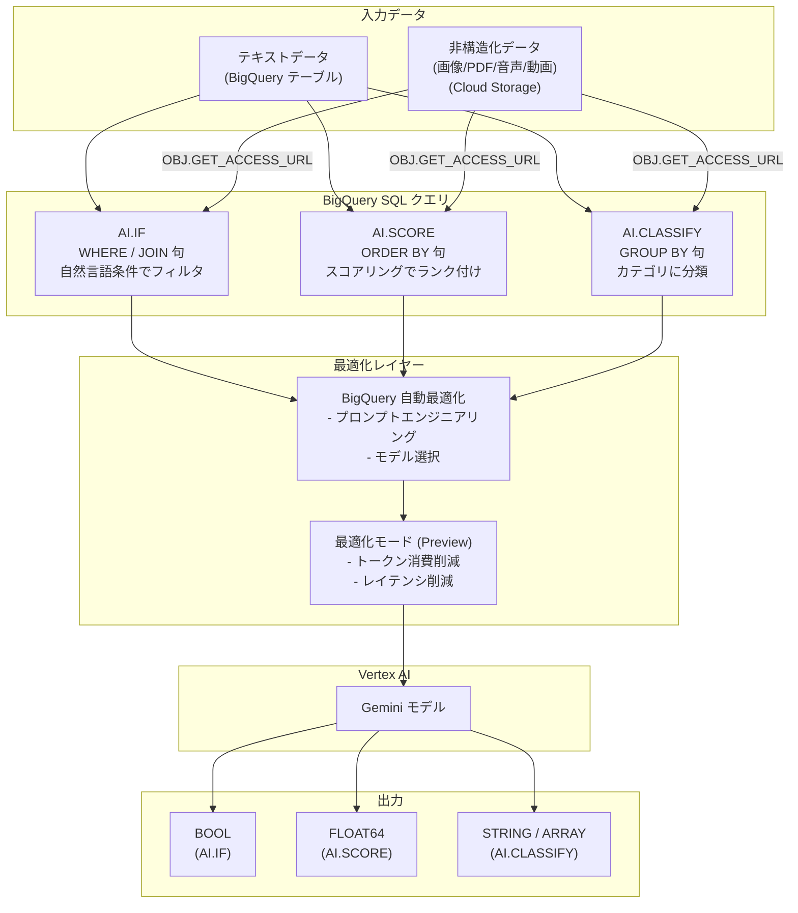

# BigQuery: マネージド AI 関数 (AI.IF, AI.SCORE, AI.CLASSIFY) の GA リリースと最適化モードの Preview

**リリース日**: 2026-04-13

**サービス**: BigQuery

**機能**: マネージド AI 関数の一般提供開始および最適化モード (Preview)

**ステータス**: GA (AI.IF, AI.SCORE, AI.CLASSIFY) / Preview (最適化モード)

[このアップデートのインフォグラフィックを見る](https://takech9203.github.io/google-cloud-news-summary/20260413-bigquery-ai-functions-ga.html)

## 概要

BigQuery のマネージド AI 関数である `AI.IF`、`AI.SCORE`、`AI.CLASSIFY` が一般提供 (GA) となった。これらの関数は Gemini モデルを活用し、自然言語によるデータのフィルタリング、結合、ランキング、分類を SQL クエリ内で直接実行できる。テキストデータに加え、画像、PDF、音声、動画といった非構造化データにも対応しており、マルチモーダルなデータ操作が可能である。

同時に、`AI.IF` と `AI.CLASSIFY` に対して最適化モード (Optimized Mode) が Preview として導入された。最適化モードは、大規模データセットを処理する際の LLM トークン消費量とクエリレイテンシを削減することを目的としている。

これらの関数は、SQL の知識を持つデータアナリスト、データエンジニア、データサイエンティストを主な対象としている。BigQuery がプロンプトエンジニアリングとモデル選択を自動的に最適化するため、ユーザーは複雑な LLM の設定を意識することなく、標準的な SQL 構文でセマンティック分析を実行できる。

**アップデート前の課題**

- BigQuery で自然言語ベースのデータ操作を行うには、汎用 AI 関数 (`AI.GENERATE` など) を使用してプロンプトやモデルパラメータを手動で設定する必要があった
- フィルタリング、分類、スコアリングといった定型的なタスクでも、LLM 呼び出しのプロンプト最適化をユーザー自身が行う必要があった
- 大規模データセットに対して AI 関数を適用する場合、トークン消費量とレイテンシが課題となることがあった
- マネージド AI 関数は Preview ステータスであり、本番環境での利用には制約があった

**アップデート後の改善**

- `AI.IF`、`AI.SCORE`、`AI.CLASSIFY` が GA となり、本番ワークロードでの利用がサポートされた
- BigQuery がプロンプトの構造化とモデル選択を自動最適化し、コストと品質のバランスを最適化してくれるようになった
- 最適化モード (Preview) により、`AI.IF` と `AI.CLASSIFY` で大規模データセット処理時のトークン消費量とレイテンシを削減できるようになった
- テキストだけでなく画像、PDF、音声、動画などの非構造化データに対するセマンティック操作が GA として安定的に利用可能になった

## アーキテクチャ図



このフローチャートは、テキストおよび非構造化データが BigQuery のマネージド AI 関数を通じて処理される流れを示している。BigQuery の自動最適化レイヤーがプロンプトとモデルを最適化し、Vertex AI の Gemini モデルを呼び出してスカラー値を返す。

## サービスアップデートの詳細

### 主要機能

1. **AI.IF 関数 (GA)**
   - 自然言語で記述した条件に基づいてデータをフィルタリングおよび結合する
   - `WHERE` 句や `JOIN` 句で使用し、`BOOL` 値を返す
   - テキストデータに加え、`OBJ.GET_ACCESS_URL` を使用して画像、PDF、音声、動画などの非構造化データにも対応
   - プロンプトの自動構造化により出力品質が最適化される
   - エラー発生時は `NULL` を返す

2. **AI.SCORE 関数 (GA)**
   - 自然言語のプロンプトに基づいて入力データを評価・スコアリングする
   - `ORDER BY` 句で使用して品質、類似度、感情などの基準でランク付けが可能
   - `FLOAT64` 値を返す (スコア範囲はプロンプトで指定可能)
   - 自動的にスコアリングルーブリックを生成するプロンプト最適化機能を備える

3. **AI.CLASSIFY 関数 (GA)**
   - テキストおよび非構造化データをユーザー定義のカテゴリに分類する
   - `GROUP BY` 句で使用してカテゴリ別の集計が可能
   - カテゴリは `ARRAY<STRING>` または説明付きの `ARRAY<STRUCT<STRING, STRING>>` で指定できる
   - `output_mode` パラメータにより、単一分類 (`single`) と複数分類 (`multi`) を切り替え可能
   - 単一分類時は `STRING`、複数分類時は `ARRAY<STRING>` を返す

4. **最適化モード (Preview)**
   - `AI.IF` と `AI.CLASSIFY` で利用可能
   - 大規模データセット処理時の LLM トークン消費量を削減
   - クエリレイテンシの低減を実現
   - 有効化方法の詳細は[最適化モードのドキュメント](https://docs.cloud.google.com/bigquery/docs/optimize-ai-functions)を参照

## 技術仕様

### 関数の比較

| 項目 | AI.IF | AI.SCORE | AI.CLASSIFY |
|------|-------|----------|-------------|
| 返り値の型 | `BOOL` | `FLOAT64` | `STRING` / `ARRAY<STRING>` |
| 主な用途 | フィルタリング / 結合 | ランキング / スコアリング | カテゴリ分類 |
| 推奨する SQL 句 | `WHERE` / `JOIN` | `ORDER BY` | `GROUP BY` |
| マルチモーダル対応 | あり | あり | あり |
| 最適化モード対応 | あり (Preview) | なし | あり (Preview) |
| ステータス | GA | GA | GA |

### 共通パラメータ

| パラメータ | 説明 | 必須 |
|-----------|------|------|
| `prompt` / `input` | 入力プロンプト (`STRING` または `STRUCT`) | はい |
| `connection_id` | Vertex AI との通信に使用する接続 | いいえ (省略時はエンドユーザー認証情報) |
| `endpoint` | 使用する Gemini モデルのエンドポイント | いいえ (省略時は BigQuery が自動選択) |

### 構文例

```sql
-- AI.IF: 自然災害に関するニュースをフィルタリング
SELECT title, body
FROM `bigquery-public-data.bbc_news.fulltext`
WHERE AI.IF(('The following news story is about a natural disaster: ', body));
```

```sql
-- AI.SCORE: 映画レビューの評価スコアを算出
SELECT
  AI.SCORE((
    'On a scale from 1 to 10, rate how much the reviewer liked the movie. Review: ',
    review)) AS ai_rating,
  reviewer_rating AS human_rating,
  review
FROM `bigquery-public-data.imdb.reviews`
WHERE title = 'The English Patient'
ORDER BY ai_rating DESC
LIMIT 10;
```

```sql
-- AI.CLASSIFY: ニュース記事のカテゴリ分類
SELECT
  title,
  body,
  AI.CLASSIFY(
    body,
    categories => ['tech', 'sport', 'business', 'politics', 'entertainment', 'other']
  ) AS category
FROM `bigquery-public-data.bbc_news.fulltext`
LIMIT 100;
```

## 設定方法

### 前提条件

1. BigQuery API が有効化された Google Cloud プロジェクト
2. Vertex AI API が有効化されていること
3. 適切な IAM 権限 (BigQuery ジョブ実行権限および Vertex AI ユーザーロール)
4. (オプション) 非構造化データを扱う場合は Cloud Resource 接続の作成

### 手順

#### ステップ 1: API の有効化

```bash
gcloud services enable bigquery.googleapis.com
gcloud services enable aiplatform.googleapis.com
```

BigQuery と Vertex AI の両方の API を有効化する。

#### ステップ 2: 接続の作成 (オプション)

```bash
bq mk --connection \
  --connection_type='CLOUD_RESOURCE' \
  --location='US' \
  myconnection
```

接続を作成すると、サービスアカウント経由で Vertex AI にアクセスする。接続を指定しない場合は、エンドユーザーの認証情報が使用される。

#### ステップ 3: マネージド AI 関数の使用

```sql
-- テキストデータのフィルタリング
SELECT *
FROM my_dataset.my_table
WHERE AI.IF(('Does this text mention a product recall? ', text_column));

-- 非構造化データの分類
SELECT
  OBJ.GET_READ_URL(ref) AS signed_url,
  AI.CLASSIFY(
    STRUCT(OBJ.GET_ACCESS_URL(ref, 'r')),
    categories => ['landscape', 'portrait', 'product', 'other']
  ) AS category
FROM my_dataset.my_images;
```

SQL クエリ内でマネージド AI 関数を直接呼び出す。`endpoint` パラメータを省略すると BigQuery がタスクに最適なモデルを自動選択する。

## メリット

### ビジネス面

- **データ分析の民主化**: SQL の知識があれば LLM を活用したセマンティック分析を実行可能。プロンプトエンジニアリングや ML の専門知識は不要
- **非構造化データの活用促進**: 画像、PDF、音声、動画などの非構造化データを SQL クエリで直接分析・分類でき、これまで活用が困難だったデータからのインサイト抽出が可能
- **運用コストの削減**: BigQuery がモデル選択とプロンプト最適化を自動化するため、手動チューニングの工数が削減される

### 技術面

- **簡潔な構文**: マネージド AI 関数は汎用 AI 関数と比較してシンプルな構文で同等のタスクを実行でき、クエリの可読性が向上
- **自動プロンプト最適化**: BigQuery がプロンプトの構造化とモデルパラメータの最適化を行い、出力品質を自動的に向上
- **スカラー値の返却**: 各関数は `BOOL`、`FLOAT64`、`STRING` などのスカラー値を返すため、既存の SQL クエリに自然に組み込み可能
- **最適化モードによるパフォーマンス向上**: 大規模データセットに対するトークン消費量とレイテンシの削減が期待できる (Preview)

## デメリット・制約事項

### 制限事項

- 最適化モードは `AI.IF` と `AI.CLASSIFY` のみで利用可能であり、`AI.SCORE` は対象外
- 最適化モードは Preview ステータスであり、本番環境での利用は「プレ GA サービスの利用規約」に基づく
- AI 関数は Vertex AI の Gemini モデルを呼び出すため、Vertex AI のクォータとレート制限の影響を受ける
- エラー発生時は `NULL` が返却されるため、汎用 AI 関数のようにエラー詳細の確認はできない

### 考慮すべき点

- AI 関数は呼び出しごとに Vertex AI の課金が発生するため、大量のデータに対して実行する場合はコスト見積りを事前に行うことが推奨される
- 非 AI フィルタを先に適用することで AI 関数の呼び出し回数を削減できる (BigQuery はクエリ最適化でこれを自動的に行う場合がある)
- LLM の出力は確定的ではないため、同じ入力に対して異なる結果が返される可能性がある
- `endpoint` パラメータを省略した場合、BigQuery がモデルを動的に選択するため、使用されるモデルを固定したい場合は明示的にエンドポイントを指定する必要がある

## ユースケース

### ユースケース 1: カスタマーレビューのセンチメント分析と分類

**シナリオ**: EC サイトのカスタマーレビューを自動的にネガティブセンチメントでフィルタリングし、不満の種類別に分類して集計する。

**実装例**:
```sql
SELECT
  review_id,
  review_text,
  AI.CLASSIFY(
    review_text,
    categories => [
      'Billing Issue',
      'Account Access',
      'Product Bug',
      'Feature Request',
      'Shipping Delay',
      'Other'
    ]
  ) AS issue_type
FROM my_dataset.customer_feedback
WHERE AI.IF(('Does this review express a negative sentiment? Review: ', review_text));
```

**効果**: ネガティブなレビューの自動トリアージにより、カスタマーサポートチームが問題の傾向を迅速に把握し、優先度の高い課題への対応を加速できる。

### ユースケース 2: 商品画像の自動分類とマッチング

**シナリオ**: Cloud Storage に格納された商品画像を自動的にカテゴリ分類し、商品データベースと結合して商品カタログを自動生成する。

**実装例**:
```sql
SELECT
  product_name,
  brand,
  OBJ.GET_READ_URL(images.ref) AS signed_url
FROM my_dataset.products
INNER JOIN
  EXTERNAL_OBJECT_TRANSFORM(TABLE `my_dataset.product_images`, ['SIGNED_URL']) AS images
  ON AI.IF((
    'Determine if the image is of the following product: ',
    products.product_name,
    OBJ.GET_ACCESS_URL(images.ref, 'r')
  ))
WHERE products.category = 'Electronics';
```

**効果**: 手動での商品画像とデータの紐付け作業を自動化し、商品カタログの作成・更新プロセスを大幅に効率化できる。

### ユースケース 3: コンテンツの品質スコアリング

**シナリオ**: 大量の社内ドキュメントやレポートを品質基準でスコアリングし、品質の高いものから優先的にレビュー・公開する。

**実装例**:
```sql
SELECT
  document_id,
  title,
  AI.SCORE((
    'On a scale from 1 to 10, rate the technical accuracy and completeness of this document: ',
    content
  )) AS quality_score
FROM my_dataset.internal_documents
ORDER BY quality_score DESC
LIMIT 20;
```

**効果**: 大量のドキュメントに対する品質評価を自動化し、レビュー担当者の作業を高品質なドキュメントに集中させることができる。

## 料金

マネージド AI 関数の料金は以下の 2 つの要素で構成される。

- **BigQuery コンピュート料金**: クエリ実行に使用するコンピュートリソースに対して課金される。オンデマンドまたはエディション (スロット) ベースの料金体系が適用される
- **Vertex AI 料金**: AI 関数が Vertex AI の Gemini モデルを呼び出すため、呼び出しごとに Vertex AI のトークンベースの料金が発生する

詳細な料金体系については [BigQuery ML の料金ページ](https://cloud.google.com/bigquery/pricing#bigquery-ml-pricing) を参照。Vertex AI 側の料金コストを追跡するには、Cloud Billing レポートで Vertex AI サービスにフィルタリングし、`bigquery_job_id_prefix` ラベルで特定のジョブの課金を確認できる。

## 利用可能リージョン

マネージド AI 関数は、Gemini モデルをサポートするすべての[リージョン](https://docs.cloud.google.com/vertex-ai/generative-ai/docs/learn/locations#google_model_endpoint_locations)、および US と EU のマルチリージョンで利用可能である。

## 関連サービス・機能

- **[Vertex AI Gemini](https://docs.cloud.google.com/vertex-ai/generative-ai/docs/learn/models)**: マネージド AI 関数のバックエンドとして使用される LLM。BigQuery が自動的にモデルを選択するか、ユーザーが `endpoint` パラメータで明示的に指定可能
- **[BigQuery 汎用 AI 関数](https://docs.cloud.google.com/bigquery/docs/generative-ai-overview#general_purpose_ai)**: `AI.GENERATE`、`AI.GENERATE_TABLE` など、モデルやパラメータを完全にコントロールしたい場合に使用する上位互換の関数群
- **[BigQuery ObjectRef](https://docs.cloud.google.com/bigquery/docs/work-with-objectref)**: Cloud Storage 上の非構造化データを BigQuery テーブルから参照するための仕組み。マネージド AI 関数とのマルチモーダル連携に使用
- **[AI.AGG 関数](https://docs.cloud.google.com/bigquery/docs/reference/standard-sql/bigqueryml-syntax-ai-agg)**: 同じマネージド AI 関数ファミリに属する集約関数。データの要約や分析に使用
- **[BigQuery セマンティック分析チュートリアル](https://docs.cloud.google.com/bigquery/docs/semantic-analysis)**: マネージド AI 関数を使用したセマンティック分析の実践的なチュートリアル

## 参考リンク

- [インフォグラフィック](https://takech9203.github.io/google-cloud-news-summary/20260413-bigquery-ai-functions-ga.html)
- [公式リリースノート](https://docs.cloud.google.com/release-notes#April_13_2026)
- [Generative AI overview (マネージド AI 関数)](https://docs.cloud.google.com/bigquery/docs/generative-ai-overview#managed_ai_functions)
- [AI.IF ドキュメント](https://docs.cloud.google.com/bigquery/docs/reference/standard-sql/bigqueryml-syntax-ai-if)
- [AI.SCORE ドキュメント](https://docs.cloud.google.com/bigquery/docs/reference/standard-sql/bigqueryml-syntax-ai-score)
- [AI.CLASSIFY ドキュメント](https://docs.cloud.google.com/bigquery/docs/reference/standard-sql/bigqueryml-syntax-ai-classify)
- [最適化モード](https://docs.cloud.google.com/bigquery/docs/optimize-ai-functions)
- [セマンティック分析チュートリアル](https://docs.cloud.google.com/bigquery/docs/semantic-analysis)
- [BigQuery ML 料金](https://cloud.google.com/bigquery/pricing#bigquery-ml-pricing)

## まとめ

BigQuery のマネージド AI 関数 (`AI.IF`、`AI.SCORE`、`AI.CLASSIFY`) が GA となり、SQL クエリ内で Gemini を活用したセマンティックなデータ操作が本番環境で利用可能になった。テキストだけでなく画像、PDF、音声、動画といったマルチモーダルデータに対応しており、BigQuery がプロンプトとモデルを自動最適化するため、SQL の知識があれば高度な AI 分析を即座に開始できる。大規模データセットを扱うユーザーは、`AI.IF` と `AI.CLASSIFY` の最適化モード (Preview) を試用し、トークン消費量とレイテンシの削減効果を評価することを推奨する。

---

**タグ**: #BigQuery #AI関数 #ManagedAI #Gemini #GA #セマンティック分析 #マルチモーダル #AI.IF #AI.SCORE #AI.CLASSIFY #最適化モード
