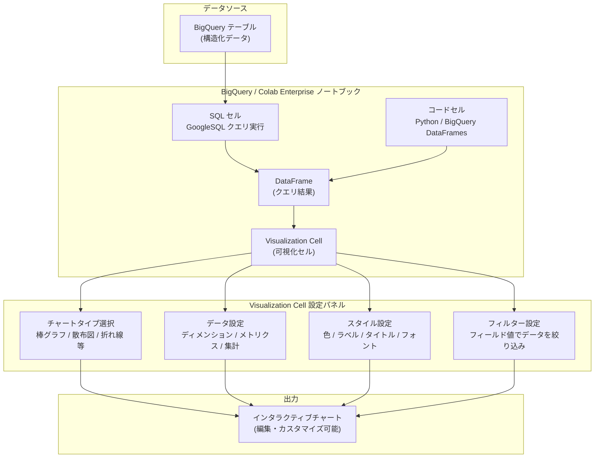

# BigQuery / Colab Enterprise: Visualization Cells の一般提供開始 (GA)

**リリース日**: 2026-04-13

**サービス**: BigQuery / Colab Enterprise

**機能**: Visualization Cells (可視化セル) の一般提供

**ステータス**: GA (Generally Available)

[このアップデートのインフォグラフィックを見る](https://takech9203.github.io/google-cloud-news-summary/20260413-bigquery-colab-visualization-cells-ga.html)

## 概要

BigQuery および Colab Enterprise のノートブックにおいて、Visualization Cells (可視化セル) が一般提供 (GA) となった。この機能により、ノートブック内の任意の DataFrame からインタラクティブな可視化をコードを書くことなく自動生成できる。2025 年 10 月に Preview としてリリースされた本機能が、約 6 か月の検証期間を経て本番環境での利用がサポートされるステータスに昇格した。

Visualization Cells は、チャートの種類、集計方法、色、ラベル、タイトルなどを GUI 上でカスタマイズできるノーコードの可視化ツールである。SQL セルで生成した DataFrame をそのまま入力として受け取り、散布図、棒グラフなどさまざまなチャートタイプで即座にデータを可視化できる。

主な対象ユーザーは、BigQuery Studio や Colab Enterprise を利用するデータアナリスト、データサイエンティスト、ビジネスアナリストである。Python の matplotlib や seaborn などのライブラリを使いこなせなくても、GUI 操作だけでデータの探索とインサイトの発見が可能になる。

**アップデート前の課題**

- ノートブック内でデータを可視化するには、Python コード (matplotlib、seaborn、pydeck など) を記述する必要があり、コーディングスキルが求められた
- SQL セルの結果を可視化するためにコードセルへのコンテキスト切り替えが発生し、探索的データ分析のフローが中断されていた
- チャートのスタイルや集計方法の変更のたびにコードを修正・再実行する必要があった
- Visualization Cells は Preview ステータスであったため、本番環境での利用には制約があり、SLA の対象外であった

**アップデート後の改善**

- Visualization Cells が GA となり、本番ワークロードでの利用がサポートされ、SLA の対象となった
- GUI ベースのインタラクティブな可視化により、コードを書かずに DataFrame のデータを即座にチャート化できるようになった
- チャートタイプ、集計方法、色、ラベル、タイトルなどの設定を GUI のサイドパネルからリアルタイムに変更可能になった
- SQL セルとの連携により、クエリ結果の DataFrame をシームレスに可視化できるようになり、データ探索のワークフローが効率化された

## アーキテクチャ図



このフローチャートは、BigQuery テーブルのデータが SQL セルまたはコードセルを経由して DataFrame に格納され、Visualization Cell がその DataFrame を入力として受け取り、GUI 設定パネルの構成に基づいてインタラクティブなチャートを生成する流れを示している。

## サービスアップデートの詳細

### 主要機能

1. **ノーコード可視化の自動生成**
   - ノートブック内の任意の DataFrame を選択するだけで、デフォルトの可視化が自動生成される
   - コードセルを追加する必要がなく、ツールバーから「Add visualization cell」を選択するだけで利用可能
   - DataFrame 生成後に表示される「Next steps」セクションの「Visualize with DATAFRAME_NAME」ボタンからも直接作成できる

2. **多様なチャートタイプと集計方法**
   - 散布図、棒グラフなど複数のチャートタイプから選択可能
   - ディメンション (カテゴリフィールド) とメトリクス (数値フィールド) の設定を GUI で変更可能
   - メトリクスの集計方法 (合計、平均、カウントなど) をワンクリックで切り替え可能
   - ソート順序やソート対象のメトリクスも設定パネルから変更できる

3. **インタラクティブなスタイルカスタマイズ**
   - サイドパネルの「Style」タブからタイトル、軸ラベル、フォント、フォントサイズ、色などを自由に変更可能
   - メトリクスごとに個別のカラー設定が可能
   - ラベルの表示・非表示を切り替えられる

4. **データフィルタリング機能**
   - 可視化セル上部の「Add filter」ボタンからフィールド値ベースのフィルターを追加可能
   - カテゴリデータの場合は含めるカテゴリを選択、数値データの場合はスライダーで範囲を指定できる
   - 複数のフィルターを組み合わせてデータを絞り込み、特定の条件下でのデータ傾向を探索できる

5. **SQL セルとの統合**
   - SQL セルで実行したクエリ結果は自動的に DataFrame として保存され、Visualization Cell の入力として直接利用可能
   - SQL セルの出力に対する「Visualize with DataFrame」ボタンにより、シームレスなクエリ実行から可視化までのワークフローを実現

## 技術仕様

### セルタイプの比較

| 項目 | コードセル (Python) | SQL セル | Visualization Cell |
|------|-------------------|----------|--------------------|
| 可視化手段 | matplotlib / seaborn / pydeck 等のライブラリ | なし (データ取得のみ) | GUI ベースのインタラクティブチャート |
| コーディング | 必要 | SQL のみ | 不要 |
| カスタマイズ | コード修正が必要 | N/A | GUI のサイドパネルで即時変更 |
| 入力 | 変数 / DataFrame | BigQuery テーブル | DataFrame |
| ステータス | GA | Preview | GA |

### 必要な IAM ロール

| ロール | 説明 |
|--------|------|
| `roles/bigquery.user` (BigQuery User) | BigQuery でのクエリ実行に必要 |
| `roles/aiplatform.colabEnterpriseUser` (Colab Enterprise User) | Colab Enterprise ノートブックの利用に必要 |
| `roles/bigquery.studioUser` (BigQuery Studio User) | BigQuery Studio でのノートブック作成・実行に必要 (BigQuery 経由の場合) |
| `roles/aiplatform.notebookRuntimeUser` (Notebook Runtime User) | ノートブックランタイムでの実行に必要 |

## 設定方法

### 前提条件

1. BigQuery API が有効化された Google Cloud プロジェクト
2. BigQuery Studio または Colab Enterprise のノートブックが作成済みであること
3. 適切な IAM ロール (BigQuery User、Colab Enterprise User など) が付与されていること
4. 可視化対象のデータが DataFrame として存在すること (SQL セルまたはコードセルで事前に作成)

### 手順

#### ステップ 1: DataFrame の作成 (SQL セルを使用する場合)

```sql
-- SQL セルで BigQuery のパブリックデータセットをクエリ
SELECT *
FROM `bigquery-public-data.ml_datasets.penguins`;
```

SQL セルでクエリを実行すると、結果が自動的に `df` という名前の DataFrame に保存される。セルのタイトルを変更すると、DataFrame 名もそのタイトルに合わせて変更される。

#### ステップ 2: Visualization Cell の追加

ツールバーの「Insert code cell options」メニューから「Add visualization cell」を選択する。または、セル間にカーソルを合わせて表示される「Visualization」ボタンをクリックする。

#### ステップ 3: DataFrame の選択と可視化の生成

Visualization Cell 内の「Choose a dataframe」メニューからステップ 1 で作成した DataFrame を選択し、「Run cell」をクリックする。デフォルトの可視化が自動生成される。

#### ステップ 4: 可視化のカスタマイズ

サイドパネルの「Toggle settings」ボタンをクリックし、以下の項目を必要に応じて調整する。

- **Setup タブ**: チャートタイプの変更、ディメンション・メトリクスの選択、集計方法の変更
- **Style タブ**: タイトル、ラベル、フォント、色の設定
- **フィルター**: 「Add filter」からフィールド値ベースのフィルタリングを追加

## メリット

### ビジネス面

- **データ分析の民主化**: Python のコーディングスキルがなくても、SQL の知識だけでデータの可視化と探索が可能。ビジネスアナリストやドメインエキスパートがセルフサービスでインサイトを発見できる
- **意思決定の迅速化**: クエリ結果から即座にチャートを生成・カスタマイズできるため、データに基づく意思決定のサイクルが短縮される
- **コラボレーションの強化**: ノートブック内に可視化が埋め込まれるため、分析結果と可視化を一体で共有でき、チーム間のコミュニケーションが効率化される

### 技術面

- **探索的データ分析の効率化**: コードの記述・修正サイクルが不要となり、GUI 操作だけでチャートのパラメータを即座に変更してデータの傾向を探索できる
- **SQL セルとのシームレスな統合**: クエリ実行から可視化までが同一ノートブック内で完結し、データパイプラインの構築と結果の確認を一つのワークフローで実行可能
- **GA ステータスによる安定性**: Preview から GA に昇格したことで、SLA の対象となり本番環境での利用が保証される

## デメリット・制約事項

### 制限事項

- Visualization Cell を再実行すると、既存の可視化設定がリセットされる
- pandas DataFrame を使用している場合、「Next steps」の「Visualize」オプションが常に表示されるとは限らない
- Gemini in Colab Enterprise は Visualization Cell と連携できない。Gemini が Visualization Cell の内容を読み取ったり、変更を提案したり、エラーの説明を行うことはできない
- Visualization Cell は DataFrame の可視化に特化しており、地理空間データの高度な可視化 (pydeck ベースのヒートマップ、ポリゴン描画など) にはコードセルでの Python ライブラリの使用が引き続き必要

### 考慮すべき点

- 大規模な DataFrame を可視化する場合、レンダリングのパフォーマンスに影響が出る可能性がある
- 高度なカスタマイズ (カスタムカラースケール、複合チャート、アニメーションなど) が必要な場合は、コードセルで matplotlib / seaborn / Plotly などのライブラリを使用する方が適切な場合がある
- Visualization Cell の設定はノートブック内に保存されるが、バージョン管理上の差分としてはコードセルと比較して扱いにくい場合がある

## ユースケース

### ユースケース 1: 売上データの探索的分析

**シナリオ**: マーケティングチームが四半期ごとの売上データを分析し、地域別・製品カテゴリ別の傾向を迅速に把握したい。SQL の知識はあるが Python のコーディングは不得意なメンバーが担当する。

**実装例**:
```sql
-- SQL セルでクエリを実行
SELECT
  region,
  product_category,
  EXTRACT(QUARTER FROM order_date) AS quarter,
  SUM(revenue) AS total_revenue,
  COUNT(DISTINCT order_id) AS order_count
FROM `my_project.sales.orders`
WHERE order_date >= '2025-01-01'
GROUP BY region, product_category, quarter
ORDER BY quarter, total_revenue DESC;
```

SQL セルの実行後、「Visualize with df」ボタンをクリックして Visualization Cell を追加する。チャートタイプを棒グラフに設定し、ディメンションに `region`、メトリクスに `total_revenue` を指定する。フィルターで特定の `product_category` に絞り込み、地域別の売上傾向を視覚的に比較する。

**効果**: Python コードを書くことなく、SQL クエリの結果を即座に可視化し、地域別・カテゴリ別の売上傾向をインタラクティブに探索できる。分析から意思決定までの時間が大幅に短縮される。

### ユースケース 2: データ品質の可視化によるモニタリング

**シナリオ**: データエンジニアが ETL パイプラインの出力データの品質をノートブック上でモニタリングし、NULL 値の割合やデータ分布の異常を視覚的に検出したい。

**実装例**:
```sql
-- SQL セルで各カラムの NULL 割合を集計
SELECT
  'column_a' AS column_name, COUNTIF(column_a IS NULL) / COUNT(*) AS null_ratio
FROM `my_project.analytics.processed_data`
UNION ALL
SELECT
  'column_b', COUNTIF(column_b IS NULL) / COUNT(*)
FROM `my_project.analytics.processed_data`
UNION ALL
SELECT
  'column_c', COUNTIF(column_c IS NULL) / COUNT(*)
FROM `my_project.analytics.processed_data`;
```

Visualization Cell で棒グラフを作成し、`column_name` をディメンション、`null_ratio` をメトリクスに設定する。色をカスタマイズして閾値超過のカラムを視覚的に目立たせる。

**効果**: データ品質の問題をノートブック内で即座に可視化し、パイプラインの改善ポイントを迅速に特定できる。

## 料金

Visualization Cells 自体に追加の料金は発生しない。料金は可視化の元となるデータの取得 (BigQuery クエリの実行) およびノートブックランタイムの使用に対して発生する。

- **BigQuery クエリ料金**: オンデマンド課金の場合、処理されたデータ量に応じて課金される (最初の 1 TiB/月は無料)
- **ノートブックランタイム料金**: Colab Enterprise のランタイムリソース (CPU、メモリ、GPU) の使用時間に応じて Vertex AI の料金が適用される

詳細な料金については [BigQuery の料金ページ](https://cloud.google.com/bigquery/pricing) および [Vertex AI の料金ページ](https://cloud.google.com/vertex-ai/pricing) を参照。

## 関連サービス・機能

- **[BigQuery Studio](https://docs.cloud.google.com/bigquery/docs/query-overview#bigquery-studio)**: BigQuery のウェブ UI であり、ノートブック、SQL エディタ、Visualization Cells を統合的に提供するプラットフォーム
- **[Colab Enterprise](https://docs.cloud.google.com/colab/docs/introduction)**: Google Cloud のマネージドノートブック環境。Visualization Cells をサポートし、エンタープライズ向けのセキュリティとコラボレーション機能を提供
- **[SQL セル](https://docs.cloud.google.com/colab/docs/sql-cells)**: ノートブック内で GoogleSQL クエリを直接実行できるセルタイプ。Visualization Cell の入力となる DataFrame を生成する主要な手段
- **[BigQuery DataFrames](https://docs.cloud.google.com/bigquery/docs/use-bigquery-dataframes)**: pandas 互換の Python API で BigQuery データを操作するライブラリ。コードセルで生成した BigQuery DataFrames も Visualization Cell の入力として利用可能
- **[Data Science Agent](https://docs.cloud.google.com/colab/docs/use-data-science-agent)**: Colab Enterprise で利用できる AI エージェント。探索的データ分析や ML タスクの自動化を支援 (ただし Visualization Cells との直接連携はまだ不可)

## 参考リンク

- [インフォグラフィック](https://takech9203.github.io/google-cloud-news-summary/20260413-bigquery-colab-visualization-cells-ga.html)
- [公式リリースノート](https://cloud.google.com/release-notes#April_13_2026)
- [Visualization Cells ドキュメント (Colab Enterprise)](https://docs.cloud.google.com/colab/docs/visualization-cells)
- [BigQuery ノートブックのセルタイプ](https://docs.cloud.google.com/bigquery/docs/create-notebooks#cells)
- [BigQuery でのデータ可視化](https://docs.cloud.google.com/bigquery/docs/visualize-data-colab)
- [BigQuery 料金](https://cloud.google.com/bigquery/pricing)

## まとめ

BigQuery および Colab Enterprise の Visualization Cells が GA となり、ノートブック内で DataFrame のデータをコードなしでインタラクティブに可視化する機能が本番環境で利用可能になった。SQL セルとの統合により、クエリ実行から可視化までをシームレスに行えるため、データアナリストやビジネスユーザーの探索的データ分析の効率が大幅に向上する。BigQuery Studio や Colab Enterprise を利用しているチームは、既存のノートブックに Visualization Cell を追加し、データ探索ワークフローの改善効果を確認することを推奨する。

---

**タグ**: #BigQuery #ColabEnterprise #VisualizationCells #GA #データ可視化 #ノートブック #ノーコード #BigQueryStudio #DataFrame #探索的データ分析
