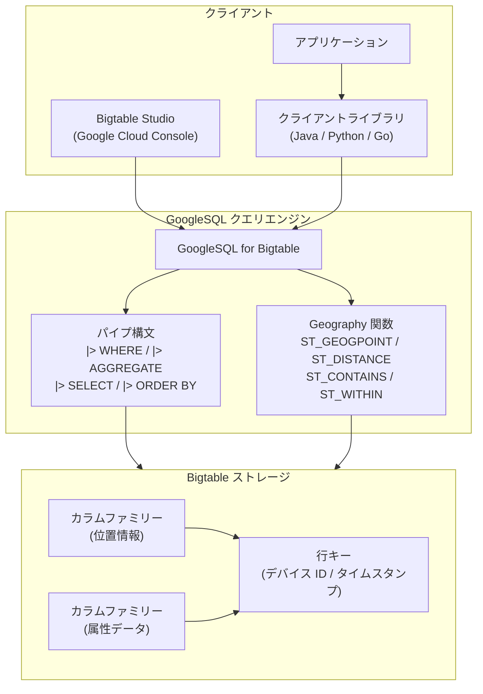

# Bigtable: GoogleSQL Geography 関数とパイプ構文の GA リリース

**リリース日**: 2026-04-13

**サービス**: Bigtable

**機能**: GoogleSQL Geography 関数による地理空間データ操作、およびパイプ構文 (Pipe Syntax) のサポート

**ステータス**: GA (Generally Available)

[このアップデートのインフォグラフィックを見る](https://takech9203.github.io/google-cloud-news-summary/20260413-bigtable-googlesql-features-ga.html)

## 概要

Bigtable において、2 つの GoogleSQL 機能が一般提供 (GA) となりました。1 つ目は **GoogleSQL Geography 関数**で、Bigtable に格納された地理空間データに対して空間クエリを実行できるようになります。2 つ目は **パイプ構文 (Pipe Syntax)** で、GoogleSQL の拡張機能として、よりシンプルで簡潔なクエリの記述を可能にします。

GoogleSQL Geography 関数により、Bigtable ユーザーは位置情報を含むデータに対して、距離計算、空間フィルタリング、ジオメトリ操作といった地理空間分析を直接実行できます。IoT デバイスの位置追跡、配送ルート最適化、位置ベースのアプリケーションなど、大規模な地理空間データをリアルタイムに処理するワークロードに適しています。

パイプ構文は、パイプ記号 `|>` を使用してクエリを線形構造で記述できる GoogleSQL の拡張です。標準構文と同じ操作をサポートしつつ、操作を任意の順序で任意の回数適用できるため、複雑なクエリの可読性と保守性が向上します。

**アップデート前の課題**

- Bigtable に格納された地理空間データを分析するには、データを BigQuery などの別サービスにエクスポートする必要があった
- 標準の GoogleSQL 構文では、複雑なクエリが入れ子のサブクエリや CTE を必要とし、可読性が低下する場合があった
- 地理空間クエリを低レイテンシで実行するには、アプリケーション側で座標計算ロジックを実装する必要があった

**アップデート後の改善**

- Bigtable 上で直接 Geography 関数を使用して地理空間データを操作でき、外部サービスへのエクスポートが不要になった
- パイプ構文により、クエリの論理的な処理順序に沿った直感的な記述が可能になった
- 両機能が GA となり、本番環境での利用が公式にサポートされた

## アーキテクチャ図



この図は、クライアント (アプリケーション、Bigtable Studio、クライアントライブラリ) から GoogleSQL クエリエンジンを介して Bigtable ストレージにアクセスする流れを示しています。クエリエンジンはパイプ構文と Geography 関数の両方をサポートし、カラムファミリーに格納された地理空間データや属性データに対して操作を実行します。

## サービスアップデートの詳細

### 主要機能

1. **GoogleSQL Geography 関数**
   - Bigtable に格納された地理空間データに対して、GoogleSQL を使用した空間クエリを実行可能
   - 緯度・経度データから地理ポイントの生成、距離計算、空間的な包含関係の判定などが可能
   - GoogleSQL は BigQuery や Spanner など複数の Google Cloud サービスで共通して使用されるクエリ言語であり、習得した知識を横断的に活用可能

2. **パイプ構文 (Pipe Syntax)**
   - パイプ記号 `|>` を使用して、クエリを線形構造で記述可能
   - 標準の GoogleSQL 構文と同じ操作 (SELECT、WHERE、AGGREGATE、JOIN、ORDER BY など) をサポート
   - 操作を任意の順序で、任意の回数適用可能
   - 標準構文と同一クエリ内で混在使用可能

3. **Bigtable Studio での実行**
   - Google Cloud コンソール内の Bigtable Studio から両機能を利用したクエリを作成・実行可能
   - クライアントライブラリ (Java、Python、Go) からもプログラム的に実行可能

## 技術仕様

### Geography 関数の主要カテゴリ

| カテゴリ | 代表的な関数 | 説明 |
|------|------|------|
| コンストラクタ | `ST_GEOGPOINT`, `ST_MAKELINE`, `ST_MAKEPOLYGON` | 座標や既存のジオグラフィから新しい地理値を構築 |
| パーサー | `ST_GEOGFROMTEXT`, `ST_GEOGFROMGEOJSON` | WKT や GeoJSON などの外部フォーマットから地理値を生成 |
| フォーマッター | `ST_ASTEXT`, `ST_ASGEOJSON`, `ST_ASBINARY` | 地理値を WKT や GeoJSON などの外部フォーマットにエクスポート |
| 述語 | `ST_CONTAINS`, `ST_WITHIN`, `ST_INTERSECTS`, `ST_DWITHIN` | 2 つの地理値の空間的関係を判定 (TRUE/FALSE) |
| 計測 | `ST_DISTANCE`, `ST_AREA`, `ST_LENGTH` | 地理値の距離、面積、長さなどを計測 |
| 変換 | `ST_BUFFER`, `ST_CENTROID`, `ST_UNION` | 入力に基づいて新しい地理値を生成 |

### パイプ構文の主要演算子

| 演算子 | 説明 |
|------|------|
| `\|> SELECT` | 指定した列で新しいテーブルを生成 |
| `\|> WHERE` | 入力テーブルの結果をフィルタリング |
| `\|> AGGREGATE ... GROUP BY` | グループ別または全体の集計を実行 |
| `\|> ORDER BY` | 結果を式のリストで並べ替え |
| `\|> LIMIT` | 返される行数を制限 |
| `\|> EXTEND` | 既存テーブルに計算列を追加 |
| `\|> DROP` | 入力テーブルから列を削除 |
| `\|> SET` | 入力テーブルの列の値を置換 |

### GoogleSQL for Bigtable の制約事項

GoogleSQL for Bigtable は、以下の SQL 構文をサポートしていません。

- DML 文 (INSERT, UPDATE, DELETE) -- SELECT のみサポート
- DDL 文 (CREATE, ALTER, DROP)
- サブクエリ、JOIN、UNION、CTE (標準構文)
- Data Boost との併用

## 設定方法

### 前提条件

1. Bigtable インスタンスとクラスタが作成済みであること
2. 地理空間データを含むテーブルが存在すること (Geography 関数を使用する場合)
3. 適切な IAM 権限が付与されていること

### 手順

#### ステップ 1: Bigtable Studio でクエリを実行

Google Cloud コンソールの Bigtable Studio にアクセスし、GoogleSQL クエリを作成・実行します。

#### ステップ 2: Geography 関数を使用したクエリ例

```sql
SELECT
  _key,
  locations['latitude'] AS lat,
  locations['longitude'] AS lng,
  ST_DISTANCE(
    ST_GEOGPOINT(CAST(locations['longitude'] AS FLOAT64),
                 CAST(locations['latitude'] AS FLOAT64)),
    ST_GEOGPOINT(139.6917, 35.6895)
  ) AS distance_from_tokyo
FROM myTable
```

このクエリは、テーブル内の各行の位置情報から東京までの距離をメートル単位で計算します。

#### ステップ 3: パイプ構文を使用したクエリ例

```sql
FROM myTable
|> WHERE locations['city'] IS NOT NULL
|> SELECT _key, locations['city'] AS city, locations['latitude'] AS lat
|> ORDER BY _key ASC
|> LIMIT 100
```

パイプ構文では、FROM 句からクエリを開始し、パイプ演算子を順番に適用してデータを変換します。

#### ステップ 4: クライアントライブラリからの実行

```java
// Java クライアントライブラリの例
import com.google.cloud.bigtable.data.v2.BigtableDataClient;

String query = "FROM myTable "
    + "|> WHERE locations['city'] IS NOT NULL "
    + "|> SELECT _key, locations['city'] AS city "
    + "|> LIMIT 10";

// executeQuery メソッドでクエリを実行
```

Java、Python、Go のクライアントライブラリから GoogleSQL クエリをプログラム的に実行できます。

## メリット

### ビジネス面

- **データ分析の効率化**: 地理空間データを Bigtable 上で直接分析でき、外部サービスへのデータ移動が不要になることで、分析ワークフローが簡素化される
- **リアルタイム位置分析**: 低レイテンシの Bigtable 上で地理空間クエリを実行でき、リアルタイムアプリケーションでの位置ベース分析が可能になる
- **開発生産性の向上**: パイプ構文により複雑なクエリの記述・保守が容易になり、開発者の生産性が向上する

### 技術面

- **GoogleSQL の一貫性**: BigQuery や Spanner と同じ GoogleSQL 構文を使用するため、学習コストが低く、スキルの移転が容易
- **パイプ構文の柔軟性**: 操作を任意の順序で適用でき、エイリアスの参照も前段のパイプから可能なため、段階的にクエリを構築可能
- **GA による安定性**: 両機能が GA となったことで、SLA の対象となり、本番ワークロードでの信頼性が保証される

## デメリット・制約事項

### 制限事項

- GoogleSQL for Bigtable は SELECT 文のみをサポートしており、INSERT、UPDATE、DELETE などの DML 操作は不可
- サブクエリ、JOIN、UNION、CTE は標準構文ではサポートされていない
- Data Boost との併用は不可
- SQL クエリはクラスタノードにより処理されるため、フルテーブルスキャンを避けるなどの NoSQL データリクエストと同様のベストプラクティスが適用される

### 考慮すべき点

- Geography 関数を多用するクエリは計算リソースを消費するため、クラスタのノード数とパフォーマンスへの影響を監視する必要がある
- Bigtable の Geography 関数で利用可能な関数の範囲は、BigQuery の Geography 関数と異なる場合があるため、公式ドキュメントで対応状況を確認すること
- パイプ構文は GoogleSQL の拡張であり、他の SQL データベースとの互換性はない

## ユースケース

### ユースケース 1: IoT デバイスの位置ベースモニタリング

**シナリオ**: 大量の IoT デバイス (配送車両、センサーなど) から送信される位置情報を Bigtable に格納し、特定のエリア内にあるデバイスをリアルタイムで検索する。

**実装例**:
```sql
FROM iot_devices
|> WHERE ST_DWITHIN(
     ST_GEOGPOINT(
       CAST(location['longitude'] AS FLOAT64),
       CAST(location['latitude'] AS FLOAT64)
     ),
     ST_GEOGPOINT(139.6917, 35.6895),
     5000
   )
|> SELECT _key AS device_id, location['latitude'] AS lat, location['longitude'] AS lng
|> ORDER BY _key ASC
```

**効果**: 東京駅から半径 5km 以内のデバイスを低レイテンシで検索でき、リアルタイムの車両追跡や資産管理に活用可能。

### ユースケース 2: 位置ベースのレコメンデーション

**シナリオ**: ユーザーの現在地から最も近い店舗やサービスポイントを検索し、パーソナライズされたレコメンデーションを提供する。

**効果**: Bigtable の低レイテンシ特性と Geography 関数を組み合わせることで、モバイルアプリなどからのリアルタイムな位置ベース検索をスケーラブルに実現可能。

### ユースケース 3: パイプ構文を使用した段階的データ分析

**シナリオ**: 大量のイベントログデータに対して、フィルタリング、集計、並べ替えを段階的に適用し、インサイトを抽出する。

**実装例**:
```sql
FROM event_logs
|> WHERE _key >= 'event#2026-04-01' AND _key < 'event#2026-04-14'
|> WHERE metrics['response_time'] IS NOT NULL
|> SELECT _key, metrics['response_time'] AS response_time, metadata['region'] AS region
|> ORDER BY response_time DESC
|> LIMIT 50
```

**効果**: パイプ構文のリニアな構造により、複雑な分析クエリを段階的に構築・理解でき、デバッグや修正が容易になる。

## 料金

今回の GoogleSQL Geography 関数およびパイプ構文の利用に関して、追加の固有料金は発生しません。SQL クエリの実行は Bigtable クラスタノードの計算リソースを使用するため、既存の Bigtable 料金体系に従います。

Bigtable の主な料金要素は以下の通りです。

| 項目 | 料金体系 |
|--------|-----------------|
| ノード (コンピューティング) | 時間あたりのノード料金 (リージョンにより異なる) |
| ストレージ (SSD) | 格納データ量に基づく月額料金 |
| ストレージ (HDD) | 格納データ量に基づく月額料金 |
| ネットワーク | 標準のネットワーク料金 |

確約利用割引 (CUD) では、1 年契約で 20%、3 年契約で 40% のノード料金割引が適用されます。最新の料金情報は公式料金ページをご確認ください。

## 利用可能リージョン

Bigtable が利用可能なすべてのリージョンで、GoogleSQL Geography 関数およびパイプ構文が利用可能です。Bigtable は世界中の複数のリージョンとゾーンで提供されています。詳細は公式のロケーションドキュメントをご確認ください。

## 関連サービス・機能

- **BigQuery**: 同じ GoogleSQL 構文で Geography 関数とパイプ構文を使用可能。バッチ分析や複数データソースの結合に適している。Bigtable から BigQuery への外部テーブル連携も可能
- **Spanner**: GoogleSQL を使用するもう一つの Google Cloud データベース。グローバル分散が必要なリレーショナルワークロード向け
- **Bigtable Studio**: Google Cloud コンソール内の SQL クエリエディタ。テーブルスキーマの確認やデバッグに活用可能
- **Bigtable クライアントライブラリ**: Java、Python、Go でプログラム的に SQL クエリを実行可能
- **Continuous Materialized View (Preview)**: 事前計算された SQL クエリの結果を自動的にソーステーブルと同期。集計データの効率的な管理に有用

## 参考リンク

- [インフォグラフィック](https://takech9203.github.io/google-cloud-news-summary/20260413-bigtable-googlesql-features-ga.html)
- [公式リリースノート](https://docs.cloud.google.com/release-notes#April_13_2026)
- [Work with geospatial data (Bigtable ドキュメント)](https://docs.cloud.google.com/bigtable/docs/work-with-geo-data)
- [Geography functions reference (Bigtable ドキュメント)](https://docs.cloud.google.com/bigtable/docs/reference/sql/geography_functions)
- [Pipe syntax reference (Bigtable ドキュメント)](https://docs.cloud.google.com/bigtable/docs/reference/sql/pipe-syntax)
- [GoogleSQL for Bigtable overview](https://docs.cloud.google.com/bigtable/docs/googlesql-overview)
- [Introduction to SQL (Bigtable ドキュメント)](https://docs.cloud.google.com/bigtable/docs/introduction-sql)
- [料金ページ](https://cloud.google.com/bigtable/pricing)

## まとめ

Bigtable における GoogleSQL Geography 関数とパイプ構文の GA リリースは、Bigtable の SQL クエリ機能を大幅に拡張するアップデートです。Geography 関数により、大規模な地理空間データを低レイテンシで直接分析できるようになり、IoT、位置ベースサービス、物流などの分野で新たなユースケースが開拓されます。パイプ構文は、複雑なクエリの可読性と保守性を向上させ、開発者の生産性を高めます。既に Bigtable を使用している場合は、公式ドキュメントの Geography 関数リファレンスとパイプ構文リファレンスを確認し、既存のワークロードへの適用を検討することを推奨します。

---

**タグ**: #Bigtable #GoogleSQL #GeographyFunctions #PipeSyntax #GA #地理空間データ #GeoSpatial #NoSQL #データベース
