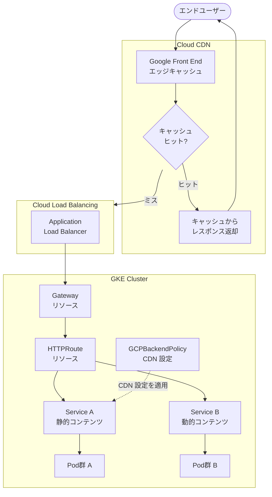

# Cloud CDN: GKE Gateway における Cloud CDN サポート (Preview)

**リリース日**: 2026-04-13

**サービス**: Cloud CDN

**機能**: GKE Gateway Cloud CDN Integration

**ステータス**: Preview

[このアップデートのインフォグラフィックを見る](https://takech9203.github.io/google-cloud-news-summary/20260413-cloud-cdn-gke-gateway-preview.html)

## 概要

Google Kubernetes Engine (GKE) の Gateway API が Cloud CDN をサポートするようになった。これにより、GKE Gateway API を使用して、ユーザーに近い場所でコンテンツをキャッシュし、アプリケーションのレイテンシを改善し、オリジンサーバーへの負荷を軽減できる。この機能は現在 Preview ステータスで提供されている。

GKE Gateway は Kubernetes Gateway API の Google Cloud 実装であり、Cloud Load Balancing を基盤としたネットワーキング機能を Kubernetes ネイティブなリソースモデルで管理できる。今回のアップデートにより、GKE Gateway API を通じて Cloud CDN のキャッシュ設定を構成・管理し、トラフィックの異なるセグメントに対してキャッシュ構成をきめ細かく調整できるようになった。

この機能は、GKE 上でホストされる Web アプリケーションやマイクロサービスにおいて、静的コンテンツ (画像、CSS、JavaScript など) のキャッシュ配信を Kubernetes マニフェストから宣言的に管理したい開発者やプラットフォームエンジニアを対象としている。

**アップデート前の課題**

- GKE Gateway では Cloud CDN がサポートされておらず、CDN キャッシュを利用するには GKE Ingress (BackendConfig 経由) や、ロードバランサを直接構成する必要があった
- GKE Gateway を使用するワークロードでは、Cloud CDN のキャッシュヒット変数 (`cdn_cache_id`, `cdn_cache_status`) がカスタムヘッダーで利用できなかった
- Gateway API の宣言的なリソースモデルと CDN キャッシュ管理が統合されておらず、インフラの構成が分断されていた

**アップデート後の改善**

- GKE Gateway API を通じて Cloud CDN のキャッシュ設定を直接構成・管理できるようになった
- トラフィックセグメントごとにキャッシュ構成をきめ細かく調整できるようになった
- Kubernetes マニフェストベースの宣言的な CDN キャッシュ管理が可能になり、GitOps ワークフローとの親和性が向上した

## アーキテクチャ図



GKE Gateway を通じた Cloud CDN のトラフィックフローを示している。エンドユーザーからのリクエストは Google Front End (GFE) でエッジキャッシュを確認し、キャッシュヒットの場合はそのまま返却、キャッシュミスの場合は Cloud Load Balancing を経由して GKE クラスタ内の Pod にルーティングされる。GCPBackendPolicy リソースにより、Service 単位で CDN キャッシュ設定を適用できる。

## サービスアップデートの詳細

### 主要機能

1. **GKE Gateway API による Cloud CDN 構成**
   - GKE Gateway API を使用して Cloud CDN のキャッシュ動作を宣言的に管理可能
   - Kubernetes マニフェスト (GCPBackendPolicy) を通じた CDN 設定の構成
   - 既存の GKE Gateway リソースモデル (Gateway, HTTPRoute, Policy) との統合

2. **トラフィックセグメント別のキャッシュ構成**
   - 異なる Service に対して個別のキャッシュポリシーを適用可能
   - HTTPRoute によるパスベースルーティングと組み合わせることで、静的コンテンツと動的コンテンツに異なるキャッシュ戦略を適用
   - キャッシュモード、TTL、キャッシュキーなどのきめ細かい制御

3. **Cloud CDN キャッシュモードのサポート**
   - `CACHE_ALL_STATIC`: 静的コンテンツを自動的にキャッシュ (デフォルト推奨)
   - `USE_ORIGIN_HEADERS`: オリジンの Cache-Control ヘッダーに基づいてキャッシュ
   - `FORCE_CACHE_ALL`: すべてのコンテンツを強制的にキャッシュ (プライベートコンテンツには非推奨)

## 技術仕様

### GCPBackendPolicy による CDN 設定

GKE Gateway では、`GCPBackendPolicy` リソースを使用してバックエンドサービスに対するポリシーを構成する。Cloud CDN の設定も同様に GCPBackendPolicy を通じて行う。

| 項目 | 詳細 |
|------|------|
| 構成リソース | GCPBackendPolicy (networking.gke.io/v1) |
| 適用対象 | Service または ServiceImport (マルチクラスタ) |
| キャッシュモード | CACHE_ALL_STATIC, USE_ORIGIN_HEADERS, FORCE_CACHE_ALL |
| ステータス | Preview |

### Cloud CDN キャッシュモード比較

| キャッシュモード | 動作 | 適用シーン |
|------|------|------|
| CACHE_ALL_STATIC | 静的コンテンツ (画像, CSS, JS 等) を自動キャッシュ。動的コンテンツは有効な Cache-Control ヘッダーがある場合のみキャッシュ | 一般的な Web アプリケーション (推奨) |
| USE_ORIGIN_HEADERS | オリジンの Cache-Control ヘッダーに基づいてキャッシュ判定 | キャッシュ動作を完全にオリジン側で制御したい場合 |
| FORCE_CACHE_ALL | private や no-store ディレクティブを無視してすべてのコンテンツをキャッシュ | パブリックな静的コンテンツのみを提供するバックエンド |

### GCPBackendPolicy による CDN 設定例

```yaml
apiVersion: networking.gke.io/v1
kind: GCPBackendPolicy
metadata:
  name: cdn-policy
  namespace: my-app
spec:
  default:
    cdn:
      enabled: true
      cacheMode: CACHE_ALL_STATIC
  targetRef:
    group: ""
    kind: Service
    name: my-web-service
```

## 設定方法

### 前提条件

1. GKE クラスタで Gateway API が有効化されていること (`--gateway-api=standard`)
2. 適切な GatewayClass を使用した Gateway リソースがデプロイ済みであること
3. HTTPRoute によるトラフィックルーティングが構成済みであること

### 手順

#### ステップ 1: GKE クラスタで Gateway API を有効化

```bash
gcloud container clusters update CLUSTER_NAME \
    --location=CLUSTER_LOCATION \
    --gateway-api=standard
```

Gateway API を有効化すると、GKE は Gateway API Standard Channel の CRD をクラスタにインストールする。この操作には最大 45 分かかる場合がある。

#### ステップ 2: Gateway と HTTPRoute のデプロイ

```yaml
# gateway.yaml
apiVersion: gateway.networking.k8s.io/v1
kind: Gateway
metadata:
  name: external-http
spec:
  gatewayClassName: gke-l7-global-external-managed
  listeners:
    - name: http
      protocol: HTTP
      port: 80
---
# httproute.yaml
apiVersion: gateway.networking.k8s.io/v1
kind: HTTPRoute
metadata:
  name: my-app-route
  namespace: my-app
spec:
  parentRefs:
    - name: external-http
  rules:
    - matches:
        - path:
            type: PathPrefix
            value: /static
      backendRefs:
        - name: static-content-service
          port: 80
    - matches:
        - path:
            type: PathPrefix
            value: /api
      backendRefs:
        - name: api-service
          port: 8080
```

```bash
kubectl apply -f gateway.yaml
kubectl apply -f httproute.yaml
```

#### ステップ 3: GCPBackendPolicy で Cloud CDN を有効化

```yaml
# cdn-backend-policy.yaml
apiVersion: networking.gke.io/v1
kind: GCPBackendPolicy
metadata:
  name: cdn-policy
  namespace: my-app
spec:
  default:
    cdn:
      enabled: true
      cacheMode: CACHE_ALL_STATIC
  targetRef:
    group: ""
    kind: Service
    name: static-content-service
```

```bash
kubectl apply -f cdn-backend-policy.yaml
```

Cloud CDN を有効化する GCPBackendPolicy を静的コンテンツ配信用の Service に適用する。動的コンテンツ配信用の Service には適用しないことで、トラフィックセグメント別のキャッシュ制御が可能になる。

#### ステップ 4: 設定の確認

```bash
kubectl describe gcpbackendpolicy cdn-policy -n my-app
```

Conditions セクションで `Attached` の Status が `True` であれば、設定が正しく適用されている。

## メリット

### ビジネス面

- **レイテンシの改善**: ユーザーに近いエッジキャッシュからコンテンツを配信することで、アプリケーションの応答時間が短縮され、ユーザーエクスペリエンスが向上する
- **オリジンコストの削減**: キャッシュヒットによりオリジンサーバーへのリクエストが減少し、GKE ワークロードのコンピューティングリソース使用量とコストを削減できる
- **運用の一元化**: CDN 設定を Kubernetes マニフェストとして管理することで、インフラ構成の一元化と GitOps ワークフローへの統合が容易になる

### 技術面

- **宣言的な CDN 管理**: GCPBackendPolicy リソースにより、CDN 設定を Kubernetes の宣言的モデルで管理でき、バージョン管理やレビューが容易
- **セグメント別キャッシュ制御**: Service 単位で異なるキャッシュポリシーを適用でき、静的コンテンツと動的コンテンツに最適なキャッシュ戦略を個別に設定可能
- **Gateway API エコシステムとの統合**: Cloud Armor (GCPBackendPolicy)、SSL ポリシー (GCPGatewayPolicy)、トラフィック分散 (GCPTrafficDistributionPolicy) など、他の GKE Gateway ポリシーリソースと一貫したモデルで CDN を管理可能

## デメリット・制約事項

### 制限事項

- 現在 Preview ステータスであり、本番環境での利用には注意が必要。Preview 機能は SLA の対象外であり、仕様が変更される可能性がある
- GKE Gateway は HTTPRoute のみをサポートしており、TCPRoute、UDPRoute、TLSRoute はサポートされない

### 考慮すべき点

- Cloud CDN の利用により、Cloud Load Balancing と Cloud CDN の両方の料金が発生する。キャッシュヒット率とトラフィック量に基づいてコスト評価を行うこと
- `FORCE_CACHE_ALL` モードを使用する場合、ユーザー固有のコンテンツ (認証情報、パーソナライズされたデータ) が誤ってキャッシュされないよう、バックエンドの設計を確認すること
- キャッシュキーの設定変更はキャッシュヒット率に影響を与える可能性がある。変更後はモニタリングで影響を確認すること

## ユースケース

### ユースケース 1: GKE 上の Web アプリケーションの静的コンテンツキャッシュ

**シナリオ**: GKE 上にデプロイされた Web アプリケーションが、画像、CSS、JavaScript ファイルなどの静的コンテンツと、API エンドポイントの動的コンテンツの両方を提供している。静的コンテンツのレイテンシを削減し、Pod への負荷を軽減したい。

**実装例**:
```yaml
# 静的コンテンツ Service に CDN を適用
apiVersion: networking.gke.io/v1
kind: GCPBackendPolicy
metadata:
  name: static-cdn-policy
spec:
  default:
    cdn:
      enabled: true
      cacheMode: CACHE_ALL_STATIC
  targetRef:
    group: ""
    kind: Service
    name: frontend-service
```

**効果**: 静的コンテンツがエッジキャッシュから配信されるため、グローバルなユーザーに対してレイテンシが大幅に改善される。オリジン Pod への負荷が減少し、スケーリングコストも削減できる。

### ユースケース 2: マイクロサービスアーキテクチャでのセグメント別キャッシュ

**シナリオ**: 複数のマイクロサービスが GKE Gateway を通じて公開されている。商品カタログ API は頻繁に更新されないためキャッシュに適しているが、カート API はユーザー固有のデータを扱うためキャッシュすべきでない。

**効果**: HTTPRoute によるパスベースルーティングと GCPBackendPolicy の組み合わせにより、商品カタログ Service のみに Cloud CDN を適用し、カート Service にはキャッシュを適用しないという細粒度の制御が可能になる。

## 料金

Cloud CDN の料金は、キャッシュエグレス (キャッシュからクライアントへのデータ転送)、キャッシュフィル (オリジンからキャッシュへのデータ転送)、キャッシュ検索リクエスト、およびキャッシュ無効化リクエストに基づいて課金される。GKE Gateway 経由で Cloud CDN を使用する場合も、標準の Cloud CDN 料金が適用される。

Cloud Load Balancing の料金 (フォワーディングルール、データ処理) も別途発生する。

詳細は [Cloud CDN 料金ページ](https://cloud.google.com/cdn/pricing) を参照。

## 利用可能リージョン

Cloud CDN は Google のグローバルエッジネットワークで動作するため、グローバルに利用可能。GKE Gateway で Cloud CDN を使用するには、グローバル外部アプリケーションロードバランサに対応する GatewayClass (`gke-l7-global-external-managed` など) を使用する必要がある。GKE クラスタ自体は任意のリージョンにデプロイ可能。

## 関連サービス・機能

- **Google Kubernetes Engine (GKE)**: Gateway API を通じて Cloud Load Balancing リソースを管理する Kubernetes コンテナオーケストレーションプラットフォーム
- **Cloud Load Balancing**: GKE Gateway の基盤となるロードバランシングサービス。Cloud CDN はアプリケーションロードバランサのバックエンドサービスに対して有効化される
- **Cloud Armor**: GKE Gateway の GCPBackendPolicy を通じて構成可能なセキュリティポリシー。Cloud CDN と組み合わせて、エッジセキュリティポリシーとバックエンドセキュリティポリシーの両方を適用できる
- **GKE Ingress**: GKE Gateway 以前から Cloud CDN をサポートしている従来のトラフィック管理手段。BackendConfig リソースを通じて CDN 設定を構成する

## 参考リンク

- [インフォグラフィック](https://takech9203.github.io/google-cloud-news-summary/20260413-cloud-cdn-gke-gateway-preview.html)
- [公式リリースノート](https://docs.cloud.google.com/release-notes#April_13_2026)
- [Configure Cloud CDN for Gateway](https://docs.cloud.google.com/kubernetes-engine/docs/how-to/configure-cdn-for-gateway)
- [GKE Gateway API の概要](https://docs.cloud.google.com/kubernetes-engine/docs/concepts/gateway-api)
- [GKE Gateway リソースの構成](https://docs.cloud.google.com/kubernetes-engine/docs/how-to/configure-gateway-resources)
- [Cloud CDN の概要](https://docs.cloud.google.com/cdn/docs/overview)
- [Cloud CDN キャッシュモードの使用](https://docs.cloud.google.com/cdn/docs/using-cache-modes)
- [Cloud CDN 料金ページ](https://cloud.google.com/cdn/pricing)

## まとめ

GKE Gateway における Cloud CDN サポートの追加は、Kubernetes ネイティブな宣言的モデルで CDN キャッシュ管理を統合する重要なアップデートである。従来は GKE Gateway で Cloud CDN が利用できないという制約があったが、今回の Preview リリースによりその制約が解消され、GKE Gateway ユーザーはアプリケーションのレイテンシ改善とオリジン負荷軽減を Kubernetes マニフェストから管理できるようになった。GKE Gateway を使用中で静的コンテンツを配信しているワークロードでは、GCPBackendPolicy による Cloud CDN の有効化を検討することを推奨する。ただし、現在 Preview ステータスであるため、本番環境への適用前に公式ドキュメントの制限事項を十分に確認すること。

---

**タグ**: #CloudCDN #GKE #GatewayAPI #Kubernetes #Caching #ContentDelivery #CloudLoadBalancing #Preview
