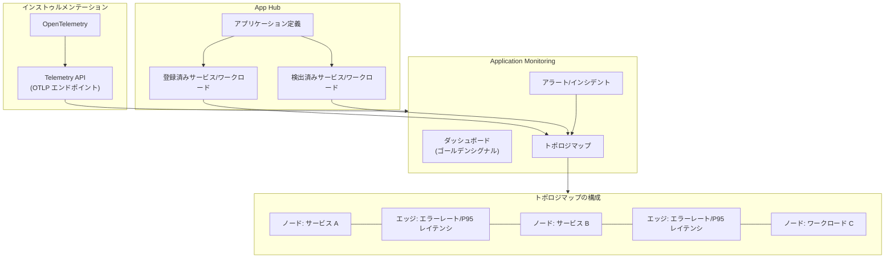

# Cloud Monitoring: Application Monitoring のトポロジマップ機能

**リリース日**: 2026-04-13

**サービス**: Cloud Monitoring

**機能**: Application Monitoring トポロジマップ

**ステータス**: Preview

[このアップデートのインフォグラフィックを見る](https://takech9203.github.io/google-cloud-news-summary/20260413-cloud-monitoring-application-topology.html)

## 概要

Cloud Monitoring の Application Monitoring に、App Hub アプリケーションのトポロジマップを動的に表示する新機能が追加されました。この機能により、アプリケーションに登録済み (Registered) および検出済み (Discovered) のサービスとワークロード間の関係性を、インタラクティブなマップ上で一目で把握できるようになります。

トポロジマップはノードとエッジで構成されており、ノードがサービスやワークロードを表し、エッジがそれらの間のトラフィックを表現します。マップ上でオープンなインシデントを持つサービスやワークロードを視覚的に特定でき、さらにサービス間のエラーレートや P95 レイテンシも確認できます。これにより、複雑なマイクロサービスアーキテクチャの監視とトラブルシューティングが大幅に効率化されます。

この機能は、アプリケーション中心のモニタリングを実現する Application Monitoring の一部として提供され、App Hub でアプリケーションを定義・登録しているユーザーが主な対象です。OpenTelemetry によるインストゥルメンテーションとトレースデータの送信が前提条件となります。

**アップデート前の課題**

- アプリケーションを構成するサービスやワークロード間の依存関係を視覚的に把握する手段がなく、個別のダッシュボードやメトリクスを個々に確認する必要があった
- インシデント発生時に影響範囲を特定するために、複数のサービスのアラートやメトリクスを個別に調査する必要があった
- サービス間のトラフィックフロー、エラーレート、レイテンシの関係性を一元的に確認できる統合ビューがなかった

**アップデート後の改善**

- 動的なトポロジマップにより、アプリケーション全体のサービスとワークロードの関係性を一目で可視化できるようになった
- オープンなインシデントを持つサービスやワークロードがマップ上で即座に特定できるようになった
- エッジを選択することで、サービス間のエラーレートと P95 レイテンシを直接確認できるようになった

## アーキテクチャ図



App Hub でアプリケーションを定義し、OpenTelemetry でインストゥルメンテーションされたトレースデータが Telemetry API 経由で送信されることで、Application Monitoring がトポロジマップを自動生成します。マップ上のノードはサービスやワークロードを、エッジはそれらの間のトラフィックとパフォーマンス指標を表現します。

## サービスアップデートの詳細

### 主要機能

1. **動的トポロジマップ表示**
   - App Hub アプリケーションに登録されたサービスとワークロードの関係性をノードとエッジで視覚化
   - ズームイン・ズームアウト、ノードの移動が可能なインタラクティブなマップ
   - 登録済み (Registered) と検出済み (Discovered) の両方のサービス・ワークロードを表示

2. **インシデントの視覚的特定**
   - オープンなインシデントを持つサービスやワークロードをマップ上で即座に識別
   - ノードを選択することでオープンなアラートや属性情報を確認可能
   - アプリケーション全体の健全性を直感的に把握

3. **サービス間パフォーマンス指標の表示**
   - エッジを選択することで、2 つのノード間のレイテンシとエラーレートを確認
   - P95 レイテンシにより、サービス間の通信遅延の実態を把握
   - エラーレートによりサービス間通信の品質を監視

## 技術仕様

### 前提条件と必要な API

| 項目 | 詳細 |
|------|------|
| ステータス | Preview (Pre-GA) |
| App Hub 設定 | ホストプロジェクトまたはマネジメントプロジェクトが必要 |
| インストゥルメンテーション | OpenTelemetry によるトレースデータ送信が必要 |
| トレースデータ送信先 | Telemetry API (OTLP エンドポイント) |
| 必要な API | Observability API, App Topology API, Cloud Trace API, Telemetry API |
| 必要な IAM ロール | App Topology viewer (`roles/apptopology.viewer`) |
| 必要な権限 | `apptopology.applicationTopologies.generate` |

### 有効化が必要な API

トポロジマップを利用するには、以下の API を有効化する必要があります。

```bash
# 必要な API の有効化
gcloud services enable \
  observability.googleapis.com \
  apptopology.googleapis.com \
  cloudtrace.googleapis.com \
  telemetry.googleapis.com \
  --project=PROJECT_ID
```

### VPC Service Controls に関する注意

VPC Service Controls で App Hub API、Observability API、Telemetry API、Cloud Logging API、または App Topology API を制限している場合、トポロジマップは生成されません。App-enabled folder を使用している場合、デフォルトの Service Usage Restriction ポリシーにより App Topology API がブロックされるため、Organization Policy Administrator ロールを持つ管理者が `apptopology.googleapis.com` をポリシーの許可リストに追加する必要があります。

## 設定方法

### 前提条件

1. App Hub でアプリケーション管理境界 (Application Management Boundary) を設定済みであること
2. アプリケーションとそのサービス・ワークロードが App Hub に登録済みであること
3. OpenTelemetry でアプリケーションがインストゥルメンテーションされ、トレースデータが Telemetry API に送信されていること
4. 必要な API (Observability, App Topology, Cloud Trace, Telemetry) が有効化されていること

### 手順

#### ステップ 1: 必要な API を有効化する

```bash
gcloud services enable \
  observability.googleapis.com \
  apptopology.googleapis.com \
  cloudtrace.googleapis.com \
  telemetry.googleapis.com \
  --project=PROJECT_ID
```

プロジェクトで必要な API を有効化します。トレーススコープに追加した他のプロジェクトについても、Observability API の有効化を推奨します。

#### ステップ 2: IAM 権限を付与する

```bash
gcloud projects add-iam-policy-binding PROJECT_ID \
  --member='user:USER_EMAIL' \
  --role='roles/apptopology.viewer'
```

トポロジマップを閲覧するユーザーに App Topology viewer ロールを付与します。

#### ステップ 3: トポロジマップを表示する

1. Google Cloud コンソールで Application monitoring ページに移動する
2. プロジェクトピッカーで App Hub のホストプロジェクトまたはマネジメントプロジェクトを選択する
3. アプリケーション一覧からアプリケーションを選択する
4. **Topology** タブをクリックする

トポロジマップが表示されます。ノードを選択するとオープンなアラートや属性が、エッジを選択するとレイテンシやエラーレートが確認できます。

## メリット

### ビジネス面

- **障害対応時間の短縮**: トポロジマップにより影響範囲を即座に把握でき、インシデント対応のMTTR (平均復旧時間) を短縮できる
- **アプリケーション運用の効率化**: 個別のリソース監視ではなくアプリケーション全体の視点で監視が可能になり、運用チームの負荷を軽減
- **サービス間依存関係の可視化**: ビジネス上重要なサービスの依存関係を視覚的に把握し、リスク管理やキャパシティプランニングに活用可能

### 技術面

- **インタラクティブなトラブルシューティング**: ズーム、ノード移動、詳細パネル表示などのインタラクティブ操作で効率的に調査が可能
- **ゴールデンシグナルの統合表示**: エラーレートと P95 レイテンシをトポロジマップ上でサービス間のコンテキストとともに確認できる
- **App Hub との統合**: アプリケーション定義に基づいた自動的なトポロジ生成により、手動でのサービスマップ管理が不要

## デメリット・制約事項

### 制限事項

- 現在 Preview (Pre-GA) ステータスであり、サポートが限定的で今後変更される可能性がある
- トレースデータに application-specific labels が必要であり、OpenTelemetry によるインストゥルメンテーションと Telemetry API へのデータ送信が前提条件
- VPC Service Controls で関連 API を制限している場合、トポロジマップは生成されない
- トポロジマップのトレースエッジは、App Hub プロジェクトと同じ組織内のトレーススコーププロジェクトからのデータのみ表示される

### 考慮すべき点

- App-enabled folder を使用している場合、デフォルトの Service Usage Restriction ポリシーにより App Topology API がブロックされるため、組織ポリシー管理者による許可リスト設定が必要
- 十分なトレースデータがない場合、トポロジマップに期待するデータが表示されない場合がある (トラブルシューティングのドキュメントを参照)
- OpenTelemetry Collector のデプロイと設定が必要であり、特に GKE 以外の環境では必要な属性を手動で設定する必要がある

## ユースケース

### ユースケース 1: マイクロサービスアーキテクチャの障害調査

**シナリオ**: 複数のマイクロサービスで構成されたアプリケーションで、エンドユーザーからレスポンス遅延の報告を受けた。

**実装例**:
1. Application Monitoring のトポロジマップを開く
2. オープンなインシデントを持つノード (サービス) を特定する
3. 問題のあるサービス間のエッジを選択し、P95 レイテンシとエラーレートを確認する
4. ボトルネックとなっているサービスを特定し、そのサービスのダッシュボードに遷移して詳細を調査する

**効果**: 従来は各サービスのダッシュボードを個別に確認する必要があったが、トポロジマップにより影響の連鎖を視覚的に追跡でき、原因特定までの時間を短縮できる

### ユースケース 2: アプリケーション全体の健全性監視

**シナリオ**: 新しいバージョンのサービスをデプロイした後、アプリケーション全体への影響を監視したい。

**効果**: トポロジマップでデプロイ対象サービスと関連サービス間のエラーレートとレイテンシの変化を即座に確認でき、デプロイによる意図しない影響を早期に検知できる

### ユースケース 3: サービス依存関係のドキュメント化と共有

**シナリオ**: 開発チーム間でアプリケーションのサービス依存関係を共有し、影響範囲の理解を統一したい。

**効果**: トポロジマップは App Hub のアプリケーション定義から自動生成されるため、常に最新のサービス依存関係を反映しており、手動でのアーキテクチャ図の更新が不要になる

## 料金

Application Monitoring のトポロジマップ機能自体の追加料金に関する具体的な情報は、公式ドキュメントで確認できませんでした。ただし、Cloud Monitoring の利用料金は Google Cloud Observability の料金体系に基づいて課金されます。

トポロジマップの生成にはトレースデータが必要であるため、以下のコストが関連します。

| 項目 | 詳細 |
|------|------|
| Cloud Monitoring メトリクス | システムメトリクスは無料、カスタムメトリクスはバイトまたはサンプル単位で課金 |
| Cloud Trace スパン | スパン取り込み量に基づいて課金 |
| 必要な API の有効化 | API 自体の有効化は無料 |

最新の料金情報は [Google Cloud Observability pricing](https://cloud.google.com/products/observability/pricing) を参照してください。

## 利用可能リージョン

トポロジマップは Application Monitoring の機能として、App Hub がサポートするリージョンで利用可能です。具体的なリージョン情報は [App Hub locations](https://docs.cloud.google.com/app-hub/docs/locations) を参照してください。なお、トレースエッジは App Hub プロジェクトと同じ組織内のトレーススコーププロジェクトからのデータのみ表示されます。

## 関連サービス・機能

- **[App Hub](https://docs.cloud.google.com/app-hub/docs/overview)**: アプリケーションの定義とリソースの登録・管理を行う基盤サービス。トポロジマップはApp Hub のアプリケーション定義に基づいて生成される
- **[Application Monitoring ダッシュボード](https://docs.cloud.google.com/monitoring/docs/application-monitoring)**: サービスやワークロードのテレメトリデータ (ログ、メトリクス、トレース) を表示する事前定義ダッシュボード
- **[Cloud Trace](https://docs.cloud.google.com/trace/docs/)**: トレースデータの収集・分析サービス。トポロジマップの生成に必要なトレースデータの基盤
- **[OpenTelemetry](https://docs.cloud.google.com/stackdriver/docs/instrumentation/opentelemetry-collector-gke)**: トレースデータのインストゥルメンテーションフレームワーク。Telemetry API へのデータ送信に使用
- **[Application Design Center](https://docs.cloud.google.com/application-design-center/docs/overview)**: アプリケーションテンプレートの設計とデプロイを支援するサービス。App Hub と統合
- **[Cloud Hub](https://docs.cloud.google.com/hub/docs/overview)**: デプロイメント障害、Google Cloud インシデント、クォータ情報などの追加的な健全性情報を提供

## 参考リンク

- [インフォグラフィック](https://takech9203.github.io/google-cloud-news-summary/20260413-cloud-monitoring-application-topology.html)
- [公式リリースノート](https://docs.cloud.google.com/release-notes#April_13_2026)
- [View application topology](https://docs.cloud.google.com/monitoring/docs/application-topology)
- [Application Monitoring overview](https://docs.cloud.google.com/monitoring/docs/about-application-monitoring)
- [View application telemetry](https://docs.cloud.google.com/monitoring/docs/application-monitoring)
- [Set up Application Monitoring](https://docs.cloud.google.com/monitoring/docs/setup-application-monitoring)
- [Application Monitoring supported infrastructure](https://docs.cloud.google.com/monitoring/docs/application-monitoring-services)
- [Instrument for Application Monitoring](https://docs.cloud.google.com/monitoring/docs/instrument-for-application-monitoring)
- [Google Cloud Observability pricing](https://cloud.google.com/products/observability/pricing)

## まとめ

Cloud Monitoring の Application Monitoring に追加されたトポロジマップ機能は、App Hub で定義されたアプリケーションのサービスとワークロード間の関係性を動的に可視化する強力なツールです。オープンなインシデントの特定、サービス間のエラーレートや P95 レイテンシの確認がインタラクティブなマップ上で可能になり、マイクロサービスアーキテクチャのトラブルシューティングと運用監視が大幅に効率化されます。現在 Preview ステータスですが、App Hub を活用してアプリケーションを管理しているチームは、OpenTelemetry によるインストゥルメンテーションの設定とともに、この機能の評価を開始することを推奨します。

---

**タグ**: #CloudMonitoring #ApplicationMonitoring #TopologyMap #AppHub #Observability #OpenTelemetry #Trace #マイクロサービス #トラブルシューティング #Preview
