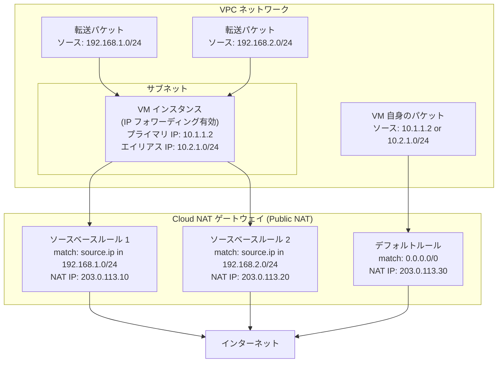

# Cloud NAT: ソースベース NAT ルール (IPv4) が一般提供 (GA) に

**リリース日**: 2026-04-13

**サービス**: Cloud NAT

**機能**: Public NAT ゲートウェイにおけるソースベース NAT ルール (IPv4)

**ステータス**: General Availability (GA)

[このアップデートのインフォグラフィックを見る](https://takech9203.github.io/google-cloud-news-summary/20260413-cloud-nat-source-based-nat-rules-ga.html)

## 概要

Cloud NAT の Public NAT ゲートウェイにおいて、IPv4 アドレスのソースベース NAT ルールが一般提供 (GA) となった。これまで Preview として提供されていたこの機能が正式にプロダクション環境での利用が推奨されるステータスに昇格し、SLA の対象となる。

ソースベース NAT ルールは、パケットのソース IP アドレスに基づいて NAT の動作を細かく制御する機能である。従来の Cloud NAT ではサブネット内の全トラフィックに対して同一の NAT IP アドレスセットが使用されていたが、ソースベースルールを利用することで、パケットの送信元 IP レンジに応じて異なる NAT IP アドレスを割り当てることが可能となる。特に IP フォワーディングが有効な VM インスタンスにおいて、転送パケットのソース IP に基づいた NAT 制御が実現できる。

主な対象ユーザーは、ネットワークエンジニア、クラウドアーキテクト、セキュリティ管理者であり、特にマルチテナント環境やサードパーティ接続でソース IP に基づく NAT IP の使い分けが必要なユースケースに適している。

**アップデート前の課題**

- Cloud NAT ゲートウェイでは、サブネット内の全 VM が同じ NAT IP アドレスセットを使用してインターネットにアクセスしており、ソース IP に基づいた NAT IP の使い分けができなかった
- IP フォワーディングが有効な VM から転送されるパケットに対して、デフォルトの NAT ルールが適用されず、転送パケットの NAT 処理には明示的なソースベースルールの作成が必要だった
- ソースベースルールは Preview ステータスであったため、SLA の適用対象外であり、プロダクション環境での利用に制約があった

**アップデート後の改善**

- ソースベース NAT ルールが GA となり、SLA が適用されるプロダクション対応の機能として利用可能になった
- パケットのソース IP アドレス範囲ごとに異なる NAT IP アドレスを割り当て、きめ細かなトラフィック制御が実現可能になった
- IP フォワーディングが有効な VM からの転送パケットに対して、送信元 IP レンジに基づく NAT IP マッピングを定義可能になった

## アーキテクチャ図



Cloud NAT ゲートウェイにおけるソースベース NAT ルールのトラフィックフローを示す。IP フォワーディングが有効な VM が受け取る転送パケットは、ソース IP レンジに応じて異なる NAT IP アドレスに変換され、VM 自身が発信するパケットはデフォルトルールで処理される。

## サービスアップデートの詳細

### 主要機能

1. **ソースベース NAT ルール (GA)**
   - パケットのソース IP アドレスに基づいて NAT 動作を制御するルール
   - IPv4 アドレスのみをサポート
   - Common Expression Language (CEL) 構文でルール条件を記述
   - ルール優先度 (0 ~ 65,000) により評価順序を制御

2. **IP フォワーディング対応**
   - IP フォワーディングが有効な VM インスタンスからの転送パケットに対して、ソース IP に基づく NAT IP の割り当てが可能
   - デフォルトルールは転送パケットには適用されないため、転送パケットの NAT にはソースベースルールの作成が必須

3. **優先度ベースのルール評価**
   - 各ルールに 0 (最高優先度) から 65,000 (最低優先度) の優先度を設定
   - デフォルトルールの優先度は 65001
   - パケットが複数ルールにマッチする場合は、最も高い優先度のルールが適用される

## 技術仕様

### ルール式言語 (CEL)

| 属性名 | 説明 |
|------|------|
| `source.ip` | パケットのソース IP アドレス |
| `destination.ip` | パケットの宛先 IP アドレス |

| 演算 | 説明 |
|------|------|
| `inIpRange(x, y)` | IP CIDR レンジ y が IP アドレス x を含む場合に true を返す |
| `\|\|` | 論理 OR 演算子 |
| `==` | 等価演算子 |

### NAT ルール仕様

| 項目 | 詳細 |
|------|------|
| サポート対象 | Public NAT ゲートウェイのみ |
| IP バージョン | IPv4 のみ |
| ルール数上限 | 150 ルール/ゲートウェイ、2,500 ルール/Cloud Router |
| ルール優先度 | 0 (最高) ~ 65,000 (最低) |
| デフォルトルール優先度 | 65001 |
| CEL 式の文字数上限 | 2,048 文字/ルール |
| IP 割り当てオプション | MANUAL_ONLY のみ (自動割り当ては不可) |
| Active IP アドレス上限 | 300/NAT ルール |
| EIM との併用 | 不可 (Endpoint-Independent Mapping が有効なゲートウェイではルール追加不可) |

### ソースベースルールの式の例

```
# 単一 IP アドレスのマッチ
"source.ip == '10.0.0.25'"

# 複数 IP アドレスの OR マッチ
"source.ip == '10.0.0.25' || source.ip == '10.0.0.26'"

# IP レンジのマッチ
"inIpRange(source.ip, '10.0.2.0/24')"

# IP アドレスと IP レンジの組み合わせ
"source.ip == '10.0.0.25' || inIpRange(source.ip, '10.0.2.0/24')"
```

## 設定方法

### 前提条件

1. Cloud NAT ゲートウェイが Public NAT として作成済みであること
2. NAT IP アドレスの割り当てが手動 (MANUAL_ONLY) に設定されていること
3. Endpoint-Independent Mapping (EIM) が無効であること
4. ソースベースルールに使用する外部 IP アドレスが予約済みであること

### 手順

#### ステップ 1: Cloud NAT ゲートウェイの作成 (未作成の場合)

```bash
# Cloud Router の作成
gcloud compute routers create my-router \
  --network=my-network \
  --region=us-central1

# Cloud NAT ゲートウェイの作成 (手動 IP 割り当て)
gcloud compute routers nats create my-nat-gateway \
  --router=my-router \
  --region=us-central1 \
  --nat-all-subnet-ip-ranges \
  --nat-external-ip-pool=NAT_IP_ADDRESS_3
```

#### ステップ 2: ソースベース NAT ルールの追加

```bash
# ルール 1: ソース IP レンジ 192.168.1.0/24 に対して NAT_IP_ADDRESS_1 を使用
gcloud compute routers nats rules create 100 \
  --nat=my-nat-gateway \
  --router=my-router \
  --region=us-central1 \
  --match="inIpRange(source.ip, '192.168.1.0/24')" \
  --source-nat-active-ips=NAT_IP_ADDRESS_1

# ルール 2: ソース IP レンジ 192.168.2.0/24 に対して NAT_IP_ADDRESS_2 を使用
gcloud compute routers nats rules create 200 \
  --nat=my-nat-gateway \
  --router=my-router \
  --region=us-central1 \
  --match="inIpRange(source.ip, '192.168.2.0/24')" \
  --source-nat-active-ips=NAT_IP_ADDRESS_2
```

ルール優先度 100 と 200 を設定し、ソース IP レンジに応じて異なる NAT IP アドレスを割り当てる。これらのルールにマッチしない VM 自身のトラフィックは、デフォルトルールの NAT IP アドレス (NAT_IP_ADDRESS_3) で処理される。

#### ステップ 3: Google Cloud コンソールでの設定

1. Google Cloud コンソールで **Cloud NAT** ページに移動
2. 対象の NAT ゲートウェイをクリック
3. **Edit** をクリック
4. **Cloud NAT IP addresses** で **Manual** を選択
5. **Cloud NAT Rules** セクションで **Add a rule** をクリック
6. **Rule priority** にルール優先度 (例: 100) を入力
7. **Match IP ranges** で **Source** を選択
8. **Source IP ranges** にソース IP レンジを入力 (例: 192.168.1.0/24)
9. **IP addresses** で使用する NAT IP アドレスを選択
10. **Done** をクリックし、**Save** をクリック

## メリット

### ビジネス面

- **マルチテナント対応**: テナントごとに異なる NAT IP アドレスを割り当てることで、テナント間のトラフィック分離と識別が可能になる
- **SLA による安心感**: GA となったことで SLA が適用され、プロダクション環境での利用が正式にサポートされる
- **コンプライアンス対応**: 特定のソース IP レンジからのトラフィックに専用の外部 IP を割り当てることで、外部サービスのホワイトリスト要件への対応が容易になる

### 技術面

- **きめ細かな NAT 制御**: ソース IP に基づいて NAT IP を使い分けることで、ネットワークポリシーの柔軟性が向上する
- **IP フォワーディング環境のサポート**: ネットワーク仮想アプライアンスや SD-WAN ゲートウェイなど、IP フォワーディングを使用する環境で転送パケットの NAT 制御が可能
- **CEL による柔軟な条件定義**: Common Expression Language を使用した直感的なルール式で、複雑なマッチ条件も記述可能

## デメリット・制約事項

### 制限事項

- ソースベースルールは IPv4 アドレスのみサポートしており、IPv6 には対応していない
- NAT IP アドレスの割り当ては手動 (MANUAL_ONLY) でなければならず、自動割り当ては利用不可
- Endpoint-Independent Mapping (EIM) が有効なゲートウェイでは NAT ルールを追加できない
- ソースベースとデスティネーションベースの条件を 1 つの NAT ルール内で組み合わせることはできない
- IP CIDR レンジはルール間で重複不可であり、1 つのパケットに対して最大 1 つのルールのみが適用される
- デフォルトルールは転送パケットには適用されないため、転送パケットに NAT を適用する場合は明示的にソースベースルールを作成する必要がある

### 考慮すべき点

- 各 NAT ルールに対して VM ごとに最小ポート数が割り当てられるため、ルール数と IP アドレス数のバランスに注意が必要。ルールの IP アドレスが不足するとポート割り当てができずトラフィックがドロップされる
- 同一ルール内で Premium Tier と Standard Tier の IP アドレスを混在させることはできない
- 0.0.0.0/0 をソースまたはデスティネーションレンジとするルールは作成不可 (デフォルトルールで使用済み)
- ルールの Active IP アドレスが空の場合、そのルールにマッチする新規接続はドロップされる

## ユースケース

### ユースケース 1: ネットワーク仮想アプライアンスからの転送トラフィックの NAT 制御

**シナリオ**: SD-WAN ゲートウェイとして動作する VM インスタンス (IP フォワーディング有効) が、複数の拠点からの転送トラフィックを処理している。拠点ごとに異なる NAT IP アドレスを使用して、外部サービスのアクセス制御リスト (ACL) 要件に対応する。

**実装例**:
```bash
# 拠点 A (192.168.1.0/24) のトラフィックに NAT IP 1 を割り当て
gcloud compute routers nats rules create 100 \
  --nat=sdwan-nat \
  --router=sdwan-router \
  --region=us-central1 \
  --match="inIpRange(source.ip, '192.168.1.0/24')" \
  --source-nat-active-ips=SITE_A_NAT_IP

# 拠点 B (192.168.2.0/24) のトラフィックに NAT IP 2 を割り当て
gcloud compute routers nats rules create 200 \
  --nat=sdwan-nat \
  --router=sdwan-router \
  --region=us-central1 \
  --match="inIpRange(source.ip, '192.168.2.0/24')" \
  --source-nat-active-ips=SITE_B_NAT_IP
```

**効果**: 拠点ごとに固定の外部 IP アドレスが割り当てられるため、外部 SaaS サービスの IP ホワイトリスト設定が容易になり、トラフィックの送信元拠点の識別が可能になる。

### ユースケース 2: Cloud WAN 連携でのサードパーティサービス接続

**シナリオ**: Cloud WAN を利用して複数のネットワークセグメントからサードパーティサービスに接続する際、セグメントごとに異なる NAT IP を割り当てて通信を制御する。

**効果**: サードパーティサービス側で送信元 IP に基づくアクセス制御が可能となり、セキュリティ要件を満たしつつ柔軟なネットワーク構成を実現できる。

## 料金

Cloud NAT の料金は、ゲートウェイ使用料金とデータ処理料金で構成される。ソースベース NAT ルールの利用による追加料金は公式ドキュメントでは明記されていない。最新の料金情報は公式料金ページを参照されたい。

- [Cloud NAT 料金ページ](https://cloud.google.com/nat/pricing)

## 利用可能リージョン

Cloud NAT は、Cloud Router が利用可能な全ての Google Cloud リージョンで使用できる。ソースベース NAT ルールも同様に、Cloud NAT が提供されている全リージョンで利用可能である。

## 関連サービス・機能

- **Cloud Router**: Cloud NAT ゲートウェイは Cloud Router に関連付けられる。Cloud Router は NAT 構成情報のグループ化に使用され、BGP ルーティングやトラフィック転送には関与しない
- **VPC ネットワーク**: Cloud NAT は VPC ネットワーク内のサブネットに対して NAT サービスを提供する。ソースベースルールは VPC 内の IP フォワーディング対応 VM と組み合わせて使用される
- **Cloud WAN**: Cloud WAN のネットワーキング機能とソースベース NAT ルールを組み合わせることで、サードパーティサービスへの差別化されたネットワーク接続が可能
- **デスティネーションベース NAT ルール**: ソースベースと対をなすルールタイプ。宛先 IP アドレスに基づいて NAT IP を使い分ける機能で、Cloud NAT ルールの一部として提供されている

## 参考リンク

- [インフォグラフィック](https://takech9203.github.io/google-cloud-news-summary/20260413-cloud-nat-source-based-nat-rules-ga.html)
- [公式リリースノート](https://docs.cloud.google.com/release-notes#April_13_2026)
- [Cloud NAT ルール概要 (NAT rules overview)](https://docs.cloud.google.com/nat/docs/nat-rules-overview)
- [Cloud NAT ルールの設定と管理 (Using NAT rules)](https://docs.cloud.google.com/nat/docs/using-nat-rules)
- [Cloud NAT の設定と管理](https://docs.cloud.google.com/nat/docs/set-up-manage-network-address-translation)
- [Cloud NAT 料金](https://cloud.google.com/nat/pricing)
- [Cloud NAT のクォータと制限](https://docs.cloud.google.com/nat/quota)

## まとめ

Cloud NAT の Public NAT ゲートウェイにおけるソースベース NAT ルール (IPv4) が GA となり、プロダクション環境での利用が正式にサポートされた。この機能により、パケットのソース IP アドレスに基づいて NAT IP アドレスを使い分ける細かなトラフィック制御が可能となり、特に IP フォワーディングを利用するネットワーク仮想アプライアンスや SD-WAN 環境での活用が期待される。IP フォワーディングを利用した転送パケットの NAT 制御が必要な環境では、ソースベースルールの導入を検討することを推奨する。

---

**タグ**: #CloudNAT #PublicNAT #NATRules #SourceBasedNAT #Networking #GoogleCloud #GA
