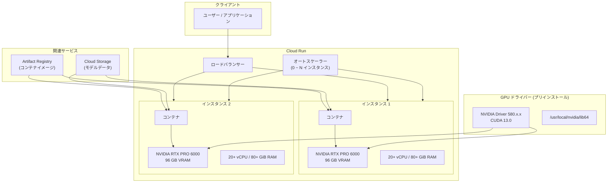

# Cloud Run: NVIDIA RTX PRO 6000 Blackwell GPU の一般提供 (GA)

**リリース日**: 2026-04-13

**サービス**: Cloud Run

**機能**: NVIDIA RTX PRO 6000 Blackwell GPU サポートの一般提供 (GA)

**ステータス**: GA (General Availability)

[このアップデートのインフォグラフィックを見る](https://takech9203.github.io/google-cloud-news-summary/20260413-cloud-run-nvidia-rtx-pro-6000-gpu-ga.html)

## 概要

Cloud Run において NVIDIA RTX PRO 6000 Blackwell GPU のサポートが一般提供 (GA) となりました。この GPU は 96 GB の VRAM (GPU メモリ) を搭載しており、既存の NVIDIA L4 GPU (24 GB VRAM) と比較して 4 倍のメモリ容量を提供します。Cloud Run のサービス、ジョブ、ワーカープールの全リソースタイプで利用可能です。

NVIDIA RTX PRO 6000 Blackwell GPU は、NVIDIA ドライバーバージョン 580.x.x (CUDA 13.0) がプリインストールされた状態で提供され、約 5 秒でインスタンスが起動します。ドライバーやライブラリの手動インストールは不要で、フルマネージドな GPU 環境を即座に利用開始できます。予約なしのオンデマンド利用が可能で、Cloud Run サービスではゼロスケールにも対応しているため、使用していない間のコストを削減できます。

このアップデートは、大規模言語モデル (LLM) の推論やバッチ処理、動画トランスコーディング、3D レンダリングなど、大容量の GPU メモリを必要とする AI/ML ワークロードを Cloud Run 上で実行したい開発者やデータサイエンティストにとって重要な進展です。

**アップデート前の課題**

- Cloud Run で利用可能な GPU は NVIDIA L4 (24 GB VRAM) のみであり、大規模な LLM や大量のコンテキストウィンドウを必要とするモデルの推論には VRAM が不足していた
- 96 GB クラスの GPU メモリが必要なワークロードでは、GKE や Compute Engine など他のコンピューティングサービスを使用する必要があり、Cloud Run のサーバーレスなスケーリングの恩恵を受けられなかった
- NVIDIA RTX PRO 6000 Blackwell GPU は Preview 段階であり、本番環境での利用には SLA やサポートの面で制約があった

**アップデート後の改善**

- 96 GB VRAM を搭載した NVIDIA RTX PRO 6000 Blackwell GPU が GA となり、本番ワークロードでの利用が正式にサポートされた
- SLA の適用対象となり、ゾーン冗長性オプションによる高可用性構成も利用可能になった
- Cloud Run のサーバーレスな自動スケーリング (ゼロスケール含む) と大容量 GPU メモリを組み合わせた柔軟なワークロード実行が可能になった

## アーキテクチャ図



Cloud Run はリクエストに応じてインスタンスを自動スケーリングし、各インスタンスには 1 基の NVIDIA RTX PRO 6000 Blackwell GPU がアタッチされます。GPU ドライバーはプリインストールされており、コンテナ内のアプリケーションからすぐに GPU を利用できます。

## サービスアップデートの詳細

### 主要機能

1. **96 GB VRAM の大容量 GPU メモリ**
   - NVIDIA RTX PRO 6000 Blackwell GPU は 96 GB の GPU メモリ (VRAM) を搭載
   - インスタンスメモリとは別に確保され、GPU 専用のメモリとして利用可能
   - 大規模な LLM (70B+ パラメータモデル) や大量のバッチ推論に対応

2. **フルマネージドな GPU 環境**
   - NVIDIA ドライバーバージョン 580.x.x (CUDA 13.0) がプリインストール
   - ドライバーライブラリは `/usr/local/nvidia/lib64` に自動マウントされ、`LD_LIBRARY_PATH` に自動追加
   - 追加のドライバーインストールやライブラリ設定は不要

3. **オンデマンド利用とゼロスケール**
   - 予約なしのオンデマンド利用が可能
   - Cloud Run サービスではゼロインスタンスまでスケールダウンし、コストを最適化
   - 約 5 秒でインスタンスが起動し、GPU が利用可能な状態に

4. **ゾーン冗長性オプション**
   - デフォルトでゾーン冗長性が有効 (複数ゾーンに GPU 容量を予約し、障害時の可用性を向上)
   - ゾーン冗長性をオフにすることで、GPU 秒あたりのコストを削減可能 (ベストエフォートでのフェイルオーバー)

5. **全リソースタイプ対応**
   - Cloud Run サービス: HTTP リクエストベースの AI 推論 API に最適
   - Cloud Run ジョブ: バッチ推論、モデルトレーニング、動画処理などのバックグラウンドタスクに最適
   - Cloud Run ワーカープール: 長時間実行ワークロードに最適

## 技術仕様

### GPU タイプ比較

| 項目 | NVIDIA L4 | NVIDIA RTX PRO 6000 Blackwell |
|------|-----------|-------------------------------|
| GPU メモリ (VRAM) | 24 GB | 96 GB |
| NVIDIA ドライバー | 535.x.x (CUDA 12.2) | 580.x.x (CUDA 13.0) |
| 最小 CPU 要件 | 4 vCPU | 20 vCPU |
| 最小メモリ要件 | 16 GiB | 80 GiB |
| GPU タイプ指定値 | `nvidia-l4` | `nvidia-rtx-pro-6000` |
| インスタンスあたりの GPU 数 | 1 | 1 |
| 起動時間 | 約 5 秒 | 約 5 秒 |

### 初期クォータ

| 項目 | 詳細 |
|------|------|
| 自動付与クォータ | 3,000 milliGPU (3 GPU 相当) / リージョン / プロジェクト |
| クォータ単位 | milliGPU |
| ゾーン冗長性 | オフ (自動付与時) |
| 追加クォータ | Google Cloud コンソールから申請可能 |

### gcloud CLI でのデプロイ例

```bash
# NVIDIA RTX PRO 6000 Blackwell GPU を使用したサービスのデプロイ
gcloud run deploy my-gpu-service \
  --image us-docker.pkg.dev/my-project/my-repo/my-image:latest \
  --gpu 1 \
  --gpu-type nvidia-rtx-pro-6000 \
  --cpu 20 \
  --memory 80Gi \
  --no-cpu-throttling \
  --max-instances 3 \
  --region us-central1
```

### YAML 設定例

```yaml
apiVersion: serving.knative.dev/v1
kind: Service
metadata:
  name: my-gpu-service
spec:
  template:
    metadata:
      annotations:
        autoscaling.knative.dev/maxScale: '3'
        run.googleapis.com/cpu-throttling: 'false'
        run.googleapis.com/gpu-zonal-redundancy-disabled: 'false'
    spec:
      containers:
        - image: us-docker.pkg.dev/my-project/my-repo/my-image:latest
          ports:
            - containerPort: 8080
              name: http1
          resources:
            limits:
              cpu: '20'
              memory: '80Gi'
              nvidia.com/gpu: '1'
          startupProbe:
            failureThreshold: 1800
            periodSeconds: 1
            tcpSocket:
              port: 8080
            timeoutSeconds: 1
      nodeSelector:
        run.googleapis.com/accelerator: nvidia-rtx-pro-6000
```

## 設定方法

### 前提条件

1. Cloud Run API が有効化されていること
2. `roles/run.developer` ロールが付与されていること (Cloud Run サービス/ジョブの管理)
3. `roles/iam.serviceAccountUser` ロールが付与されていること (サービスアイデンティティ)
4. 対象リージョンで NVIDIA RTX PRO 6000 GPU クォータが利用可能であること

### 手順

#### ステップ 1: Cloud Run API の有効化

```bash
gcloud services enable run.googleapis.com
```

Cloud Run API が未有効の場合は、上記コマンドで有効化します。

#### ステップ 2: GPU 付きサービスのデプロイ

```bash
gcloud run deploy my-llm-service \
  --image us-docker.pkg.dev/my-project/my-repo/llm-server:latest \
  --gpu 1 \
  --gpu-type nvidia-rtx-pro-6000 \
  --cpu 20 \
  --memory 80Gi \
  --no-cpu-throttling \
  --region us-central1 \
  --max-instances 5 \
  --gpu-zonal-redundancy
```

`--gpu-type nvidia-rtx-pro-6000` で NVIDIA RTX PRO 6000 Blackwell GPU を指定します。最小で 20 vCPU と 80 GiB メモリが必要です。

#### ステップ 3: GPU 付きジョブの作成

```bash
gcloud run jobs create my-batch-job \
  --image us-docker.pkg.dev/my-project/my-repo/batch-inference:latest \
  --gpu 1 \
  --gpu-type nvidia-rtx-pro-6000 \
  --cpu 20 \
  --memory 80Gi \
  --region us-central1 \
  --tasks 10 \
  --max-retries 3
```

ジョブとして作成する場合は `gcloud run jobs create` を使用します。バッチ推論やトレーニングなどのバックグラウンドタスクに適しています。

#### ステップ 4: デプロイ状態の確認

```bash
gcloud run services describe my-llm-service --region us-central1
```

GPU 設定がサービスに正しく適用されていることを確認します。

## メリット

### ビジネス面

- **大規模 AI モデルのサーバーレス運用**: 96 GB VRAM により、70B+ パラメータの大規模 LLM を Cloud Run 上でサーバーレスに運用でき、インフラ管理コストを削減
- **コスト最適化**: ゼロスケール対応によりリクエストがない時間帯のコストを排除でき、従来の VM ベースの GPU 環境と比較して大幅なコスト削減が可能
- **迅速な市場投入**: 約 5 秒のインスタンス起動とフルマネージドな GPU 環境により、AI サービスのプロトタイプから本番運用までのリードタイムを短縮

### 技術面

- **大容量 VRAM**: 96 GB の VRAM により、量子化なしの大規模モデルや、長いコンテキストウィンドウを持つモデルの推論が可能
- **最新の CUDA 対応**: CUDA 13.0 環境がプリインストールされており、最新の AI/ML フレームワークとの互換性を確保
- **シンプルな運用**: ドライバー管理、スケーリング、ヘルスチェックが全て Cloud Run により自動管理され、運用負荷を最小化
- **柔軟なデプロイ形態**: サービス (HTTP API)、ジョブ (バッチ処理)、ワーカープール (長時間実行) の 3 つのリソースタイプで GPU を利用可能

## デメリット・制約事項

### 制限事項

- インスタンスあたり 1 基の GPU のみ設定可能 (マルチ GPU 構成は不可)
- 最低 20 vCPU と 80 GiB メモリが必要であり、L4 GPU (最低 4 vCPU / 16 GiB) と比較してリソース要件が大きい
- サイドカーコンテナを使用する場合、GPU はひとつのコンテナにのみアタッチ可能
- インスタンスベース課金が必須であり、リクエストベース課金は利用不可
- 最小インスタンスを設定した場合、アイドル状態でもフルレートで課金される

### 考慮すべき点

- GPU クォータはリージョンごと、プロジェクトごとに制限されており、大規模な運用では事前にクォータ増加申請が必要
- ゾーン冗長性をオフにした場合、ゾーン障害時のフェイルオーバーはベストエフォートとなり、GPU 容量の可用性に依存する
- CUDA 12.2 より新しいバージョンを使用する場合、NVIDIA Forward Compatibility パッケージのインストールまたは対応するベースイメージの使用が必要

## ユースケース

### ユースケース 1: 大規模 LLM 推論 API

**シナリオ**: 70B パラメータクラスの大規模言語モデル (例: Llama 3 70B) を Cloud Run 上でホストし、REST API として社内外に提供する。モデルの重みを量子化なしでフル精度でロードし、高品質な推論結果を返す。

**実装例**:
```bash
# vLLM を使用した LLM 推論サービスのデプロイ
gcloud run deploy llm-api \
  --image us-docker.pkg.dev/my-project/my-repo/vllm-server:latest \
  --gpu 1 \
  --gpu-type nvidia-rtx-pro-6000 \
  --cpu 20 \
  --memory 80Gi \
  --no-cpu-throttling \
  --region us-central1 \
  --max-instances 10 \
  --concurrency 50
```

**効果**: 96 GB VRAM により 70B パラメータモデルをフル精度でロード可能。ゼロスケールによりトラフィックが少ない時間帯のコストを排除し、ピーク時には最大 10 インスタンスまで自動スケール。

### ユースケース 2: バッチ動画トランスコーディング

**シナリオ**: 大量の動画ファイルを Cloud Run ジョブで GPU アクセラレーション付きのトランスコーディング処理を行う。NVIDIA のハードウェアエンコーダー/デコーダーを活用して処理を高速化する。

**実装例**:
```bash
# GPU バッチジョブの作成と実行
gcloud run jobs create video-transcode \
  --image us-docker.pkg.dev/my-project/my-repo/ffmpeg-gpu:latest \
  --gpu 1 \
  --gpu-type nvidia-rtx-pro-6000 \
  --cpu 20 \
  --memory 80Gi \
  --region us-central1 \
  --tasks 100 \
  --parallelism 10

gcloud run jobs execute video-transcode
```

**効果**: GPU アクセラレーションにより CPU のみの場合と比較して大幅な処理速度向上を実現。Cloud Run ジョブの並列実行機能により、大量の動画を効率的に処理。

### ユースケース 3: マルチモーダル AI サービス

**シナリオ**: 画像認識、自然言語処理、音声処理を組み合わせたマルチモーダル AI サービスを Cloud Run ワーカープールとして長時間稼働させる。

**効果**: 96 GB VRAM により、複数のモデルを同時にメモリにロードし、マルチモーダルなパイプラインを単一の GPU インスタンスで実行可能。ワーカープールにより長時間実行タスクを安定して処理。

## 料金

Cloud Run GPU の料金はインスタンスベース課金で、GPU はインスタンスのライフサイクル全体にわたって課金されます。ゾーン冗長性のオン/オフにより GPU 秒あたりのコストが異なります。最新の料金は [Cloud Run pricing](https://cloud.google.com/run/pricing) を参照してください。

### 料金に関する注意事項

| 項目 | 詳細 |
|--------|-----------------|
| 課金モデル | インスタンスベース課金 (必須) |
| GPU 課金単位 | GPU 秒 |
| ゾーン冗長性オン | GPU 秒あたり高コスト (高可用性) |
| ゾーン冗長性オフ | GPU 秒あたり低コスト (ベストエフォートフェイルオーバー) |
| 最小インスタンス課金 | アイドル時もフルレートで課金 |
| CPU / メモリ | GPU 料金に加えて vCPU 秒、GiB 秒で別途課金 |

詳細な料金情報は [Cloud Run の料金ページ](https://cloud.google.com/run/pricing) を参照してください。

## 利用可能リージョン

NVIDIA RTX PRO 6000 Blackwell GPU は以下のリージョンで利用可能です。

| リージョン | ロケーション | 備考 |
|-----------|------------|------|
| us-central1 | Iowa, USA | Low CO2 |
| europe-west4 | Netherlands | Low CO2 |
| asia-southeast1 | Singapore | - |
| asia-south2 | Delhi, India | 招待制 (Google アカウントチームへの問い合わせが必要) |

## 関連サービス・機能

- **Cloud Run サービス**: HTTP リクエストベースのワークロード向け。ゼロスケール対応で AI 推論 API に最適
- **Cloud Run ジョブ**: バッチ処理向け。LLM トレーニング、バッチ推論、動画処理などに利用
- **Cloud Run ワーカープール**: 長時間実行ワークロード向け。継続的な処理タスクに対応 (Preview)
- **Artifact Registry**: GPU 対応コンテナイメージの格納と管理
- **Cloud Monitoring**: GPU 利用率、メモリ使用量、インスタンス数などのメトリクス監視
- **NVIDIA L4 GPU (Cloud Run)**: 24 GB VRAM の GPU オプション。より小規模なモデルやコスト重視のワークロードに適合

## 参考リンク

- [インフォグラフィック](https://takech9203.github.io/google-cloud-news-summary/20260413-cloud-run-nvidia-rtx-pro-6000-gpu-ga.html)
- [公式リリースノート](https://cloud.google.com/release-notes#April_13_2026)
- [Cloud Run サービスの GPU 設定](https://cloud.google.com/run/docs/configuring/services/gpu)
- [Cloud Run ジョブの GPU 設定](https://cloud.google.com/run/docs/configuring/jobs/gpu)
- [Cloud Run ワーカープールの GPU 設定](https://cloud.google.com/run/docs/configuring/workerpools/gpu)
- [Cloud Run の料金](https://cloud.google.com/run/pricing)
- [Cloud Run GPU でのAI 推論](https://cloud.google.com/run/docs/ai/inference)

## まとめ

NVIDIA RTX PRO 6000 Blackwell GPU の GA により、Cloud Run は 96 GB VRAM を活用した大規模 AI ワークロードのサーバーレス実行に対応しました。70B+ パラメータの大規模 LLM 推論や高負荷な動画処理など、これまで VM ベースの環境が必要だったユースケースを Cloud Run のフルマネージド環境で実行できるようになります。大容量 GPU メモリを必要とするワークロードをお持ちの場合は、対象リージョンでの利用を検討し、まず GPU クォータの確認と必要に応じたクォータ増加申請を行うことを推奨します。

---

**タグ**: #CloudRun #GPU #NVIDIA #RTX_PRO_6000 #Blackwell #AI #ML #LLM #推論 #サーバーレス #GA
