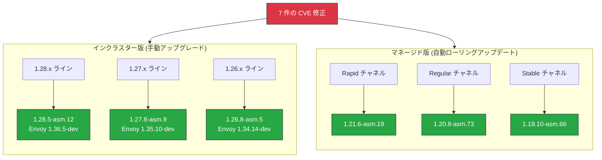

# Cloud Service Mesh: セキュリティパッチリリース (1.28.5-asm.12, 1.27.8-asm.9, 1.26.8-asm.5 / マネージド ローリングアップデート)

**リリース日**: 2026-04-13

**サービス**: Cloud Service Mesh

**機能**: セキュリティパッチ (CVE 修正 - Critical 1 件、High 1 件、Medium 4 件、Low 1 件)

**ステータス**: Security / Announcement

[このアップデートのインフォグラフィックを見る](https://takech9203.github.io/google-cloud-news-summary/20260413-cloud-service-mesh-security-patches-april.html)

## 概要

Google Cloud は Cloud Service Mesh のインクラスター版およびマネージド版に対して、複数のセキュリティパッチをリリースしました。今回のパッチでは、Critical (9.1) から Low (3.4) まで合計 7 件の CVE が修正されています。特に CVE-2026-33186 は CVSS スコア 9.1 の Critical 脆弱性であり、早急な対応が推奨されます。

インクラスター版では 3 つのメジャーバージョンライン (1.28.x、1.27.x、1.26.x) それぞれに対してパッチが提供されています。マネージド版では Rapid、Regular、Stable の全 3 チャネルにローリングアップデートが展開されます。これにより、インクラスター・マネージド両方の Cloud Service Mesh 利用者が脆弱性から保護されます。

**アップデート前の課題**

- 複数の CVE により、RBAC バイパス、クラッシュ、情報漏洩などのセキュリティリスクが存在していた
- CVE-2026-33186 (Critical 9.1) は特に深刻度が高く、リモートからの攻撃に悪用される可能性があった
- Envoy プロキシの脆弱性が未修正のままであったため、サービスメッシュを介した通信の安全性が保証できなかった

**アップデート後の改善**

- Critical を含む 7 件の CVE が修正され、サービスメッシュ全体のセキュリティが大幅に向上
- インクラスター版・マネージド版の両方でパッチが提供され、全デプロイメントモデルで一貫したセキュリティレベルを実現
- 最新の Envoy バージョンにアップデートされ、プロキシレイヤーでの脆弱性リスクが低減

## アーキテクチャ図



Cloud Service Mesh のインクラスター版とマネージド版の両方に対して CVE 修正パッチが提供されます。インクラスター版は手動でのアップグレードが必要であり、マネージド版は Google によって自動的にローリングアップデートが適用されます。

## サービスアップデートの詳細

### 主要機能

1. **インクラスター版セキュリティパッチ**
   - 3 つのバージョンライン (1.28.x、1.27.x、1.26.x) に対するパッチを同時リリース
   - 各バージョンラインで対応する Envoy プロキシも最新の開発版に更新
   - v1.25 以前のバージョンはサポート終了 (EOL) のため、バックポートなし

2. **マネージド版ローリングアップデート**
   - Rapid (1.21.6-asm.19)、Regular (1.20.8-asm.73)、Stable (1.19.10-asm.66) の全チャネルにパッチを展開
   - マネージド版はコントロールプレーンおよびデータプレーンが自動的にアップグレード
   - 段階的にロールアウトされるため、既存ワークロードへの影響を最小化

3. **7 件の CVE 修正**
   - Critical から Low まで幅広い深刻度の脆弱性を一括修正
   - Envoy プロキシおよび Istio コントロールプレーンの両方に影響する脆弱性を網羅

## 技術仕様

### CVE 一覧

| CVE ID | 深刻度 | CVSS スコア | 概要 |
|--------|--------|-------------|------|
| CVE-2026-33186 | Critical | 9.1 | 重大なセキュリティ脆弱性 |
| CVE-2026-3731 | High | 7.5 | 高深刻度の脆弱性 |
| CVE-2026-3784 | Medium | 6.5 | 中程度の脆弱性 |
| CVE-2026-1965 | Medium | 6.5 | 中程度の脆弱性 |
| CVE-2026-29111 | Medium | 5.5 | 中程度の脆弱性 |
| CVE-2026-3783 | Medium | 5.3 | 中程度の脆弱性 |
| CVE-2025-0167 | Low | 3.4 | 低深刻度の脆弱性 |

### インクラスター版バージョン詳細

| バージョンライン | パッチバージョン | Envoy バージョン |
|------------------|------------------|------------------|
| 1.28.x | 1.28.5-asm.12 | Envoy 1.36.5-dev |
| 1.27.x | 1.27.8-asm.9 | Envoy 1.35.10-dev |
| 1.26.x | 1.26.8-asm.5 | Envoy 1.34.14-dev |

### マネージド版バージョン詳細

| リリースチャネル | パッチバージョン | 推奨環境 |
|------------------|------------------|----------|
| Rapid | 1.21.6-asm.19 | テスト / 開発 / カナリア |
| Regular | 1.20.8-asm.73 | 本番環境 (標準) |
| Stable | 1.19.10-asm.66 | 本番環境 (安定性重視) |

## 設定方法

### 前提条件

1. 現在使用中の Cloud Service Mesh のバージョンとデプロイメントモデル (インクラスター / マネージド) を確認
2. `gcloud` CLI が最新バージョンにアップデートされていること
3. クラスタに対する適切な IAM 権限を保持していること

### 手順

#### ステップ 1: 現在のバージョンを確認

```bash
# インクラスター版の場合: istiod のバージョンを確認
kubectl get pods -n istio-system -l app=istiod -o jsonpath='{.items[*].spec.containers[*].image}'

# マネージド版の場合: コントロールプレーンのリビジョンを確認
kubectl get controlplanerevision -n istio-system
```

#### ステップ 2: インクラスター版のアップグレード

```bash
# asmcli を使用してアップグレード (例: 1.28.5-asm.12 へ)
./asmcli install \
  --project_id PROJECT_ID \
  --cluster_name CLUSTER_NAME \
  --cluster_location CLUSTER_LOCATION \
  --fleet_id FLEET_PROJECT_ID \
  --output_dir OUTPUT_DIR \
  --enable_all
```

公式のアップグレードガイドに従い、カナリアアップグレード方式を推奨します。

#### ステップ 3: マネージド版の場合

マネージド版を使用している場合、Google が自動的にローリングアップデートを適用します。追加の操作は不要ですが、以下のコマンドでロールアウト状況を確認できます。

```bash
# マネージド版のコントロールプレーンステータスを確認
kubectl get controlplanerevision -n istio-system -o yaml
```

#### ステップ 4: サイドカープロキシの再起動

```bash
# 名前空間内のワークロードをローリングリスタートしてサイドカープロキシを更新
kubectl rollout restart deployment -n NAMESPACE
```

## メリット

### ビジネス面

- **セキュリティコンプライアンスの維持**: Critical レベルの脆弱性を含む 7 件の CVE 修正により、規制要件やセキュリティ監査への対応が容易に
- **ダウンタイムの最小化**: マネージド版の自動ローリングアップデートにより、運用チームの作業負荷を削減しながらセキュリティを確保

### 技術面

- **多層的な脆弱性修正**: Envoy プロキシ層と Istio コントロールプレーン層の両方で脆弱性が修正され、サービスメッシュ全体の安全性が向上
- **複数バージョンラインのサポート**: 3 つのメジャーバージョンラインに対して同時にパッチが提供されるため、即座のメジャーバージョンアップグレードなしにセキュリティを確保可能
- **Envoy プロキシの更新**: 各バージョンラインで最新の Envoy ビルドが含まれ、プロキシレイヤーでの脆弱性も解消

## デメリット・制約事項

### 制限事項

- Cloud Service Mesh v1.25 以前のバージョンはサポート終了 (EOL) であり、今回の CVE 修正はバックポートされない
- インクラスター版では手動でのアップグレード作業が必要であり、大規模クラスタでは計画的なメンテナンスウィンドウが必要

### 考慮すべき点

- サイドカープロキシの更新にはワークロードのローリングリスタートが必要であり、一時的にリクエスト処理能力が低下する可能性がある
- マネージド版のローリングアップデートは段階的に適用されるため、全チャネルへの展開完了まで数週間かかる場合がある
- カナリアアップグレード方式の場合、一時的に複数バージョンのコントロールプレーンが共存するため、リソース使用量が増加する

## 関連サービス・機能

- **Google Kubernetes Engine (GKE)**: Cloud Service Mesh のデプロイ先として、GKE クラスタのリリースチャネルとマネージド版のチャネルが連動
- **Cloud Service Mesh セキュリティ情報**: 過去のセキュリティパッチ (GCP-2026-013 など) と同様のプロセスで提供
- **Envoy Proxy**: Cloud Service Mesh のデータプレーンとして動作し、今回のパッチで各バージョンラインの Envoy が更新
- **Istio**: Cloud Service Mesh の基盤技術であり、上流の Istio プロジェクトで発見された脆弱性の修正も含まれる

## 参考リンク

- [インフォグラフィック](https://takech9203.github.io/google-cloud-news-summary/20260413-cloud-service-mesh-security-patches-april.html)
- [公式リリースノート](https://cloud.google.com/release-notes#April_13_2026)
- [Cloud Service Mesh アップグレードガイド](https://cloud.google.com/service-mesh/docs/upgrade/upgrade)
- [Cloud Service Mesh セキュリティ情報](https://cloud.google.com/service-mesh/docs/security-bulletins)
- [マネージド Cloud Service Mesh リリースチャネル](https://cloud.google.com/service-mesh/docs/managed/select-a-release-channel)
- [Cloud Service Mesh リリースノート](https://cloud.google.com/service-mesh/docs/release-notes)

## まとめ

今回のセキュリティパッチは、CVE-2026-33186 (Critical 9.1) を含む 7 件の脆弱性を修正する重要なリリースです。インクラスター版の Cloud Service Mesh を利用しているユーザーは、速やかに対応するバージョンへのアップグレードを実施してください。マネージド版を利用している場合は自動的にパッチが適用されますが、ロールアウトの進捗を確認することを推奨します。特に v1.25 以前のバージョンを使用している場合は、サポート終了に伴い CVE 修正が提供されないため、v1.26 以降への早急なバージョンアップが必要です。

---

**タグ**: #CloudServiceMesh #Security #CVE #Envoy #Istio #ServiceMesh #GKE #セキュリティパッチ #マネージドサービス
