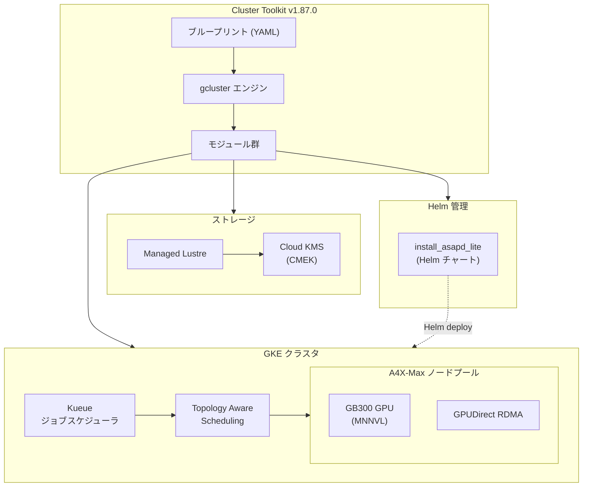

# Cluster Toolkit: バージョン v1.87.0 リリース

**リリース日**: 2026-04-13

**サービス**: Cluster Toolkit

**機能**: バージョン v1.87.0 - GKE A4X-Max Kueue サポート、Managed Lustre CMEK 対応、Helm 移行

**ステータス**: Feature

[このアップデートのインフォグラフィックを見る](https://takech9203.github.io/google-cloud-news-summary/20260413-cluster-toolkit-v1-87-0.html)

## 概要

Cluster Toolkit v1.87.0 がリリースされた。Cluster Toolkit は Google Cloud が提供するオープンソースソフトウェアであり、HPC (高性能コンピューティング)、AI、ML ワークロードの Google Cloud 上へのデプロイを簡素化するツールである。本リリースでは、GKE A4X-Max マシンタイプにおける Kueue ジョブスケジューリングのサポート追加、Google Cloud Managed Lustre における顧客管理暗号鍵 (CMEK) のサポート導入、install_asapd_lite モジュールの Helm への移行、および GKE A3 High ブループリントの更新が含まれる。

今回のアップデートは、大規模 AI/ML クラスタを運用するインフラストラクチャエンジニア、プラットフォームエンジニア、および HPC ワークロードを管理するクラスタ管理者を主な対象としている。A4X-Max は NVIDIA Multi-Node NVLink (MNNVL) システムを採用したラックスケールソリューションであり、Kueue との統合によりワークロードのスケジューリングとリソース管理が大幅に改善される。

**アップデート前の課題**

- GKE A4X-Max マシンタイプで Kueue によるジョブキューイングとリソースクォータ管理が利用できなかった
- Managed Lustre のデータ暗号化は Google デフォルト暗号化のみであり、暗号鍵のライフサイクルを顧客側で制御できなかった
- install_asapd_lite モジュールは静的マニフェストベースでデプロイされており、Helm によるバージョン管理やロールバックが利用できなかった
- A3 High ブループリントが最新のベストプラクティスに追従していなかった

**アップデート後の改善**

- GKE A4X-Max で Kueue によるトポロジーアウェアスケジューリング (TAS)、リソースクォータ管理、コホートによるリソース共有が可能になった
- Managed Lustre で Cloud KMS を使用した CMEK により、暗号鍵のローテーション、無効化、破棄などのライフサイクル管理が可能になった
- install_asapd_lite モジュールが Helm チャートに移行され、デプロイメントの管理性と再現性が向上した
- A3 High ブループリントが最新構成に更新された

## アーキテクチャ図



Cluster Toolkit v1.87.0 のアーキテクチャを示す。ブループリントから gcluster エンジンを通じて GKE クラスタ、Managed Lustre ストレージ、Helm 管理モジュールがデプロイされる。GKE クラスタ内では Kueue がトポロジーアウェアスケジューリングを通じて A4X-Max ノードプールへワークロードを配置する。

## サービスアップデートの詳細

### 主要機能

1. **GKE A4X-Max における Kueue サポート**
   - A4X-Max マシンタイプを使用する GKE クラスタで Kueue によるジョブキューイングが利用可能になった
   - Kueue は Kubernetes ネイティブのジョブスケジューラであり、リソースクォータに基づいてジョブの開始タイミングを制御する
   - ClusterQueue、LocalQueue、ResourceFlavor を定義することで、チーム間のリソース公平共有が可能
   - Topology Aware Scheduling (TAS) との連携により、A4X-Max の物理トポロジー (ブロック、サブブロック、ホスト) を考慮したワークロード配置が実現される
   - A4X-Max は NVIDIA GB300 GPU と Multi-Node NVLink (MNNVL) を搭載し、最大 18 ノード (1x72 GPU トポロジー) をサポート

2. **Managed Lustre の CMEK (顧客管理暗号鍵) サポート**
   - Google Cloud Managed Lustre のファイルデータおよびファイルシステムメタデータ (ファイル名など) を顧客管理の Cloud KMS 鍵で暗号化可能になった
   - Cloud KMS の SOFTWARE、HSM、EXTERNAL の 3 つの保護レベルをサポート
   - 鍵のローテーション、無効化、再有効化、破棄などのライフサイクル管理が可能
   - Cluster Toolkit のブループリントから CMEK 保護された Managed Lustre インスタンスの構成が可能になった

3. **install_asapd_lite モジュールの Helm 移行**
   - install_asapd_lite モジュールが静的 Kubernetes マニフェストから Helm チャートへ移行された
   - Helm によるバージョン管理、ロールバック、カスタマイズが容易になった
   - これは v1.70.0 で開始された Jobset の Helm 移行に続く、モジュール管理の近代化の一環

4. **GKE A3 High ブループリントの更新**
   - A3 High (H100 GPU 搭載) 向けの GKE ブループリントが最新構成に更新された
   - Jobset および Kueue のサポートを含む

## 技術仕様

### A4X-Max マシンタイプの仕様

| 項目 | 詳細 |
|------|------|
| GPU | NVIDIA GB300 (4 GPU/ノード) |
| NVLink | Multi-Node NVLink (MNNVL) |
| 最大ノード数 | 18 ノード (1x72 GPU トポロジー / 1 サブブロック) |
| ネットワーク | NVIDIA ConnectX-8、GPUDirect RDMA |
| OS アーキテクチャ | ARM64 (aarch64) |
| ベース OS | ubuntu-accelerator-2404-arm64-with-nvidia-580 (Slurm) / Container-Optimized OS (GKE) |
| 最小 GPU ドライバ | R580.95.05 |
| 最小 GKE バージョン | 1.35.0-gke.2745000 (1.35) / 1.34.3-gke.1318000 (1.34) |

### CMEK 構成パラメータ

| 項目 | 詳細 |
|------|------|
| 対象データ | ファイルデータ、ファイルシステムメタデータ |
| 保護レベル | SOFTWARE、HSM、EXTERNAL |
| 鍵リージョン | Managed Lustre インスタンスと同一リージョン |
| サービスエージェント | `service-PROJECT_NUMBER@gcp-sa-lustre.iam.gserviceaccount.com` |
| 必要な IAM ロール | `roles/cloudkms.cryptoKeyEncrypterDecrypter` |

### Kueue の主要リソース

```yaml
# Topology 定義例 (GKE A4X-Max)
apiVersion: kueue.x-k8s.io/v1alpha1
kind: Topology
metadata:
  name: "gke-default"
spec:
  levels:
    - nodeLabel: "cloud.google.com/gce-topology-block"
    - nodeLabel: "cloud.google.com/gce-topology-subblock"
    - nodeLabel: "cloud.google.com/gce-topology-host"
    - nodeLabel: "kubernetes.io/hostname"
---
kind: ResourceFlavor
apiVersion: kueue.x-k8s.io/v1beta1
metadata:
  name: "a4x-max-flavor"
spec:
  nodeLabels:
    cloud.google.com/gke-nodepool: "a4x-max-pool"
  topologyName: "gke-default"
  tolerations:
    - key: "nvidia.com/gpu"
      operator: "Exists"
      effect: NoSchedule
```

## 設定方法

### 前提条件

1. Cluster Toolkit v1.87.0 がインストールされていること
2. Google Cloud プロジェクトで GKE API が有効化されていること
3. A4X-Max のリザベーションが利用可能であること
4. CMEK を使用する場合は Cloud KMS API が有効化されていること

### 手順

#### ステップ 1: Cluster Toolkit のインストール

```bash
# GitHub リポジトリのクローン
git clone https://github.com/GoogleCloudPlatform/cluster-toolkit.git
cd cluster-toolkit
git checkout v1.87.0

# gcluster バイナリのビルド
make
```

#### ステップ 2: GKE A4X-Max ブループリントのデプロイ

```bash
# Application Default Credentials の設定
gcloud auth application-default login

# A4X-Max GKE ブループリントのデプロイ
./gcluster deploy -d \
  examples/gke-a4xmax/gke-a4xmax-deployment.yaml \
  examples/gke-a4xmax/gke-a4xmax.yaml
```

デプロイメント YAML でリザベーション名、プロジェクト ID、リージョン、ノード数などを設定する。

#### ステップ 3: CMEK 保護された Managed Lustre の設定

```bash
# Cloud KMS キーリングとキーの作成
gcloud kms keyrings create my-keyring \
  --location=REGION

gcloud kms keys create my-lustre-key \
  --keyring=my-keyring \
  --location=REGION \
  --purpose=encryption

# Managed Lustre サービスエージェントへの権限付与
gcloud kms keys add-iam-policy-binding my-lustre-key \
  --keyring=my-keyring \
  --location=REGION \
  --member=serviceAccount:service-PROJECT_NUMBER@gcp-sa-lustre.iam.gserviceaccount.com \
  --role=roles/cloudkms.cryptoKeyEncrypterDecrypter

# CMEK 保護された Managed Lustre インスタンスの作成
gcloud lustre instance create my-instance \
  --filesystem=my-fs \
  --per-unit-storage-throughput=250 \
  --capacity-gib=18000 \
  --location=ZONE \
  --network=my-network \
  --kms-key-name=projects/KMS_PROJECT/locations/REGION/keyRings/my-keyring/cryptoKeys/my-lustre-key
```

## メリット

### ビジネス面

- **GPU リソース利用率の最大化**: Kueue のクォータ管理とコホートによるリソース共有により、高価な A4X-Max GPU リソースの利用率が向上し、投資対効果が改善される
- **コンプライアンス要件への対応**: CMEK によりデータ暗号化の鍵管理を顧客側で制御でき、金融・医療・公共セクターなどの規制要件に対応できる
- **運用コストの削減**: Helm ベースのモジュール管理により、クラスタのデプロイとメンテナンスにかかる運用工数が削減される

### 技術面

- **トポロジーアウェアなワークロード配置**: Kueue の TAS 機能により、A4X-Max の MNNVL トポロジーを考慮した最適なワークロード配置が可能になり、分散学習のパフォーマンスが向上する
- **暗号鍵のライフサイクル管理**: Cloud KMS との統合により、鍵のローテーション、監査ログ、アクセス制御が一元管理できる
- **宣言的なインフラ管理**: Helm チャートへの移行により、バージョン管理、差分確認、ロールバックが容易になる

## デメリット・制約事項

### 制限事項

- Managed Lustre の CMEK について、GKE での動的プロビジョニングはサポートされておらず、静的プロビジョニングのみ対応
- CMEK で保護された Managed Lustre インスタンスは、VPC Service Controls 境界内で使用する場合、Cloud KMS キーが同一境界内にあるか、エグレスルールでアクセス可能である必要がある
- A4X-Max ノードプールの最大ノード数は 18 ノード (1 サブブロック) に制限される
- A4X-Max は GKE バージョン 1.34.3 以上または 1.35.0 以上が必要

### 考慮すべき点

- CMEK で保護された Managed Lustre インスタンスが鍵の無効化等で SUSPENDED 状態になった場合も課金は継続される
- Helm 移行に伴い、既存の install_asapd_lite モジュールを使用しているデプロイメントではアップグレード手順の確認が必要
- 鍵バージョンが破棄された場合、Managed Lustre インスタンスは永久に SUSPENDED 状態となり、削除のみ可能

## ユースケース

### ユースケース 1: 大規模分散学習クラスタでのジョブスケジューリング

**シナリオ**: 複数の AI 研究チームが A4X-Max クラスタを共有し、分散学習ジョブを並行して実行する環境。各チームに GPU クォータを割り当て、未使用リソースをチーム間で共有したい。

**実装例**:
```yaml
# チーム間リソース共有のための ClusterQueue 設定
apiVersion: kueue.x-k8s.io/v1beta1
kind: ClusterQueue
metadata:
  name: team-a-queue
spec:
  cohort: "shared-a4x-max"
  resourceGroups:
    - coveredResources: ["nvidia.com/gpu"]
      flavors:
        - name: "a4x-max-flavor"
          resources:
            - name: "nvidia.com/gpu"
              nominalQuota: 36  # 9 ノード分
              borrowingLimit: 36
---
apiVersion: kueue.x-k8s.io/v1beta1
kind: ClusterQueue
metadata:
  name: team-b-queue
spec:
  cohort: "shared-a4x-max"
  resourceGroups:
    - coveredResources: ["nvidia.com/gpu"]
      flavors:
        - name: "a4x-max-flavor"
          resources:
            - name: "nvidia.com/gpu"
              nominalQuota: 36
              borrowingLimit: 36
```

**効果**: チーム A がリソースを使用していない時間帯に、チーム B がコホート内の未使用 GPU を借用でき、クラスタ全体の GPU 利用率が向上する。

### ユースケース 2: 規制対応が必要な AI ワークロード向けストレージ暗号化

**シナリオ**: 金融機関の AI 部門が、顧客データを含む学習データセットを Managed Lustre に配置し、暗号鍵の管理を自社で行う必要がある。

**効果**: Cloud KMS の CMEK により暗号鍵のローテーションスケジュール、アクセス権限、監査ログを一元管理でき、コンプライアンス監査への対応が容易になる。鍵の使用状況を Cloud KMS Key Inventory で追跡可能。

## 関連サービス・機能

- **Google Kubernetes Engine (GKE)**: A4X-Max ノードプールのホスティング基盤。Kueue と TAS による高度なワークロードスケジューリングを提供
- **Kueue**: Kubernetes ネイティブのジョブスケジューラ。リソースクォータ管理、ジョブキューイング、コホートによるリソース共有を実現
- **Google Cloud Managed Lustre**: 高性能並列ファイルシステム。HPC および AI ワークロード向けの高スループットストレージを提供
- **Cloud KMS**: 暗号鍵の作成、管理、使用を一元化するサービス。CMEK による顧客管理暗号化を実現
- **AI Hypercomputer**: A4X-Max を含む GPU マシンファミリーの統合ドキュメントとベストプラクティスを提供

## 参考リンク

- [このアップデートのインフォグラフィック](https://takech9203.github.io/google-cloud-news-summary/20260413-cluster-toolkit-v1-87-0.html)
- [公式リリースノート](https://cloud.google.com/release-notes#April_13_2026)
- [GitHub リリースディスカッション](https://github.com/GoogleCloudPlatform/cluster-toolkit/discussions/5469)
- [Cluster Toolkit ドキュメント](https://docs.cloud.google.com/cluster-toolkit/docs/overview)
- [Managed Lustre CMEK ドキュメント](https://docs.cloud.google.com/managed-lustre/docs/cmek)
- [Kueue チュートリアル (GKE)](https://docs.cloud.google.com/kubernetes-engine/docs/tutorials/kueue-intro)
- [A4X-Max GKE クラスタ作成ガイド](https://docs.cloud.google.com/ai-hypercomputer/docs/create/gke-ai-hypercompute-custom-a4x-max)
- [Cluster Toolkit ブループリントカタログ](https://docs.cloud.google.com/cluster-toolkit/docs/setup/cluster-blueprint-catalog)

## まとめ

Cluster Toolkit v1.87.0 は、A4X-Max GPU クラスタの運用効率を大幅に向上させるリリースである。Kueue サポートにより複数チーム間での GPU リソースの公平な共有と高効率なスケジューリングが実現され、Managed Lustre の CMEK 対応により規制要件を持つ組織でも安心してデータを管理できるようになった。A4X-Max を使用した AI/ML ワークロードを運用している組織は、本バージョンへのアップグレードと Kueue の導入を検討することを推奨する。

---

**タグ**: #ClusterToolkit #GKE #A4XMax #Kueue #ManagedLustre #CMEK #CloudKMS #HPC #AI #ML #Helm #GPU #MNNVL
