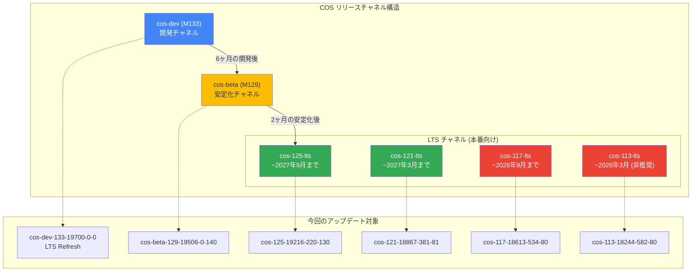

# Container-Optimized OS: 2026年4月セキュリティアップデート (複数バージョン)

**リリース日**: 2026-04-13

**サービス**: Container-Optimized OS

**機能**: セキュリティアップデート (複数バージョン同時リリース)

**ステータス**: Security / Change

[このアップデートのインフォグラフィックを見る](https://takech9203.github.io/google-cloud-news-summary/20260413-container-optimized-os-security-updates-april.html)

## 概要

Google は 2026年4月13日、Container-Optimized OS (COS) の複数バージョンに対するセキュリティアップデートを一斉にリリースしました。今回のリリースでは、開発チャネル (cos-dev)、ベータチャネル (cos-beta)、および複数の LTS マイルストーン (113, 117, 121, 125) にわたる合計6つのイメージが更新されています。

特に注目すべきは、cos-dev-133 における LTS Refresh リリース、Docker の重大な脆弱性 (CVE-2026-33997, CVE-2026-34040) の修正、第8世代 TPU デバイスのサポート追加、そして virtio_pci ティアダウン時のカーネルパニック修正です。これらの変更は、GKE ノードや Compute Engine 上でコンテナワークロードを実行するすべてのユーザーに影響します。

LTS Refresh リリースは四半期ごとに行われる中・低優先度のバグ修正とセキュリティ修正を含むリリースであり、通常のオンデマンドリリースよりも広範な変更が含まれるため、ロールアウト時には追加の注意が必要です。

**アップデート前の課題**

- Docker に CVE-2026-33997 および CVE-2026-34040 の脆弱性が存在し、コンテナランタイムのセキュリティリスクがあった
- カーネルに複数の CVE (CVE-2024-14027, CVE-2026-23270 等) が未修正のまま残っていた
- virtio_pci のティアダウン処理で仮想キューが条件付きでスキップされた場合にカーネルパニックが発生する問題があった
- 第8世代 TPU デバイスが COS 上でサポートされていなかった

**アップデート後の改善**

- Docker の CVE-2026-33997 および CVE-2026-34040 が修正され、コンテナランタイムのセキュリティが強化された
- 複数のカーネル CVE が修正され、OS レベルのセキュリティが向上した
- virtio_pci のカーネルパニック問題が解消され、仮想マシンの安定性が改善された
- 第8世代 TPU デバイスが利用可能になり、最新の TPU ハードウェアでの COS 利用が可能になった

## アーキテクチャ図



COS のリリースチャネル構造と、今回アップデートされた各イメージの関係を示しています。開発チャネルからベータ、LTS へと段階的にリリースが進み、LTS チャネルでは2年間のサポートが提供されます。

## サービスアップデートの詳細

### 主要機能

1. **第8世代 TPU デバイスサポート**
   - cos-dev-133 において第8世代 TPU デバイスのサポートが追加された
   - Google の最新 TPU ハードウェアを使用した AI/ML ワークロードの実行が COS 上で可能に
   - 以前のリリースで追加された第7世代 TPU サポート (cos-dev-125 M125) に続く拡張

2. **Docker セキュリティ修正 (CVE-2026-33997, CVE-2026-34040)**
   - Docker v27.5.1 および v24.0.9 に影響する2つの CVE が修正された
   - 全チャネル (dev, beta, LTS) のイメージに修正が適用されている
   - コンテナランタイムのセキュリティを確保するため、早期のアップデートが推奨される

3. **LTS Refresh リリース (cos-dev-133)**
   - cos-dev-133-19700-0-0 は LTS Refresh リリースとして提供された
   - 四半期ごとの中・低優先度のバグ修正とセキュリティ修正が含まれる
   - LTS Refresh は通常リリースより広範な変更を含むため、ロールアウト時にはリグレッションに注意が必要

4. **カーネルパニック修正 (virtio_pci)**
   - virtio_pci のティアダウン処理で仮想キューが条件付きでスキップされた場合に発生するカーネルパニックが修正された
   - この修正は VM の安定性に直結するため、特に本番環境での適用が重要

5. **カーネル CVE 修正**
   - CVE-2024-14027、CVE-2026-23270 などの複数のカーネル脆弱性が修正された
   - 各 LTS マイルストーンのカーネルバージョンに応じた修正が適用されている

## 技術仕様

### バージョン比較表

| イメージ名 | チャネル | カーネル | Docker | Containerd | 備考 |
|------------|----------|----------|--------|------------|------|
| cos-dev-133-19700-0-0 | Dev | COS-6.12.77 | v27.5.1 | v2.2.1 | LTS Refresh リリース |
| cos-beta-129-19506-0-140 | Beta | COS-6.12.77 | v27.5.1 | v2.2.2 | 安定化フェーズ |
| cos-125-19216-220-130 | LTS | COS-6.12.68 | v27.5.1 | v2.1.5 | ~2027年9月までサポート |
| cos-121-18867-381-81 | LTS | COS-6.6.122 | v27.5.1 | v2.0.7 | ~2027年3月までサポート |
| cos-117-18613-534-80 | LTS | COS-6.6.123 | v24.0.9 | v1.7.29 | ~2026年9月までサポート |
| cos-113-18244-582-80 | LTS | COS-6.1.161 | v24.0.9 | v1.7.27 | 非推奨 (~2026年3月) |

### カーネルバージョン系統

| カーネル系統 | バージョン | 対象マイルストーン |
|-------------|-----------|-------------------|
| 6.12 系 | COS-6.12.77 | M133 (Dev), M129 (Beta) |
| 6.12 系 | COS-6.12.68 | M125 (LTS) |
| 6.6 系 | COS-6.6.122 / 6.6.123 | M121, M117 (LTS) |
| 6.1 系 | COS-6.1.161 | M113 (LTS) |

### Docker / Containerd バージョン

| コンポーネント | 最新チャネル (Dev/Beta/M125/M121) | 旧 LTS チャネル (M117/M113) |
|---------------|----------------------------------|---------------------------|
| Docker | v27.5.1 | v24.0.9 |
| Containerd | v2.0.7 - v2.2.2 | v1.7.27 - v1.7.29 |

## 設定方法

### 前提条件

1. Google Cloud プロジェクトが有効であること
2. Compute Engine API が有効化されていること
3. `gcloud` CLI が最新バージョンにアップデートされていること

### 手順

#### ステップ 1: 現在のイメージバージョンを確認

```bash
# 利用可能な COS LTS イメージの一覧を表示
gcloud compute images list --no-standard-images --project=cos-cloud | grep lts
```

#### ステップ 2: 特定の COS イメージでインスタンスを作成

```bash
# 例: cos-125-lts の最新イメージでインスタンスを作成
gcloud compute instances create my-cos-instance \
  --image-family=cos-125-lts \
  --image-project=cos-cloud \
  --zone=asia-northeast1-b
```

#### ステップ 3: 自動更新の設定確認

```bash
# 自動更新が有効かどうか確認 (マイルストーン 117 以降はデフォルト無効)
gcloud compute instances describe my-cos-instance \
  --zone=asia-northeast1-b \
  --format="get(metadata.items[key='cos-update-strategy'].value)"

# 自動更新を有効化する場合
gcloud compute instances add-metadata my-cos-instance \
  --zone=asia-northeast1-b \
  --metadata cos-update-strategy=update_enabled
```

#### ステップ 4: インスタンスの OS バージョンを確認

```bash
# SSH でインスタンスに接続し、バージョンを確認
gcloud compute ssh my-cos-instance --zone=asia-northeast1-b \
  --command="cat /etc/os-release | grep -E 'VERSION_ID|BUILD_ID'"
```

## メリット

### ビジネス面

- **セキュリティリスクの低減**: Docker および カーネルの CVE 修正により、コンテナワークロードのセキュリティリスクが大幅に低減される
- **最新 AI/ML ハードウェアの活用**: 第8世代 TPU サポートにより、Google の最新 AI インフラストラクチャ上でワークロードを実行可能

### 技術面

- **VM 安定性の向上**: virtio_pci のカーネルパニック修正により、予期しないクラッシュのリスクが排除される
- **コンテナランタイムの最新化**: Docker v27.5.1 および Containerd v2.x 系への移行が進行し、最新のコンテナ機能が利用可能
- **包括的なセキュリティ対応**: 全チャネルに対して一斉にセキュリティ修正が適用されるため、環境全体のセキュリティレベルが統一的に向上

## デメリット・制約事項

### 制限事項

- マイルストーン 113 (COS 113 LTS) は 2026年3月にサポート終了を迎えており、今回のアップデートが最終期のリリースとなる可能性がある。早期に M117 以降への移行が推奨される
- LTS Refresh リリース (cos-dev-133) は中・低優先度の修正を含むため、リグレッションのリスクがある
- 自動更新はマイルストーン 117 以降でデフォルト無効のため、手動での更新管理が必要

### 考慮すべき点

- UEFI Secure Boot が有効な COS VM ではインプレースアップデートがサポートされないため、イメージの再作成が必要
- Arm ベースの COS イメージではインプレースアップデートがサポートされない
- GKE など マネージドサービスで COS を使用している場合、マネージドサービス側のアップデートスケジュールに従う必要がある
- Docker v24.0.9 を使用する M117/M113 環境と Docker v27.5.1 を使用する M121 以降の環境では、利用可能な Docker 機能に差異がある

## ユースケース

### ユースケース 1: GKE ノードのセキュリティ強化

**シナリオ**: GKE クラスタのノードイメージとして COS を使用しており、Docker CVE の修正を適用したい場合

**実装例**:
```bash
# GKE ノードプールのイメージバージョンを確認
gcloud container node-pools describe default-pool \
  --cluster=my-cluster \
  --zone=asia-northeast1-b \
  --format="get(config.imageType)"

# ノードプールのアップグレード (GKE がサポートするイメージバージョンに依存)
gcloud container clusters upgrade my-cluster \
  --node-pool=default-pool \
  --zone=asia-northeast1-b
```

**効果**: Docker CVE-2026-33997 および CVE-2026-34040 の修正が適用され、コンテナエスケープなどのセキュリティリスクが排除される

### ユースケース 2: 第8世代 TPU を使用した AI/ML ワークロード

**シナリオ**: 最新の第8世代 TPU インスタンスで COS ベースの AI トレーニングジョブを実行したい場合

**効果**: cos-dev-133 イメージを使用することで、第8世代 TPU デバイスが COS 上で認識・利用可能になり、最新の TPU ハードウェア性能を活かした AI/ML ワークロードの実行が可能になる

### ユースケース 3: 本番環境の LTS マイルストーン移行

**シナリオ**: M113 (サポート終了間近) から M125 LTS への移行を計画している場合

**実装例**:
```bash
# M125 LTS の最新イメージを使用してテスト用インスタンスを作成
gcloud compute instances create cos-test-m125 \
  --image-family=cos-125-lts \
  --image-project=cos-cloud \
  --zone=asia-northeast1-b

# テスト後、本番インスタンスのイメージを更新
# (マネージドインスタンスグループの場合)
gcloud compute instance-groups managed set-instance-template my-mig \
  --template=my-cos-125-template \
  --zone=asia-northeast1-b
```

**効果**: カーネル 6.12 系、Docker v27.5.1、Containerd v2.1.5 への移行により、2027年9月までのサポートが確保される

## 関連サービス・機能

- **Google Kubernetes Engine (GKE)**: COS は GKE のデフォルトノード OS イメージであり、GKE ノードのセキュリティに直接影響する
- **Compute Engine**: COS イメージは Compute Engine 上で VM として直接利用可能
- **Cloud TPU**: 第8世代 TPU デバイスのサポート追加により、COS と Cloud TPU の統合が強化された
- **Containerd**: COS にプリインストールされるコンテナランタイムとして、v2.x 系への移行が進行中

## 参考リンク

- [このアップデートのインフォグラフィック](https://takech9203.github.io/google-cloud-news-summary/20260413-container-optimized-os-security-updates-april.html)
- [公式リリースノート](https://cloud.google.com/release-notes#April_13_2026)
- [Container-Optimized OS バージョニング](https://cloud.google.com/container-optimized-os/docs/concepts/versioning)
- [COS Dev チャネル リリースノート](https://cloud.google.com/container-optimized-os/docs/release-notes/dev)
- [COS 自動更新の設定](https://cloud.google.com/container-optimized-os/docs/concepts/auto-update)
- [COS サポートポリシー](https://cloud.google.com/container-optimized-os/docs/resources/support-policy)

## まとめ

今回の COS セキュリティアップデートは、Docker の重大な CVE 修正、複数のカーネル脆弱性の解消、第8世代 TPU サポートの追加、および virtio_pci のカーネルパニック修正を含む包括的なリリースです。特に Docker CVE-2026-33997 および CVE-2026-34040 はコンテナランタイムのセキュリティに直接影響するため、全チャネルのユーザーに早期の適用が推奨されます。また、M113 LTS がサポート終了を迎えているため、M117 以降の LTS マイルストーンへの移行計画を早急に策定することを推奨します。

---

**タグ**: #ContainerOptimizedOS #COS #Security #Docker #CVE #TPU #LTS #Kernel #GKE #ComputeEngine #ContainerRuntime
