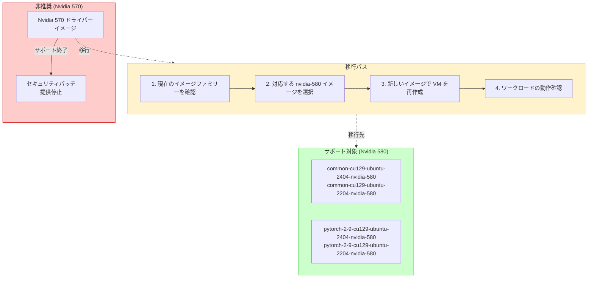

# Deep Learning VM Images: Nvidia 570 ドライバーの非推奨化

**リリース日**: 2026-04-13

**サービス**: Deep Learning VM Images

**機能**: Nvidia 570 ドライバーの非推奨化

**ステータス**: Breaking Change

[このアップデートのインフォグラフィックを見る](https://takech9203.github.io/google-cloud-news-summary/20260413-deep-learning-vm-nvidia-570-deprecation.html)

## 概要

Google Cloud の Deep Learning VM Images において、Nvidia 570 ドライバーを搭載したイメージが非推奨 (deprecated) となりました。これは Nvidia が 570 シリーズドライバーの公式サポートを終了したことに伴う措置です。今後は Nvidia 580 ドライバーを搭載したイメージを使用する必要があります。

この変更は、Deep Learning VM を GPU ワークロードに利用しているすべてのユーザーに影響します。現在 Nvidia 570 ドライバーベースのイメージを使用している場合、セキュリティパッチや新機能の提供が停止するため、速やかに Nvidia 580 ドライバーベースのイメージへの移行が推奨されます。

現在サポートされているイメージファミリーはすべて Nvidia 580 ドライバーを搭載しており、Ubuntu 22.04 および Ubuntu 24.04 をサポートしています。また、すべてのアクティブなイメージは A3 Ultra GPU アクセラレーターに対応しています。

**アップデート前の課題**

- Nvidia 570 ドライバーは Nvidia による公式サポートが終了しており、セキュリティ脆弱性への対応が行われなくなる
- 570 ドライバーベースのイメージでは新しい GPU アーキテクチャとの互換性に制限がある可能性がある
- サポート終了後のドライバーを使用し続けることで、本番環境でのセキュリティリスクが増大する

**アップデート後の改善**

- Nvidia 580 ドライバーへの移行により、最新のセキュリティパッチと安定性修正が適用される
- 580 ドライバーは A3 Ultra GPU アクセラレーターを含む最新の GPU ハードウェアをサポート
- CUDA 12.9 との組み合わせにより、最新のフレームワーク (PyTorch 2.9 など) との完全な互換性が確保される

## アーキテクチャ図



この図は Nvidia 570 ドライバーから 580 ドライバーへの移行パスを示しています。570 ドライバーベースのイメージはサポート終了となり、ユーザーは 580 ドライバーベースの新しいイメージファミリーに移行する必要があります。

## サービスアップデートの詳細

### 主要変更点

1. **Nvidia 570 ドライバーイメージの非推奨化**
   - Nvidia が 570 シリーズドライバーの公式サポートを終了したことに伴い、570 ドライバーを搭載した Deep Learning VM イメージが非推奨となった
   - 非推奨イメージは公開リストから非表示となり、`--show-deprecated` フラグを使用しないと表示されない

2. **Nvidia 580 ドライバーへの移行**
   - すべてのアクティブなイメージファミリーは Nvidia 580 ドライバーを使用
   - イメージファミリー名のサフィックスが `-nvidia-580` に統一されている
   - CUDA 12.9 と組み合わせた最新のスタックが提供される

3. **サポート対象 OS の確認**
   - Ubuntu 22.04 および Ubuntu 24.04 がサポート対象
   - Debian イメージはすべて非推奨済み

## 技術仕様

### 現在サポートされているイメージファミリー

| フレームワーク | プロセッサー | イメージファミリー名 |
|------|------|------|
| Base | GPU | `common-cu129-ubuntu-2404-nvidia-580`<br/>`common-cu129-ubuntu-2204-nvidia-580` |
| PyTorch 2.9 | GPU | `pytorch-2-9-cu129-ubuntu-2404-nvidia-580`<br/>`pytorch-2-9-cu129-ubuntu-2204-nvidia-580` |

### イメージファミリー命名規則

イメージファミリー名は `FRAMEWORK-CUDA_VERSION-OS-NVIDIA_DRIVER` の形式で構成されています。

```
pytorch-2-9-cu129-ubuntu-2204-nvidia-580
|          |    |         |          |
|          |    |         |          +-- Nvidia ドライバーバージョン
|          |    |         +-- OS バージョン (Ubuntu 22.04)
|          |    +-- CUDA バージョン (12.9)
|          +-- フレームワークバージョン
+-- フレームワーク名
```

## 設定方法

### 前提条件

1. Google Cloud CLI (`gcloud`) がインストール済みであること
2. 適切なプロジェクトと課金が設定済みであること
3. GPU クォータが対象ゾーンで確保されていること

### 手順

#### ステップ 1: 現在使用中のイメージを確認する

```bash
# 現在の VM のイメージ情報を確認
gcloud compute instances describe INSTANCE_NAME \
  --zone=ZONE \
  --format="value(disks[0].source)"
```

使用中のイメージに `nvidia-570` が含まれている場合は移行が必要です。

#### ステップ 2: 利用可能な Nvidia 580 イメージを一覧表示する

```bash
# Nvidia 580 ドライバー搭載イメージの一覧を表示
gcloud compute images list \
  --project deeplearning-platform-release \
  --format="value(NAME)" \
  --no-standard-images \
  --filter="name~nvidia-580"
```

#### ステップ 3: 新しいイメージで VM を作成する

```bash
# PyTorch + GPU の場合の例 (Ubuntu 22.04)
export IMAGE_FAMILY="pytorch-2-9-cu129-ubuntu-2204-nvidia-580"
export ZONE="us-west1-b"
export INSTANCE_NAME="my-dl-vm"

gcloud compute instances create $INSTANCE_NAME \
  --zone=$ZONE \
  --image-family=$IMAGE_FAMILY \
  --image-project=deeplearning-platform-release \
  --maintenance-policy=TERMINATE \
  --accelerator="type=nvidia-tesla-v100,count=1" \
  --metadata="install-nvidia-driver=True"
```

```bash
# Base GPU イメージの場合の例 (Ubuntu 24.04)
export IMAGE_FAMILY="common-cu129-ubuntu-2404-nvidia-580"
export ZONE="us-west1-b"
export INSTANCE_NAME="my-gpu-vm"

gcloud compute instances create $INSTANCE_NAME \
  --zone=$ZONE \
  --image-family=$IMAGE_FAMILY \
  --image-project=deeplearning-platform-release \
  --maintenance-policy=TERMINATE \
  --accelerator="type=nvidia-tesla-v100,count=1" \
  --metadata="install-nvidia-driver=True"
```

#### ステップ 4: ドライバーのインストールを確認する

```bash
# VM に SSH 接続後、ドライバーバージョンを確認
nvidia-smi
```

出力に `Driver Version: 580.x.x` が表示されることを確認します。初回起動時はドライバーのインストールに 3-5 分かかる場合があります。

## デメリット・制約事項

### 制限事項

- Nvidia 570 ドライバーに依存する特定のワークロードやカスタム設定がある場合、580 ドライバーとの互換性を事前に検証する必要がある
- 既存の VM を直接アップグレードすることはできず、新しいイメージで VM を再作成する必要がある
- 非推奨イメージの使用は引き続き可能だが、`--show-deprecated` フラグが必要であり、セキュリティリスクを伴う

### 考慮すべき点

- 本番環境で使用中の場合、移行前にステージング環境での十分なテストを推奨
- カスタムスクリプトやオートメーションで旧イメージファミリー名をハードコードしている場合は更新が必要
- クラスター構成で全ノードの一貫性を保つために、特定のイメージバージョンを指定する場合は新しいイメージ名を使用すること

## ユースケース

### ユースケース 1: 機械学習トレーニング環境の移行

**シナリオ**: PyTorch を使用した大規模モデルのトレーニングに Nvidia 570 ドライバーベースの Deep Learning VM を使用していた場合

**実装例**:
```bash
# 旧イメージからの移行
# 旧: pytorch-X-X-cuXXX-ubuntu-2204-nvidia-570 (非推奨)
# 新: pytorch-2-9-cu129-ubuntu-2204-nvidia-580

gcloud compute instances create ml-training-vm \
  --zone=us-central1-a \
  --image-family=pytorch-2-9-cu129-ubuntu-2204-nvidia-580 \
  --image-project=deeplearning-platform-release \
  --machine-type=n1-standard-8 \
  --maintenance-policy=TERMINATE \
  --accelerator="type=nvidia-tesla-v100,count=1" \
  --boot-disk-size=200GB \
  --metadata="install-nvidia-driver=True"
```

**効果**: 最新の PyTorch 2.9 と CUDA 12.9 の組み合わせにより、トレーニングパフォーマンスの向上とセキュリティの確保が実現される

### ユースケース 2: GPU コンピューティング基盤の更新

**シナリオ**: 汎用 GPU ワークロード (画像処理、科学計算など) に Base GPU イメージを使用しているチームが、非推奨化に対応する場合

**効果**: Nvidia 580 ドライバーへの移行により、A3 Ultra GPU アクセラレーターを含む最新ハードウェアへの対応が可能になり、将来的なインフラスケーリングの選択肢が広がる

## 関連サービス・機能

- **[Compute Engine GPU](https://cloud.google.com/compute/docs/gpus)**: Deep Learning VM は Compute Engine 上で GPU アクセラレーターを使用する際の推奨イメージの一つ
- **[AI Hypercomputer OS イメージ](https://cloud.google.com/ai-hypercomputer/docs/images)**: Deep Learning VM 以外の GPU 最適化 OS イメージの選択肢
- **[Deep Learning Containers](https://cloud.google.com/deep-learning-containers/docs)**: コンテナベースの Deep Learning 環境を必要とする場合の代替手段
- **[Vertex AI Workbench](https://cloud.google.com/vertex-ai/docs/workbench)**: マネージドノートブック環境での GPU 利用

## 参考リンク

- [インフォグラフィック](https://takech9203.github.io/google-cloud-news-summary/20260413-deep-learning-vm-nvidia-570-deprecation.html)
- [公式リリースノート](https://cloud.google.com/release-notes#April_13_2026)
- [Deep Learning VM Images - イメージの選択](https://cloud.google.com/deep-learning-vm/docs/images)
- [Deep Learning VM Images - リリースノート](https://cloud.google.com/deep-learning-vm/docs/release-notes)
- [gcloud CLI による VM 作成手順](https://cloud.google.com/deep-learning-vm/docs/cli)

## まとめ

Nvidia 570 ドライバーの非推奨化は、Nvidia のサポートライフサイクルに伴う予想された変更です。現在 570 ドライバーベースのイメージを使用しているユーザーは、セキュリティと互換性を維持するために、早期に Nvidia 580 ドライバーベースのイメージへの移行を計画・実施してください。移行は新しいイメージファミリー名を指定して VM を再作成するだけで完了し、大きな手順変更は必要ありません。

---

**タグ**: #DeepLearningVM #GPU #Nvidia #DriverDeprecation #BreakingChange #Migration #CUDA #PyTorch #MachineLearning
