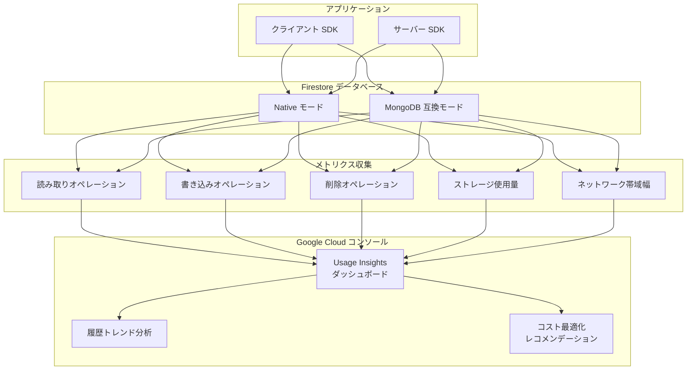

# Firestore: Usage Insights ダッシュボード

**リリース日**: 2026-04-13

**サービス**: Firestore

**機能**: Usage Insights ダッシュボード

**ステータス**: Feature

[このアップデートのインフォグラフィックを見る](https://takech9203.github.io/google-cloud-news-summary/20260413-firestore-usage-insights.html)

## 概要

Firestore に新たに Usage Insights ダッシュボードが追加されました。Google Cloud コンソール上で、特定の Firestore データベースごとの課金対象使用量を監視・分析できる機能です。これにより、データベース単位での詳細な使用状況の把握、コスト最適化、および履歴トレンドの監視が可能になります。

Usage Insights は、Firestore Native モードと MongoDB 互換モードの両方で利用できます。従来の Usage ダッシュボードがオペレーション数の概算を提供していたのに対し、Usage Insights は課金対象の使用量に焦点を当てた、よりきめ細かいデータを提供します。これにより、実際のコストに直結する使用パターンを正確に把握し、予算管理やリソース配分の意思決定に役立てることができます。

複数の Firestore データベースを運用している組織や、コスト管理を重視するチームにとって、データベース単位での課金使用量の可視化は極めて有用なアップデートです。

**アップデート前の課題**

- 既存の Usage ダッシュボードは使用量の概算値を提供するのみで、実際の課金額との間に乖離が生じていた (import/export オペレーション、No-op writes、Collapsed writes、ゼロ結果クエリ、インデックスエントリ読み取りなどが正確に反映されなかった)
- 特定のデータベースの課金対象使用量をきめ細かく追跡する手段がなく、コスト最適化のための分析が困難だった
- 使用量の履歴トレンドを確認するには、Cloud Monitoring で個別にダッシュボードを構成する必要があった

**アップデート後の改善**

- Google Cloud コンソール上で、データベースごとの課金対象使用量を直接確認できるようになった
- きめ細かい使用量データにより、コストの要因を特定し、最適化の機会を見つけやすくなった
- 履歴トレンドの監視機能により、使用パターンの変化やスパイクを時系列で追跡可能になった

## アーキテクチャ図



Firestore データベースで発生するすべてのオペレーション (読み取り、書き込み、削除、ストレージ、ネットワーク) のメトリクスが収集され、Usage Insights ダッシュボードに集約されます。ダッシュボード上で履歴トレンドの分析やコスト最適化の検討が行えます。

## サービスアップデートの詳細

### 主要機能

1. **課金対象使用量の監視**
   - 特定の Firestore データベースに対する課金対象の使用量をリアルタイムに近い形で確認可能
   - ドキュメントの読み取り、書き込み、削除オペレーションの課金使用量を個別に表示
   - ストレージ使用量とネットワーク帯域幅の消費状況も含めた包括的なビュー

2. **きめ細かい使用量データ**
   - プロジェクト全体ではなく、個別のデータベース単位での使用量を分析
   - 課金に直結するオペレーション数を正確に表示 (従来のダッシュボードで見落とされがちだったインデックスエントリ読み取りなどを含む)
   - 時間帯別の使用パターンを詳細に把握

3. **履歴トレンドの監視**
   - 過去の使用量データを時系列で表示し、トレンドの変化を視覚的に把握
   - 使用量のスパイクや異常値を検出し、コスト増加の要因を特定
   - 将来の使用量予測やキャパシティプランニングに活用可能

4. **マルチモード対応**
   - Firestore Native モードで利用可能
   - Firestore MongoDB 互換モードでも同等の機能を提供
   - 両モードで統一されたインターフェースによる使用量分析

## 技術仕様

### 対応モードとドキュメント

| 項目 | 詳細 |
|------|------|
| Firestore Native モード | `/firestore/native/docs/usage-insights` で提供 |
| MongoDB 互換モード | `/firestore/mongodb-compatibility/docs/usage-insights` で提供 |
| アクセス方法 | Google Cloud コンソール |
| 追加コスト | なし (Firestore の利用料金に含まれる) |

### 監視可能なメトリクス

| メトリクス | 説明 |
|------|------|
| ドキュメント読み取り | クエリ、単純取得、リアルタイムリスナー更新による読み取り数 |
| ドキュメント書き込み | set、update オペレーションによる書き込み数 |
| ドキュメント削除 | delete オペレーションによる削除数 |
| インデックスエントリ読み取り | クエリ実行時に読み取られたインデックスエントリ数 |
| ストレージ | メタデータとインデックスを含むデータ保存量 |
| ネットワーク帯域幅 | アウトバウンドデータ転送量 |

### 必要な権限

| ロール | 説明 |
|------|------|
| `roles/monitoring.viewer` | Cloud Monitoring メトリクスの閲覧 |
| `roles/datastore.viewer` | Firestore データの閲覧 (Insights データ含む) |
| `roles/viewer` | プロジェクトレベルの閲覧権限 (上記ロールを包含) |

## 設定方法

### 前提条件

1. Google Cloud プロジェクトで Firestore が有効化されていること
2. 対象の Firestore データベースが作成済みであること
3. 適切な IAM 権限 (`monitoring.timeSeries.list` パーミッション) が付与されていること

### 手順

#### ステップ 1: Google Cloud コンソールでデータベースを選択

Google Cloud コンソールの Firestore セクションに移動し、対象のデータベースを選択します。

```
Google Cloud コンソール > Firestore > Databases > [データベースを選択]
```

コンソール URL: `https://console.cloud.google.com/firestore/databases`

#### ステップ 2: Usage Insights ダッシュボードにアクセス

データベースを選択後、ナビゲーションメニューから Usage Insights を開きます。

```
[データベース選択] > Usage Insights
```

ダッシュボード上で、課金対象使用量のグラフ、履歴トレンド、および詳細なメトリクスを確認できます。

#### ステップ 3: Cloud Monitoring との連携 (オプション)

より高度な監視やアラート設定が必要な場合は、Cloud Monitoring と連携してカスタムダッシュボードやアラートポリシーを作成できます。

```bash
# Cloud Monitoring でアラートポリシーを作成する例 (gcloud CLI)
gcloud monitoring policies create \
  --display-name="Firestore Usage Spike Alert" \
  --condition-display-name="High Read Operations" \
  --condition-filter='resource.type="firestore.googleapis.com/Database" AND metric.type="firestore.googleapis.com/document/read_count"' \
  --condition-threshold-value=1000000 \
  --condition-threshold-comparison=COMPARISON_GT \
  --condition-threshold-duration=300s \
  --notification-channels="projects/PROJECT_ID/notificationChannels/CHANNEL_ID"
```

## メリット

### ビジネス面

- **コスト可視化の向上**: データベース単位の課金使用量を可視化することで、コストの帰属先を正確に把握でき、部門別やプロジェクト別のコスト配分が容易になる
- **予算管理の精度向上**: 履歴トレンドに基づく使用量予測により、将来のコストを見積もり、予算超過を未然に防止できる
- **コスト最適化の促進**: 使用パターンの詳細分析により、不要なオペレーションの削減やクエリの最適化によるコスト削減の機会を特定できる

### 技術面

- **運用効率の向上**: 従来 Cloud Monitoring でカスタムダッシュボードを構築する必要があった使用量監視を、コンソール内で手軽に実施可能
- **問題の早期発見**: 使用量スパイクやトレンド変化をすばやく検出し、パフォーマンス問題やセキュリティインシデントの兆候を早期に察知
- **データ駆動の意思決定**: 正確な課金データに基づいてインデックス戦略やクエリ設計の最適化を判断できる

## デメリット・制約事項

### 制限事項

- Usage Insights はコンソール上のダッシュボード機能であり、プログラムからの直接的なデータ取得 API は提供されていない (Cloud Monitoring API を介して関連メトリクスにはアクセス可能)
- 従来の Usage ダッシュボードと同様に、表示される値と実際の請求額との間にわずかな差異が生じる可能性がある (請求レポートが常に最終的な使用量数値)

### 考慮すべき点

- 使用量データには 1-2 時間程度の遅延がある可能性があり、リアルタイムの監視には Cloud Monitoring のメトリクスを併用することを推奨
- 複数のデータベースを使用している場合、無料枠が適用されるのはプロジェクト内の 1 つのデータベースのみである点に注意

## ユースケース

### ユースケース 1: マルチテナントアプリケーションのコスト配分

**シナリオ**: 複数のテナントごとに個別の Firestore データベースを運用している SaaS プロバイダーが、テナント別のコストを正確に把握し、料金体系に反映させたい。

**効果**: Usage Insights によりデータベース単位の課金使用量を確認することで、テナントごとのコスト配分を正確に算出できる。これにより、公平な料金設定と収益性分析が可能になる。

### ユースケース 2: 開発・テスト環境のコスト削減

**シナリオ**: 開発チームが本番環境に近い規模のテストデータを使用しており、開発・テスト環境の Firestore コストが想定以上に増加している。

**効果**: Usage Insights の履歴トレンド分析により、コスト増加の原因となっているオペレーション (例: 不要なフルスキャンクエリ、過剰な書き込み) を特定し、テスト戦略の見直しやクエリの最適化によりコストを削減できる。

### ユースケース 3: 本番環境の異常検知

**シナリオ**: E コマースアプリケーションの本番 Firestore データベースで、特定の時間帯に読み取りオペレーションが急増し、コストが予想を大幅に超過している。

**効果**: Usage Insights のスパイク検出により異常な使用パターンを発見し、原因調査 (例: 非効率なクエリ、リアルタイムリスナーの過剰利用、セキュリティ問題) を迅速に行える。Cloud Monitoring のアラートと組み合わせることで、自動通知も設定可能。

## 料金

Usage Insights ダッシュボード自体の利用に追加料金は発生しません。Firestore の通常の使用料金のみが課金されます。

### Firestore Standard エディション料金例 (us-central1)

| 項目 | 料金 |
|--------|-----------------|
| ドキュメント読み取り | $0.06 / 100,000 読み取り |
| ドキュメント書き込み | $0.18 / 100,000 書き込み |
| ドキュメント削除 | $0.02 / 100,000 削除 |
| ストレージ | $0.18 / GiB / 月 |
| ネットワーク Egress | $0.12 / GB (10 GiB/月 の無料枠あり) |

### 無料枠 (1 プロジェクト、1 データベース)

| 項目 | 無料枠 |
|--------|-----------------|
| ドキュメント読み取り | 50,000 回/日 |
| ドキュメント書き込み | 20,000 回/日 |
| ドキュメント削除 | 20,000 回/日 |
| ストレージ | 1 GiB |
| ネットワーク Egress | 10 GiB/月 |

## 関連サービス・機能

- **Cloud Monitoring**: Firestore のカスタムダッシュボードやアラートポリシーを作成し、Usage Insights を補完するより高度な監視を実現
- **Cloud Billing**: プロジェクト全体の請求レポートと予算アラートを管理。Usage Insights のデータベース単位の分析と組み合わせることでコスト管理を強化
- **Query Insights**: クエリパフォーマンスの分析ダッシュボード。Usage Insights とあわせて使用することで、コストの高いクエリの特定と最適化が可能
- **Firebase コンソール**: Firebase プロジェクトで Firestore を使用している場合、Firebase コンソールの Usage ダッシュボードも併用可能

## 参考リンク

- [インフォグラフィック](https://takech9203.github.io/google-cloud-news-summary/20260413-firestore-usage-insights.html)
- [公式リリースノート](https://cloud.google.com/release-notes#April_13_2026)
- [Usage Insights ドキュメント (Native モード)](https://cloud.google.com/firestore/native/docs/usage-insights)
- [Usage Insights ドキュメント (MongoDB 互換モード)](https://cloud.google.com/firestore/mongodb-compatibility/docs/usage-insights)
- [Firestore の使用量モニタリング](https://cloud.google.com/firestore/native/docs/monitor-usage)
- [Firestore の料金](https://cloud.google.com/firestore/pricing)
- [Cloud Monitoring ダッシュボード](https://cloud.google.com/monitoring/charts/dashboards)

## まとめ

Firestore の Usage Insights ダッシュボードは、データベース単位の課金対象使用量を Google Cloud コンソール上で直接監視・分析できる新機能です。従来の Usage ダッシュボードの概算表示を補完し、より正確な課金データに基づくコスト最適化を支援します。Firestore を本番運用しているすべてのチームは、Usage Insights を活用して使用パターンを把握し、不要なオペレーションの削減やクエリ最適化によるコスト削減の機会を探ることを推奨します。

---

**タグ**: #Firestore #UsageInsights #コスト最適化 #モニタリング #ダッシュボード #課金管理 #GoogleCloud #NoSQL #データベース
