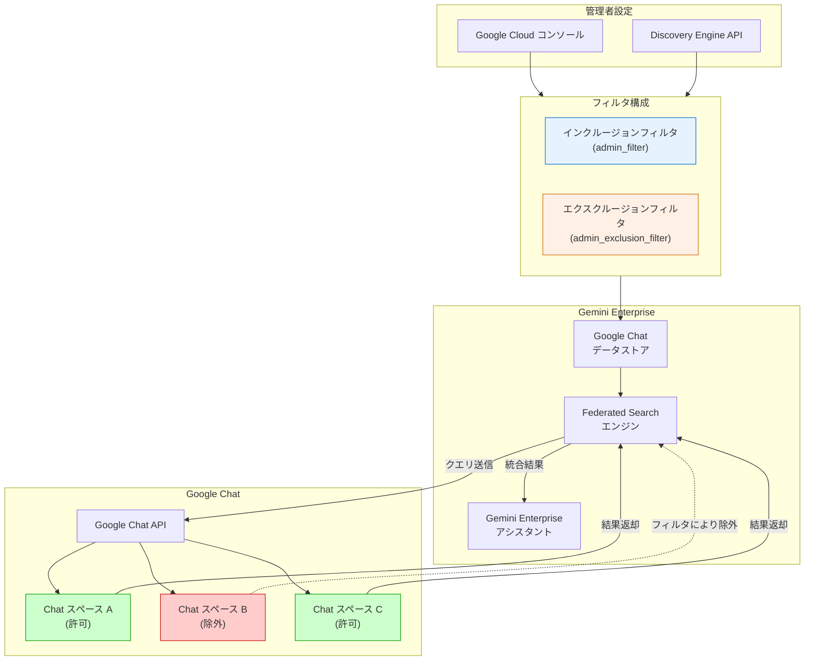

# Gemini Enterprise: Google Chat データストア向け拡張フィルタリング機能 (Preview)

**リリース日**: 2026-04-13

**サービス**: Gemini Enterprise

**機能**: Enhanced Filtering for Google Chat Data Stores (Preview)

**ステータス**: Public Preview

[このアップデートのインフォグラフィックを見る](https://takech9203.github.io/google-cloud-news-summary/20260413-gemini-enterprise-google-chat-filtering.html)

## 概要

Gemini Enterprise において、Google Chat データストアに対する拡張フィルタリング機能が Public Preview として提供開始されました。この機能により、管理者は Google Cloud コンソールまたは API を使用して、Google Chat データストアにフィルタを設定し、Gemini Enterprise アシスタントがアクセスできる Google Chat データの範囲を精密に制御できるようになります。

Google Chat コネクタは 2026年3月11日に Preview として初めて導入され、組織の Google Chat データを Gemini Enterprise に接続して自然言語で検索できる機能を提供してきました。今回のアップデートでは、そのデータストアに対してインクルージョン（包含）フィルタおよびエクスクルージョン（除外）フィルタを構成する機能が追加され、Federated Search においてどのコンテンツがアシスタントに公開されるかを詳細に定義できるようになります。

この機能は、Microsoft SharePoint（3月13日）、Microsoft OneDrive（3月24日）に続く、Gemini Enterprise データストアコネクタ向け拡張フィルタリング機能の第3弾として位置づけられます。情報セキュリティやコンプライアンスの観点から、組織内のチャットデータへのアクセスを適切に管理したい管理者に特に有用です。

**アップデート前の課題**

- Google Chat データストアを Gemini Enterprise に接続した場合、接続されたすべてのチャットデータがアシスタントの検索対象となり、特定のコンテンツのみに制限する手段がなかった
- 機密性の高いチャットスペースやプロジェクトの会話を検索対象から除外するには、データストア自体を分離するなどの回避策が必要だった
- Federated Search において、管理者がデータのスコープをきめ細かく制御する方法が提供されていなかった

**アップデート後の改善**

- Google Cloud コンソールまたは API からインクルージョンフィルタ（`admin_filter`）を設定し、特定の Google Chat コンテンツのみを検索対象に含めることが可能になった
- エクスクルージョンフィルタ（`admin_exclusion_filter`）を設定し、機密性の高いコンテンツを検索対象から除外できるようになった
- フィルタの組み合わせにより、包含と除外を柔軟に構成して精密なデータアクセス制御が実現可能になった

## アーキテクチャ図



管理者が Google Cloud コンソールまたは API を通じてフィルタを構成すると、Federated Search エンジンが Google Chat API に対してクエリを送信する際に、設定されたフィルタに基づいてコンテンツの包含・除外が適用されます。

## サービスアップデートの詳細

### 主要機能

1. **インクルージョンフィルタ（`admin_filter`）**
   - データコネクタの `params` オブジェクト内で設定する包含フィルタ
   - 指定した条件に一致する Google Chat コンテンツのみをアシスタントの検索対象に含める
   - 特定のチャットスペースやコンテンツに検索範囲を限定したい場合に使用

2. **エクスクルージョンフィルタ（`admin_exclusion_filter`）**
   - データコネクタの `params` オブジェクト内で設定する除外フィルタ
   - 指定した条件に一致する Google Chat コンテンツをアシスタントの検索対象から除外する
   - 機密性の高い会話やプロジェクトを検索対象から外したい場合に使用

3. **複数の設定方法**
   - Google Cloud コンソールの GUI から直感的にフィルタを設定可能
   - Discovery Engine API（`setUpDataConnector` メソッド）を使用してプログラマティックにフィルタを設定可能
   - 既存のデータストアに対するフィルタの追加・更新にも対応

## 技術仕様

### フィルタタイプ

| フィルタタイプ | パラメータキー | 説明 |
|------|------|------|
| インクルージョンフィルタ | `admin_filter` | 指定したコンテンツのみを検索対象に含める |
| エクスクルージョンフィルタ | `admin_exclusion_filter` | 指定したコンテンツを検索対象から除外する |
| レガシーフィルタ | `structured_search_filter` | 以前の API フィルタ設定方式（後方互換性のため維持） |

### フィルタの組み合わせ動作

| フィルタの組み合わせ | 動作 |
|------|------|
| インクルージョンのみ | 指定したコンテンツのみが検索対象になる |
| エクスクルージョンのみ | 指定したコンテンツが検索対象から除外される |
| インクルージョン + エクスクルージョン | インクルージョンで広範囲を含めつつ、エクスクルージョンで特定のコンテンツを除外する |

### API 設定例

```json
{
  "collectionId": "COLLECTION_ID",
  "collectionDisplayName": "Google Chat Data Store",
  "dataConnector": {
    "dataSource": "gchat_federated_search",
    "params": {
      "admin_filter": {
        "FILTER_KEY": [
          "FILTER_VALUE1",
          "FILTER_VALUE2"
        ]
      },
      "admin_exclusion_filter": {
        "FILTER_KEY": [
          "EXCLUDED_VALUE1"
        ]
      }
    },
    "entities": [
      {
        "entityName": "message"
      }
    ],
    "connectorType": "THIRD_PARTY_FEDERATED",
    "connectorModes": [
      "FEDERATED"
    ]
  }
}
```

## 設定方法

### 前提条件

1. Gemini Enterprise が有効化された Google Cloud プロジェクト
2. Google Workspace の「他の Google プロダクトのスマート機能」が有効化されていること
3. ID プロバイダの構成が完了していること（データソースのアクセス制御のため）
4. Google Chat データストアが作成済みで「Active」状態であること

### 手順

#### ステップ 1: Google Chat データストアの確認

Google Cloud コンソールで Gemini Enterprise ページに移動し、Data stores セクションで Google Chat データストアのステータスが「Active」であることを確認します。

#### ステップ 2: コンソールからフィルタを設定する場合

1. Google Cloud コンソールで Gemini Enterprise ページを開く
2. ナビゲーションメニューから「Data stores」をクリック
3. 対象の Google Chat データストアを選択
4. フィルタ設定セクションで、インクルージョンまたはエクスクルージョンフィルタを構成
5. フィルタの種類（Include in search / Exclude from search）を選択
6. フィルタ値を入力して保存

#### ステップ 3: API からフィルタを設定する場合

```bash
curl -X POST \
  -H "Authorization: Bearer $(gcloud auth print-access-token)" \
  -H "Content-Type: application/json" \
  -H "X-Goog-User-Project: PROJECT_ID" \
  "https://ENDPOINT_LOCATION-discoveryengine.googleapis.com/v1alpha/projects/PROJECT_ID/locations/LOCATION:setUpDataConnector" \
  -d '{
    "collectionId": "COLLECTION_ID",
    "collectionDisplayName": "COLLECTION_DISPLAY_NAME",
    "dataConnector": {
      "dataSource": "gchat_federated_search",
      "params": {
        "admin_filter": {
          "FILTER_KEY": ["FILTER_VALUE1", "FILTER_VALUE2"]
        }
      },
      "entities": [{"entityName": "message"}],
      "connectorType": "THIRD_PARTY_FEDERATED",
      "connectorModes": ["FEDERATED"]
    }
  }'
```

`PROJECT_ID`、`ENDPOINT_LOCATION`（us / eu / global）、`LOCATION`、`COLLECTION_ID` を環境に合わせて置き換えてください。

## メリット

### ビジネス面

- **情報セキュリティの強化**: 機密性の高いチャットスペースや会話を検索対象から除外することで、意図しない情報漏洩リスクを低減できる
- **コンプライアンス対応**: 規制要件に応じて、アシスタントがアクセスできるデータの範囲を明確に定義・管理できる
- **部門別アクセス制御**: 部門やプロジェクトごとにアシスタントが参照できるチャットデータを限定し、適切な情報境界を設定できる

### 技術面

- **柔軟な設定方法**: GUI（コンソール）と API の両方からフィルタを設定できるため、手動管理と自動化の両方に対応
- **既存コネクタとの一貫性**: Microsoft SharePoint や OneDrive のフィルタリングと同じアーキテクチャ（`admin_filter` / `admin_exclusion_filter`）を採用しており、学習コストが低い
- **Federated Search との統合**: データをコピーせずにリアルタイムで Google Chat API に対してフィルタリングが適用されるため、データの鮮度が保たれる

## デメリット・制約事項

### 制限事項

- この機能は **Public Preview** であり、SLA の対象外。本番環境での利用には注意が必要
- フィルタは **Federated Search にのみ適用**され、Google Chat アクションには適用されない
- Google Chat データストアは **EU、US、Global ロケーションのみ**でサポートされる
- Pre-GA 機能であるため、サポートが限定される可能性がある

### 考慮すべき点

- Google Chat のデータレジデンシー（DRZ）は Google Cloud 内でのみ保証される。Google Chat 自体のデータ保存場所については Google Workspace の規約を確認する必要がある
- CMEK（Customer-managed encryption keys）は Google Cloud 内のデータのみに適用され、Google Chat に保存されたデータには Cloud KMS の制御が及ばない
- 1つのアプリケーションに同一コネクタタイプの複数データストア（例: 2つの Google Chat データストア）を関連付けることは推奨されない
- 最適なレスポンス品質を得るには、Gemini 3.1 バージョンの使用が推奨される

## ユースケース

### ユースケース 1: 機密プロジェクトの除外

**シナリオ**: ある企業では、M&A 関連の議論が行われるチャットスペースや、経営会議用のスペースが存在する。これらの機密性の高いスペースのデータを、一般社員が利用する Gemini Enterprise アシスタントの検索結果から除外したい。

**実装例**:
```json
{
  "admin_exclusion_filter": {
    "Space": [
      "spaces/confidential-ma-project",
      "spaces/executive-meetings"
    ]
  }
}
```

**効果**: 機密情報が一般的な検索結果に含まれることを防止し、情報セキュリティを確保しつつ、その他のチャットデータは引き続き検索可能に保つことができる。

### ユースケース 2: 部門限定のナレッジアシスタント

**シナリオ**: エンジニアリング部門専用の Gemini Enterprise アプリケーションを構築し、エンジニアリング関連のチャットスペースのデータのみを検索対象としたい。

**実装例**:
```json
{
  "admin_filter": {
    "Space": [
      "spaces/engineering-general",
      "spaces/engineering-architecture",
      "spaces/engineering-incidents"
    ]
  }
}
```

**効果**: エンジニアリング部門に関連するチャットデータのみを検索対象にすることで、より精度の高い回答が得られるとともに、他部門の情報が意図せず参照されることを防止できる。

## 利用可能リージョン

Google Chat データストアは以下のロケーションでサポートされています。

| ロケーション | サポート状況 |
|------|------|
| US（マルチリージョン） | サポート対象 |
| EU（マルチリージョン） | サポート対象 |
| Global | サポート対象 |

US または EU ロケーションを選択した場合は、Google マネージド暗号化キーまたは Cloud KMS キーによる暗号化設定が可能です。

## 関連サービス・機能

- **Gemini Enterprise Google Chat コネクタ**: 今回のフィルタリング機能の基盤となる Google Chat データストア接続機能（2026年3月11日 Preview 開始）
- **Gemini Enterprise SharePoint フィルタリング**: 同様のフィルタリング機能を Microsoft SharePoint データストアに提供（2026年3月13日 Preview 開始）
- **Gemini Enterprise OneDrive フィルタリング**: 同様のフィルタリング機能を Microsoft OneDrive データストアに提供（2026年3月24日 Preview 開始）
- **Vertex AI Search**: Gemini Enterprise のバックエンドとして Federated Search を提供する検索エンジン基盤
- **Google Workspace**: Google Chat データの元となるコラボレーションプラットフォーム

## 参考リンク

- [インフォグラフィック](https://takech9203.github.io/google-cloud-news-summary/20260413-gemini-enterprise-google-chat-filtering.html)
- [公式リリースノート](https://cloud.google.com/release-notes#April_13_2026)
- [Google Chat データストアのセットアップ](https://cloud.google.com/gemini/enterprise/docs/connectors/gchat/set-up-data-store)
- [Google Chat データストアへのフィルタ追加](https://cloud.google.com/gemini/enterprise/docs/connectors/gchat/add-filters-to-gchat-data-store)
- [Google Chat コネクタの概要](https://cloud.google.com/gemini/enterprise/docs/connectors/gchat)
- [Gemini Enterprise コネクタの概要](https://cloud.google.com/gemini/enterprise/docs/connectors/introduction-to-connectors-and-data-stores)

## まとめ

Gemini Enterprise の Google Chat データストア向け拡張フィルタリング機能は、組織のチャットデータに対するアクセス制御を大幅に強化する重要なアップデートです。SharePoint や OneDrive で既に提供されているフィルタリングパターンと一貫性のあるアーキテクチャにより、管理者は学習コストを抑えつつ、複数のデータソースにわたる統一的なデータガバナンスを実現できます。Preview 段階ではありますが、情報セキュリティやコンプライアンスの要件が高い組織は、早期に検証を開始し、本番環境への適用に備えることを推奨します。

---

**タグ**: #GeminiEnterprise #GoogleChat #DataStore #Filtering #FederatedSearch #Preview #DataGovernance #Security #Connectors
