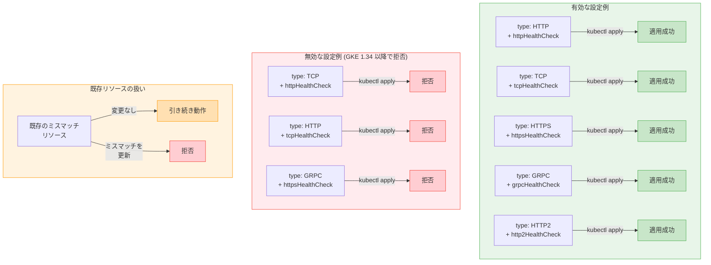

# Google Kubernetes Engine (GKE): HealthCheckPolicy バリデーション強化

**リリース日**: 2026-04-13

**サービス**: Google Kubernetes Engine (GKE)

**機能**: HealthCheckPolicy Validation Enhancement

**ステータス**: Change

[このアップデートのインフォグラフィックを見る](https://takech9203.github.io/google-cloud-news-summary/20260413-gke-healthcheckpolicy-validation.html)

## 概要

GKE バージョン 1.34 以降において、GKE Gateway API の HealthCheckPolicy カスタムリソースのバリデーションが強化された。具体的には、HealthCheckPolicy の `config` セクション内の `type` フィールドと、実際に指定されたヘルスチェック設定フィールド (例: `httpHealthCheck`, `tcpHealthCheck`) の整合性が検証されるようになった。これにより、設定ミスによるヘルスチェックの意図しない動作を未然に防止できる。

以前のバージョンの GKE では、`type` フィールドと実際のヘルスチェック設定フィールドが一致しない場合でもカスタムリソースが受け入れられていた。その場合、`type` フィールドの値が優先され、ヘルスチェック設定フィールドの内容は無視されるという暗黙的な動作があった。GKE 1.34 以降では、このようなミスマッチが検出された場合に `kubectl` がポリシーを拒否するため、設定の意図と実際の動作の乖離を防止できる。

このアップデートは、GKE Gateway API を使用してロードバランサのヘルスチェックを構成しているプラットフォームエンジニアやクラスタ管理者を対象としている。既存のミスマッチを含む HealthCheckPolicy リソースは引き続き動作するが、更新時には新たなミスマッチの導入や既存のミスマッチフィールドの変更が禁止される。

**アップデート前の課題**

- `type: TCP` と指定しながら `httpHealthCheck` を設定するなど、`type` フィールドとヘルスチェック設定が不一致でも受け入れられていた
- 不一致の場合、`type` フィールドの値のみが使用され、設定したヘルスチェックフィールドの内容が無視されるという暗黙的な動作があった
- 設定ミスが検出されないまま運用され、意図しないプロトコルでヘルスチェックが実行される可能性があった

**アップデート後の改善**

- HealthCheckPolicy の作成・更新時に `type` フィールドとヘルスチェック設定フィールドの整合性が自動的に検証されるようになった
- ミスマッチが検出された場合、`kubectl` がポリシーを即座に拒否するため、設定ミスをデプロイ前に防止できる
- 既存のミスマッチを含むリソースは後方互換性のため免除され、引き続き動作する

## アーキテクチャ図



GKE 1.34 以降の HealthCheckPolicy バリデーションの動作を示している。`type` フィールドと対応するヘルスチェック設定フィールドが一致する場合のみ適用が成功し、不一致の場合は拒否される。既存のミスマッチリソースは免除されるが、更新時に新たなミスマッチを導入することはできない。

## サービスアップデートの詳細

### 主要機能

1. **type フィールドとヘルスチェック設定の整合性検証**
   - HealthCheckPolicy の `config.type` フィールドが、指定されたヘルスチェック設定フィールドと一致するかを検証
   - 例: `type: TCP` を指定した場合、`tcpHealthCheck` フィールドの設定が必要であり、`httpHealthCheck` を設定するとバリデーションエラーとなる
   - GKE バージョン 1.34 以降で自動的に適用される

2. **既存リソースの後方互換性**
   - GKE 1.34 へのアップグレード前に作成された、ミスマッチを含む HealthCheckPolicy リソースは引き続き動作する
   - これらの既存リソースは免除 (exempt) として扱われ、既存の動作が維持される
   - ただし、既存リソースを更新する際に新たなミスマッチを導入したり、既存のミスマッチフィールドを別の無効な値に変更することはできない

3. **デプロイ時の即時フィードバック**
   - `kubectl apply` や `kubectl create` の実行時にバリデーションエラーが即座に返される
   - CI/CD パイプラインでの設定ミス検出が容易になり、本番環境への不正な設定のデプロイを防止

## 技術仕様

### type フィールドとヘルスチェック設定の対応表

| type フィールド | 対応するヘルスチェック設定 | 主な用途 |
|------|------|------|
| `HTTP` | `httpHealthCheck` | HTTP エンドポイントのヘルスチェック |
| `HTTPS` | `httpsHealthCheck` | HTTPS エンドポイントのヘルスチェック |
| `TCP` | `tcpHealthCheck` | TCP ポートの疎通確認 |
| `GRPC` | `grpcHealthCheck` | gRPC ヘルスチェックプロトコル |
| `HTTP2` | `http2HealthCheck` | HTTP/2 エンドポイントのヘルスチェック |

### バリデーションルール

| シナリオ | GKE 1.33 以前 | GKE 1.34 以降 |
|------|------|------|
| type と設定が一致 | 適用成功 | 適用成功 |
| type と設定が不一致 (新規作成) | 適用成功 (type が優先、設定は無視) | 拒否 |
| type と設定が不一致 (既存リソース、変更なし) | 動作継続 | 動作継続 (免除) |
| 既存ミスマッチリソースへの新たなミスマッチ追加 | 適用成功 | 拒否 |

### 有効な HealthCheckPolicy の設定例

```yaml
apiVersion: networking.gke.io/v1
kind: HealthCheckPolicy
metadata:
  name: tcp-healthcheck
  namespace: my-app
spec:
  default:
    checkIntervalSec: 15
    timeoutSec: 5
    healthyThreshold: 2
    unhealthyThreshold: 3
    logConfig:
      enabled: true
    config:
      type: TCP
      tcpHealthCheck:
        port: 8080
  targetRef:
    group: ""
    kind: Service
    name: my-backend-service
```

### 無効な HealthCheckPolicy の設定例 (GKE 1.34 以降で拒否)

```yaml
apiVersion: networking.gke.io/v1
kind: HealthCheckPolicy
metadata:
  name: mismatched-healthcheck
  namespace: my-app
spec:
  default:
    config:
      type: TCP          # TCP を指定
      httpHealthCheck:    # しかし HTTP のヘルスチェック設定を記述 (不一致)
        port: 8080
        requestPath: /health
  targetRef:
    group: ""
    kind: Service
    name: my-backend-service
```

## 設定方法

### 前提条件

1. GKE クラスタが バージョン 1.34 以降にアップグレードされていること
2. GKE Gateway API が有効化されていること (`--gateway-api=standard`)
3. HealthCheckPolicy CRD がクラスタにインストールされていること

### 手順

#### ステップ 1: 既存の HealthCheckPolicy リソースの確認

```bash
kubectl get healthcheckpolicies --all-namespaces
```

クラスタ内の全ての HealthCheckPolicy リソースを一覧表示し、確認対象を把握する。

#### ステップ 2: 各ポリシーの type フィールドとヘルスチェック設定の整合性を確認

```bash
kubectl get healthcheckpolicy <POLICY_NAME> -n <NAMESPACE> -o yaml
```

出力された YAML の `spec.default.config` セクションで、`type` フィールドと実際のヘルスチェック設定フィールド (例: `httpHealthCheck`, `tcpHealthCheck`) が一致しているかを確認する。

#### ステップ 3: ミスマッチの修正

ミスマッチが見つかった場合、`type` フィールドまたはヘルスチェック設定フィールドのいずれかを修正して整合性を確保する。

```yaml
# 修正前 (ミスマッチ)
spec:
  default:
    config:
      type: TCP
      httpHealthCheck:        # type: TCP と不一致
        port: 8080
        requestPath: /health

# 修正後 (パターン A: type に合わせて設定を変更)
spec:
  default:
    config:
      type: TCP
      tcpHealthCheck:         # type: TCP と一致
        port: 8080

# 修正後 (パターン B: 設定に合わせて type を変更)
spec:
  default:
    config:
      type: HTTP
      httpHealthCheck:        # type: HTTP と一致
        port: 8080
        requestPath: /health
```

意図するヘルスチェックプロトコルに基づいて、どちらのパターンで修正するかを判断する。

#### ステップ 4: 修正の適用と確認

```bash
kubectl apply -f healthcheckpolicy.yaml
kubectl describe healthcheckpolicy <POLICY_NAME> -n <NAMESPACE>
```

修正したポリシーを適用し、Conditions セクションで正常にアタッチされていることを確認する。

## メリット

### ビジネス面

- **運用リスクの低減**: 設定ミスが自動的に検出されるため、意図しないヘルスチェック動作による本番障害リスクが低減される
- **デバッグ時間の短縮**: ヘルスチェックの設定ミスがデプロイ時に即座にフィードバックされるため、問題の原因調査にかかる時間を大幅に短縮できる

### 技術面

- **設定の明示性向上**: `type` フィールドとヘルスチェック設定が必ず一致するため、ポリシーの意図が明確になり、コードレビューや監査が容易になる
- **CI/CD パイプラインとの親和性**: バリデーションエラーが `kubectl` レベルで検出されるため、GitOps ワークフローや CI/CD パイプラインでの品質ゲートとして機能する
- **後方互換性の確保**: 既存リソースが免除されるため、GKE 1.34 へのアップグレード時にワークロードへの即時影響がない

## デメリット・制約事項

### 制限事項

- GKE バージョン 1.34 以降でのみ有効であり、1.33 以前のクラスタでは従来の動作が継続される
- 既存のミスマッチリソースは免除されるため、アップグレード後に自動的に修正されるわけではない。手動での確認と修正が必要

### 考慮すべき点

- GKE 1.34 へのアップグレード前に、既存の HealthCheckPolicy リソースに `type` フィールドとヘルスチェック設定のミスマッチがないか事前に確認することを推奨する
- 免除された既存リソースは動作し続けるが、`type` フィールドの値が実際のヘルスチェックプロトコルとして使用され、ヘルスチェック設定フィールドの内容は無視されるという従来の動作が維持される。この暗黙的な動作を理解した上で、早期の修正を検討すること
- CI/CD パイプラインでマニフェストの lint や dry-run テストを実行している場合、GKE 1.34 クラスタへの適用時に新たなバリデーションエラーが発生する可能性がある

## ユースケース

### ユースケース 1: TCP バックエンドサービスのヘルスチェック設定

**シナリオ**: GKE Gateway の背後で TCP ベースのバックエンドサービス (データベースプロキシなど) を運用しており、TCP ポートの疎通確認でヘルスチェックを行いたい。

**実装例**:
```yaml
apiVersion: networking.gke.io/v1
kind: HealthCheckPolicy
metadata:
  name: tcp-backend-healthcheck
  namespace: database
spec:
  default:
    checkIntervalSec: 10
    timeoutSec: 5
    unhealthyThreshold: 3
    config:
      type: TCP
      tcpHealthCheck:
        port: 5432
  targetRef:
    group: ""
    kind: Service
    name: db-proxy-service
```

**効果**: `type: TCP` と `tcpHealthCheck` が一致しているため、GKE 1.34 でもバリデーションを通過する。TCP ポート 5432 の疎通確認によるヘルスチェックが意図通りに動作する。

### ユースケース 2: GKE 1.34 アップグレード前の既存設定の監査

**シナリオ**: GKE 1.33 で運用中のクラスタを 1.34 にアップグレードする前に、既存の HealthCheckPolicy リソースにミスマッチがないか確認したい。

**実装例**:
```bash
# 全 HealthCheckPolicy を YAML で出力して確認
kubectl get healthcheckpolicies --all-namespaces -o yaml | \
  grep -A 10 "config:" | grep -E "(type:|HealthCheck:)"
```

**効果**: アップグレード前にミスマッチを特定し、修正することで、アップグレード後のポリシー更新時にバリデーションエラーが発生するリスクを排除できる。

## 関連サービス・機能

- **GKE Gateway API**: HealthCheckPolicy はGKE Gateway API のポリシーリソースの一つであり、ロードバランサのヘルスチェック動作を制御する
- **Cloud Load Balancing**: GKE Gateway の基盤となるロードバランシングサービス。HealthCheckPolicy の設定は Cloud Load Balancing のヘルスチェックリソースにマッピングされる
- **GCPBackendPolicy**: バックエンドサービスのセッションアフィニティ、Cloud Armor、CDN などを構成するポリシーリソース。HealthCheckPolicy と同様に Service を対象とする
- **GCPGatewayPolicy**: Gateway のフロントエンド設定 (SSL ポリシー、グローバルアクセスなど) を構成するポリシーリソース

## 参考リンク

- [インフォグラフィック](https://takech9203.github.io/google-cloud-news-summary/20260413-gke-healthcheckpolicy-validation.html)
- [公式リリースノート](https://cloud.google.com/release-notes#April_13_2026)
- [Gateway リソースのヘルスチェック構成](https://docs.cloud.google.com/kubernetes-engine/docs/how-to/configure-gateway-resources#configure_health_check)
- [GKE Gateway API の概要](https://docs.cloud.google.com/kubernetes-engine/docs/concepts/gateway-api)
- [Cloud Load Balancing ヘルスチェックの概要](https://docs.cloud.google.com/load-balancing/docs/health-check-concepts)
- [Compute Engine HealthChecks REST API リファレンス](https://docs.cloud.google.com/compute/docs/reference/rest/v1/healthChecks)

## まとめ

GKE 1.34 における HealthCheckPolicy バリデーションの強化は、Gateway API のヘルスチェック設定の信頼性を向上させる重要な変更である。`type` フィールドとヘルスチェック設定フィールドの整合性が自動検証されることで、設定ミスによる意図しない動作を未然に防止できるようになった。GKE 1.34 へのアップグレードを予定しているクラスタ管理者は、事前に既存の HealthCheckPolicy リソースを確認し、ミスマッチが存在する場合は修正を行うことを推奨する。

---

**タグ**: #GKE #GatewayAPI #HealthCheckPolicy #Kubernetes #Validation #LoadBalancing #HealthCheck
