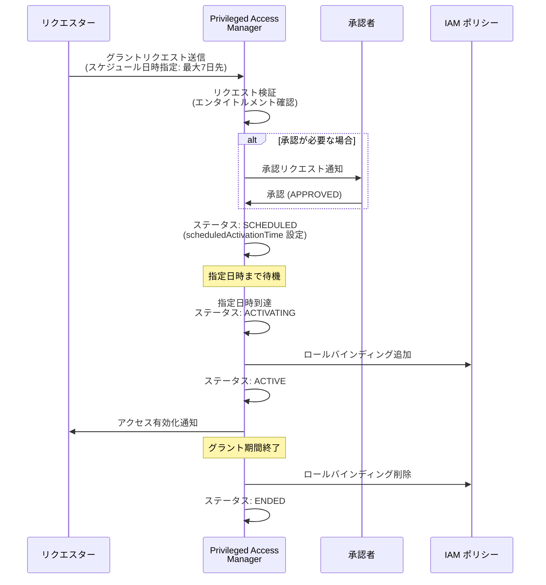

# Identity and Access Management (IAM): Privileged Access Manager グラントスケジューリング

**リリース日**: 2026-04-13

**サービス**: Identity and Access Management (IAM)

**機能**: Privileged Access Manager Grant Scheduling (Preview)

**ステータス**: Preview

:bar_chart: [このアップデートのインフォグラフィックを見る](https://takech9203.github.io/google-cloud-news-summary/20260413-iam-pam-grant-scheduling.html)

## 概要

Google Cloud の Privileged Access Manager (PAM) に、グラントリクエストのスケジューリング機能がプレビューとして追加されました。この機能により、リクエスターは最大 7 日前からグラントリクエストを事前にスケジュールできるようになります。計画的なメンテナンスやオンコールシフトに合わせて、特権アクセスの取得タイミングを事前に設定できます。

Privileged Access Manager は、Just-In-Time (JIT) の一時的な特権昇格を制御するための IAM 機能です。管理者がエンタイトルメント (権限付与ポリシー) を作成し、対象のプリンシパルがそのエンタイトルメントに対してグラントをリクエストすることで、一時的にロールが付与されます。今回のグラントスケジューリング機能は、このリクエストのタイミングを「今すぐ」だけでなく「将来の特定の時刻」に設定できるようにする拡張です。

この機能は、定期メンテナンス、オンコール対応、計画的なデプロイメントなど、事前にアクセスが必要になるタイミングが分かっているシナリオで特に有用です。セキュリティチームや運用チームが、計画的な作業のために特権アクセスを事前に準備できるようになります。

**アップデート前の課題**

- グラントリクエストは即時実行のみ対応しており、計画的なメンテナンス作業の前に事前準備ができなかった
- オンコールシフトの開始時刻に合わせてアクセスを取得するには、シフト開始時に手動でリクエストを行う必要があった
- 深夜のメンテナンスウィンドウでは、作業開始直前にリクエストと承認のプロセスを完了させる必要があり、承認が遅延するリスクがあった

**アップデート後の改善**

- 最大 7 日前からグラントリクエストをスケジュールでき、計画的な作業に合わせてアクセスを事前準備できるようになった
- 承認プロセスを営業時間内に完了させ、実際のアクセス有効化は指定した将来の時刻に自動的に行われるようになった
- オンコールシフトの開始に合わせた自動的なアクセス付与が可能になり、手動操作の負担が軽減された

## アーキテクチャ図



このシーケンス図は、グラントスケジューリングの全体的なフローを示しています。リクエスターがスケジュール日時を指定してリクエストを送信し、承認後に SCHEDULED ステータスとなり、指定日時に自動的にアクセスが有効化されます。

## サービスアップデートの詳細

### 主要機能

1. **事前スケジューリング (最大 7 日前)**
   - グラントリクエスト時に将来の有効化日時 (`scheduledActivationTime`) を指定可能
   - 最大 7 日先までのスケジュール設定に対応
   - RFC 3339 形式のタイムスタンプで日時を指定

2. **SCHEDULED ステータスの導入**
   - 承認済みかつ有効化待ちのグラントに対して `SCHEDULED` ステータスが割り当てられる
   - 指定日時になると自動的に `ACTIVATING` に遷移し、ロールバインディングが追加される
   - グラントのタイムラインイベントに `scheduled` イベントが記録される

3. **既存ワークフローとの統合**
   - 承認ワークフロー (マルチレベル承認を含む) との完全な互換性
   - 監査ログへの記録 (Cloud Audit Logs)
   - メール通知およびPub/Sub 通知との連携

## 技術仕様

### グラントのライフサイクルステータス

| ステータス | 説明 |
|------|------|
| APPROVAL_AWAITED | 承認待ち |
| SCHEDULED | 承認済み、指定日時まで待機中 (新規) |
| ACTIVATING | アクセス有効化処理中 |
| ACTIVE | アクセス有効 |
| ENDED | アクセス期間終了 |
| EXPIRED | 承認期限切れ (24 時間以内に未承認) |
| REVOKED | 取り消し済み |
| WITHDRAWN | 撤回済み |

### スケジューリング関連の API レスポンス

グラントのタイムラインイベントに `scheduled` イベントが追加されます。

```json
{
  "timeline": {
    "events": [
      {
        "eventTime": "2026-04-13T10:00:00Z",
        "requested": {
          "expireTime": "2026-04-14T10:00:00Z"
        }
      },
      {
        "eventTime": "2026-04-13T12:00:00Z",
        "approved": {
          "reason": "Scheduled maintenance approved",
          "actor": "approver@example.com"
        }
      },
      {
        "eventTime": "2026-04-13T12:00:00Z",
        "scheduled": {
          "scheduledActivationTime": "2026-04-15T02:00:00Z"
        }
      }
    ]
  }
}
```

## 設定方法

### 前提条件

1. Privileged Access Manager が有効化されたプロジェクト、フォルダ、または組織
2. 対象のエンタイトルメントに対するリクエスター権限
3. `gcloud` CLI の最新バージョン (または Google Cloud コンソール)

### 手順

#### ステップ 1: エンタイトルメントの確認

```bash
# 利用可能なエンタイトルメントを一覧表示
gcloud pam entitlements list \
  --project=my-project \
  --location=global
```

スケジューリング機能は既存のエンタイトルメントに対してそのまま利用できます。エンタイトルメント側の追加設定は不要です。

#### ステップ 2: スケジュール付きグラントリクエストの作成 (REST API)

```bash
# スケジュール付きグラントリクエストを作成
curl -X POST \
  -H "Authorization: Bearer $(gcloud auth print-access-token)" \
  -H "Content-Type: application/json; charset=utf-8" \
  -d '{
    "requestedDuration": "3600s",
    "justification": {
      "unstructuredJustification": "Scheduled maintenance window"
    },
    "scheduledActivationTime": "2026-04-15T02:00:00Z"
  }' \
  "https://privilegedaccessmanager.googleapis.com/v1/projects/my-project/locations/global/entitlements/ENTITLEMENT_ID/grants"
```

`scheduledActivationTime` に将来の日時を RFC 3339 形式で指定することで、グラントの有効化タイミングをスケジュールできます。

#### ステップ 3: グラントステータスの確認

```bash
# グラントのステータスを確認
gcloud pam grants describe GRANT_ID \
  --entitlement=ENTITLEMENT_ID \
  --project=my-project \
  --location=global
```

承認後、ステータスが `SCHEDULED` に変わり、`scheduledActivationTime` に指定した日時にアクセスが自動的に有効化されます。

## メリット

### ビジネス面

- **運用効率の向上**: メンテナンスウィンドウに合わせた事前準備が可能になり、作業開始時の待ち時間を排除
- **承認プロセスの最適化**: 承認者は営業時間中に承認を完了でき、深夜・早朝のメンテナンスでも承認遅延のリスクを回避
- **コンプライアンスの強化**: 計画的なアクセス管理により、監査証跡がより明確になり、規制要件への対応が容易に

### 技術面

- **自動化の促進**: スケジュールされたメンテナンスパイプラインとの統合が容易に。サービスアカウントによる承認自動化と組み合わせることで、完全自動化が可能
- **最小権限の原則の徹底**: アクセスが必要な正確なタイミングでのみ権限が付与され、不要な期間の特権保持を防止
- **既存ワークフローとの互換性**: マルチレベル承認、スコープカスタマイズ、監査ログなど既存の PAM 機能と完全に統合

## デメリット・制約事項

### 制限事項

- プレビュー段階の機能であり、SLA の対象外。本番環境での利用は慎重に検討が必要
- スケジュール可能な期間は最大 7 日先まで。7 日を超える事前スケジュールには対応していない
- 1 ユーザーあたりエンタイトルメントごとに最大 10 個のオープンなグラント (Active または Approval awaited ステータス) の制限は従来どおり適用

### 考慮すべき点

- スケジュール済みのグラントが有効化される前に、対象リソースの IAM ポリシーが外部から変更されると、予期しない動作が発生する可能性がある
- Terraform で IAM ポリシーを管理している場合は、非権威的リソース (non-authoritative resources) を使用すること。権威的リソースを使用すると、PAM によるロールバインディングが上書きされるリスクがある
- 承認が必要なエンタイトルメントでは、スケジュール日時より前に承認が完了していない場合、24 時間の承認期限切れが通常どおり適用される

## ユースケース

### ユースケース 1: 定期メンテナンスウィンドウ

**シナリオ**: データベース管理者が毎週水曜日の深夜 2:00 (JST) に定期メンテナンスを実施する。`roles/cloudsql.admin` の一時的な特権が必要。

**実装例**:
```bash
# 月曜日の営業時間中にリクエストを作成
curl -X POST \
  -H "Authorization: Bearer $(gcloud auth print-access-token)" \
  -H "Content-Type: application/json" \
  -d '{
    "requestedDuration": "7200s",
    "justification": {
      "unstructuredJustification": "Weekly DB maintenance - CHANGE-1234"
    },
    "scheduledActivationTime": "2026-04-15T17:00:00Z"
  }' \
  "https://privilegedaccessmanager.googleapis.com/v1/projects/my-project/locations/global/entitlements/db-admin-entitlement/grants"
```

**効果**: 承認者は営業時間中に承認を完了でき、深夜のメンテナンス開始時には自動的にアクセスが有効化される。手動操作の負担と承認遅延リスクが排除される。

### ユースケース 2: オンコールシフトのローテーション

**シナリオ**: SRE チームがオンコールシフトのローテーションに合わせて、本番環境への特権アクセスを事前にスケジュールする。

**効果**: シフト開始時に自動的に特権アクセスが付与され、インシデント発生時に即座に対応可能。シフト終了後はグラント期間の終了とともにアクセスが自動的に取り消される。

### ユースケース 3: 計画的なデプロイメント

**シナリオ**: リリースマネージャーが週次デプロイメントのために、デプロイ担当者に本番環境のデプロイ権限を事前にスケジュールする。サービスアカウントによる自動承認と組み合わせて、完全自動化されたデプロイパイプラインを実現。

**効果**: デプロイ担当者はデプロイウィンドウ開始時に自動的に必要な権限を取得し、完了後は自動的に権限が取り消される。ITSM チケットとの連携による承認自動化も可能。

## 関連サービス・機能

- **[マルチレベル・マルチパーティ承認](https://cloud.google.com/iam/docs/pam-create-entitlements)** (Preview): スケジューリングと組み合わせることで、複数段階の承認を事前に完了し、指定日時に自動有効化できる
- **[スコープカスタマイズ](https://cloud.google.com/iam/docs/pam-request-temporary-elevated-access)** (Preview): グラントリクエスト時に必要なロールとリソースのみに範囲を限定。スケジューリングと組み合わせて最小権限を徹底
- **[サービスアカウント承認](https://cloud.google.com/iam/docs/pam-configure-settings)** (Preview): サービスアカウントを承認者として設定し、プログラマティックな承認を自動化。スケジューリングとの組み合わせで完全自動化を実現
- **[Cloud Audit Logs](https://cloud.google.com/iam/docs/pam-audit-entitlement-events)**: スケジュール済みグラントのすべてのイベント (リクエスト、承認、スケジュール、有効化、終了) が監査ログに記録される
- **[Security Command Center](https://cloud.google.com/security-command-center/docs/service-tiers)**: Enterprise または Premium ティアで PAM の高度な機能 (マルチレベル承認、スコープカスタマイズ) を利用可能

## 参考リンク

- :bar_chart: [インフォグラフィック](https://takech9203.github.io/google-cloud-news-summary/20260413-iam-pam-grant-scheduling.html)
- [公式リリースノート](https://cloud.google.com/release-notes#April_13_2026)
- [Privileged Access Manager の概要](https://cloud.google.com/iam/docs/pam-overview)
- [グラントスケジューリングのドキュメント](https://cloud.google.com/iam/docs/pam-overview#grant-scheduling)
- [一時的な特権アクセスのリクエスト](https://cloud.google.com/iam/docs/pam-request-temporary-elevated-access)
- [PAM REST API リファレンス (Grants)](https://cloud.google.com/iam/docs/reference/pam/rest/v1/folders.locations.entitlements.grants)

## まとめ

Privileged Access Manager のグラントスケジューリング機能は、計画的なメンテナンスやオンコール対応において、特権アクセスの事前準備を可能にする重要なアップデートです。最大 7 日先までのスケジュール設定に対応し、承認プロセスを営業時間内に完了させつつ、実際のアクセス有効化を指定した将来の時刻に自動的に行えます。現在プレビュー段階ですが、運用効率とセキュリティの両面で大きなメリットをもたらす機能であり、定期メンテナンスやオンコールローテーションを行う組織は早期の検証を推奨します。

---

**タグ**: #IAM #PrivilegedAccessManager #PAM #Security #JustInTime #Preview #GrantScheduling
