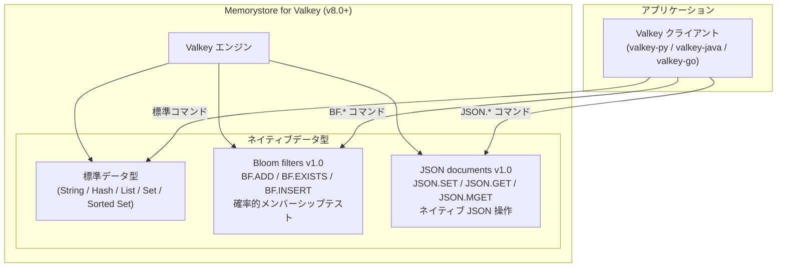

# Memorystore for Valkey: Bloom filters v1.0 および JSON documents v1.0 が GA

**リリース日**: 2026-04-13

**サービス**: Memorystore for Valkey

**機能**: Bloom filters v1.0 / JSON documents v1.0 General Availability

**ステータス**: GA (一般提供)

📊 [このアップデートのインフォグラフィックを見る](https://takech9203.github.io/google-cloud-news-summary/20260413-memorystore-valkey-bloom-filters-json-ga.html)

## 概要

Memorystore for Valkey において、Bloom filters v1.0 および JSON documents v1.0 が General Availability (GA) となった。これにより、Memorystore for Valkey バージョン 8.0 以降のインスタンスで、空間効率の高い確率的データ構造である Bloom filter と、ネイティブ JSON データ型が本番環境向けとして正式にサポートされる。

Bloom filter は、要素がセットに属しているかどうかを高速にテストできる確率的データ構造である。偽陽性 (false positive) は発生し得るが、偽陰性 (false negative) は発生しない。広告の重複排除、不正検知、スパムフィルタリング、ユーザー名の重複チェックなど、大規模なメンバーシップテストが必要なユースケースに最適である。JSON documents は、Memorystore for Valkey 上でネイティブに構造化データを格納・操作する機能を提供し、ドキュメント全体を上書きすることなく部分的な取得・更新が可能となる。

両機能とも、Memorystore for Valkey バージョン 8.0 以降のインスタンスを作成すると自動的に利用可能となり、追加の設定や有効化の手順は不要である。インメモリデータベースとしての高速性を活かしながら、より高度なデータ構造を利用できるようになったことで、アプリケーション設計の選択肢が大幅に広がる。

**アップデート前の課題**

- Bloom filter と JSON documents は Preview 段階であり、本番環境での利用には「Pre-GA Offerings Terms」の制約が適用され、サポートも限定的だった
- メンバーシップテストを行うには、セット型やハッシュ型などの汎用データ構造を使用する必要があり、大量の要素を扱う際にメモリ効率が低かった
- 構造化 JSON データを Valkey に格納する場合、アプリケーション側でシリアライズ/デシリアライズのカスタムコードを実装する必要があった

**アップデート後の改善**

- Bloom filter と JSON documents が GA となり、SLA に基づく本番環境での利用が正式にサポートされた
- Bloom filter により、メモリ効率の高い確率的メンバーシップテストがネイティブに利用可能となった
- JSON documents により、スキーマレスな構造化データの格納・部分更新・クエリがネイティブにサポートされ、カスタムコードが不要となった

## アーキテクチャ図



Memorystore for Valkey v8.0 以降のインスタンスにおけるデータ型の構成を示す。従来の標準データ型に加え、Bloom filters と JSON documents がネイティブデータ型として自動的に利用可能となる。

## サービスアップデートの詳細

### 主要機能

1. **Bloom filters v1.0**
   - 空間効率の高い確率的データ構造で、要素がセットに属しているかどうかを高速にテストできる
   - 複数のハッシュ関数を使用して要素を固定サイズのビット配列にマッピングする仕組み
   - 偽陽性率 (false positive rate) はビット数とハッシュ関数の数を調整することで制御可能
   - Scaling filter (容量を動的に拡張) と Non-scaling filter (固定容量) の 2 種類をサポート
   - Bloom filter オブジェクトは最大 128 MB のメモリを消費可能
   - [valkey-bloom](https://github.com/valkey-io/valkey-bloom) をベースとした実装

2. **JSON documents v1.0**
   - Memorystore for Valkey 上でネイティブに JSON データを格納・操作するためのデータ型
   - RFC 7159 および ECMA-404 JSON データ交換標準に準拠し、UTF-8 Unicode をサポート
   - ドキュメント全体を上書きすることなく、部分的な取得・更新が可能
   - 最大ネスト深度は 128 (CONFIG SET で調整可能)
   - JSON ドキュメントの最大サイズは CONFIG SET json.max-document-size で制限可能 (デフォルトは無制限)
   - JSON module v2 と API 互換
   - [valkey-json](https://github.com/valkey-io/valkey-json) をベースとした実装

3. **自動有効化**
   - Memorystore for Valkey バージョン 8.0 以降のインスタンスを作成すると、Bloom filter と JSON documents は自動的に利用可能
   - 追加のモジュールインストールや設定変更は不要

## 技術仕様

### Bloom filter コマンド一覧

| コマンド | 説明 | カテゴリ |
|---------|------|---------|
| BF.ADD | 単一アイテムを Bloom filter に追加 (フィルタが存在しない場合は作成) | @write, @fast |
| BF.CARD | Bloom filter のカーディナリティを返す | @read, @fast |
| BF.EXISTS | 指定アイテムが Bloom filter に含まれるか判定 | @read, @fast |
| BF.INFO | Bloom filter の使用状況とプロパティを返す | @read, @fast |
| BF.INSERT | 0 個以上のアイテムで Bloom filter を作成、または既存フィルタにアイテムを追加 | @write, @fast |
| BF.MADD | 1 個以上のアイテムを Bloom filter に追加 | @write, @fast |
| BF.MEXISTS | 1 個以上のアイテムが Bloom filter に含まれるか判定 | @read, @fast |
| BF.RESERVE | 指定プロパティで空の Bloom filter を作成 | @read, @fast |

注意: BF.LOAD コマンドは Memorystore for Valkey ではサポートされていない。

### JSON コマンド一覧 (主要なもの)

| コマンド | 説明 |
|---------|------|
| JSON.SET | 指定パスに JSON 値を設定 |
| JSON.GET | 指定パスの JSON 値を取得 |
| JSON.MGET | 複数キーから指定パスの値を取得 |
| JSON.MSET | 複数キーの指定パスに JSON 値を設定 |
| JSON.DEL | 指定パスの JSON 値を削除 |
| JSON.ARRAPPEND | 配列に JSON 値を追加 |
| JSON.NUMINCRBY | 数値を指定値でインクリメント |
| JSON.TOGGLE | boolean 値を true/false で切り替え |
| JSON.TYPE | 指定パスの JSON 値の型を取得 |
| JSON.DEBUG MEMORY | JSON ドキュメントのメモリ使用量を確認 |

### Bloom filter のプロパティ

| プロパティ | 説明 |
|-----------|------|
| Capacity (容量) | フィルタが保持できるアイテム数。Scaling filter は容量到達時に拡張、Non-scaling filter はエラーを返す |
| False positive rate (偽陽性率) | 偽陽性が発生する確率を制御するパラメータ |
| Expansion (拡張) | Scaling filter における容量到達時の拡張率 |
| 最大メモリ | Bloom filter オブジェクトあたり最大 128 MB |

### JSON ドキュメントのプロパティ

| プロパティ | 説明 |
|-----------|------|
| Max document size | 個別 JSON キーのサイズ制限 (デフォルト: 0 = 無制限)。CONFIG SET json.max-document-size で設定 |
| Max depth | JSON オブジェクト/配列の最大ネスト深度 (デフォルト: 128)。CONFIG SET json.max-path-limit で調整可能 |

## 設定方法

### 前提条件

1. Google Cloud プロジェクトが作成済みであること
2. Memorystore for Valkey API が有効化されていること
3. Memorystore for Valkey バージョン 8.0 以降のインスタンスが作成されていること

### 手順

#### ステップ 1: Memorystore for Valkey インスタンスの作成 (バージョン 8.0 以降)

```bash
gcloud memorystore instances create my-valkey-instance \
    --location=us-central1 \
    --engine-version=valkey-8-0 \
    --node-type=highmem-medium \
    --shard-count=3 \
    --replica-count=1
```

バージョン 8.0 以降のインスタンスを作成すると、Bloom filter と JSON documents は自動的に利用可能となる。

#### ステップ 2: Bloom filter の使用例

```bash
# Bloom filter にアイテムを追加
BF.ADD user:visited:ads "ad-12345"

# アイテムの存在確認
BF.EXISTS user:visited:ads "ad-12345"
# 結果: (integer) 1

# 複数アイテムの存在確認
BF.MEXISTS user:visited:ads "ad-12345" "ad-67890"
# 結果: 1) (integer) 1
#        2) (integer) 0

# カスタム設定でフィルタを作成 (容量 10000、偽陽性率 0.01)
BF.RESERVE my-filter 0.01 10000

# フィルタ情報の確認
BF.INFO user:visited:ads
```

#### ステップ 3: JSON documents の使用例

```bash
# JSON ドキュメントの保存
JSON.SET user:1001 $ '{"name":"Taro","age":30,"address":{"city":"Tokyo","zip":"100-0001"}}'

# 部分的な値の取得
JSON.GET user:1001 $.address.city
# 結果: "[\"Tokyo\"]"

# 部分的な値の更新
JSON.SET user:1001 $.age 31

# 数値のインクリメント
JSON.NUMINCRBY user:1001 $.age 1

# 配列操作
JSON.SET user:1001 $.tags '["premium"]'
JSON.ARRAPPEND user:1001 $.tags '"vip"'
```

## メリット

### ビジネス面

- **コスト最適化**: Bloom filter はセット型と比較して大幅にメモリ効率が高く、大量のメンバーシップテストを低コストで実現できる
- **開発効率の向上**: JSON documents により、アプリケーション側でのシリアライズ/デシリアライズのカスタムコードが不要となり、開発・保守コストが削減される
- **GA による安心感**: Preview から GA への移行により、SLA に基づくサポートが提供され、本番環境での利用が正式に保証される

### 技術面

- **メモリ効率**: Bloom filter は固定サイズのビット配列を使用するため、数百万〜数十億の要素に対するメンバーシップテストを極めて少ないメモリで実行できる
- **部分更新**: JSON documents はドキュメント全体を読み取り・書き戻しすることなく、特定のパスの値だけを更新できるため、ネットワーク帯域とレイテンシの両方を削減できる
- **高速アクセス**: JSON ドキュメントは内部的に高速アクセスと変更に最適化された形式で格納される
- **クライアントライブラリの互換性**: Bloom filter は valkey-py、valkey-java、valkey-go と API 互換であり、既存のクライアントコードからシームレスに利用可能

## デメリット・制約事項

### 制限事項

- Bloom filter は Valkey 8.0 以降でのみ利用可能であり、それ以前のバージョンではサポートされない
- Bloom filter の BF.LOAD コマンドは Memorystore for Valkey ではサポートされていない
- Bloom filter データ型は他の非 Valkey ベースの Bloom 製品と RDB 互換性がない
- JSON ドキュメントは内部的に高速アクセスに最適化された形式で格納されるため、元のテキスト形式よりも多くのメモリを消費する場合がある

### 考慮すべき点

- Bloom filter は確率的データ構造であり、偽陽性が発生する可能性がある。偽陽性率はフィルタ作成時に設定する必要がある
- Bloom filter からの要素の削除はサポートされていない (追加のみ)
- JSON ドキュメントの最大ネスト深度はデフォルトで 128 に制限されている
- JSON の数値は内部的に 64 ビット IEEE 倍精度浮動小数点数または 64 ビット符号付き整数に変換されるため、元のフォーマットは保持されない

## ユースケース

### ユースケース 1: 広告・コンテンツの重複表示防止

**シナリオ**: EC サイトやストリーミングサービスにおいて、ユーザーが既に閲覧した広告やコンテンツを再表示しないようにする。数百万のユーザーと数十万の広告/コンテンツの組み合わせを効率的に管理する必要がある。

**実装例**:
```bash
# ユーザーが広告を閲覧したら記録
BF.ADD user:12345:seen_ads "ad-campaign-001"

# 新しい広告を表示する前にチェック
BF.EXISTS user:12345:seen_ads "ad-campaign-002"
# 0 (未閲覧) -> 表示する
# 1 (閲覧済みの可能性あり) -> 別の広告を選択
```

**効果**: セット型を使用する場合と比較してメモリ使用量を大幅に削減しながら、大規模な重複排除を実現できる。

### ユースケース 2: セッション管理とユーザープロファイルの JSON 格納

**シナリオ**: Web アプリケーションにおいて、ユーザーのセッション情報やプロファイルデータを構造化された JSON として Valkey に格納し、必要なフィールドだけを高速に取得・更新する。

**実装例**:
```bash
# ユーザープロファイルを JSON として格納
JSON.SET session:abc123 $ '{"user_id":"u-001","login_time":"2026-04-13T10:00:00Z","preferences":{"lang":"ja","theme":"dark"},"cart":[]}'

# 特定フィールドの取得
JSON.GET session:abc123 $.preferences.lang

# カートへの商品追加
JSON.ARRAPPEND session:abc123 $.cart '{"item_id":"SKU-100","qty":1}'

# セッション情報の部分更新
JSON.SET session:abc123 $.preferences.theme '"light"'
```

**効果**: ドキュメント全体を読み取り・書き戻しする必要がないため、ネットワーク帯域とレイテンシを削減しつつ、柔軟な構造化データの管理が可能となる。

### ユースケース 3: 不正検知と URL フィルタリング

**シナリオ**: 不正なクレジットカードや悪意のある URL のリストを Bloom filter に格納し、リアルタイムのトランザクション処理やアクセス制御において高速なルックアップを行う。

**実装例**:
```bash
# 盗難カード番号をフィルタに追加
BF.MADD stolen_cards "4111-XXXX-XXXX-1234" "5500-XXXX-XXXX-5678"

# トランザクション時にチェック
BF.EXISTS stolen_cards "4111-XXXX-XXXX-9999"
# 0 -> 盗難リストにない -> トランザクション続行
# 1 -> 盗難の可能性あり -> メインデータベースで再確認
```

**効果**: 数百万件の不正データに対するリアルタイムルックアップを、インメモリの高速性と Bloom filter のメモリ効率を組み合わせて実現できる。

## 料金

Bloom filter および JSON documents の利用に対する追加料金は発生しない。料金は Memorystore for Valkey インスタンスの標準的なノード課金に基づく。

### ノードタイプ別仕様

| ノードタイプ | デフォルト書き込み可能容量 | 合計ノード容量 | vCPU | SLA |
|------------|----------------------|-------------|------|-----|
| shared-core-nano | 1.12 GB | 1.4 GB | 0.5 | なし |
| standard-small | 5.2 GB | 6.5 GB | 2 | あり |
| highmem-medium | 10.4 GB | 13 GB | 2 | あり |
| highmem-xlarge | 46.4 GB | 58 GB | 8 | あり |

### 確約利用割引 (CUD)

| 期間 | 割引率 |
|------|--------|
| 1 年間 | 20% |
| 3 年間 | 40% |

詳細な料金情報は [Memorystore for Valkey 料金ページ](https://cloud.google.com/memorystore/valkey/pricing) を参照のこと。

## 利用可能リージョン

Bloom filter と JSON documents は、Memorystore for Valkey バージョン 8.0 以降が利用可能な全リージョンで自動的にサポートされる。主なリージョンは以下の通り。

- **アジア太平洋**: asia-northeast1 (東京)、asia-northeast2 (大阪)、asia-northeast3 (ソウル)、asia-east1 (台湾)、asia-south1 (ムンバイ)、asia-southeast1 (シンガポール)、australia-southeast1 (シドニー) ほか
- **米州**: us-central1 (アイオワ)、us-east1 (サウスカロライナ)、us-west1 (オレゴン)、northamerica-northeast1 (モントリオール)、southamerica-east1 (サンパウロ) ほか
- **ヨーロッパ**: europe-west1 (ベルギー)、europe-west3 (フランクフルト)、europe-north1 (フィンランド) ほか

全リージョンの一覧は [Memorystore for Valkey のロケーション](https://docs.cloud.google.com/memorystore/docs/valkey/locations) を参照のこと。

## 関連サービス・機能

- **Memorystore for Valkey MCP Server**: Memorystore for Valkey のリモート MCP サーバーが提供されており、AI エージェントからの操作が可能
- **Memorystore for Redis Cluster**: Redis 互換のマネージドインメモリデータストア。Valkey への移行パスとして位置付けられる
- **Cloud Memorystore for Redis**: Redis 互換のマネージドサービス。Memorystore for Valkey CUD は Redis / Redis Cluster / Memcached にも適用可能
- **Pub/Sub**: イベント駆動アーキテクチャにおいて、Bloom filter と組み合わせたリアルタイムフィルタリングパイプラインの構築が可能
- **Vertex AI**: AI/ML ワークロードにおける特徴量キャッシュとして、JSON documents を活用した構造化データの高速アクセスが可能

## 参考リンク

- 📊 [インフォグラフィック](https://takech9203.github.io/google-cloud-news-summary/20260413-memorystore-valkey-bloom-filters-json-ga.html)
- [公式リリースノート](https://docs.cloud.google.com/release-notes#April_13_2026)
- [Bloom filters について](https://docs.cloud.google.com/memorystore/docs/valkey/about-bloom-filters)
- [JSON documents について](https://docs.cloud.google.com/memorystore/docs/valkey/about-json)
- [Memorystore for Valkey ドキュメント](https://docs.cloud.google.com/memorystore/docs/valkey)
- [料金ページ](https://cloud.google.com/memorystore/valkey/pricing)
- [インスタンスおよびノード仕様](https://docs.cloud.google.com/memorystore/docs/valkey/instance-node-specification)
- [確約利用割引 (CUD)](https://docs.cloud.google.com/memorystore/docs/valkey/cuds)

## まとめ

Memorystore for Valkey において Bloom filters v1.0 と JSON documents v1.0 が GA となり、本番環境での利用が正式にサポートされた。Bloom filter は大規模なメンバーシップテストをメモリ効率よく実行でき、JSON documents はスキーマレスな構造化データのネイティブ操作を可能にする。バージョン 8.0 以降のインスタンスでは自動的に利用可能であるため、既存ユーザーは追加設定なしでこれらの機能を活用できる。広告重複排除、不正検知、セッション管理など幅広いユースケースに適用可能であり、インメモリデータストアとしての Memorystore for Valkey の価値を大きく向上させるアップデートである。

---

**タグ**: #MemorystoreForValkey #BloomFilter #JSON #GA #InMemoryDatabase #Valkey #DataStructures #GoogleCloud
