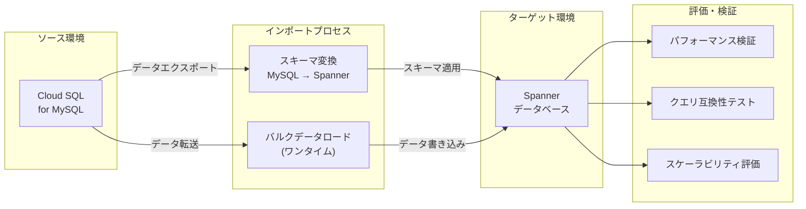

# Spanner: Cloud SQL for MySQL からのインポート機能が GA

**リリース日**: 2026-04-13

**サービス**: Spanner

**機能**: Import from Cloud SQL for MySQL (GA)

**ステータス**: GA (一般提供)

[このアップデートのインフォグラフィックを見る](https://takech9203.github.io/google-cloud-news-summary/20260413-spanner-import-from-cloudsql-ga.html)

## 概要

Spanner に Cloud SQL for MySQL からデータをインポートする機能が一般提供 (GA) となった。この機能により、Cloud SQL for MySQL のスキーマとデータを Spanner へ一括ロードし、Spanner の採用を評価するためのユースケース検証が容易になる。

従来、MySQL から Spanner へのデータ移行には、Spanner migration tool (SMT) の設定、Dataflow パイプラインの構築、Cloud Storage を介した中間ファイルの管理など、複数のステップと専門知識が必要であった。今回の機能は、Cloud SQL for MySQL を直接のインポートソースとしてサポートすることで、スキーマ変換とワンタイムのバルクデータロードをより簡潔に実行できるようにしたものである。

この機能は、現在 Cloud SQL for MySQL を使用しており、グローバルスケール、高可用性、強整合性といった Spanner の特性を評価したいデータベース管理者やアプリケーション開発者を主な対象としている。

**アップデート前の課題**

- MySQL から Spanner へ移行するには、SMT、Dataflow、Cloud Storage など複数のサービスを組み合わせた複雑なパイプラインの構築が必要であった
- スキーマ変換とデータロードが別々のプロセスであり、移行の初期評価に多くの時間と工数がかかっていた
- Spanner の採用検討のための PoC (概念実証) を行う際のハードルが高く、小規模な検証であっても相応のセットアップが必要だった

**アップデート後の改善**

- Cloud SQL for MySQL から Spanner への直接インポートが GA として正式にサポートされ、本番ワークロードでの利用が可能になった
- スキーマの移行とワンタイムのバルクデータロードが統合されたプロセスで実行でき、移行評価の工数が大幅に削減された
- Spanner 導入検討のための PoC を迅速に開始でき、実際のデータを使った評価が容易になった

## アーキテクチャ図



Cloud SQL for MySQL からスキーマとデータが Spanner へインポートされ、移行評価に活用されるフローを示す。スキーマ変換とバルクデータロードが統合的に処理される。

## サービスアップデートの詳細

### 主要機能

1. **スキーマ自動変換**
   - Cloud SQL for MySQL のスキーマを Spanner 互換のスキーマに変換する
   - データ型マッピング (MySQL の INT -> Spanner の INT64、VARCHAR -> STRING など) が自動的に処理される
   - インデックスや制約も可能な範囲で変換される

2. **ワンタイムバルクデータロード**
   - ソースデータベースの全データを一括で Spanner にロードする
   - 大量データの効率的な転送を実現する
   - Spanner の分散アーキテクチャを活用した並列書き込みによりスループットを最大化する

3. **Spanner 評価のための簡易導入**
   - 既存の Cloud SQL for MySQL データベースを使って Spanner の性能やスケーラビリティを実データで検証できる
   - 本番環境のデータを用いた PoC を迅速に開始可能
   - 移行前のフィージビリティスタディに最適

## 技術仕様

### MySQL から Spanner への主要な型マッピング

| MySQL データ型 | Spanner データ型 (GoogleSQL) |
|------|------|
| INT / INTEGER | INT64 |
| BIGINT | INT64 |
| FLOAT / DOUBLE | FLOAT64 |
| VARCHAR(n) | STRING(n) |
| TEXT | STRING(MAX) |
| BLOB | BYTES(MAX) |
| DATETIME / TIMESTAMP | TIMESTAMP |
| DATE | DATE |
| BOOL / BOOLEAN | BOOL |
| JSON | JSON |

### スキーマ変換時の注意事項

| 項目 | 詳細 |
|------|------|
| AUTO_INCREMENT | Spanner ではサポートされない。UUID やビットリバースシーケンスへの変更が必要 |
| ストアドプロシージャ | Spanner ではサポートされない。アプリケーション側での実装が必要 |
| トリガー | Spanner ではサポートされない。アプリケーション側での実装が必要 |
| 外部キー | Spanner の外部キーとしてマッピングされる |
| インターリーブテーブル | 親子関係のあるテーブルはインターリーブ構造への変換を推奨 |

## 設定方法

### 前提条件

1. Google Cloud プロジェクトで Spanner API と Cloud SQL Admin API が有効化されていること
2. Cloud SQL for MySQL インスタンスが稼働中であること
3. Spanner インスタンスが作成済みであること
4. 適切な IAM 権限 (Spanner Database Admin、Cloud SQL Viewer など) が付与されていること

### 手順

#### ステップ 1: Spanner インスタンスとデータベースの準備

```bash
# Spanner インスタンスの作成 (未作成の場合)
gcloud spanner instances create my-instance \
    --config=regional-us-central1 \
    --description="Migration evaluation" \
    --edition=STANDARD \
    --nodes=1
```

Spanner インスタンスが未作成の場合は、評価に適したサイズでインスタンスを作成する。

#### ステップ 2: Cloud SQL からのインポートの実行

```bash
# Cloud SQL for MySQL から Spanner へのインポート
# 詳細な手順は公式ドキュメントを参照
# https://cloud.google.com/spanner/docs/import-database-cloudsql
```

公式ドキュメントに記載されている手順に従い、ソース Cloud SQL インスタンスとターゲット Spanner データベースを指定してインポートを実行する。

#### ステップ 3: インポート結果の確認

```bash
# Spanner データベース内のテーブル一覧を確認
gcloud spanner databases ddl describe my-database \
    --instance=my-instance

# データの行数を確認
gcloud spanner databases execute-sql my-database \
    --instance=my-instance \
    --sql="SELECT COUNT(*) FROM my_table"
```

インポート完了後、スキーマとデータが正しく移行されたことを確認する。

## メリット

### ビジネス面

- **移行評価の迅速化**: Cloud SQL for MySQL から直接インポートできるため、Spanner 導入検討のための PoC 開始までの時間を大幅に短縮できる
- **リスク軽減**: 実データを使った検証により、本番移行前に互換性や性能の問題を早期に発見できる
- **コスト最適化**: 複雑な移行パイプラインを構築せずに評価できるため、PoC フェーズのコストを削減できる

### 技術面

- **統合プロセス**: スキーマ変換とデータロードが一体化されており、手動での中間操作が不要
- **GA の信頼性**: 一般提供により SLA の対象となり、本番ワークロードでの利用が公式にサポートされる
- **Spanner の先進機能へのアクセス**: 移行後は Spanner の強整合性、グローバル分散、自動スケーリングなどの機能を活用できる

## デメリット・制約事項

### 制限事項

- ワンタイムのバルクロードであり、継続的なレプリケーション (CDC) には対応しない。ライブデータ移行が必要な場合は Datastream + Dataflow の利用が推奨される
- MySQL のストアドプロシージャ、トリガー、ビューは Spanner へ自動変換されない
- AUTO_INCREMENT 列は Spanner でサポートされないため、キー生成戦略の変更が必要
- Cloud SQL for MySQL のみがソースとしてサポートされる (Cloud SQL for PostgreSQL や Cloud SQL for SQL Server は対象外)

### 考慮すべき点

- 大規模データベースのインポートには相応の時間とコンピュートリソースが必要
- スキーマ変換結果の検証と最適化 (インターリーブテーブル設計、主キー設計など) は手動で行う必要がある
- インポート中はソース Cloud SQL インスタンスに追加の負荷がかかる可能性がある

## ユースケース

### ユースケース 1: Spanner 導入のための PoC 実施

**シナリオ**: 現在 Cloud SQL for MySQL で稼働中の e コマースアプリケーションが、グローバル展開に伴いデータベースのスケーラビリティと可用性の向上を検討している。Spanner が要件を満たすかを実データで検証したい。

**効果**: 本番データベースのスナップショットを Spanner にインポートし、読み取り/書き込みレイテンシ、スループット、クエリ互換性をすぐに評価できる。従来数週間かかっていた PoC 環境のセットアップが大幅に短縮される。

### ユースケース 2: 段階的なデータベース移行の第一歩

**シナリオ**: 金融系アプリケーションが強整合性とグローバル分散を必要としており、Cloud SQL for MySQL から Spanner への段階的な移行を計画している。まずはスキーマ互換性とデータ整合性を検証したい。

**効果**: インポート機能でスキーマとデータを Spanner に移行し、MySQL と Spanner のクエリ結果を比較検証できる。その後、Datastream を使ったライブ移行に進むかどうかの判断材料を得られる。

## 料金

Spanner の料金はエディション (Standard / Enterprise / Enterprise Plus) とコンピュートキャパシティ (ノード数または処理ユニット数)、ストレージ使用量に基づく。インポート機能自体に追加料金はかからないが、インポート処理中の Spanner コンピュートリソース使用量とストレージ料金が発生する。

### 料金の主要コンポーネント

| コンポーネント | 料金 (リージョナル、us-central1 の場合) |
|--------|-----------------|
| コンピュート (Standard) | $0.90 / ノード / 時間 |
| コンピュート (Enterprise) | $1.20 / ノード / 時間 |
| ストレージ | $0.30 / GB / 月 |
| CUD (1 年契約) | 20% 割引 |
| CUD (3 年契約) | 40% 割引 |

※ インポートに Dataflow を使用する場合は、別途 Dataflow の料金が発生する。最新の料金は [Spanner 料金ページ](https://cloud.google.com/spanner/pricing) を参照。

## 利用可能リージョン

Spanner が利用可能な全てのリージョンで使用可能。Cloud SQL for MySQL インスタンスと Spanner インスタンスが同一リージョンに配置されている場合、データ転送のパフォーマンスが最適化される。

## 関連サービス・機能

- **[Cloud SQL for MySQL](https://cloud.google.com/sql/docs/mysql)**: インポートのソースデータベース。Google Cloud のマネージド MySQL サービス
- **[Spanner migration tool (SMT)](https://cloud.google.com/spanner/docs/set-up-spanner-migration-tool)**: より詳細なスキーマ変換やアセスメントが必要な場合に使用するオープンソースツール
- **[Datastream](https://cloud.google.com/datastream/docs/overview)**: CDC (Change Data Capture) を使ったライブデータ移行が必要な場合に使用
- **[Dataflow](https://cloud.google.com/dataflow)**: 大規模データの ETL 処理やカスタム変換ロジックが必要な場合に使用
- **[Database Migration Service (DMS)](https://cloud.google.com/database-migration)**: 他のデータベース移行シナリオに対応するマネージドサービス

## 参考リンク

- [インフォグラフィック](https://takech9203.github.io/google-cloud-news-summary/20260413-spanner-import-from-cloudsql-ga.html)
- [公式リリースノート](https://cloud.google.com/release-notes#April_13_2026)
- [Import from Cloud SQL to Spanner ドキュメント](https://cloud.google.com/spanner/docs/import-database-cloudsql)
- [MySQL から Spanner への移行ガイド](https://cloud.google.com/spanner/docs/migrating-mysql-to-spanner)
- [Spanner migration tool の設定](https://cloud.google.com/spanner/docs/set-up-spanner-migration-tool)
- [Spanner 料金ページ](https://cloud.google.com/spanner/pricing)

## まとめ

Cloud SQL for MySQL から Spanner への直接インポート機能が GA となったことで、Spanner 導入の評価と検証がこれまでよりも大幅に容易になった。この機能はスキーマ変換とワンタイムのバルクデータロードを統合的に提供し、PoC の迅速な立ち上げを可能にする。Cloud SQL for MySQL を使用しており、グローバルスケールや高可用性を必要とするワークロードへの対応を検討している場合は、この機能を活用して Spanner の評価を開始することを推奨する。

---

**タグ**: #Spanner #CloudSQL #MySQL #Migration #GA #Database #DataMigration #SchemaConversion
