# Google Cloud CCaaS: Advanced Reporting Dashboards の機能強化とバグ修正

**リリース日**: 2026-04-14

**サービス**: Google Cloud Contact Center as a Service (CCaaS) / CCAI Platform

**機能**: Advanced Reporting Dashboards アップデート

**ステータス**: リリース済み

[このアップデートのインフォグラフィックを見る](https://takech9203.github.io/google-cloud-news-summary/20260414-ccaas-reporting-dashboards.html)

## 概要

Google Cloud は、Contact Center as a Service (CCaaS) の Advanced Reporting Dashboards に対する包括的なアップデートをリリースした。本アップデートでは、Location フィルターの追加、Queue Performance ダッシュボードの改善、各種ダッシュボードのタイル名称変更、および複数のバグ修正が含まれている。

今回のアップデートは、コンタクトセンターの管理者やスーパーバイザーがリアルタイムおよび履歴データをより正確かつ効率的に分析できるようにすることを目的としている。特に、Location フィルターの追加により複数拠点を運用する組織でのデータ分析が容易になり、Queue Performance ダッシュボードの改善によりキュー関連の指標がより直感的に把握できるようになった。

また、Performance Overview と CSAT ダッシュボード間の CSAT スコア不一致や、キューインタラクションの集計誤り、Virtual Agent チャットテーブルの表示不具合など、データの正確性に関わる重要なバグが修正されている。

**アップデート前の課題**

- Real-time Channel Performance、Transfers、Queue Interval の各ダッシュボードに Location フィルターがなく、拠点別のデータ分析が困難だった
- Queue Performance ダッシュボードが Advanced Reporting Landing Page から直接アクセスできなかった
- Performance Overview ダッシュボードの「Queued Now」「Max Queue Time」というタイル名称が、リアルタイム値であることを明示していなかった
- Performance Overview と CSAT ダッシュボード間で CSAT スコアに不一致が発生していた
- キューインタラクションの集計が誤った値を表示していた

**アップデート後の改善**

- 3 つのダッシュボード (Real-time Channel Performance、Transfers、Queue Interval) に Location フィルターが追加され、拠点別分析が可能になった
- Queue Performance ダッシュボードが Advanced Reporting Landing Page に追加され、アクセスが容易になった
- タイル名称が「Current Queued Now」「Current Max Queue Time」に変更され、リアルタイムデータであることが明確になった
- CSAT スコアの不一致、集計誤り、Virtual Agent チャットの表示バグなど複数の問題が修正された

## アーキテクチャ図

```mermaid
flowchart TD
    subgraph LP["Advanced Reporting Landing Page"]
        direction LR
        A["Queue Performance<br/>(新規追加)"]
        B["Real-time Channel<br/>Performance"]
        C["Transfers"]
        D["Queue Interval"]
        E["Performance Overview"]
        F["Connected Calls/Chats"]
        G["Queue Group<br/>Performance - All"]
    end

    subgraph Filters["共通フィルター"]
        direction LR
        F1["Location<br/>(新規追加)"]
        F2["Queue Name"]
        F3["Language<br/>(Lang から改名)"]
        F4["Support Phone Number<br/>(新規追加)"]
    end

    subgraph QP["Queue Performance ダッシュボード改善"]
        direction TB
        Q1["Total Queue Interactions<br/>(新規カラム)"]
        Q2["Total Queue Answered<br/>(旧: Total Inbound Handled)"]
        Q3["Total Failed<br/>(新規タイル)"]
    end

    subgraph PO["Performance Overview ダッシュボード改善"]
        direction TB
        P1["Current Queued Now<br/>(旧: Queued Now)"]
        P2["Current Max Queue Time<br/>(旧: Max Queue Time)"]
    end

    subgraph RC["Real-time Connected ダッシュボード改善"]
        direction TB
        R1["Total Connected Calls/Chats<br/>(新規)"]
        R2["Avg Current Sentiment Score<br/>(新規)"]
    end

    LP --> Filters
    B & C & D -.->|Location フィルター追加| F1
    A --> QP
    E --> PO
    F --> RC
    G -.->|Lang を Language に改名| F3

    style F1 fill:#1A73E8,color:#fff
    style F4 fill:#1A73E8,color:#fff
    style Q1 fill:#34A853,color:#fff
    style Q2 fill:#FBBC04,color:#000
    style Q3 fill:#34A853,color:#fff
    style P1 fill:#FBBC04,color:#000
    style P2 fill:#FBBC04,color:#000
    style R1 fill:#34A853,color:#fff
    style R2 fill:#34A853,color:#fff
    style A fill:#1A73E8,color:#fff
```

Advanced Reporting Dashboards の全体構成と今回のアップデートによる変更点を示す。青色は新規追加、緑色は新規タイル/カラム、黄色は名称変更された項目を表す。

## サービスアップデートの詳細

### 主要機能

1. **Location フィルターの追加**
   - 以下のダッシュボードに Location フィルターが新たに追加された
     - Real-time Channel Performance
     - Transfers
     - Queue Interval
   - 複数拠点を運用するコンタクトセンターにおいて、拠点ごとのパフォーマンスを個別に確認可能

2. **Queue Performance ダッシュボードの改善**
   - Advanced Reporting Landing Page にダッシュボードへのリンクが追加された
   - Support Phone Number フィルターが新たに追加され、電話番号によるフィルタリングが可能に
   - 「Total Inbound Handled」タイルが「Total Queue Answered」に改名され、キューから応答されたインタラクションであることが明確に
   - 「Total Failed」タイルが新規追加され、エージェントへの接続に失敗したインタラクション数が可視化された
   - Queue Summary テーブルから「Total Inbound Calls Handled」カラムが削除され、代わりに「Total Queue Interactions」と「Total Queue Answered」カラムが追加された

3. **Performance Overview ダッシュボードの名称変更**
   - 「Queued Now」が「Current Queued Now」に改名
   - 「Max Queue Time」が「Current Max Queue Time」に改名
   - いずれもリアルタイム値であることを接頭辞「Current」で明示するための変更

4. **Real-time Connected ダッシュボードの改善**
   - Real-time Connected Calls / Connected Chats ダッシュボードに「Total Connected Calls」/「Total Connected Chats」タイルが追加
   - 「Avg Current Sentiment Score」タイルが追加され、現在接続中のインタラクションの平均センチメントスコアをリアルタイムで確認可能

5. **Queue Group Performance - All ダッシュボードの改善**
   - 「Lang」フィルターが「Language」に改名され、フィルター名がより直感的に

### バグ修正

1. **CSAT スコアの不一致修正**
   - Performance Overview ダッシュボードと CSAT ダッシュボード間で CSAT スコアが一致しない問題が修正された

2. **キューインタラクション集計の修正**
   - キューインタラクションの合計値が不正確に計算されていた問題が修正された

3. **Virtual Agent チャットテーブルの修正**
   - Virtual Agents Chats テーブルで誤ったチャットが表示される問題が修正された

4. **Failed Interaction カラムの修正**
   - Failed Interaction カラムに関する表示の問題が修正された

## 技術仕様

### ダッシュボード変更一覧

| ダッシュボード | 変更種別 | 変更内容 |
|--------------|---------|---------|
| Real-time Channel Performance | フィルター追加 | Location フィルター追加 |
| Transfers | フィルター追加 | Location フィルター追加 |
| Queue Interval | フィルター追加 | Location フィルター追加 |
| Queue Performance | 構成変更 | Advanced Reporting Landing Page への追加 |
| Queue Performance | フィルター追加 | Support Phone Number フィルター追加 |
| Queue Performance | 名称変更 | Total Inbound Handled -> Total Queue Answered |
| Queue Performance | タイル追加 | Total Failed タイル追加 |
| Queue Performance (Queue Summary) | カラム変更 | Total Inbound Calls Handled 削除、Total Queue Interactions / Total Queue Answered 追加 |
| Performance Overview | 名称変更 | Queued Now -> Current Queued Now |
| Performance Overview | 名称変更 | Max Queue Time -> Current Max Queue Time |
| Connected Calls Status | タイル追加 | Total Connected Calls、Avg Current Sentiment Score |
| Connected Chats Status | タイル追加 | Total Connected Chats、Avg Current Sentiment Score |
| Queue Group Performance - All | 名称変更 | Lang -> Language |

### Advanced Reporting 利用可能リージョン

| リージョン | ロケーション |
|-----------|------------|
| us-east1 | サウスカロライナ |
| us-central1 | アイオワ |
| us-west1 | オレゴン |
| europe-west2 | ロンドン |
| asia-northeast1 | 東京 |
| northamerica-northeast1 | モントリオール |
| australia-southeast1 | シドニー |

## 設定方法

### 前提条件

1. CCAI Platform インスタンスが Advanced Reporting 対応リージョン (上記表を参照) にデプロイされていること
2. Advanced Reporting 拡張機能が有効化されていること

### 手順

#### ステップ 1: Advanced Reporting 拡張機能の有効化

Advanced Reporting が未有効化の場合、以下の手順で有効化する:

1. Google Cloud コンソールでプロジェクトを選択
2. ナビゲーションメニューから **CCAI Platform** をクリック
3. 対象のインスタンスをクリックし、**Edit** > **Configure extensions** を選択
4. **Extensions** で **Advanced reporting** チェックボックスを選択し、**Save** をクリック

#### ステップ 2: ダッシュボードへのアクセス

1. CCAI Platform ポータルで **Dashboard** > **Advanced Reporting** をクリック
2. Advanced Reporting Landing Page から対象のダッシュボード (Queue Performance など) を選択
3. 新しく追加された Location フィルターや Support Phone Number フィルターを利用してデータを絞り込む
4. **Update** または **Reload** をクリックして結果を表示

## メリット

### ビジネス面

- **拠点別パフォーマンス分析の強化**: Location フィルターの追加により、複数拠点を運用するコンタクトセンターで拠点ごとのパフォーマンスを容易に比較・分析できるようになった
- **データの信頼性向上**: CSAT スコアの不一致やキューインタラクション集計の誤りが修正され、経営判断に使用するデータの正確性が向上した
- **オペレーション改善の迅速化**: Real-time Connected ダッシュボードに Total Connected 数と Avg Current Sentiment Score が追加され、現在の状況をリアルタイムに把握し迅速な対応が可能になった

### 技術面

- **指標名の明確化**: 「Current Queued Now」「Current Max Queue Time」への名称変更により、リアルタイム値と履歴値の区別が明確になった
- **ダッシュボードアクセスの改善**: Queue Performance が Advanced Reporting Landing Page に追加され、Advanced Reporting の全機能 (カスタムダッシュボード作成、Looks の作成など) に直接アクセス可能になった
- **フィルターの一貫性向上**: 「Lang」から「Language」への改名により、ダッシュボード間のフィルター名称の一貫性が向上した

## デメリット・制約事項

### 制限事項

- Advanced Reporting は特定のリージョン (us-east1、us-central1、us-west1、europe-west2、asia-northeast1、northamerica-northeast1、australia-southeast1) でのみ利用可能であり、対応リージョン外のインスタンスでは有効化できない
- Advanced Reporting を有効化するとレガシーダッシュボードは利用できなくなるため、切り替え時には注意が必要
- ダッシュボードの日付範囲フィルターは最大 45 日間に制限されており、それを超える範囲を指定するとエラーが返される

### 考慮すべき点

- Advanced Reporting の有効化/無効化はカスタムロールの権限設定に影響する可能性がある。切り替え後はカスタムロールの権限を確認すること
- タイルやカラムの名称変更により、既存のレポートやアラート設定で旧名称を参照している場合は更新が必要になる可能性がある
- Consumer Phone Number の表示は、顧客電話番号の閲覧に関する法的補遺がアカウントに対して署名されている場合にのみ有効

## ユースケース

### ユースケース 1: 複数拠点のコンタクトセンター運用管理

**シナリオ**: 東京、大阪、福岡の 3 拠点でコンタクトセンターを運用する企業のオペレーション管理者が、拠点ごとのチャネルパフォーマンスを比較分析したい。

**効果**: Real-time Channel Performance ダッシュボードの新しい Location フィルターを使用することで、各拠点のリアルタイムパフォーマンスを個別に確認し、リソース配分の最適化やスタッフィング調整を迅速に行える。

### ユースケース 2: キューパフォーマンスの詳細分析

**シナリオ**: コンタクトセンターのスーパーバイザーが、特定のキューにおける応答率と失敗率を把握し、SLA 目標の達成状況を評価したい。

**効果**: Queue Performance ダッシュボードの新しい「Total Queue Interactions」「Total Queue Answered」「Total Failed」タイルにより、キューに到達したインタラクション数、応答されたインタラクション数、失敗したインタラクション数を一目で把握できる。これにより、ボトルネックの特定とルーティングルールの改善が容易になる。

### ユースケース 3: リアルタイムの顧客感情モニタリング

**シナリオ**: カスタマーサクセスチームのリーダーが、現在進行中の通話やチャットの顧客感情をリアルタイムに把握し、問題のあるインタラクションに早期介入したい。

**効果**: Real-time Connected ダッシュボードに追加された「Avg Current Sentiment Score」タイルにより、現在接続中のインタラクション全体の感情傾向をリアルタイムに確認できる。スコアの低下を検知した場合、スーパーバイザーが個別のインタラクションを確認し、必要に応じてバージやエスカレーションの対応を取ることが可能になる。

## 関連サービス・機能

- **[CCAI Platform Dashboards Overview](https://docs.cloud.google.com/contact-center/ccai-platform/docs/dashboards-overview)**: Advanced Reporting Dashboards 全体の概要と有効化手順
- **[Queue Performance Dashboard](https://docs.cloud.google.com/contact-center/ccai-platform/docs/dashboards-queue-performance)**: キューごとのパフォーマンス指標 (インタラクション数、放棄率、ハンドル時間、CSAT など)
- **[Performance Overview Dashboard](https://docs.cloud.google.com/contact-center/ccai-platform/docs/dashboards-perf-overview)**: チャネル全体のハイレベルなパフォーマンス情報
- **[Connected Calls Status Dashboard](https://docs.cloud.google.com/contact-center/ccai-platform/docs/dashboards-calls-connected)**: 接続中の通話のリアルタイム状況
- **[Connected Chats Status Dashboard](https://docs.cloud.google.com/contact-center/ccai-platform/docs/dashboards-chats-connected)**: 接続中のチャットのリアルタイム状況
- **[Queue Group Performance Dashboard](https://docs.cloud.google.com/contact-center/ccai-platform/docs/dashboards-queue-group-perf)**: キューグループのリアルタイムおよび履歴データの概要

## 参考リンク

- [インフォグラフィック](https://takech9203.github.io/google-cloud-news-summary/20260414-ccaas-reporting-dashboards.html)
- [公式リリースノート](https://docs.cloud.google.com/release-notes#April_14_2026)
- [Advanced Reporting Dashboards 概要](https://docs.cloud.google.com/contact-center/ccai-platform/docs/dashboards-overview)
- [Queue Performance ダッシュボード](https://docs.cloud.google.com/contact-center/ccai-platform/docs/dashboards-queue-performance)
- [Performance Overview ダッシュボード](https://docs.cloud.google.com/contact-center/ccai-platform/docs/dashboards-perf-overview)
- [CCAI Platform リリースノート](https://docs.cloud.google.com/contact-center/ccai-platform/docs/release-notes)

## まとめ

今回の CCaaS Advanced Reporting Dashboards のアップデートは、Location フィルターの追加やタイル名称の明確化、Queue Performance ダッシュボードの大幅な改善など、コンタクトセンターの運用可視性を向上させる多数の変更を含んでいる。特に CSAT スコアの不一致やキューインタラクション集計の誤りといったデータ正確性に関わるバグ修正は、データ駆動型のオペレーション改善を行う組織にとって重要な修正である。Advanced Reporting を利用中のコンタクトセンター管理者は、名称変更されたタイルやカラムに基づく既存のレポートやアラートの確認を推奨する。

---

**タグ**: #CCaaS #ContactCenter #Reporting #Dashboards #Analytics
