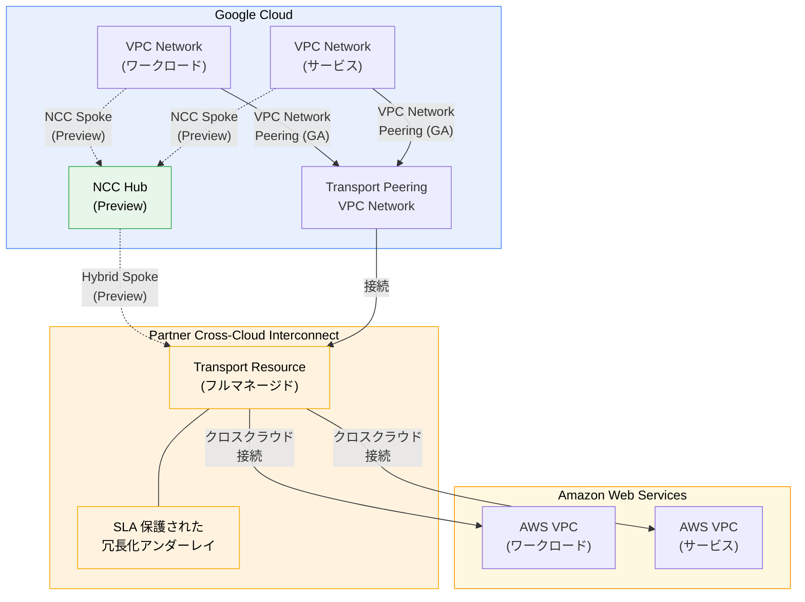

# Cloud Interconnect: Partner Cross-Cloud Interconnect for AWS が GA、NCC サポートが Preview に

**リリース日**: 2026-04-14

**サービス**: Cloud Interconnect

**機能**: Partner Cross-Cloud Interconnect for AWS (VPC Network Peering: GA / NCC: Preview)

**ステータス**: GA (VPC Network Peering) / Preview (Network Connectivity Center)

[このアップデートのインフォグラフィックを見る](https://takech9203.github.io/google-cloud-news-summary/20260414-cloud-interconnect-partner-cci-aws-ga.html)

## 概要

Google Cloud は、Partner Cross-Cloud Interconnect for Amazon Web Services (AWS) の VPC Network Peering 接続が一般提供 (GA) になったことを発表した。加えて、Network Connectivity Center (NCC) を使用した Partner Cross-Cloud Interconnect for AWS 接続が Preview として利用可能になった。

Partner Cross-Cloud Interconnect for AWS は、Google Cloud と AWS 間のマルチクラウド接続をフルマネージドで提供するサービスである。従来の Cross-Cloud Interconnect と異なり、物理的なプロビジョニングやポート管理が不要であり、1 日以内での接続セットアップが可能である。帯域幅は 1 Gbps から 100 Gbps まで柔軟に選択でき、冗長性がサービスレベルで組み込まれているため、複雑な冗長構成を手動で設定する必要がない。

本アップデートにより、VPC Network Peering を使用したシンプルな 1 対 1 のクラウド間接続が GA として本番ワークロードに対応するとともに、NCC を使用したハブ & スポークモデルによる複数クラウド/VPC ネットワーク間の高度なルーティングが Preview として利用可能になった。マルチクラウド環境を運用する企業、特にネットワーキングの専門知識が限られたアプリケーションオーナーや、低帯域幅のクロスクラウド接続を必要とするチームにとって有用なアップデートである。

**アップデート前の課題**

- Google Cloud と AWS 間の接続には Cross-Cloud Interconnect を使用する必要があり、10 Gbps / 100 Gbps 単位の大容量接続のみが選択肢で、物理的なプロビジョニングに 1 - 4 週間を要していた
- 冗長性を確保するために、ユーザーが手動で複数の接続を構成・管理する必要があった
- 接続の開始は Google Cloud 側からのみ可能で、AWS 側からの双方向プロビジョニングには対応していなかった
- NCC を通じた Partner Cross-Cloud Interconnect for AWS のハブ & スポーク接続は提供されていなかった

**アップデート後の改善**

- VPC Network Peering を使用した Partner Cross-Cloud Interconnect for AWS が GA となり、本番ワークロードで SLA 付きの利用が可能になった
- 1 Gbps から 100 Gbps まで柔軟な帯域幅オプションにより、ニーズに応じた接続サイズの選択とオンデマンドでのスケールが可能になった
- 物理プロビジョニング不要で、1 日以内に接続をセットアップでき、冗長性がサービスに組み込まれた
- NCC サポート (Preview) により、ハブ & スポークモデルで複数の VPC ネットワークやオンプレミスネットワークとの統合的な接続管理が可能になった
- Google Cloud と AWS の双方から接続を開始できるようになった

## アーキテクチャ図



Partner Cross-Cloud Interconnect for AWS のアーキテクチャを示す。VPC Network Peering (GA) による直接的な接続と、NCC Hub (Preview) を経由したハブ & スポークモデルの 2 つの接続方式が利用可能である。Transport Resource はフルマネージドで冗長性が組み込まれている。

## サービスアップデートの詳細

### 主要機能

1. **VPC Network Peering 接続 (GA)**
   - Google Cloud VPC ネットワークと Transport Resource の Peering VPC ネットワーク間を VPC Network Peering で接続
   - Google Cloud または AWS のどちらからでも接続を開始可能
   - Activation Key を使用した双方向プロビジョニングに対応
   - 接続確立後、ピアリングされた VPC ネットワークとルートテーブルの確認が可能

2. **Network Connectivity Center (NCC) サポート (Preview)**
   - NCC Hub にハイブリッドスポークとして Partner Cross-Cloud Interconnect for AWS を接続
   - 複数の VPC ネットワーク、オンプレミスネットワーク、他クラウドネットワーク間のルーティングを NCC で一元管理
   - サイト間データ転送による、Google のバックボーンネットワークを活用した WAN 接続が可能
   - VPC スポークとハイブリッドスポークの組み合わせによる Any-to-Any 接続に対応

3. **フルマネージドな冗長性とプロビジョニング**
   - 冗長性がサービスレベルで組み込まれており、手動での冗長構成が不要
   - 物理ポートやアタッチメントの管理が不要
   - プロビジョニング時間は 1 日以内 (従来の Cross-Cloud Interconnect は 1 - 4 週間)
   - 帯域幅のオンデマンドスケールアップ/ダウンに対応

## 技術仕様

### Cross-Cloud Interconnect との比較

| 項目 | Cross-Cloud Interconnect | Partner Cross-Cloud Interconnect for AWS |
|------|--------------------------|------------------------------------------|
| 物理プロビジョニング | 必要 | 不要 |
| 物理ポート/アタッチメント | 必要 | 不要 |
| 接続帯域幅 | 10 Gbps / 100 Gbps | 1 Gbps - 100 Gbps (柔軟な選択) |
| プロビジョニング時間 | 1 - 4 週間 | 1 日以内 |
| 接続開始方向 | Google Cloud からのみ | 双方向 (Google Cloud / AWS) |
| 冗長性 | 手動構成 | サービスに組み込み |
| 接続方式 | VLAN アタッチメント | VPC Network Peering (GA) / NCC (Preview) |

### 接続方式の比較

| 項目 | VPC Network Peering (GA) | NCC (Preview) |
|------|--------------------------|---------------|
| ステータス | 一般提供 (GA) | Preview |
| 接続モデル | 1 対 1 の VPC ピアリング | ハブ & スポーク |
| ルーティング | VPC Peering による経路交換 | NCC Hub を通じた動的経路交換 |
| マルチ VPC 接続 | 個別にピアリングが必要 | Hub 経由で統合管理 |
| サイト間転送 | 非対応 | 対応 |
| 適用シナリオ | シンプルなクラウド間接続 | 複雑なマルチクラウド/マルチ VPC 環境 |

### クォータ

| 項目 | 詳細 |
|------|------|
| Transport Resource | プロジェクトごと、リージョンごとに 1 つ (デフォルト) |

## 設定方法

### 前提条件

1. Google Cloud プロジェクトと AWS アカウントが作成済みであること
2. VPC Network Peering で接続する場合: Google Cloud VPC ネットワークが作成済みであること
3. NCC で接続する場合: NCC Hub が作成済みであること

### 手順

#### VPC Network Peering 接続 (Google Cloud から開始する場合)

##### ステップ 1: ペアリングロケーションの選択

利用可能なペアリングロケーションから、接続するリージョンペアを選択する。

##### ステップ 2: プロファイルの確認と Transport Resource の作成

```bash
# 利用可能なプロファイルを一覧表示
gcloud compute interconnects partner-cci-for-aws \
  list-profiles --region=REGION

# Transport Resource を作成
gcloud compute interconnects partner-cci-for-aws \
  create TRANSPORT_NAME \
  --region=REGION \
  --profile=PROFILE_NAME \
  --bandwidth=BANDWIDTH \
  --network=VPC_NETWORK
```

Activation Key が生成されるので、これを使用して AWS 側で接続を完了する。

##### ステップ 3: AWS 側での接続完了

AWS Console または API を使用して、生成された Activation Key で接続を作成する。

##### ステップ 4: VPC Network Peering の確立と接続確認

```bash
# VPC Network Peering を確立
gcloud compute networks peerings create PEERING_NAME \
  --network=YOUR_VPC_NETWORK \
  --peer-network=TRANSPORT_PEERING_VPC

# 接続を確認
gcloud compute networks peerings list \
  --network=YOUR_VPC_NETWORK
```

#### NCC 接続 (Google Cloud から開始する場合)

##### ステップ 1: NCC Hub の作成

```bash
# NCC Hub を作成
gcloud network-connectivity hubs create HUB_NAME \
  --description="Cross-cloud connectivity hub"
```

##### ステップ 2: Transport Resource の作成と NCC スポークへの接続

Transport Resource を作成し、NCC Hub にハイブリッドスポークとして接続する。

## メリット

### ビジネス面

- **導入期間の大幅短縮**: 従来の 1 - 4 週間のプロビジョニング期間が 1 日以内に短縮され、マルチクラウドプロジェクトの立ち上げを加速できる
- **コスト最適化**: 1 Gbps からの柔軟な帯域幅オプションにより、実際のニーズに合わせた接続サイズを選択でき、過剰な帯域幅への投資を回避できる
- **運用負荷の軽減**: 物理インフラストラクチャの管理やサードパーティとの調整が不要になり、ネットワーキングの専門知識がないチームでもクロスクラウド接続を構築できる

### 技術面

- **組み込みの冗長性**: サービスレベルで冗長性が確保されており、手動での複雑な冗長構成が不要。Google Cloud と AWS の双方で SLA が管理・抽象化されている
- **双方向プロビジョニング**: Google Cloud と AWS のどちらからでも接続を開始でき、既存の AWS ワークフローに統合しやすい
- **NCC によるスケーラブルなルーティング (Preview)**: ハブ & スポークモデルにより、複数の VPC ネットワークやオンプレミスネットワークとの統合的なルーティング管理が可能になり、大規模なマルチクラウド環境に対応できる
- **自動ルート交換**: クラウド間のルート交換が自動的に処理され、手動でのルート設定やリソース情報のコピーが不要

## デメリット・制約事項

### 制限事項

- NCC サポートは Preview であり、本番ワークロードでの使用は推奨されない。SLA やサポートが制限される可能性がある
- Transport Resource のクォータはプロジェクトごと、リージョンごとにデフォルト 1 つに制限されている
- 対応する AWS リージョンはペアリングロケーションに限定されており、すべてのリージョンの組み合わせが利用可能ではない
- 接続先のクラウドプロバイダーは AWS のみ (Azure、OCI、Alibaba には Partner Cross-Cloud Interconnect for AWS は使用不可)

### 考慮すべき点

- VPC Network Peering と NCC のどちらの接続方式を選択するかは、環境の複雑さと将来のスケーラビリティ要件に基づいて判断すること
- NCC を使用する場合、Preview 段階であるため、GA までに API や動作が変更される可能性がある
- クラウド間のデータ転送に関する料金は Google Cloud 側と AWS 側で別々に発生する。コスト見積もりの際は双方の料金体系を確認すること

## ユースケース

### ユースケース 1: マルチクラウド分析基盤の構築

**シナリオ**: 企業が AWS の S3 に蓄積された大量のデータを Google Cloud の BigQuery で分析したいケースで、定期的にデータ転送が発生するが、帯域幅は 5 Gbps 程度で十分である。

**効果**: Partner Cross-Cloud Interconnect for AWS により、5 Gbps の帯域幅を選択してコストを最適化しつつ、プライベートな接続を 1 日以内にセットアップできる。VPC Network Peering (GA) によるシンプルな接続で、安定した SLA 保護付きのデータ転送が可能になる。

### ユースケース 2: 大規模マルチクラウドネットワークの統合管理

**シナリオ**: グローバル企業が複数の Google Cloud VPC ネットワーク、オンプレミスデータセンター、AWS 環境を統合的に管理する必要がある。各環境間での動的なルーティングとサイト間データ転送が求められる。

**効果**: NCC Hub を中心としたハブ & スポークモデルにより、Partner Cross-Cloud Interconnect for AWS をハイブリッドスポークとして接続し、VPC スポークやオンプレミス接続と組み合わせた統合的なネットワーク管理が可能になる (Preview)。

## 利用可能リージョン

Partner Cross-Cloud Interconnect for AWS のペアリングロケーションは以下の通りである:

| Google Cloud リージョン | AWS リージョン |
|------------------------|---------------|
| europe-west2 | eu-west-2 Europe (London) |
| europe-west3 | eu-central-1 Europe (Frankfurt) |
| us-east4 | us-east-1 US East (N. Virginia) |
| us-west1 | us-west-2 US West (Oregon) |
| us-west2 | us-west-1 US West (N. California) |

## 関連サービス・機能

- **[Cross-Cloud Interconnect](https://docs.cloud.google.com/network-connectivity/docs/interconnect/concepts/cci-overview)**: 10 Gbps / 100 Gbps / 400 Gbps の専用接続を提供する既存のクロスクラウド接続サービス。物理プロビジョニングが必要だが、AWS 以外のクラウド (Azure、OCI、Alibaba) にも対応
- **[VPC Network Peering](https://docs.cloud.google.com/vpc/docs/vpc-peering)**: Google Cloud VPC ネットワーク間のプライベート接続を提供。Partner Cross-Cloud Interconnect for AWS の GA 接続方式として使用
- **[Network Connectivity Center (NCC)](https://docs.cloud.google.com/network-connectivity/docs/network-connectivity-center/concepts/overview)**: ハブ & スポークモデルによるネットワーク接続のオーケストレーションフレームワーク。VPC スポーク、ハイブリッドスポーク、サイト間データ転送に対応
- **[Partner Cross-Cloud Interconnect for OCI](https://docs.cloud.google.com/network-connectivity/docs/interconnect/concepts/partner-cci-for-oci-overview)**: Oracle Cloud Infrastructure 向けの同等のパートナー型クロスクラウド接続サービス

## 参考リンク

- [インフォグラフィック](https://takech9203.github.io/google-cloud-news-summary/20260414-cloud-interconnect-partner-cci-aws-ga.html)
- [公式リリースノート](https://docs.cloud.google.com/release-notes#April_14_2026)
- [Partner Cross-Cloud Interconnect for AWS 概要](https://docs.cloud.google.com/network-connectivity/docs/interconnect/concepts/partner-cci-for-aws-overview)
- [プロビジョニング概要](https://docs.cloud.google.com/network-connectivity/docs/interconnect/how-to/partner-cci-for-aws/provisioning-overview)
- [ペアリングロケーション](https://docs.cloud.google.com/network-connectivity/docs/interconnect/how-to/partner-cci-for-aws/paired-locations)
- [Network Connectivity Center 概要](https://docs.cloud.google.com/network-connectivity/docs/network-connectivity-center/concepts/overview)
- [Cloud Interconnect 料金](https://cloud.google.com/network-connectivity/pricing)

## まとめ

Partner Cross-Cloud Interconnect for AWS の VPC Network Peering 接続が GA となり、Google Cloud と AWS 間のマルチクラウド接続がフルマネージドで本番利用可能になった。物理プロビジョニング不要、1 日以内のセットアップ、1 Gbps からの柔軟な帯域幅選択、組み込みの冗長性により、従来の Cross-Cloud Interconnect と比較して導入と運用が大幅に簡素化されている。さらに NCC サポート (Preview) により、大規模なマルチクラウド環境でのハブ & スポークモデルによる統合ネットワーク管理への道筋も示された。マルチクラウド戦略を推進する企業は、まず VPC Network Peering (GA) での接続を検討し、より複雑なネットワーク要件がある場合は NCC (Preview) の評価を開始することを推奨する。

---

**タグ**: #CloudInterconnect #CrossCloud #AWS #VPCPeering #NCC #GA #Preview
