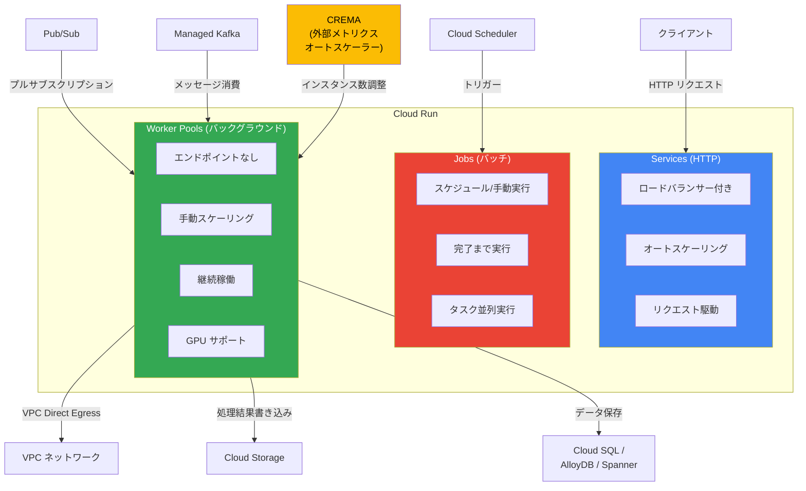

# Cloud Run: Worker Pools が General Availability (GA) に昇格

**リリース日**: 2026-04-14

**サービス**: Cloud Run

**機能**: Worker Pools General Availability (GA)

**ステータス**: GA (一般提供)

[このアップデートのインフォグラフィックを見る](https://takech9203.github.io/google-cloud-news-summary/20260414-cloud-run-worker-pools-ga.html)

## 概要

Google Cloud は、Cloud Run の Worker Pools 機能が General Availability (GA) に昇格したことを発表した。Worker Pools は Cloud Run Services、Cloud Run Jobs に続く第 3 のリソースタイプであり、継続的なバックグラウンド処理に特化して設計されている。これまで Preview として提供されていた本機能が GA となり、本番環境での利用が正式にサポートされるようになった。

Worker Pools は、Cloud Run Services とは異なりロードバランサーのエンドポイント/URL を持たず、HTTP リクエストの処理を目的としない。代わりに、メッセージキューからのメッセージ消費、ストリーム処理、ML モデルのサービング、長時間バックグラウンドタスクなど、リクエスト駆動でないワークロードを Cloud Run 上でネイティブに実行できるようになる。これにより、サーバーレスの運用利便性を維持しつつ、従来は GKE や Compute Engine が必要だったバックグラウンド処理ワークロードを Cloud Run に統合できる。

対象となるのは、Pub/Sub や Kafka などのメッセージキューからのメッセージ消費、GPU を活用した ML 推論サーバー、常駐型のデータ処理パイプラインなど、継続的に稼働するバックグラウンドワークロードを運用するユーザーである。

**アップデート前の課題**

- Cloud Run では HTTP リクエスト駆動の Services と、バッチ実行の Jobs のみが利用可能であり、継続的なバックグラウンド処理に適したリソースタイプがなかった
- メッセージキューからのプル型消費やストリーム処理を行うには、GKE や Compute Engine など別のコンピュートサービスを利用する必要があった
- Worker Pools は Preview 段階であり、SLA の保証やプロダクションサポートが限定的であった

**アップデート後の改善**

- Worker Pools が GA となり、SLA の保証を受けた本番環境での利用が可能になった
- Cloud Run 上で Services (HTTP リクエスト処理)、Jobs (バッチ処理)、Worker Pools (継続的バックグラウンド処理) の 3 つのワークロードパターンをカバーできるようになった
- Google Cloud コンソール、gcloud CLI、Terraform、REST API による完全なライフサイクル管理がサポートされている
- サイドカーコンテナのデプロイ (最大 10 コンテナ/インスタンス)、GPU の利用、VPC Direct Egress など、エンタープライズグレードの機能が利用可能になった

## アーキテクチャ図



Cloud Run の 3 つのリソースタイプ (Services, Jobs, Worker Pools) のアーキテクチャ上の位置付けを示す。Worker Pools はエンドポイントを持たず、メッセージキューなどの外部ソースからプル型でデータを消費し、継続的なバックグラウンド処理を実行する。CREMA (Cloud Run External Metrics Autoscaling) と組み合わせることで、外部メトリクスに基づくオートスケーリングも実現できる。

## サービスアップデートの詳細

### Cloud Run リソースタイプの比較

| 特性 | Services | Jobs | Worker Pools |
|------|----------|------|-------------|
| 用途 | HTTP リクエスト処理 | バッチ処理 | 継続的バックグラウンド処理 |
| エンドポイント | ロードバランサー付き URL | なし | なし |
| スケーリング | オートスケーリング | タスク並列 | 手動スケーリング |
| 実行モデル | リクエスト駆動 | 完了まで実行 | 常駐実行 |
| GPU サポート | あり | なし | あり |
| サイドカー | あり | あり | あり |
| カナリアデプロイ | あり | なし | あり |

### 主要機能

1. **手動スケーリング**
   - インスタンス数を明示的に指定して制御する
   - `--instances` フラグでデプロイ時にインスタンス数を設定可能
   - インスタンス数を 0 に設定することで Worker Pool を無効化できる
   - スケーリングモードの変更は新しいリビジョンを作成しない

2. **CREMA (Cloud Run External Metrics Autoscaling) との統合**
   - 外部メトリクス (Pub/Sub キュー深度、Prometheus メトリクスなど) に基づくオートスケーリングが可能
   - CREMA サービスを別途デプロイし、Worker Pool のインスタンス数を動的に調整
   - Pub/Sub のメッセージ数やCPU 使用率に応じたスケーリングポリシーを YAML で定義

3. **GPU サポート**
   - Worker Pool インスタンスで GPU を利用可能
   - ゾーン冗長性オプション (オン/オフ) を選択可能
   - GPU ゾーン冗長性をオンにすると、ゾーン障害時の可用性が向上 (追加コストあり)
   - ML 推論やデータ処理など GPU を活用するバックグラウンドワークロードに対応

4. **サイドカーコンテナ**
   - 1 インスタンスあたり最大 10 コンテナをデプロイ可能
   - メインコンテナとサイドカー間は localhost ポートで通信
   - 共有インメモリボリュームによるファイル共有もサポート

5. **VPC ネットワーク統合**
   - VPC Direct Egress によるプライベートネットワークへの接続
   - VPC 内のリソース (Cloud SQL、Memorystore など) へのセキュアなアクセス

## 技術仕様

### リソース構成

| 項目 | 詳細 |
|------|------|
| vCPU | 1 / 2 / 4 / 6 / 8 vCPU |
| メモリ | 512 MiB - 32 GiB (vCPU に応じた範囲) |
| デフォルト vCPU | 1 vCPU |
| デフォルトメモリ | 512 MiB |
| 最大コンテナ数/インスタンス | 10 (メイン + サイドカー) |
| Worker Pool 名の最大長 | 49 文字 |
| スケーリングモード | 手動 |

### vCPU とメモリの対応表

| vCPU | メモリ範囲 |
|------|-----------|
| 1 vCPU | 128 MiB - 4 GiB |
| 2 vCPU | 128 MiB - 8 GiB |
| 4 vCPU | 2 GiB - 16 GiB |
| 6 vCPU | 4 GiB - 24 GiB |
| 8 vCPU | 4 GiB - 32 GiB |

### 必要な IAM ロール

```
roles/run.developer         # Cloud Run Worker Pool に対して
roles/iam.serviceAccountUser  # Worker Pool のサービスアカウントに対して
roles/artifactregistry.reader # コンテナイメージのリポジトリに対して
```

## 設定方法

### 前提条件

1. Google Cloud プロジェクトで Cloud Run API が有効であること
2. gcloud CLI がインストールされ、認証済みであること
3. コンテナイメージが Artifact Registry または Docker Hub に格納されていること

### 手順

#### ステップ 1: Worker Pool のデプロイ

```bash
# 基本的なデプロイ
gcloud run worker-pools deploy my-worker-pool \
  --image us-docker.pkg.dev/my-project/my-repo/my-worker:latest \
  --region us-central1 \
  --instances 3 \
  --cpu 2 \
  --memory 4Gi
```

コンテナイメージを指定して Worker Pool をデプロイする。`--instances` でインスタンス数を指定し、`--cpu` と `--memory` でリソースを構成する。

#### ステップ 2: Worker Pool の状態確認

```bash
# Worker Pool の一覧表示
gcloud run worker-pools list --region us-central1

# 詳細表示
gcloud run worker-pools describe my-worker-pool --region us-central1
```

デプロイされた Worker Pool の状態やリビジョン情報を確認する。

#### ステップ 3: スケーリングの調整

```bash
# インスタンス数の変更
gcloud run worker-pools update my-worker-pool \
  --instances 5

# Worker Pool の無効化 (インスタンス数を 0 に設定)
gcloud run worker-pools update my-worker-pool \
  --instances 0
```

運用中の Worker Pool のインスタンス数を変更する。0 に設定すると Worker Pool を無効化できる。

#### ステップ 4: Terraform によるデプロイ (オプション)

```hcl
resource "google_cloud_run_v2_worker_pool" "default" {
  name     = "my-worker-pool"
  location = "us-central1"

  template {
    containers {
      image = "us-docker.pkg.dev/my-project/my-repo/my-worker:latest"
    }
  }

  scaling {
    scaling_mode         = "MANUAL"
    manual_instance_count = 3
  }
}
```

Terraform を使用した Infrastructure as Code による Worker Pool のデプロイも完全にサポートされている。

## メリット

### ビジネス面

- **インフラ統合によるコスト削減**: バックグラウンド処理のために GKE クラスタや Compute Engine VM を別途管理する必要がなくなり、Cloud Run に統合することで運用コストが削減される
- **サーバーレス運用の拡大**: Worker Pools の GA により、HTTP サービス、バッチ処理、バックグラウンド処理の全てを Cloud Run の統一されたプラットフォーム上で運用できるようになった
- **GA の信頼性**: SLA の保証とプロダクションサポートにより、ミッションクリティカルなバックグラウンド処理ワークロードにも安心して採用できる

### 技術面

- **Cloud Run ネイティブの管理性**: Google Cloud コンソール、gcloud CLI、Terraform、REST API による統一的な管理インターフェースで Worker Pool のライフサイクルを制御できる
- **GPU 対応のバックグラウンド処理**: GPU をサポートしているため、ML 推論やデータ処理など GPU を活用するワークロードをサーバーレスで実行可能
- **Cloud Deploy との統合**: Cloud Deploy を使用した CI/CD パイプラインにおいて、Worker Pool のカナリアデプロイがサポートされている
- **柔軟なリソース構成**: 最大 8 vCPU、32 GiB メモリまでのリソース割り当てが可能で、多様なワークロード要件に対応

## デメリット・制約事項

### 制限事項

- Worker Pools はオートスケーリングをネイティブにサポートしていない。自動スケーリングには CREMA (Cloud Run External Metrics Autoscaling、Preview) との組み合わせが必要
- ロードバランサーのエンドポイント/URL がないため、外部からの HTTP リクエストを直接受信するユースケースには利用できない
- GPU Worker Pools はオートスケーリング対象外。GPU を使用するインスタンスは常時課金される

### 考慮すべき点

- Worker Pools の CPU/メモリの料金は Cloud Run Services や Jobs とは異なる料金体系で課金される
- インスタンス数の管理は手動であるため、ワークロードの変動に応じたスケーリングを実現するには CREMA などの外部スケーリング機構の導入が推奨される
- Worker Pool 名はリージョンとプロジェクト内でユニークである必要があり、既存の Service 名と重複してはならない

## ユースケース

### ユースケース 1: Pub/Sub メッセージの非同期処理

**シナリオ**: E コマースプラットフォームで、注文確定後の処理 (決済確認、在庫更新、配送手配、メール通知) を Pub/Sub 経由で非同期に処理する。Worker Pool が Pub/Sub サブスクリプションからメッセージをプルし、継続的にバックグラウンド処理を実行する。

**実装例**:
```python
import os
from google.cloud import pubsub_v1
from concurrent.futures import TimeoutError

PROJECT_ID = os.environ.get('PROJECT_ID')
SUBSCRIPTION_ID = os.environ.get('SUBSCRIPTION_ID')

subscriber = pubsub_v1.SubscriberClient()
subscription_path = f"projects/{PROJECT_ID}/subscriptions/{SUBSCRIPTION_ID}"

def callback(message):
    data = message.data.decode("utf-8")
    # 注文処理ロジックを実行
    process_order(data)
    message.ack()

streaming_pull_future = subscriber.subscribe(subscription_path, callback=callback)

with subscriber:
    streaming_pull_future.result()
```

**効果**: GKE クラスタを管理することなく、Cloud Run のサーバーレス環境でメッセージ駆動のバックグラウンド処理を実現できる。CREMA と組み合わせることで、キュー深度に応じたインスタンスの自動スケーリングも可能。

### ユースケース 2: GPU を活用した ML 推論サーバー

**シナリオ**: 画像認識や自然言語処理の ML モデルを Worker Pool 上にデプロイし、他のサービスからの推論リクエストをキュー経由で処理する。GPU を利用することで高速な推論を実現しつつ、Cloud Run の運用利便性を享受する。

**効果**: GPU 対応の Worker Pool により、GKE のノードプール管理なしに GPU ワークロードを運用できる。ゾーン冗長性オプションにより高可用性も確保可能。

### ユースケース 3: ストリームデータのリアルタイム処理

**シナリオ**: IoT デバイスからのセンサーデータを Managed Kafka を通じて受信し、Worker Pool でリアルタイムに集計・異常検知を行い、結果を BigQuery や Cloud Storage に書き込む。

**効果**: Kafka コンシューマーをサーバーレスで運用でき、インフラストラクチャの管理負荷を大幅に削減できる。VPC Direct Egress により、プライベートネットワーク内のデータストアにもセキュアにアクセス可能。

## 利用可能リージョン

Worker Pools は Cloud Run がサポートする全リージョンで利用可能。主要リージョンは以下の通り:

**Tier 1 (低価格)**:
- asia-east1 (台湾)、asia-northeast1 (東京)、asia-northeast2 (大阪)
- europe-west1 (ベルギー)、europe-west4 (オランダ)、europe-north1 (フィンランド)
- us-central1 (アイオワ)、us-east1 (サウスカロライナ)、us-west1 (オレゴン)

**Tier 2 (標準価格)**:
- asia-southeast1 (シンガポール)、australia-southeast1 (シドニー)
- europe-west2 (ロンドン)、europe-west3 (フランクフルト)
- northamerica-northeast1 (モントリオール) 他

全リージョン一覧は [Cloud Run のロケーションページ](https://cloud.google.com/run/docs/locations) を参照。

## 関連サービス・機能

- **[Cloud Run Services](https://cloud.google.com/run/docs/deploying)**: HTTP リクエスト処理に特化した Cloud Run のリソースタイプ。Worker Pools と補完的に利用される
- **[Cloud Run Jobs](https://cloud.google.com/run/docs/create-jobs)**: バッチ処理に特化した Cloud Run のリソースタイプ。完了まで実行するワークロード向け
- **[CREMA (Cloud Run External Metrics Autoscaling)](https://cloud.google.com/run/docs/configuring/workerpools/crema-autoscaling)**: Worker Pools の外部メトリクスに基づくオートスケーリングを実現するサービス (Preview)
- **[Cloud Pub/Sub](https://cloud.google.com/pubsub/docs)**: Worker Pools と組み合わせてメッセージ駆動のバックグラウンド処理を実現するメッセージングサービス
- **[Cloud Deploy](https://cloud.google.com/deploy/docs/run-targets)**: Worker Pools のカナリアデプロイを含む CI/CD パイプラインを構築するデプロイメントサービス

## 参考リンク

- [インフォグラフィック](https://takech9203.github.io/google-cloud-news-summary/20260414-cloud-run-worker-pools-ga.html)
- [公式リリースノート](https://docs.cloud.google.com/release-notes#April_14_2026)
- [Worker Pools のデプロイ](https://cloud.google.com/run/docs/deploy-worker-pools)
- [Worker Pools の管理](https://cloud.google.com/run/docs/managing/workerpools)
- [Worker Pools の手動スケーリング](https://cloud.google.com/run/docs/configuring/workerpools/manual-scaling)
- [Worker Pools の CPU 構成](https://cloud.google.com/run/docs/configuring/workerpools/cpu)
- [Worker Pools のメモリ構成](https://cloud.google.com/run/docs/configuring/workerpools/memory-limits)
- [Worker Pools の GPU 構成](https://cloud.google.com/run/docs/configuring/workerpools/gpu)
- [Worker Pools のコスト最適化](https://cloud.google.com/run/docs/configuring/workerpools/workerpools-cost-optimization)
- [Pub/Sub メッセージ処理の自動スケーリング チュートリアル](https://cloud.google.com/run/docs/tutorials/autoscale-workerpools-pubsub)
- [Cloud Run 料金ページ](https://cloud.google.com/run/pricing)

## まとめ

Cloud Run Worker Pools の GA は、Cloud Run プラットフォームにとって重要なマイルストーンである。Services (HTTP リクエスト処理)、Jobs (バッチ処理) に加え、Worker Pools (継続的バックグラウンド処理) が正式にサポートされたことで、Cloud Run は幅広いワークロードパターンをカバーするフルスペクトラムのサーバーレスコンピューティングプラットフォームとなった。Pub/Sub メッセージ消費、ML 推論、ストリーム処理など、これまで GKE や Compute Engine が必要だったバックグラウンド処理ワークロードを検討しているユーザーは、Worker Pools の評価と導入を推奨する。

---

**タグ**: #CloudRun #WorkerPools #GA #BackgroundProcessing #Serverless
