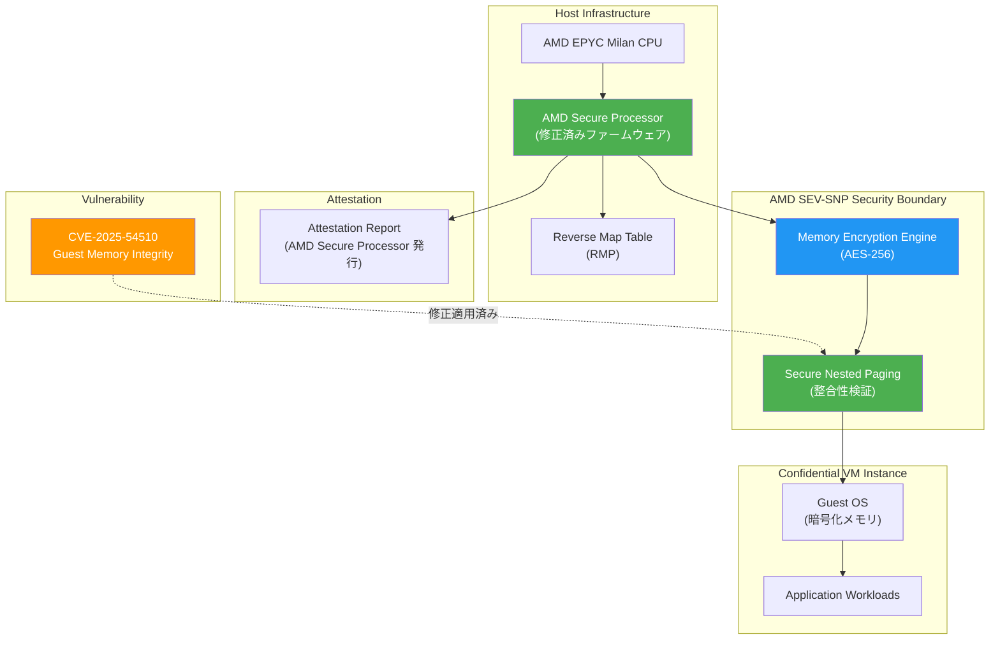

# Compute Engine: AMD SEV-SNP ゲストメモリ整合性の脆弱性修正 (CVE-2025-54510)

**リリース日**: 2026-04-14

**サービス**: Compute Engine

**機能**: AMD SEV-SNP Guest Memory Integrity Vulnerability Fix (CVE-2025-54510)

**ステータス**: セキュリティ修正適用済み

[このアップデートのインフォグラフィックを見る](https://takech9203.github.io/google-cloud-news-summary/20260414-compute-engine-amd-sev-snp-cve-2025-54510.html)

## 概要

Google Cloud は、AMD SEV-SNP (Secure Encrypted Virtualization - Secure Nested Paging) のゲストメモリ整合性に影響する脆弱性 CVE-2025-54510 に対処したことを発表した。この脆弱性に関する詳細はセキュリティ速報 GCP-2026-019 に記載されている。

AMD SEV-SNP は、Confidential VM インスタンスにおいてハードウェアベースのメモリ暗号化と整合性保護を提供する技術であり、悪意のあるハイパーバイザーによるデータリプレイやメモリリマッピングなどの攻撃を防御する。本脆弱性はこのゲストメモリ整合性の保護機構に影響するものであり、悪用された場合、Confidential VM のメモリ保護が侵害される可能性があった。

対象となるのは、AMD SEV-SNP を有効にした Confidential VM インスタンス (N2D マシンタイプ、AMD EPYC Milan CPU プラットフォーム) を利用するユーザーである。Google は既にサーバーフリート全体に対して修正を適用済みであり、顧客側での対応は不要である。

**アップデート前の課題**

- AMD SEV-SNP のゲストメモリ整合性に関する脆弱性 (CVE-2025-54510) が存在し、メモリ保護機構が侵害されるリスクがあった
- 悪意のあるハイパーバイザーが本脆弱性を悪用することで、暗号化されたゲストメモリの整合性が損なわれる可能性があった
- Confidential VM が提供する Trusted Execution Environment (TEE) の信頼性に影響を及ぼす可能性があった

**アップデート後の改善**

- Google サーバーフリート全体に修正が適用され、CVE-2025-54510 が対処された
- AMD SEV-SNP によるゲストメモリ整合性保護の信頼性が回復された
- 顧客側の対応は不要であり、自動的に保護が適用されている

## アーキテクチャ図

AMD SEV-SNP のセキュリティアーキテクチャと CVE-2025-54510 の影響範囲を示す。脆弱性は Secure Nested Paging によるゲストメモリ整合性検証に影響するものであり、AMD Secure Processor のファームウェアレベルで修正が適用されている。

## サービスアップデートの詳細

### 対象脆弱性

1. **CVE-2025-54510: AMD SEV-SNP ゲストメモリ整合性の脆弱性**
   - AMD SEV-SNP のゲストメモリ整合性保護機構に影響する脆弱性
   - 悪用された場合、Confidential VM インスタンスの暗号化メモリの整合性が侵害される可能性があった
   - Google は既にサーバーフリート全体に修正を適用済み

### 対応状況

- **セキュリティ速報**: GCP-2026-019
- **顧客対応**: 不要 (Google が自動的に修正を適用済み)
- **修正範囲**: Google サーバーフリート全体
- **悪用の報告**: 現時点で悪用の証拠は確認されていない

### AMD SEV-SNP の保護機構

AMD SEV-SNP は、AMD SEV (Secure Encrypted Virtualization) を拡張した技術であり、以下の保護を提供する:

1. **メモリ暗号化**: AES-256 暗号化によるゲストメモリの保護
2. **Secure Nested Paging**: ハードウェアベースのメモリ整合性保護により、データリプレイやメモリリマッピング攻撃を防止
3. **Reverse Map Table (RMP)**: メモリページの所有権を追跡し、不正なアクセスを防止
4. **アテステーション**: AMD Secure Processor から直接アテステーションレポートを取得可能

## 技術仕様

### 脆弱性の詳細

| 項目 | 詳細 |
|------|------|
| CVE ID | CVE-2025-54510 |
| セキュリティ速報 | GCP-2026-019 |
| 影響を受ける技術 | AMD SEV-SNP (Secure Nested Paging) |
| 影響 | ゲストメモリ整合性の侵害 |
| 修正状況 | Google サーバーフリート全体に適用済み |
| 顧客対応 | 不要 |

### AMD SEV-SNP 対応マシンタイプ

| マシンタイプ | CPU プラットフォーム | Confidential Computing 技術 | ライブマイグレーション |
|-------------|---------------------|---------------------------|---------------------|
| N2D | AMD EPYC Milan | AMD SEV-SNP | 非対応 |

### AMD SEV-SNP 対応ゾーン

| リージョン | ゾーン |
|-----------|-------|
| asia-southeast1 | asia-southeast1-a, asia-southeast1-b, asia-southeast1-c |
| europe-west3 | europe-west3-a, europe-west3-b, europe-west3-c |
| europe-west4 | europe-west4-a, europe-west4-b, europe-west4-c |
| us-central1 | us-central1-a, us-central1-b, us-central1-c |

## メリット

### ビジネス面

- **運用負荷なし**: Google が自動的にサーバーフリート全体にパッチを適用しており、顧客側での作業や計画停止は一切不要
- **コンプライアンス維持**: Confidential Computing を利用する規制産業 (金融、医療、政府機関) において、セキュリティ要件を継続的に満たすことが可能
- **透明性の確保**: セキュリティ速報の公開により、脆弱性対応のプロセスが透明化され、監査対応やリスク評価に活用できる

### 技術面

- **ファームウェアレベルの修正**: ハードウェアベースのセキュリティ修正がインフラストラクチャレイヤーで適用され、ワークロードへの影響なし
- **ゲストメモリ整合性の回復**: SEV-SNP の Secure Nested Paging によるメモリ整合性保護の信頼性が維持されている
- **アテステーション検証**: ユーザーは AMD Secure Processor から発行されるアテステーションレポートを通じて、ファームウェアの整合性を引き続き検証可能

## デメリット・制約事項

### 制限事項

- 本速報は AMD SEV-SNP を使用する Confidential VM のみに関連する。AMD SEV や Intel TDX を使用するインスタンスには影響しない
- AMD SEV-SNP は N2D マシンタイプ (AMD EPYC Milan) でのみサポートされており、他のマシンタイプでは利用できない
- AMD SEV-SNP を使用する Confidential VM インスタンスはライブマイグレーションに対応していない

### 考慮すべき点

- AMD SEV-SNP を使用するワークロードのアテステーションレポートを定期的に検証し、ファームウェアの整合性を確認することが推奨される
- 過去のアップデート (2025年10月) により、AMD SEV-SNP のアテステーションレポートが v4 形式に変更されている。[go-sev-guest](https://github.com/google/go-sev-guest) ライブラリを使用している場合は v0.14.0 以上へのアップデートが必要
- 今後のファームウェアアップデートに伴い、Trusted Computing Base (TCB) のバージョンが変更される可能性がある。カスタムのアテステーション検証を実施している場合は、最新の TCB バージョンを確認すること

## ユースケース

### ユースケース 1: 金融機関における機密取引データの処理

**シナリオ**: 金融機関が Confidential VM (N2D + AMD SEV-SNP) を使用して、顧客の取引データや個人情報を処理している。ゲストメモリの暗号化と整合性保護により、クラウドインフラストラクチャの管理者を含む第三者からデータを保護している。

**効果**: Google による自動パッチ適用により、サービスの中断なく脆弱性が修正された。規制当局への報告においても、クラウドプロバイダーによる迅速なセキュリティ対応を証明できる。

### ユースケース 2: マルチパーティ計算における信頼実行環境

**シナリオ**: 複数の組織が Confidential Space を通じて機密データを共有・処理している。AMD SEV-SNP のアテステーション機能により、各パーティが実行環境の整合性を検証している。

**効果**: ゲストメモリ整合性の脆弱性が修正されたことで、マルチパーティ計算における Trusted Execution Environment (TEE) の信頼性が維持される。アテステーションレポートの検証を通じて、修正が適用されていることを確認できる。

## 利用可能リージョン

AMD SEV-SNP (N2D マシンタイプ、AMD EPYC Milan CPU) は以下のゾーンで利用可能:

- **アジア太平洋**: asia-southeast1-a, asia-southeast1-b, asia-southeast1-c
- **ヨーロッパ**: europe-west3-a/b/c, europe-west4-a/b/c
- **北米**: us-central1-a, us-central1-b, us-central1-c

## 関連サービス・機能

- **[Confidential VM](https://cloud.google.com/confidential-computing/confidential-vm/docs/about-cvm)**: ハードウェアベースのメモリ暗号化を提供する Compute Engine VM。AMD SEV、AMD SEV-SNP、Intel TDX に対応
- **[Confidential Space](https://cloud.google.com/confidential-computing/confidential-space/docs/confidential-space-overview)**: Confidential VM をベースとした、マルチパーティ計算のための信頼実行環境
- **[Cloud Monitoring](https://cloud.google.com/confidential-computing/confidential-vm/docs/monitoring)**: Confidential VM のステータスやアテステーション結果を監視するための統合モニタリング
- **[Security Command Center](https://cloud.google.com/security-command-center/docs)**: Confidential Computing が有効でないインスタンスを検知する `CONFIDENTIAL_COMPUTING_DISABLED` ファインディングを提供

## 参考リンク

- [インフォグラフィック](https://takech9203.github.io/google-cloud-news-summary/20260414-compute-engine-amd-sev-snp-cve-2025-54510.html)
- [公式リリースノート](https://cloud.google.com/release-notes#April_14_2026)
- [Compute Engine セキュリティ速報 (GCP-2026-019)](https://cloud.google.com/compute/docs/security-bulletins#gcp-2026-019)
- [Confidential VM セキュリティ速報](https://cloud.google.com/confidential-computing/confidential-vm/docs/security-bulletins)
- [Confidential VM ドキュメント](https://cloud.google.com/confidential-computing/confidential-vm/docs/about-cvm)
- [AMD SEV-SNP ホワイトペーパー](https://www.amd.com/content/dam/amd/en/documents/epyc-business-docs/white-papers/SEV-SNP-strengthening-vm-isolation-with-integrity-protection-and-more.pdf)
- [Confidential VM サポート対象構成](https://cloud.google.com/confidential-computing/confidential-vm/docs/supported-configurations)

## まとめ

GCP-2026-019 は、AMD SEV-SNP のゲストメモリ整合性に影響する脆弱性 CVE-2025-54510 に対するセキュリティ速報である。Google は既にサーバーフリート全体に修正を適用済みであり、顧客側での対応は不要である。AMD SEV-SNP を使用する Confidential VM のユーザーは、引き続きアテステーションレポートの検証を通じてファームウェアの整合性を確認し、今後のセキュリティ速報にも注視することを推奨する。

---

**タグ**: #ComputeEngine #ConfidentialVM #AMDSEVSNP #Security #GCP-2026-019 #CVE-2025-54510 #ゲストメモリ整合性 #セキュリティ速報
