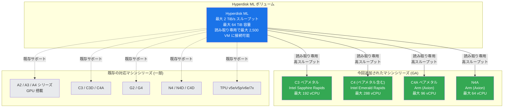

# Compute Engine: Hyperdisk ML が C3 ベアメタル、C4、C4A ベアメタル、N4A で GA サポート

**リリース日**: 2026-04-14

**サービス**: Compute Engine

**機能**: Hyperdisk ML の対応マシンシリーズ拡大 (C3 ベアメタル、C4 (ベアメタル含む)、C4A ベアメタル、N4A)

**ステータス**: GA (一般提供)

[このアップデートのインフォグラフィックを見る](https://takech9203.github.io/google-cloud-news-summary/20260414-compute-engine-hyperdisk-ml-ga.html)

## 概要

Google Cloud は、Hyperdisk ML ディスクの対応マシンシリーズに C3 ベアメタル、C4 (ベアメタルインスタンス含む)、C4A ベアメタルインスタンス、N4A の 4 つを新たに追加し、一般提供 (GA) としてリリースした。Hyperdisk ML は、Google Cloud の全 Hyperdisk タイプの中で最高のスループットを提供するブロックストレージであり、単一ボリュームで最大 2 TiB/s (2,097,152 MiB/s) のスループットと最大 33,554,432 IOPS を実現する。

今回のアップデートにより、ベアメタルインスタンスを含むハイパフォーマンスなコンピューティング環境で Hyperdisk ML を活用できるようになった。特に C3 ベアメタル (Intel Sapphire Rapids) や C4 ベアメタル (Intel Emerald Rapids) は、仮想化オーバーヘッドのない環境で最大級のパフォーマンスを必要とするワークロードに適しており、Hyperdisk ML の高スループット特性と組み合わせることで、大規模 AI/ML モデルの読み込み時間を大幅に短縮できる。また、N4A (Arm ベース) の追加により、コスト効率の高い Arm アーキテクチャ上でも高スループットの読み取り専用ストレージが利用可能になった。

このアップデートの主な対象ユーザーは、ベアメタル環境で大規模な推論・学習ワークロードを実行する AI/ML エンジニア、HPC ワークロードを実行するエンジニア、および N4A (Arm) 上でコスト効率の高い推論環境を構築するユーザーである。

**アップデート前の課題**

- C3 ベアメタルインスタンスでは Hyperdisk ML がサポートされておらず、仮想化オーバーヘッドのない環境で最高スループットのストレージを利用できなかった
- C4 マシンシリーズ (ベアメタル含む) では Hyperdisk ML を接続できず、Intel Emerald Rapids ベースの高性能コンピューティング環境でモデルデータの高速ロードが制限されていた
- C4A ベアメタルおよび N4A (Arm) マシンシリーズでは Hyperdisk ML を利用できず、Arm アーキテクチャ上での高スループット読み取りワークロードに制約があった

**アップデート後の改善**

- C3 ベアメタルインスタンスで Hyperdisk ML を利用可能になり、最大 10,000 MiB/s のインスタンスレベルスループットを活かした大規模データ読み込みが実現
- C4 マシンシリーズ (ベアメタル含む) で Hyperdisk ML を接続可能になり、最大 10,000 MiB/s のインスタンスレベルスループットで AI/ML モデルの高速ロードが可能に
- C4A ベアメタルインスタンスおよび N4A マシンシリーズで Hyperdisk ML が利用可能になり、Arm ベースの環境でもコスト効率の高い高スループットストレージを活用可能に

## アーキテクチャ図



Hyperdisk ML ボリュームと今回新たに GA サポートされたマシンシリーズの関係を示す。緑色のノードが今回追加されたマシンシリーズ、グレーのノードが既存の対応マシンシリーズである。

## サービスアップデートの詳細

### 今回追加されたマシンシリーズ

1. **C3 ベアメタル**
   - Intel Sapphire Rapids ベースのベアメタルインスタンス (c3-*-192 相当)
   - 仮想化オーバーヘッドなしで最大 192 vCPU を提供
   - Hyperdisk ML 接続時の最大スループット: 10,000 MiB/s、最大 IOPS: 500,000

2. **C4 (ベアメタルインスタンス含む)**
   - Intel Emerald Rapids ベースのマシンシリーズ
   - 2 vCPU から 288 vCPU まで幅広いサイズを提供
   - ベアメタルインスタンス (c4-*-288-metal) も含む
   - Hyperdisk ML 接続時の最大スループット: 10,000 MiB/s (c4-*-192 以上)、最大 IOPS: 500,000

3. **C4A ベアメタルインスタンス**
   - Google Axion (Arm ベース) プロセッサを搭載したベアメタルインスタンス
   - Arm アーキテクチャによるコスト効率とエネルギー効率の高いコンピューティング
   - Hyperdisk ML 接続時の最大スループット: 5,000 MiB/s (c4a-*-72)、最大 IOPS: 350,000

4. **N4A**
   - Google Axion (Arm ベース) プロセッサを搭載した汎用マシンシリーズ
   - 1 vCPU から 64 vCPU までのサイズを提供
   - Hyperdisk ML 接続時の最大スループット: 2,400 MiB/s (n4a-*-48 以上)、最大 IOPS: 160,000

### Hyperdisk ML の主な特徴

1. **最高クラスのスループット**
   - 単一ボリュームで最大 2 TiB/s (2,097,152 MiB/s) のスループットを提供
   - 1 MiB/s のスループットあたり 16 IOPS が自動的にプロビジョニングされ、最大 33,554,432 IOPS に到達可能

2. **マルチ VM 読み取り専用アタッチ**
   - 単一の Hyperdisk ML ボリュームを最大 2,500 VM に同時に読み取り専用でアタッチ可能
   - 複数の VM でデータを共有することで、同一データの複製が不要となりコストを削減
   - アタッチ数はボリューム容量に応じて変動 (512 GiB 以下: 最大 2,500、16 TiB 超: 最大 30)

3. **99.999% の耐久性**
   - データは複数の物理ディスクに分散配置されており、高い耐久性を確保

## 技術仕様

### Hyperdisk ML ボリュームのサイズ・パフォーマンス上限

| 項目 | 仕様 |
|------|------|
| 容量 | 4 GiB - 64 TiB (デフォルト: 100 GiB) |
| スループット | 400 MiB/s - 2,097,152 MiB/s (2 TiB/s) |
| IOPS | 自動計算 (スループット x 16、最大 33,554,432) |
| 耐久性 | 99.999% 以上 |
| アクセスモード | READ_WRITE_SINGLE または READ_ONLY_MANY |
| 最大アタッチ VM 数 (読み取り専用) | 最大 2,500 (容量に依存) |
| サイズ変更間隔 | 4 時間ごと |
| スループット変更間隔 | 6 時間ごと |

### 今回追加されたマシンシリーズの Hyperdisk ML パフォーマンス上限

| マシンタイプ | 最大 IOPS | 最大スループット (MiB/s) |
|-------------|-----------|------------------------|
| c3-*-192 (ベアメタル) | 500,000 | 10,000 |
| c4-*-2 | 50,000 | 400 |
| c4-*-48 | 160,000 | 2,400 |
| c4-*-96 | 350,000 | 5,000 |
| c4-*-192 | 500,000 | 10,000 |
| c4-*-288 | 500,000 | 10,000 |
| c4a-*-72 (ベアメタル相当) | 350,000 | 5,000 |
| n4a-*-16 | 80,000 | 1,200 |
| n4a-*-32 | 100,000 | 1,600 |
| n4a-*-48 | 160,000 | 2,400 |
| n4a-*-64 | 160,000 | 2,400 |

### 4 世代マシンへの制限事項

2026 年 2 月 4 日以前に作成された Hyperdisk ML ボリュームは、C4 や G4 などの第 4 世代マシンにアタッチできない。この制限を回避するには、既存ディスクのスナップショットを作成し、そのスナップショットから新しいディスクを作成する必要がある。

## 設定方法

### 前提条件

1. Google Cloud プロジェクトで Compute Engine API が有効であること
2. 対象マシンシリーズ (C3 ベアメタル、C4、C4A ベアメタル、N4A) が利用可能なリージョン・ゾーンにリソースがあること
3. プロジェクトに十分な Hyperdisk ML スループットクォータ (`HDML_TOTAL_THROUGHPUT`) があること

### 手順

#### ステップ 1: Hyperdisk ML ボリュームの作成

```bash
gcloud compute disks create my-hdml-disk \
    --zone=us-central1-a \
    --size=500GB \
    --type=hyperdisk-ml \
    --provisioned-throughput=2400 \
    --access-mode=READ_ONLY_MANY
```

`--provisioned-throughput` を指定しない場合、デフォルト値 (MAX(24 x サイズGiB, 400) MiB/s) が適用される。

#### ステップ 2: VM インスタンスへのアタッチ

```bash
# C4 インスタンスにアタッチする例
gcloud compute instances attach-disk my-c4-instance \
    --disk=my-hdml-disk \
    --zone=us-central1-a \
    --mode=ro

# N4A インスタンスにアタッチする例
gcloud compute instances attach-disk my-n4a-instance \
    --disk=my-hdml-disk \
    --zone=us-central1-a \
    --mode=ro
```

読み取り専用モード (`--mode=ro`) を指定することで、同一ディスクを複数の VM から同時にアクセスできる。

#### ステップ 3: ディスクのマウント

```bash
# Linux VM 上でのマウント例
sudo mkdir -p /mnt/hdml
sudo mount -o ro /dev/nvme0n2 /mnt/hdml
```

## メリット

### ビジネス面

- **ベアメタル環境での AI/ML ワークロード最適化**: 仮想化オーバーヘッドのないベアメタルインスタンスで Hyperdisk ML を利用することで、大規模モデルの読み込み時間を短縮し、GPU/アクセラレータのアイドル時間を削減できる
- **Arm アーキテクチャによるコスト最適化**: N4A (Arm) で Hyperdisk ML が利用可能になったことで、推論ワークロードなどにおいて x86 と比較してコスト効率の高い構成が選択可能に
- **データ共有コストの削減**: 単一の Hyperdisk ML ボリュームを複数の VM で共有することで、データの複製が不要となりストレージコストを削減

### 技術面

- **最大 10,000 MiB/s のインスタンスレベルスループット**: C3 ベアメタルおよび C4 の大型インスタンスでは、単一 VM あたり最大 10,000 MiB/s のスループットを実現
- **スケーラブルなマルチ VM 構成**: 最大 2,500 VM への同時アタッチにより、大規模な分散推論や HPC ワークロードに対応
- **柔軟なパフォーマンスプロビジョニング**: 作成後もスループットを 6 時間ごとに変更可能で、ワークロードの変化に対応

## デメリット・制約事項

### 制限事項

- Hyperdisk ML はブートディスクとして使用できない
- 読み取り専用モードに変更した後は、書き込みモードに戻すことができない
- Hyperdisk ML ボリュームからマシンイメージやインスタントスナップショットは作成できない
- 2026 年 2 月 4 日以前に作成された Hyperdisk ML ボリュームは、C4 などの第 4 世代マシンにアタッチできない (スナップショット経由の再作成が必要)
- ボリュームはゾーナルリソースであり、作成したゾーンからのみアクセス可能

### 考慮すべき点

- Hyperdisk ML は CUD (確約利用割引) および SUD (継続利用割引) の対象外である
- 20 VM を超えてアタッチする場合、VM あたり最低 100 MiB/s のスループットをプロビジョニングする必要がある (例: 500 VM にアタッチする場合、最低 50,000 MiB/s が必要)
- VM のマシンタイプに応じたパフォーマンス上限があるため、ディスク側のプロビジョニング値がインスタンス側の上限を超えても効果がない

## ユースケース

### ユースケース 1: C4 ベアメタルでの大規模 LLM 推論

**シナリオ**: 大規模言語モデル (数百 GB) を C4 ベアメタルインスタンス上で推論サービスとして運用する。モデルデータを Hyperdisk ML に格納し、読み取り専用モードで複数のインスタンスに同時アタッチすることで、スケーラブルな推論環境を構築する。

**実装例**:
```bash
# 1 TiB の Hyperdisk ML ボリュームを作成 (高スループット)
gcloud compute disks create llm-model-disk \
    --zone=us-central1-a \
    --size=1000GB \
    --type=hyperdisk-ml \
    --provisioned-throughput=10000 \
    --access-mode=READ_ONLY_MANY

# C4 ベアメタルインスタンスに読み取り専用でアタッチ
gcloud compute instances attach-disk c4-inference-01 \
    --disk=llm-model-disk \
    --zone=us-central1-a \
    --mode=ro
```

**効果**: 単一の Hyperdisk ML ボリュームから最大 10,000 MiB/s のスループットでモデルデータを読み込み可能。モデルのロード時間を大幅に短縮し、推論サービスのスケールアウトが容易になる。

### ユースケース 2: N4A (Arm) でのコスト効率の高い推論環境

**シナリオ**: 中規模の AI モデルを N4A (Arm ベース) インスタンス上でコスト効率よく推論する。Arm アーキテクチャの低コスト特性と Hyperdisk ML の高スループット読み取りを組み合わせる。

**効果**: x86 ベースのインスタンスと比較してコストを削減しつつ、Hyperdisk ML による高速モデルロードを実現。n4a-*-48 以上のインスタンスでは最大 2,400 MiB/s のスループットを活用可能。

### ユースケース 3: C3 ベアメタルでの HPC ワークロード

**シナリオ**: 大規模な不変データセット (ゲノムデータ、気象シミュレーションデータなど) を C3 ベアメタルインスタンス上で解析する。Hyperdisk ML の読み取り専用マルチアタッチにより、複数のベアメタルノードで同一データセットを共有する。

**効果**: 仮想化オーバーヘッドのないベアメタル環境で最大 10,000 MiB/s のスループットを活用し、大規模データセットの読み込みを高速化。データの複製が不要となり、ストレージコストも削減される。

## 料金

Hyperdisk ML は、プロビジョニングした容量とスループットに基づいて課金される。容量はボリューム削除まで、インスタンスの状態 (停止・サスペンド含む) に関係なく課金が継続される。マルチ VM アタッチによる追加料金は発生しない。

詳細な料金は [Disk pricing](https://cloud.google.com/compute/disks-image-pricing#disk) を参照。

## 利用可能リージョン

Hyperdisk ML は全てのリージョンおよびゾーンで利用可能である。ただし、今回追加されたマシンシリーズ (C3 ベアメタル、C4、C4A ベアメタル、N4A) の利用可能ゾーンはマシンシリーズごとに異なるため、各マシンシリーズのドキュメントで確認が必要である。

## 関連サービス・機能

- **[Hyperdisk ML Overview](https://cloud.google.com/compute/docs/disks/hd-types/hyperdisk-ml)**: Hyperdisk ML の概要、対応マシンシリーズ、パフォーマンス仕様
- **[GKE での Hyperdisk ML](https://cloud.google.com/kubernetes-engine/docs/how-to/persistent-volumes/hyperdisk-ml)**: GKE クラスタにおける Hyperdisk ML の Persistent Volume としての利用方法
- **[Hyperdisk パフォーマンス上限](https://cloud.google.com/compute/docs/disks/hyperdisk-perf-limits)**: マシンタイプごとの Hyperdisk パフォーマンス上限一覧
- **[VM 間でのディスク共有](https://cloud.google.com/compute/docs/disks/sharing-disks-between-vms)**: 読み取り専用モードでの Hyperdisk ML マルチアタッチの詳細

## 参考リンク

- [インフォグラフィック](https://takech9203.github.io/google-cloud-news-summary/20260414-compute-engine-hyperdisk-ml-ga.html)
- [公式リリースノート](https://cloud.google.com/release-notes#April_14_2026)
- [Hyperdisk ML ドキュメント](https://cloud.google.com/compute/docs/disks/hd-types/hyperdisk-ml)
- [Hyperdisk の概要](https://cloud.google.com/compute/docs/disks/hyperdisks)
- [Hyperdisk ボリュームの作成](https://cloud.google.com/compute/docs/disks/add-hyperdisk)
- [ディスク料金](https://cloud.google.com/compute/disks-image-pricing#disk)

## まとめ

今回のアップデートにより、Hyperdisk ML が C3 ベアメタル、C4 (ベアメタル含む)、C4A ベアメタル、N4A マシンシリーズで GA サポートされた。特にベアメタルインスタンスでの Hyperdisk ML 利用が可能になったことで、仮想化オーバーヘッドのない環境での大規模 AI/ML モデルロードや HPC ワークロードが大幅に効率化される。N4A (Arm) の追加により、コスト効率を重視した推論環境でも高スループットストレージが活用できるようになった。対象マシンシリーズを利用中のユーザーは、既存のワークロードで Hyperdisk ML の導入を検討することを推奨する。

---

**タグ**: #ComputeEngine #HyperdiskML #GA #BareMetal #C3 #C4 #C4A #N4A #AI_ML
