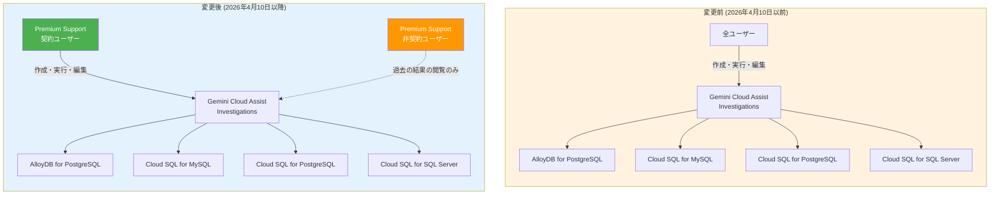

# AlloyDB / Cloud SQL: Gemini Cloud Assist Investigations が Premium Support 契約必須に (Breaking Change)

**リリース日**: 2026-04-14

**サービス**: AlloyDB for PostgreSQL, Cloud SQL for MySQL, Cloud SQL for PostgreSQL, Cloud SQL for SQL Server

**機能**: Gemini Cloud Assist Investigations - Premium Support 契約要件の追加

**ステータス**: Breaking Change (2026年4月10日より適用済み)

[このアップデートのインフォグラフィックを見る](https://takech9203.github.io/google-cloud-news-summary/20260414-gemini-cloud-assist-premium-support.html)

## 概要

2026年4月10日以降、Gemini Cloud Assist の Investigations (調査) 機能の作成・実行・編集に Premium Support 契約が必須となった。この変更は AlloyDB for PostgreSQL、Cloud SQL for MySQL、Cloud SQL for PostgreSQL、Cloud SQL for SQL Server の 4 つのデータベースサービスに同時に適用される Breaking Change である。

Gemini Cloud Assist Investigations は、AI を活用してデータベースインスタンスの監視とトラブルシューティングを行う機能であり、ログ、メトリクス、構成情報を横断的に分析して根本原因の特定と解決策の提示を行う。これまでは Premium Support 契約なしでもこの機能を利用できたが、今回の変更により、新規の調査の作成・実行・編集には Premium Support 契約が必要となった。

なお、2026年4月10日より前に実行された調査の結果については、引き続き Google Cloud コンソールで閲覧可能である。既存の調査結果が削除されることはないが、新たな調査を開始することはできなくなる。

**アップデート前の課題**

- Gemini Cloud Assist Investigations は Premium Support 契約の有無に関わらず利用可能であった
- データベースの AI 支援トラブルシューティング機能に対するアクセス制御が限定的であった

**アップデート後の改善**

- Gemini Cloud Assist Investigations の作成・実行・編集には Premium Support 契約が必須となった
- Premium Support 契約を持つ顧客は引き続き AI 支援の調査機能をフルに活用可能
- 2026年4月10日以前に実行された調査結果は Premium Support 契約なしでも引き続き閲覧可能

## アーキテクチャ図

変更前は全ユーザーが Investigations 機能を利用できたが、変更後は Premium Support 契約ユーザーのみが新規の調査を作成・実行・編集できる。非契約ユーザーは過去に実行した調査結果の閲覧のみ可能となった。

## サービスアップデートの詳細

### 影響を受けるサービス

1. **AlloyDB for PostgreSQL**
   - AI 支援トラブルシューティングによるクエリパフォーマンスの分析と最適化
   - Query Insights ダッシュボードからの Gemini Cloud Assist 連携
   - 高データベースロードの調査・分析機能

2. **Cloud SQL for MySQL**
   - AI 支援によるスロークエリの検出と改善提案
   - Query Insights Enterprise Plus 機能との統合
   - Cloud SQL Enterprise Plus エディションでの AI トラブルシューティング

3. **Cloud SQL for PostgreSQL**
   - Cloud SQL Enterprise Plus エディションでの AI 支援トラブルシューティング
   - クエリパフォーマンスの AI 分析と最適化提案

4. **Cloud SQL for SQL Server**
   - Cloud SQL Enterprise Plus エディションでの AI 支援トラブルシューティング
   - クエリパフォーマンスの AI 分析と最適化提案

### Gemini Cloud Assist Investigations の機能

Investigations は以下の機能を提供する根本原因分析 (RCA) ツールである:

1. **問題の診断**: ログ、メトリクス、構成情報を横断的に分析し、問題の根本原因を特定
2. **Observations (観察結果)**: 環境の状態に関する AI 生成のインサイトを提供
3. **Hypotheses (仮説)**: 収集データに基づく根本原因の仮説と推奨される修正策を提示
4. **サポートへのエスカレーション**: 調査結果をそのまま Google Cloud サポートケースに転送可能 (サポート契約保持者のみ)

## 技術仕様

### 変更内容の詳細

| 項目 | 詳細 |
|------|------|
| 変更種別 | Breaking Change |
| 適用日 | 2026年4月10日 |
| 発表日 | 2026年4月14日 |
| 影響範囲 | AlloyDB for PostgreSQL, Cloud SQL for MySQL, Cloud SQL for PostgreSQL, Cloud SQL for SQL Server |
| 新要件 | Premium Support 契約 |
| 影響を受ける操作 | Investigations の作成、実行、編集 |
| 影響を受けない操作 | 2026年4月10日以前に実行された調査結果の閲覧 |

### 必要な IAM ロールとパーミッション

Gemini Cloud Assist Investigations の利用には、Premium Support 契約に加えて以下の IAM ロールが必要:

| ロール | 説明 |
|--------|------|
| `roles/geminicloudassist.investigationOwner` | Gemini Cloud Assist Investigation Owner - 調査の作成・管理に必要 |
| `roles/databaseinsights.viewer` | Database Insights Viewer - AI 支援トラブルシューティングの利用に必要 |

### 必要なパーミッション

| パーミッション | 用途 |
|---------------|------|
| `databaseinsights.performanceIssues.detect` | パフォーマンス問題の検出 |
| `databaseinsights.performanceIssues.investigate` | パフォーマンス問題の調査 |

## デメリット・制約事項

### 制限事項

- Premium Support 契約のない顧客は、2026年4月10日以降、Gemini Cloud Assist Investigations の新規作成・実行・編集ができなくなった
- この変更は 4 つのデータベースサービス (AlloyDB for PostgreSQL, Cloud SQL for MySQL, Cloud SQL for PostgreSQL, Cloud SQL for SQL Server) 全てに同時に適用される
- Premium Support は月額最低 $15,000 (または Cloud 利用額に基づく従量課金) であり、小規模な組織にとってはコスト負担が大きい
- Premium Support は 12 か月の最低契約期間があり、短期利用はできない

### 考慮すべき点

- 現在 Gemini Cloud Assist Investigations を活用してデータベースの監視・トラブルシューティングを行っている場合、Premium Support 契約の有無を早急に確認する必要がある
- Premium Support 契約がない場合は、代替のトラブルシューティング手法 (Cloud Monitoring、Cloud Logging、手動でのクエリ分析など) への移行を検討する必要がある
- Gemini Cloud Assist の他の機能 (チャット、データベーストラブルシューティングなど) がこの変更の影響を受けるかは、リリースノートからは明確ではない。Investigations 機能に特化した変更である可能性が高い
- 2026年4月10日以前の調査結果は閲覧可能だが、その結果を基にした調査の再実行 (Revision) には Premium Support 契約が必要となる可能性がある

## 料金

Gemini Cloud Assist Investigations の利用には Premium Support 契約が必要となった。Premium Support の料金体系は以下の通り:

### Premium Support 料金

| 月額 Cloud 利用額 | サポート料率 |
|-------------------|-------------|
| $0 - $150,000 | 10% |
| $150,000 - $500,000 | 7% |
| $500,000 - $1,000,000 | 5% |
| $1,000,000 超 | 3% |

- **最低月額**: $15,000
- **最低契約期間**: 12 か月 (自動更新)
- 月額 Cloud 利用料金のリスト価格に基づいて計算される

## 関連サービス・機能

- **[Gemini Cloud Assist](https://docs.cloud.google.com/cloud-assist/overview)**: AI を活用した Google Cloud の設計・構築・監視・トラブルシューティング支援サービス。Investigations はその診断・解決機能の一部
- **[AlloyDB AI 支援トラブルシューティング](https://docs.cloud.google.com/alloydb/docs/monitor-troubleshoot-with-ai)**: AlloyDB のクエリパフォーマンス改善とシステムパフォーマンス監視を AI で支援
- **[Cloud SQL AI 支援トラブルシューティング](https://docs.cloud.google.com/sql/docs/mysql/observe-troubleshoot-with-ai)**: Cloud SQL のクエリパフォーマンス改善とシステムパフォーマンス監視を AI で支援
- **[Google Cloud Premium Support](https://docs.cloud.google.com/support/docs/premium)**: P1 ケースの 15 分以内応答、24/7 サポート、TAM サービスなどを含むエンタープライズ向けサポートサービス
- **[Database Center](https://docs.cloud.google.com/database-center/docs/learn-database-products-using-gemini)**: データベースフリートの健全性を Gemini Cloud Assist で監視・最適化

## 参考リンク

- [インフォグラフィック](https://takech9203.github.io/google-cloud-news-summary/20260414-gemini-cloud-assist-premium-support.html)
- [公式リリースノート](https://docs.cloud.google.com/release-notes#April_14_2026)
- [Gemini Cloud Assist Investigations ドキュメント](https://docs.cloud.google.com/cloud-assist/investigations)
- [AlloyDB AI 支援トラブルシューティング](https://docs.cloud.google.com/alloydb/docs/monitor-troubleshoot-with-ai)
- [Cloud SQL for MySQL AI 支援トラブルシューティング](https://docs.cloud.google.com/sql/docs/mysql/observe-troubleshoot-with-ai)
- [Cloud SQL for PostgreSQL AI 支援トラブルシューティング](https://docs.cloud.google.com/sql/docs/postgres/observe-troubleshoot-with-ai)
- [Cloud SQL for SQL Server AI 支援トラブルシューティング](https://docs.cloud.google.com/sql/docs/sqlserver/observe-troubleshoot-with-ai)
- [Premium Support 概要](https://docs.cloud.google.com/support/docs/premium)

## まとめ

本変更は、Gemini Cloud Assist の Investigations 機能を Premium Support 契約必須とする Breaking Change であり、AlloyDB for PostgreSQL、Cloud SQL for MySQL、Cloud SQL for PostgreSQL、Cloud SQL for SQL Server の 4 サービスに同時に影響する。現在この機能を活用しているユーザーは、Premium Support 契約の有無を確認し、契約がない場合は代替のトラブルシューティング手法への移行を早急に検討すべきである。既存の調査結果は引き続き閲覧可能だが、新たな調査には Premium Support 契約が必要となるため、運用プロセスへの影響を評価することを推奨する。

---

**タグ**: #GeminiCloudAssist #AlloyDB #CloudSQL #PremiumSupport #Breaking
