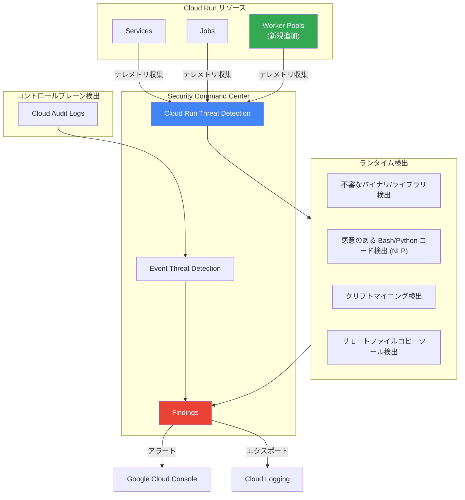

# Security Command Center: Cloud Run Threat Detection が Cloud Run Worker Pools の監視に対応

**リリース日**: 2026-04-14

**サービス**: Security Command Center

**機能**: Cloud Run Threat Detection による Worker Pools 監視の追加

**ステータス**: Feature (機能追加)

[このアップデートのインフォグラフィックを見る](https://takech9203.github.io/google-cloud-news-summary/20260414-security-command-center-cloud-run-threat-detection.html)

## 概要

Google Cloud は、Security Command Center (SCC) の組み込みサービスである Cloud Run Threat Detection の監視対象に Cloud Run Worker Pools を追加したことを発表した。これにより、Cloud Run の 3 つのリソースタイプ全て (Services、Jobs、Worker Pools) が Cloud Run Threat Detection によるランタイム脅威検出の対象となる。

このアップデートは、同日 (2026 年 4 月 14 日) に Cloud Run Worker Pools が General Availability (GA) に昇格したことと連動している。Worker Pools が GA として本番環境での利用が正式にサポートされるのと同時に、SCC による脅威検出カバレッジが拡張されたことで、Worker Pools を利用するユーザーは GA 初日からセキュリティ監視の恩恵を受けることができる。

対象となるのは、SCC の Premium または Enterprise ティアを利用しており、Cloud Run Worker Pools でバックグラウンド処理ワークロード (Pub/Sub メッセージ消費、Kafka コンシューマー、ML 推論サーバーなど) を運用するユーザーである。

**アップデート前の課題**

- Cloud Run Threat Detection の監視対象は Cloud Run Services と Cloud Run Jobs のみであり、Worker Pools は対象外であった
- Worker Pools 上で動作するバックグラウンドワークロードに対するランタイム脅威検出が提供されておらず、悪意のあるバイナリの実行やクリプトマイニングなどの攻撃を検出する手段が限定的であった
- Worker Pools は Preview 段階であったため、セキュリティカバレッジの優先度が低かった

**アップデート後の改善**

- Cloud Run Worker Pools が Cloud Run Threat Detection の監視対象に追加され、ランタイム脅威検出が利用可能になった
- Cloud Run の全リソースタイプ (Services、Jobs、Worker Pools) に対して統一的な脅威検出カバレッジが提供されるようになった
- Worker Pools の GA と同時にセキュリティ監視が利用可能となり、本番環境での利用開始時点からセキュリティが確保される

## アーキテクチャ図



Security Command Center の Cloud Run Threat Detection が Cloud Run の全リソースタイプ (Services、Jobs、Worker Pools) からテレメトリを収集し、ランタイム検出器で脅威を分析する。Worker Pools が新たに監視対象に追加されたことで、バックグラウンドワークロードに対するセキュリティカバレッジが完成した。

## サービスアップデートの詳細

### Cloud Run Threat Detection の監視対象リソース

| リソースタイプ | 説明 | 監視状況 |
|--------------|------|---------|
| Cloud Run Services | HTTP リクエスト処理用のサーバーレスコンテナ | 既存 (GA) |
| Cloud Run Jobs | バッチ処理用のコンテナ実行 | 既存 (GA) |
| Cloud Run Worker Pools | 継続的バックグラウンド処理用のコンテナ | **今回追加** |

### 主要機能

1. **ランタイム脅威検出 (Runtime Detectors)**
   - Worker Pools のコンテナ内で実行されるプロセス、スクリプト、ライブラリを継続的に監視する
   - 不審なバイナリやライブラリのロードを検出する
   - NLP (自然言語処理) を活用して、悪意のある Bash および Python コードを検出する
   - 第 2 世代実行環境で動作する Worker Pools が対象

2. **コントロールプレーン検出 (Control Plane Detectors)**
   - Event Threat Detection を通じて Cloud Audit Logs を監視する
   - Worker Pools に対するクリプトマイニングコマンドの付与や、不正な Docker イメージの使用を検出する
   - 第 1 世代および第 2 世代の両方の実行環境で動作する

3. **検出可能な脅威の例**
   - 不審な OpenSSL 共有オブジェクトのロード
   - リモートファイルコピーツールの実行 (データ流出の可能性)
   - 悪意のあるコマンドライン引数の検出
   - ディスクからの大量データ削除
   - Stratum プロトコルを使用した暗号通貨マイニング
   - NLP によるマルウェアスクリプトの検出

## 技術仕様

### ランタイム検出器の一覧

| 検出器名 | API 名 | 説明 |
|---------|--------|------|
| 不審な OpenSSL 共有オブジェクト | CLOUD_RUN_SUSPICIOUS_OPENSSL_SHARED_OBJECT_LOADED | カスタム共有オブジェクトによる OpenSSL の置き換えを検出 |
| リモートファイルコピーツール | CLOUD_RUN_LAUNCH_REMOTE_FILE_COPY_TOOLS_IN_CONTAINER | コンテナ内でのリモートファイルコピーツールの実行を検出 |
| 悪意のあるコマンドライン | CLOUD_RUN_DETECT_MALICIOUS_CMDLINES | 破壊的なコマンド引数の実行を検出 |
| 大量データ削除 | CLOUD_RUN_REMOVE_BULK_DATA_FROM_DISK | 証拠隠滅やデータワイピング攻撃の可能性を検出 |
| 暗号通貨マイニング | CLOUD_RUN_SUSPICIOUS_CRYPTO_MINING_ACTIVITY_USING_STRATUM_PROTOCOL | Stratum プロトコルによる不正マイニングを検出 |
| 悪意のあるスクリプト | CLOUD_RUN_MALICIOUS_SCRIPT_EXECUTED | NLP で悪意のある Bash コードを識別 |

### コントロールプレーン検出器の一覧

| 検出器名 | API 名 | 説明 |
|---------|--------|------|
| クリプトマイニングコマンド | CLOUD_RUN_JOBS_CRYPTOMINING_COMMANDS | クリプトマイニングコマンドの付与を検出 |
| クリプトマイニング Docker イメージ | CLOUD_RUN_CRYPTOMINING_DOCKER_IMAGES | 既知の悪意ある Docker イメージの使用を検出 |
| デフォルト SA による IAM ポリシー設定 | CLOUD_RUN_SERVICES_SET_IAM_POLICY | デフォルト Compute Engine SA による不正な IAM 操作を検出 |

### 実行環境の要件

| 検出器タイプ | 対応実行環境 |
|------------|-------------|
| ランタイム検出器 | 第 2 世代実行環境のみ |
| コントロールプレーン検出器 | 第 1 世代および第 2 世代 |

## 設定方法

### 前提条件

1. Security Command Center の Premium または Enterprise ティアが有効であること
2. Cloud Run Threat Detection が組織またはプロジェクトで有効化されていること
3. Worker Pools が第 2 世代実行環境で動作していること (ランタイム検出器を利用する場合)

### 手順

#### ステップ 1: Cloud Run Threat Detection の有効化確認

Cloud Run Threat Detection は SCC の Premium および Enterprise ティアではデフォルトで有効化されている。Google Cloud コンソールの Security Command Center 設定画面で有効化状況を確認する。

#### ステップ 2: Worker Pools のデプロイ (第 2 世代実行環境)

```bash
# Worker Pool を第 2 世代実行環境でデプロイ
gcloud run worker-pools deploy my-worker-pool \
  --image us-docker.pkg.dev/my-project/my-repo/my-worker:latest \
  --region us-central1 \
  --execution-environment gen2
```

ランタイム検出器を利用するには、Worker Pool が第 2 世代実行環境で動作している必要がある。Cloud Run Threat Detection が有効な場合、第 1 世代実行環境での Worker Pool の作成はブロックされる。

#### ステップ 3: Findings の確認

```bash
# SCC の Findings を確認 (gcloud)
gcloud scc findings list organizations/ORG_ID \
  --source=projects/PROJECT_ID/sources/SOURCE_ID \
  --filter='category="CLOUD_RUN_MALICIOUS_SCRIPT_EXECUTED"'
```

Cloud Run Threat Detection が脅威を検出すると、SCC の Findings としてニアリアルタイムで報告される。Google Cloud コンソールの SCC ダッシュボードまたは gcloud CLI で確認できる。

## メリット

### ビジネス面

- **GA 初日からのセキュリティ保証**: Worker Pools の GA と同時にセキュリティ監視が利用可能となり、本番ワークロードの導入時点から包括的なセキュリティカバレッジが確保される
- **統一的なセキュリティ管理**: Cloud Run の全リソースタイプに対する脅威検出が SCC に統合され、セキュリティチームの運用負荷が軽減される

### 技術面

- **追加設定不要の自動保護**: SCC Premium/Enterprise ティアでは Cloud Run Threat Detection がデフォルトで有効化されており、Worker Pools に対しても自動的に脅威検出が適用される
- **NLP ベースのスクリプト分析**: シグネチャベースでない NLP 技術により、既知および未知の悪意のあるスクリプトを検出可能

## デメリット・制約事項

### 制限事項

- ランタイム検出器は第 2 世代実行環境でのみ動作する。第 1 世代実行環境の Worker Pools ではコントロールプレーン検出器のみが利用可能
- Cloud Run Threat Detection を有効化すると、第 1 世代実行環境での Worker Pool の作成がブロックされる
- データレジデンシーを特定のロケーションで有効化している場合、CLOUD_RUN_MALICIOUS_SCRIPT_EXECUTED 検出器はそのロケーションで有効化できない

### 考慮すべき点

- Cloud Run Threat Detection は SCC の Premium または Enterprise ティアでのみ利用可能であり、Standard ティアでは利用できない
- 検出結果はエフェメラルなデータに基づいており、脅威と判定されなかったデータは永続的に保存されない

## ユースケース

### ユースケース 1: Kafka コンシューマー Worker Pool の保護

**シナリオ**: 金融取引データを処理する Kafka コンシューマーを Worker Pool 上で運用している。攻撃者がコンテナの脆弱性を悪用して侵入し、リモートファイルコピーツールを使用して取引データを外部に流出させようとする。

**効果**: Cloud Run Threat Detection のランタイム検出器がリモートファイルコピーツールの実行を検出 (CLOUD_RUN_LAUNCH_REMOTE_FILE_COPY_TOOLS_IN_CONTAINER) し、SCC に Finding を生成する。セキュリティチームはニアリアルタイムでアラートを受信し、迅速なインシデント対応が可能になる。

### ユースケース 2: GPU Worker Pool でのクリプトマイニング検出

**シナリオ**: ML 推論用の GPU Worker Pool が運用されている。攻撃者が不正アクセスに成功し、GPU リソースを悪用して暗号通貨マイニングを実行する。

**効果**: Stratum プロトコルを使用した通信が検出され (CLOUD_RUN_SUSPICIOUS_CRYPTO_MINING_ACTIVITY_USING_STRATUM_PROTOCOL)、GPU リソースの不正利用を早期に発見できる。これにより、コストの増大とパフォーマンス劣化を最小限に抑えることができる。

## 関連サービス・機能

- **[Cloud Run Worker Pools](https://cloud.google.com/run/docs/deploy-worker-pools)**: 今回のアップデートで Cloud Run Threat Detection の監視対象に追加された Cloud Run のリソースタイプ。同日に GA に昇格
- **[Container Threat Detection](https://cloud.google.com/security-command-center/docs/concepts-container-threat-detection-overview)**: GKE コンテナに対するランタイム脅威検出サービス。Cloud Run Threat Detection と同様に SCC の組み込みサービスとして提供される
- **[Event Threat Detection](https://cloud.google.com/security-command-center/docs/concepts-event-threat-detection-overview)**: Cloud Logging のログストリームを監視してコントロールプレーンレベルの脅威を検出するサービス。Cloud Run のコントロールプレーン検出器はこのサービスを通じて提供される
- **[Agent Engine Threat Detection](https://cloud.google.com/security-command-center/docs/agent-engine-threat-detection-overview)**: Vertex AI Agent Engine にデプロイされた AI エージェントに対するランタイム脅威検出サービス (Preview)

## 参考リンク

- [インフォグラフィック](https://takech9203.github.io/google-cloud-news-summary/20260414-security-command-center-cloud-run-threat-detection.html)
- [公式リリースノート](https://docs.cloud.google.com/release-notes#April_14_2026)
- [Cloud Run Threat Detection の概要](https://cloud.google.com/security-command-center/docs/cloud-run-threat-detection-overview)
- [Cloud Run Threat Detection の使用](https://cloud.google.com/security-command-center/docs/use-cloud-run-threat-detection)
- [Cloud Run Threat Detection のテスト](https://cloud.google.com/security-command-center/docs/how-to-test-cloud-run-threat-detection)
- [Cloud Run の脅威 Findings への対応](https://cloud.google.com/security-command-center/docs/respond-cloud-run-threats)
- [Security Command Center のサービスティア](https://cloud.google.com/security-command-center/docs/service-tiers)
- [Cloud Run Worker Pools のデプロイ](https://cloud.google.com/run/docs/deploy-worker-pools)

## まとめ

Cloud Run Threat Detection の Worker Pools 対応は、Cloud Run Worker Pools の GA と同日に提供された重要なセキュリティアップデートである。これにより Cloud Run の全リソースタイプ (Services、Jobs、Worker Pools) に対する統一的なランタイム脅威検出カバレッジが完成した。SCC の Premium または Enterprise ティアを利用しているユーザーは追加設定なしで Worker Pools の脅威検出が自動的に有効化されるため、Worker Pools を本番環境で利用開始する際にセキュリティ対策として別途対応する必要がない点が大きなメリットである。

---

**タグ**: #SecurityCommandCenter #SCC #CloudRun #ThreatDetection #WorkerPools
