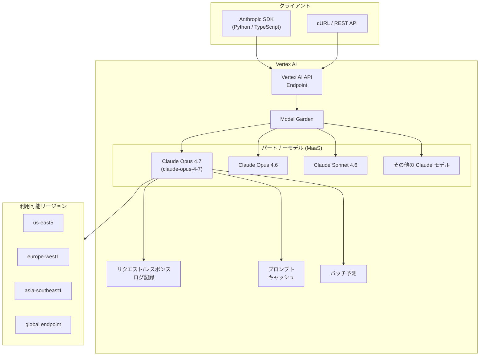

# Generative AI on Vertex AI: Anthropic Claude Opus 4.7 が Model Garden で利用可能に

**リリース日**: 2026-04-14

**サービス**: Generative AI on Vertex AI

**機能**: Anthropic の Claude Opus 4.7 が Model Garden で利用可能

**ステータス**: Feature (GA)

[このアップデートのインフォグラフィックを見る](https://takech9203.github.io/google-cloud-news-summary/20260414-vertex-ai-claude-opus-4-7.html)

## 概要

Google Cloud は、Anthropic の最新フラグシップモデルである Claude Opus 4.7 が Vertex AI の Model Garden で一般提供 (GA) として利用可能になったことを発表した。Claude Opus 4.7 は、Anthropic が提供する最も高性能なモデルであり、コーディング、エンタープライズエージェント、プロフェッショナルワークにおいて最先端の性能を発揮するよう設計されている。

Model Garden を通じて提供されるパートナーモデルとして、Claude Opus 4.7 はフルマネージドのサーバーレス API として利用可能であり、インフラストラクチャのプロビジョニングや管理は不要である。Vertex AI のエンドポイントにリクエストを送信するだけで利用でき、Anthropic SDK やcURL コマンドから直接アクセスできる。Google Cloud のセキュリティ境界内で動作し、FedRAMP High 要件にも準拠している。

このアップデートの対象ユーザーは、高度な推論能力・長文コンテキスト処理・コード生成・エージェント構築を必要とする企業開発者、AI/ML エンジニア、データサイエンティストである。特に、長時間実行エージェント、複雑なコーディングタスク、サイバーセキュリティ分析、金融分析などの高度なユースケースにおいて大きな価値を提供する。

**アップデート前の課題**

- Vertex AI Model Garden で利用可能な Anthropic の最上位モデルは Claude Opus 4.6 (2026年2月5日リリース) であり、最新のモデル改善を活用できなかった
- 前世代の Claude Opus 4.6 では、特定の複雑なエージェントタスクやコーディングシナリオにおいてさらなる性能向上が求められていた
- Anthropic の最新モデルを利用するには、Vertex AI 外の環境を別途構築する必要があった場合があった

**アップデート後の改善**

- Claude Opus 4.7 が Model Garden で GA として利用可能になり、Anthropic の最新フラグシップモデルを Vertex AI のエコシステム内でシームレスに利用できるようになった
- コーディング、エージェント構築、リサーチ、金融分析などの主要ユースケースにおいてさらなる性能向上が期待される
- Google Cloud のセキュリティ・コンプライアンス基盤 (FedRAMP High、データレジデンシー、IAM 統合) の下で最新モデルを利用できるようになった

## アーキテクチャ図



クライアントは Anthropic SDK または REST API を通じて Vertex AI エンドポイントにリクエストを送信し、Model Garden 経由で Claude Opus 4.7 にアクセスする。モデルはフルマネージドの MaaS (Model as a Service) として提供され、複数のリージョンおよびグローバルエンドポイントから利用可能である。

## サービスアップデートの詳細

### 主要機能

1. **最先端のコーディング性能**
   - 複雑なソフトウェアプロジェクトの計画・実行を数時間から数日にわたるスパンで処理可能
   - 複数セッションにまたがる情報の保存・維持・参照機能
   - 日常的な開発タスクから大規模なプロジェクト管理まで幅広く対応

2. **長時間実行エージェント**
   - マルチステップかつリアルタイムのアプリケーション向けに最適化されたプロダクション対応のアシスタント
   - カスタマーサポート自動化から複雑なオペレーションワークフローまで対応
   - 高精度・高知性・高速処理を要求するユースケースに適合

3. **サイバーセキュリティ対応**
   - 脆弱性の悪用前に自律的にパッチを適用するエージェントの構築
   - リアクティブな検知からプロアクティブな防御へのシフトを実現

4. **金融分析**
   - エントリーレベルの財務分析から高度な予測分析まで対応
   - ドメイン知識を活用したインテリジェントなリスク管理戦略の策定

5. **コンピューター操作 (Computer Use)**
   - 人間と同様の方法でコンピューターを操作する能力
   - GUI ベースのタスク自動化を実現

6. **リサーチ・調査**
   - 複数データソースにわたる集中的な分析
   - 専門的な分析から最終的な成果物への変換
   - 複雑な問題解決、迅速なビジネスインテリジェンス、リアルタイムの意思決定支援に最適

## 技術仕様

### モデル仕様 (Claude Opus 4.6 の仕様に基づく推定値)

Claude Opus 4.7 の詳細な技術仕様は公開後の公式ドキュメントで確認されたい。以下は前世代の Claude Opus 4.6 を基にした参考情報である。

| 項目 | 詳細 |
|------|------|
| モデル ID | claude-opus-4-7 (推定) |
| ローンチステージ | GA (一般提供) |
| リリース日 | 2026年4月14日 |
| 最大入力トークン | 1,000,000 (前世代同等と推定) |
| 最大出力トークン | 128,000 (前世代同等と推定) |
| 入力モダリティ | テキスト、コード、画像、ドキュメント |
| 出力モダリティ | テキスト |

### 前世代モデルとの比較

| 項目 | Claude Opus 4.6 | Claude Opus 4.7 |
|------|-----------------|-----------------|
| リリース日 | 2026年2月5日 | 2026年4月14日 |
| ローンチステージ | GA | GA |
| コンテキスト長 | 1,000,000 トークン | 詳細は公式ドキュメント参照 |
| 最大出力 | 128,000 トークン | 詳細は公式ドキュメント参照 |
| リタイア予定日 | 2027年2月5日以降 | 詳細は公式ドキュメント参照 |

### サポートされる機能

前世代 Claude Opus 4.6 で対応していた以下の機能は、Claude Opus 4.7 でも対応が見込まれる。

| 機能 | 説明 |
|------|------|
| Computer Use | コンピューター操作の自動化 |
| Web Search | ウェブ検索統合 |
| Batch Predictions | バッチ予測処理 |
| Prompt Caching | プロンプトキャッシュによるコスト削減 |
| Function Calling (Tool Use) | 外部ツール・関数の呼び出し |
| Extended Thinking | 拡張思考モードによる深い推論 |
| Count Tokens | トークン数カウント API |

### リクエスト例 (Anthropic SDK)

```python
import anthropic

client = anthropic.AnthropicVertex(
    region="us-east5",
    project_id="your-project-id",
)

message = client.messages.create(
    model="claude-opus-4-7",
    max_tokens=4096,
    messages=[
        {
            "role": "user",
            "content": "Google Cloud の Vertex AI Model Garden について詳しく説明してください。"
        }
    ]
)

print(message.content[0].text)
```

### リクエスト例 (cURL)

```bash
curl -X POST \
  -H "Authorization: Bearer $(gcloud auth print-access-token)" \
  -H "Content-Type: application/json" \
  "https://us-east5-aiplatform.googleapis.com/v1/projects/YOUR_PROJECT_ID/locations/us-east5/publishers/anthropic/models/claude-opus-4-7:rawPredict" \
  -d '{
    "anthropic_version": "vertex-2023-10-16",
    "messages": [
      {
        "role": "user",
        "content": "Hello, Claude Opus 4.7!"
      }
    ],
    "max_tokens": 256
  }'
```

## 設定方法

### 前提条件

1. Google Cloud プロジェクトが作成済みであること
2. Vertex AI API (`aiplatform.googleapis.com`) が有効化されていること
3. パートナーモデルの利用に必要な IAM 権限が付与されていること
4. 課金が有効になっていること

### 手順

#### ステップ 1: Model Garden でモデルを有効化

Google Cloud コンソールの Model Garden にアクセスし、Claude Opus 4.7 のモデルカードから「有効化」をクリックする。

```bash
# Google Cloud コンソールで Model Garden にアクセス
# https://console.cloud.google.com/vertex-ai/publishers/anthropic/model-garden/claude-opus-4-7
```

初回有効化時に Anthropic の利用規約への同意が必要となる。

#### ステップ 2: Anthropic SDK のインストール

```bash
# Python SDK のインストール
pip install anthropic[vertex]

# TypeScript SDK のインストール (Node.js の場合)
npm install @anthropic-ai/vertex-sdk
```

#### ステップ 3: 認証設定

```bash
# gcloud CLI での認証
gcloud auth application-default login

# プロジェクトの設定
gcloud config set project YOUR_PROJECT_ID
```

#### ステップ 4: API リクエストの送信

```python
import anthropic

# Vertex AI 経由でクライアントを初期化
client = anthropic.AnthropicVertex(
    region="us-east5",           # 利用可能リージョンを指定
    project_id="your-project-id",
)

# ストリーミングレスポンスの例
with client.messages.stream(
    model="claude-opus-4-7",
    max_tokens=4096,
    messages=[
        {
            "role": "user",
            "content": "エンタープライズ向けの AI エージェント設計パターンについて説明してください。"
        }
    ]
) as stream:
    for text in stream.text_stream:
        print(text, end="", flush=True)
```

## メリット

### ビジネス面

- **最新の AI 性能へのアクセス**: Anthropic のフラグシップモデルの最新版を Google Cloud のエコシステム内でシームレスに利用でき、競争力のある AI ソリューションを迅速に構築できる
- **サーバーレスでの運用**: インフラストラクチャの管理が不要であり、従量課金 (Pay-as-you-go) またはプロビジョンドスループットでコスト効率よく利用できる
- **コンプライアンス対応**: FedRAMP High 認証境界内で動作し、リクエスト/レスポンスのログ記録機能により監査要件にも対応

### 技術面

- **マルチモーダル対応**: テキスト、コード、画像、ドキュメント (PDF) を入力として受け付け、幅広いユースケースに対応
- **大規模コンテキスト処理**: 最大 100 万トークンの入力コンテキストにより、長文ドキュメント分析や大規模コードベースの理解が可能 (前世代同等と推定)
- **豊富な機能統合**: プロンプトキャッシュ、バッチ予測、Function Calling、Extended Thinking など Vertex AI のエコシステムと深く統合
- **グローバルエンドポイント**: リージョナルエンドポイントに加え、グローバルエンドポイントによる高可用性と低エラーレートを提供

## デメリット・制約事項

### 制限事項

- Opus モデルは Sonnet や Haiku モデルと比較してクエリあたりのコストが高く、QPM (Queries Per Minute) の上限も低い傾向がある (前世代 Opus 4.6 では各リージョン QPM: 200)
- 画像ファイルのサイズ上限は 5 MB、1 リクエストあたり最大 100 画像
- 禁止リセラーを通じて管理される Google Cloud 請求アカウントでは、利用規約の同意やモデルの有効化ができない場合がある

### 考慮すべき点

- 出力はテキストのみであり、画像や音声の直接生成には対応していない
- Provisioned Throughput の利用には Google Cloud 営業担当者への問い合わせが必要
- 前世代モデル (Claude Opus 4.6) からの移行時にはモデル ID の変更が必要であり、テスト・検証を推奨
- トークン使用量の正確な把握には、Google Cloud コンソールの Quota ページではなく Token Counting API または Metrics Explorer を使用することが推奨される

## ユースケース

### ユースケース 1: エンタープライズ AI エージェント構築

**シナリオ**: カスタマーサポート部門で、複数のシステム (CRM、ナレッジベース、チケットシステム) にアクセスしてユーザーの問い合わせを自律的に解決するエージェントを構築する。

**実装例**:
```python
import anthropic

client = anthropic.AnthropicVertex(
    region="us-east5",
    project_id="your-project-id",
)

tools = [
    {
        "name": "search_knowledge_base",
        "description": "社内ナレッジベースを検索する",
        "input_schema": {
            "type": "object",
            "properties": {
                "query": {"type": "string", "description": "検索クエリ"}
            },
            "required": ["query"]
        }
    },
    {
        "name": "create_ticket",
        "description": "サポートチケットを作成する",
        "input_schema": {
            "type": "object",
            "properties": {
                "title": {"type": "string"},
                "description": {"type": "string"},
                "priority": {"type": "string", "enum": ["low", "medium", "high"]}
            },
            "required": ["title", "description"]
        }
    }
]

message = client.messages.create(
    model="claude-opus-4-7",
    max_tokens=4096,
    tools=tools,
    messages=[
        {
            "role": "user",
            "content": "請求書の再発行方法を教えてください。先月分のインボイスが届いていません。"
        }
    ]
)
```

**効果**: 高度な推論能力により、ユーザーの意図を正確に把握し、複数のツールを適切に連携させてワンストップでの問題解決を実現。カスタマーサポートの対応時間を大幅に短縮できる。

### ユースケース 2: 大規模コードベースの分析・リファクタリング

**シナリオ**: 数十万行のレガシーコードベースの全体構造を分析し、リファクタリング計画を策定する。100 万トークンのコンテキストウィンドウを活用して、コードベース全体を理解した上で改善提案を行う。

**効果**: 大規模なコンテキストウィンドウにより、コードベースの全体像を把握した上での一貫性のあるリファクタリング提案が可能。Extended Thinking 機能を併用することで、より深い分析と高品質な提案を得られる。

### ユースケース 3: 金融レポートの自動分析

**シナリオ**: 四半期決算報告書 (PDF) を入力として、財務分析レポートを自動生成する。複数の決算書を同時に分析し、トレンド分析やリスク評価を行う。

**効果**: ドキュメント入力 (PDF サポート) と高度な推論能力の組み合わせにより、専門的な金融分析をスケーラブルに実行可能。バッチ予測機能を活用して大量のレポートを効率的に処理できる。

## 料金

Claude Opus 4.7 の料金は、Vertex AI の公式料金ページで確認されたい。パートナーモデルの料金は従量課金 (Pay-as-you-go) とプロビジョンドスループットの 2 つの課金モデルが提供される。

以下は前世代の Claude Opus 4.6 の参考料金である。Claude Opus 4.7 の正式料金は公式ドキュメントを参照のこと。

### 参考: 前世代モデルのプロビジョンドスループット仕様 (Claude Opus 4.6)

| 項目 | 値 |
|------|-----|
| スループット/GSU | 210 tokens/sec |
| 最小 GSU 購入数 | 35 |
| GSU 購入単位 | 1 |
| 入力トークンバーンダウン | 1 input token = 1 token |
| 出力トークンバーンダウン | 1 output token = 5 tokens |
| キャッシュ書き込み (5分) | 1 cache write 5m token = 1.25 tokens |
| キャッシュ書き込み (1時間) | 1 cache write 1h token = 2 tokens |
| キャッシュヒット | 1 cache hit token = 0.1 token |

最新の正確な料金については [Vertex AI 料金ページ](https://cloud.google.com/vertex-ai/generative-ai/pricing#partner-models) を確認されたい。

## 利用可能リージョン

Claude Opus 4.7 の利用可能リージョンは公式ドキュメントで確認されたい。参考として、前世代の Claude Opus 4.6 は以下のリージョンで利用可能であった。

| リージョン | ロケーション | エンドポイント |
|-----------|------------|--------------|
| us-east5 | コロンバス (米国) | リージョナル |
| europe-west1 | ベルギー (欧州) | リージョナル |
| asia-southeast1 | シンガポール (アジア太平洋) | リージョナル |
| global | グローバル | グローバルエンドポイント |

前世代 Claude Opus 4.6 の ML 処理は以下のロケーションで行われていた。
- 米国: マルチリージョン
- 欧州: マルチリージョン
- アジア太平洋: asia-southeast1

Claude Opus 4.7 でも同等またはそれ以上のリージョン展開が期待されるが、正式な情報は公式ドキュメントを参照されたい。

## 関連サービス・機能

- **[Vertex AI Model Garden](https://docs.cloud.google.com/vertex-ai/generative-ai/docs/model-garden/explore-models)**: Google およびパートナー提供の AI/ML モデルを発見・テスト・カスタマイズ・デプロイするためのライブラリ。Claude Opus 4.7 のホスティング基盤
- **[Vertex AI Provisioned Throughput](https://docs.cloud.google.com/vertex-ai/generative-ai/docs/provisioned-throughput)**: 予約済みスループット容量による安定したパフォーマンスと可用性の確保
- **[Vertex AI Agent Engine](https://docs.cloud.google.com/agent-builder/agent-engine/sessions/overview)**: Claude Opus 4.7 と組み合わせて高度な AI エージェントを構築・デプロイするためのマネージドプラットフォーム
- **[Claude Opus 4.6](https://docs.cloud.google.com/vertex-ai/generative-ai/docs/partner-models/claude/opus-4-6)**: 前世代のフラグシップモデル。移行元として参照可能
- **[Claude Sonnet 4.6](https://docs.cloud.google.com/vertex-ai/generative-ai/docs/partner-models/claude/sonnet-4-6)**: 高いコスト効率と性能のバランスを持つ Sonnet ファミリーの最新モデル

## 参考リンク

- [インフォグラフィック](https://takech9203.github.io/google-cloud-news-summary/20260414-vertex-ai-claude-opus-4-7.html)
- [公式リリースノート](https://cloud.google.com/release-notes#April_14_2026)
- [Vertex AI Model Garden - Claude モデル](https://docs.cloud.google.com/vertex-ai/generative-ai/docs/partner-models/claude)
- [Claude モデルの利用方法](https://docs.cloud.google.com/vertex-ai/generative-ai/docs/partner-models/claude/use-claude)
- [パートナーモデルの概要](https://docs.cloud.google.com/vertex-ai/generative-ai/docs/partner-models/use-partner-models)
- [Vertex AI 料金ページ](https://cloud.google.com/vertex-ai/generative-ai/pricing#partner-models)
- [Anthropic 公式ドキュメント](https://docs.anthropic.com/)

## まとめ

Anthropic の Claude Opus 4.7 が Vertex AI Model Garden で GA として利用可能になったことは、Google Cloud 上で最先端の AI モデルにアクセスしたいエンタープライズユーザーにとって重要なアップデートである。前世代の Claude Opus 4.6 (2026年2月5日リリース) からわずか約2ヶ月での後継モデルリリースであり、Anthropic のモデル開発の加速と Google Cloud パートナーエコシステムの迅速な対応を示している。

コーディング、エージェント構築、金融分析、サイバーセキュリティなどの高度なユースケースに取り組むユーザーは、Model Garden のモデルカードから Claude Opus 4.7 を有効化し、既存のワークロードでの性能評価を行うことを推奨する。前世代モデルからの移行はモデル ID の変更のみで対応でき、API 互換性が維持されているため、迅速な検証が可能である。

---

**タグ**: #VertexAI #ModelGarden #Anthropic #Claude #ClaudeOpus #GenerativeAI #LLM #パートナーモデル #MaaS #エージェント #コーディング #GA
