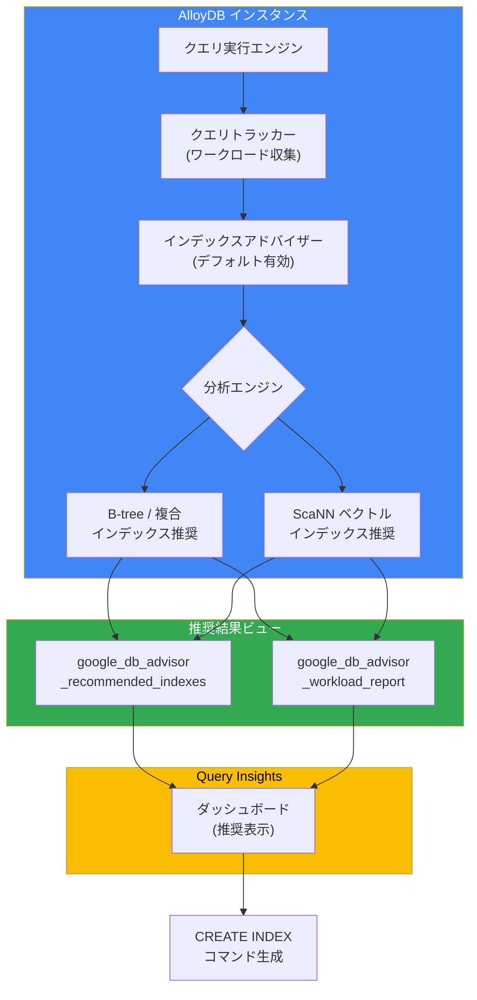

# AlloyDB for PostgreSQL: インデックスアドバイザーのデフォルト有効化と ScaNN インデックス推奨

**リリース日**: 2026-04-15

**サービス**: AlloyDB for PostgreSQL

**機能**: インデックスアドバイザーがデフォルトで有効化、ScaNN インデックス推奨を含む

**ステータス**: Feature (GA)

[このアップデートのインフォグラフィックを見る](https://takech9203.github.io/google-cloud-news-summary/20260415-alloydb-index-advisor-default.html)

## 概要

2026 年 4 月 15 日、AlloyDB for PostgreSQL のインデックスアドバイザーがデフォルトで有効化されることが発表されました。これにより、新規および既存の AlloyDB インスタンスにおいて、追加の設定作業なしにインデックス推奨機能が利用可能になります。さらに、ベクトル検索用の Scalable Nearest Neighbors (ScaNN) インデックスの推奨もデフォルトで提供されるようになりました。

インデックスアドバイザーは、データベースが定期的に処理するクエリを追跡・分析し、クエリパフォーマンスを向上させる新しいインデックスを自動的に推奨する機能です。従来の B-tree インデックスの推奨に加え、AI/ML ワークロードで重要なベクトル検索のための ScaNN インデックスも推奨対象に含まれるようになったことで、生成 AI やセマンティック検索アプリケーションの最適化が大幅に容易になります。

このアップデートは、AlloyDB を利用するすべてのデータベース管理者、アプリケーション開発者、および AI/ML エンジニアに影響があります。特にベクトル検索を活用した RAG (Retrieval-Augmented Generation) パイプラインやセマンティック検索を構築しているチームにとって、パフォーマンスチューニングの負担を軽減する重要な改善です。

**アップデート前の課題**

- インデックスアドバイザーを利用するには、Google Cloud コンソールまたはデータベースフラグを通じて手動で有効化する設定が必要だった
- ベクトル検索インデックス (ScaNN) の推奨を受けるには、`google_db_advisor.enable_vector_index_advisor` フラグを個別に有効化する必要があった
- 新規にインスタンスを作成した際に、インデックスアドバイザーの有効化を忘れると最適化の機会を逃していた
- ベクトル検索のパフォーマンスチューニングには、ScaNN インデックスの `num_leaves` や `quantizer` などのパラメータを手動で計算・設定する専門知識が必要だった

**アップデート後の改善**

- AlloyDB インスタンスの作成直後からインデックスアドバイザーが自動的に有効化され、追加の設定作業が不要になった
- ScaNN ベクトルインデックスの推奨がデフォルトで含まれるようになり、AI/ML ワークロードのインデックス最適化が自動化された
- クエリ Insights ダッシュボードから推奨インデックスを直接確認し、ワンクリックで適用可能な `CREATE INDEX` コマンドを取得できるようになった

## アーキテクチャ図



AlloyDB インスタンスがクエリワークロードを継続的に追跡し、インデックスアドバイザーが定期的に分析を実行します。分析結果は B-tree インデックスと ScaNN ベクトルインデックスの両方の推奨を含み、データベースビューおよび Query Insights ダッシュボードを通じて確認できます。

## サービスアップデートの詳細

### 主要機能

1. **インデックスアドバイザーのデフォルト有効化**
   - `google_db_advisor.enabled` フラグがデフォルトで `on` に設定され、新規インスタンスでは追加設定なしにインデックス推奨が開始される
   - 24 時間ごとに自動分析が実行され、パフォーマンスを向上させるインデックスの候補が推奨される
   - 遅いクエリの上位 100 件を対象に分析が行われ、推奨されるインデックスの推定ストレージサイズや影響を受けるクエリ数も提示される

2. **ScaNN ベクトルインデックス推奨**
   - `google_db_advisor.enable_vector_index_advisor` フラグがデフォルトで `on` に設定され、ベクトル検索クエリに対する ScaNN インデックスの推奨が自動的に有効化される
   - ScaNN インデックスは Google の検索研究に由来するアルゴリズムで、標準の HNSW インデックスと比較してインデックス作成が最大 10 倍高速、ベクトル検索クエリが最大 4 倍高速、フィルタ付きベクトル検索が最大 10 倍高速
   - alloydb_scann 拡張機能が有効な場合に ScaNN インデックスの推奨が生成される

3. **Query Insights との統合**
   - Query Insights ダッシュボードの「Top dimensions by database load」テーブルの Recommendations 列にインデックス推奨が表示される
   - ScaNN ベクトルインデックスの推奨も同じインターフェースで確認可能
   - 推奨されるインデックスの CREATE INDEX コマンドをコピーして直接適用できる

## 技術仕様

### インデックスアドバイザー データベースフラグ

| フラグ名 | 型 | デフォルト値 | 説明 |
|---------|-----|------------|------|
| `google_db_advisor.enabled` | Boolean | `on` | インデックスアドバイザーの有効/無効を制御 |
| `google_db_advisor.enable_auto_advisor` | Boolean | `on` | 自動分析の有効/無効を制御 |
| `google_db_advisor.auto_advisor_schedule` | String | `'EVERY 24 HOURS'` | 自動分析の実行頻度 |
| `google_db_advisor.enable_vector_index_advisor` | Boolean | `on` | ScaNN ベクトルインデックスの推奨を有効化 |
| `google_db_advisor.max_index_width` | Integer | `2` | 推奨インデックスの最大カラム数 |
| `google_db_advisor.auto_advisor_max_time_in_seconds` | Integer | `1800` | 自動分析の 1 日あたりの最大実行時間 (秒) |
| `google_db_advisor.max_storage_size_in_mb` | Integer | `0` | 推奨インデックスの最大合計ストレージ (0 = DB サイズが上限) |
| `google_db_advisor.top_k_slowest_statements` | Integer | `100` | 分析対象とする遅いクエリの上位件数 |

### ScaNN インデックスの性能比較

| 指標 | ScaNN vs 標準 HNSW |
|------|-------------------|
| インデックス作成速度 | 最大 10 倍高速 |
| ベクトル検索クエリ速度 | 最大 4 倍高速 |
| フィルタ付きベクトル検索速度 | 最大 10 倍高速 |
| メモリ使用量 | HNSW の 1/3 |

### インデックス推奨結果の確認

```sql
-- 推奨インデックスの一覧を取得
SELECT * FROM google_db_advisor_recommended_indexes;

-- 推奨インデックスと関連クエリの詳細を取得
SELECT DISTINCT recommended_indexes, query
FROM google_db_advisor_workload_report r,
     google_db_advisor_workload_statements s
WHERE r.query_id = s.query_id;

-- 即時分析を実行して推奨を取得
SELECT * FROM google_db_advisor_recommend_indexes();
```

## 設定方法

### 前提条件

1. AlloyDB for PostgreSQL クラスタおよびインスタンスが作成済みであること
2. ScaNN インデックスの推奨を利用する場合は、`alloydb_scann` および `vector` 拡張機能がインストール済みであること

### 手順

#### ステップ 1: 拡張機能のインストール (ScaNN 推奨を利用する場合)

```sql
-- pgvector 拡張機能のインストール
CREATE EXTENSION IF NOT EXISTS vector;

-- alloydb_scann 拡張機能のインストール
CREATE EXTENSION IF NOT EXISTS alloydb_scann;
```

ScaNN ベクトルインデックスの推奨を受けるには、上記の拡張機能が必要です。B-tree インデックスの推奨のみであれば、追加の拡張機能は不要です。

#### ステップ 2: インデックスアドバイザーの動作確認

```sql
-- インデックスアドバイザーが有効であることを確認
SHOW google_db_advisor.enabled;
-- 結果: on

-- ベクトルインデックスアドバイザーが有効であることを確認
SHOW google_db_advisor.enable_vector_index_advisor;
-- 結果: on

-- 自動分析スケジュールの確認
SHOW google_db_advisor.auto_advisor_schedule;
-- 結果: EVERY 24 HOURS
```

デフォルトで有効化されているため、通常はこの確認のみで十分です。

#### ステップ 3: 推奨インデックスの確認と適用

```sql
-- 即時分析の実行
SELECT * FROM google_db_advisor_recommend_indexes();

-- 推奨結果の確認
SELECT index, estimated_storage_size_in_mb
FROM google_db_advisor_recommended_indexes;

-- 推奨された CREATE INDEX コマンドをそのまま実行
-- 例: CREATE INDEX ON "public"."embeddings" USING scann (embedding cosine)
--     WITH (num_leaves = 100, quantizer = 'SQ8');
```

推奨結果の `index` 列に含まれる `CREATE INDEX` DDL をそのまま実行することで、推奨インデックスを作成できます。

## メリット

### ビジネス面

- **運用コストの削減**: インデックスの手動チューニングに費やしていた DBA の工数を大幅に削減し、データベースの初期セットアップから最適化が自動的に開始される
- **パフォーマンス向上の即時実現**: インスタンス作成直後からクエリの追跡と分析が開始されるため、パフォーマンス問題の早期発見と対処が可能
- **AI/ML プロジェクトの加速**: ScaNN インデックスの推奨がデフォルトで有効になることで、ベクトル検索の最適化に関する専門知識がなくても高性能な AI アプリケーションを構築できる

### 技術面

- **ゼロコンフィグ最適化**: 追加設定なしにインデックス推奨が開始され、セットアップのミスや設定漏れを防止
- **ScaNN の高性能**: HNSW と比較して最大 10 倍高速なインデックス作成、4 倍高速なクエリ、1/3 のメモリ使用量を実現する ScaNN インデックスが推奨される
- **適応的フィルタリング**: ScaNN インデックスは PostgreSQL クエリプランナーと深く統合されており、ベクトル類似検索とメタデータフィルタのハイブリッドクエリに対して最適な実行計画を自動選択

## デメリット・制約事項

### 制限事項

- ScaNN インデックスの推奨を受けるには、`alloydb_scann` および `vector` 拡張機能を事前にインストールしておく必要がある
- インデックスアドバイザーの自動分析には最大 1800 秒/日の CPU リソースが消費される (デフォルト設定)
- 推奨されるインデックスは自動的には作成されない。推奨結果を確認し、手動で `CREATE INDEX` コマンドを実行する必要がある
- `alloydbsuperuser` ロール以外のユーザーで即時分析を実行した場合、そのユーザーが発行したクエリに基づく推奨のみが表示される

### 考慮すべき点

- インデックスの作成はストレージを消費するため、推奨されたすべてのインデックスを無条件に適用するのではなく、推定ストレージサイズと影響クエリ数を考慮して判断すること
- デフォルト有効化によりバックグラウンドで分析処理が実行されるため、極めてリソースに制約のあるインスタンスでは `google_db_advisor.auto_advisor_max_time_in_seconds` の調整を検討すること
- ScaNN インデックスの自動メンテナンス (`auto_maintenance`) を有効にすることで、データセットの成長に合わせてインデックスのセントロイドが自動更新される

## ユースケース

### ユースケース 1: RAG パイプラインのベクトル検索最適化

**シナリオ**: 企業のナレッジベースを AlloyDB に格納し、Vertex AI のエンベディングモデルでベクトル化したドキュメントに対して RAG パイプラインからベクトル検索を実行している。クエリ数の増加に伴いレスポンスが遅延し始めている。

**実装例**:
```sql
-- ベクトルカラムを含むテーブルの作成
CREATE TABLE knowledge_base (
    id SERIAL PRIMARY KEY,
    title TEXT,
    content TEXT,
    embedding vector(768),
    category VARCHAR(50),
    updated_at TIMESTAMP
);

-- インデックスアドバイザーの推奨を確認
SELECT * FROM google_db_advisor_recommend_indexes();

-- 推奨に従い ScaNN インデックスを作成
-- (推奨例)
CREATE INDEX ON knowledge_base
USING scann (embedding cosine)
WITH (num_leaves = 100, quantizer = 'SQ8');
```

**効果**: インデックスアドバイザーがワークロードに基づいて最適な ScaNN インデックス設定を推奨するため、手動でのパラメータチューニングが不要になり、ベクトル検索のレイテンシが大幅に改善される。

### ユースケース 2: E コマースのセマンティック商品検索

**シナリオ**: E コマースサイトで商品のテキスト説明と画像をベクトル化し、ユーザーの自然言語クエリに対してセマンティック検索を実行している。カテゴリフィルタとの組み合わせクエリが多いが、パフォーマンスが安定しない。

**実装例**:
```sql
-- フィルタ付きベクトル検索クエリ (アプリケーション側)
SELECT product_id, name, price
FROM products
WHERE category = 'electronics'
ORDER BY embedding <=> $1::vector
LIMIT 20;
```

**効果**: インデックスアドバイザーが ScaNN インデックスを推奨し、ScaNN のアダプティブフィルタリング機能によりカテゴリフィルタとベクトル検索が同時に最適化される。フィルタ付きベクトル検索が HNSW 比で最大 10 倍高速化される。

### ユースケース 3: 新規プロジェクトのデータベース立ち上げ

**シナリオ**: 新規 AlloyDB インスタンスを作成し、アプリケーションの初期開発を開始する。クエリパターンが固まっていない段階から、インデックス最適化を意識したい。

**効果**: デフォルトでインデックスアドバイザーが有効なため、開発段階からクエリパターンが追跡され、本番リリース前にインデックス推奨に基づいた最適化を実施できる。従来のように「本番稼働後にパフォーマンス問題が発覚してから対応する」というリアクティブなアプローチを回避できる。

## 料金

インデックスアドバイザー自体には追加の料金は発生しません。AlloyDB for PostgreSQL の通常のインスタンス料金 (vCPU、メモリ、ストレージ) に含まれています。

| 項目 | 詳細 |
|------|------|
| インデックスアドバイザー機能 | 追加料金なし (AlloyDB インスタンス料金に含まれる) |
| インデックス作成によるストレージ | 推奨インデックスを作成した場合、AlloyDB のストレージ料金が発生 |
| AlloyDB vCPU | マシンタイプに基づく従量課金 |
| AlloyDB メモリ | マシンタイプに基づく従量課金 |
| AlloyDB ストレージ | 使用量に基づく従量課金 |

> AlloyDB では 1 年間のコミットメント (CUD) で 25%、3 年間で 52% のコンピュートリソース割引が利用可能です。

## 利用可能リージョン

インデックスアドバイザーは AlloyDB for PostgreSQL が利用可能なすべてのリージョンで使用できます。主なリージョンは以下の通りです。

| 地域 | リージョン例 |
|------|------------|
| 米州 | us-central1 (Iowa)、us-east1 (South Carolina)、us-west1 (Oregon)、northamerica-northeast1 (Montreal)、southamerica-east1 (Brazil) など 14 リージョン |
| ヨーロッパ | europe-west1 (Belgium)、europe-west3 (Frankfurt)、europe-north1 (Finland) など 13 リージョン |
| アジア太平洋 | asia-northeast1 (Tokyo)、asia-northeast2 (Osaka)、asia-southeast1 (Singapore) など 10 リージョン |
| オーストラリア | australia-southeast1 (Sydney)、australia-southeast2 (Melbourne) |
| 中東 | me-central1 (Doha)、me-central2 (Dammam)、me-west1 (Tel Aviv) |
| アフリカ | africa-south1 (Johannesburg) |

全リージョンの一覧は [AlloyDB Locations](https://cloud.google.com/alloydb/docs/locations) を参照してください。

## 関連サービス・機能

- **[AlloyDB Query Insights](https://cloud.google.com/alloydb/docs/query-insights-overview)**: インデックスアドバイザーの推奨結果を視覚的に表示するダッシュボード。クエリのパフォーマンス分析と合わせてインデックス推奨を確認できる
- **[AlloyDB AI / ベクトル検索](https://cloud.google.com/alloydb/docs/ai/vector-search-overview)**: ScaNN インデックスを活用したベクトル検索機能。RAG、セマンティック検索、レコメンデーションエンジンを構築するための基盤
- **[AlloyDB カラムナエンジン](https://cloud.google.com/alloydb/docs/columnar-engine/about)**: 分析クエリを加速するカラムナストレージ機能。インデックスアドバイザーと合わせて使用することでクエリパフォーマンスを総合的に最適化
- **[Gemini Cloud Assist](https://cloud.google.com/alloydb/docs/monitor-troubleshoot-with-gemini)**: AlloyDB リソースの監視とトラブルシューティングに Gemini を活用する機能。インデックス推奨の理解を深めるための AI アシスタント

## 参考リンク

- [インフォグラフィック](https://takech9203.github.io/google-cloud-news-summary/20260415-alloydb-index-advisor-default.html)
- [公式リリースノート](https://cloud.google.com/release-notes#April_15_2026)
- [インデックスアドバイザーの使用](https://cloud.google.com/alloydb/docs/use-index-advisor)
- [インデックスアドバイザーの概要](https://cloud.google.com/alloydb/docs/index-advisor-overview)
- [Query Insights でのインデックスアドバイザーの使用](https://cloud.google.com/alloydb/docs/use-index-advisor-with-query-insights)
- [インデックスアドバイザー フラグリファレンス](https://cloud.google.com/alloydb/docs/reference/index-advisor-flags)
- [ScaNN インデックスリファレンス](https://cloud.google.com/alloydb/docs/reference/ai/scann-index-reference)
- [AlloyDB ベクトル検索の概要](https://cloud.google.com/alloydb/docs/ai/vector-search-overview)
- [AlloyDB 料金](https://cloud.google.com/alloydb/pricing)

## まとめ

AlloyDB for PostgreSQL のインデックスアドバイザーがデフォルトで有効化されたことにより、すべての AlloyDB ユーザーが追加設定なしにインデックス最適化の恩恵を受けられるようになりました。特に ScaNN ベクトルインデックスの推奨がデフォルトで含まれる点は、生成 AI やセマンティック検索アプリケーションを構築する開発者にとって大きな改善です。AlloyDB を利用している組織は、Query Insights ダッシュボードでインデックスアドバイザーの推奨を定期的に確認し、推奨されたインデックスを適用することで、クエリパフォーマンスの継続的な最適化を実現することを推奨します。

---

**タグ**: #AlloyDB #PostgreSQL #IndexAdvisor #ScaNN #VectorSearch #AI #GA
