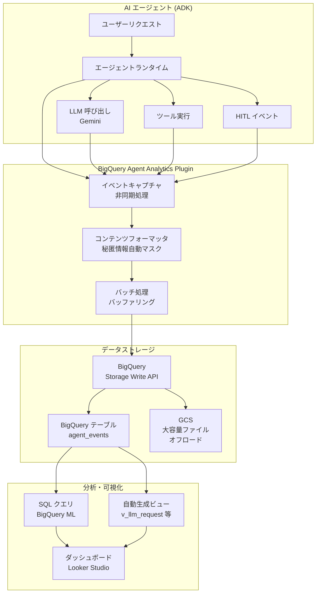

# BigQuery: BigQuery agent analytics が Google Agent Developer Kit で GA

**リリース日**: 2026-04-15

**サービス**: BigQuery

**機能**: BigQuery agent analytics is now GA in Google Agent Developer Kit

**ステータス**: GA (一般提供)

[このアップデートのインフォグラフィックを見る](https://takech9203.github.io/google-cloud-news-summary/20260415-bigquery-agent-analytics-ga.html)

## 概要

Google Cloud は、BigQuery agent analytics が Google Agent Developer Kit (ADK) において一般提供 (GA) となったことを発表しました。BigQuery agent analytics は、マルチモーダルなエージェントインタラクションデータを大規模にキャプチャ、分析、可視化するためのオープンソースソリューションです。ADK のプラグインアーキテクチャと BigQuery Storage Write API を活用し、エージェントの運用イベントを BigQuery テーブルに直接ストリーミングすることで、デバッグ、リアルタイムモニタリング、包括的なオフライン性能評価を実現します。

Agent Developer Kit (ADK) は、Google が提供するオープンソースの AI エージェント開発フレームワークであり、Gemini および Google エコシステム向けに最適化されつつも、モデル非依存・デプロイメント非依存の設計となっています。今回の GA リリースにより、ADK で構築されたエージェントのすべてのインタラクション (リクエスト、レスポンス、ツール呼び出し、エラー) を BigQuery にストリーミングし、AI を活用した評価やプロンプト最適化、長期メモリの抽出が本番環境でサポートされるようになりました。

この機能は、AI エージェントを開発・運用するすべてのチームにとって重要なアップデートです。特に、複数のエージェントを大規模に運用する企業において、エージェントの品質管理、パフォーマンス最適化、コンプライアンス対応に大きく貢献します。

**アップデート前の課題**

BigQuery agent analytics が GA になる以前、エージェントの監視と分析には以下の課題がありました。

- エージェントのインタラクションデータを体系的に収集するには、独自のロギング基盤を構築する必要があった
- マルチモーダルデータ (テキスト、画像、音声、動画) を統合的に分析する標準的な手段がなかった
- Preview 段階では SLA の保証がなく、本番環境での採用にリスクがあった
- エージェント間の分散トレーシングやツール呼び出しの来歴追跡を自前で実装する必要があった

**アップデート後の改善**

GA リリースにより、以下の改善が実現されました。

- 1 行のコード追加でエージェントの包括的なロギングが有効化でき、スキーマ管理も自動化された
- OpenTelemetry スタイルの分散トレーシング (trace_id, span_id) によるエージェント実行フローの可視化が可能になった
- ツールプロバナンス追跡 (LOCAL, MCP, SUB_AGENT, A2A, TRANSFER_AGENT) が組み込まれた
- Human-in-the-Loop (HITL) イベントトレーシングにより、人間の介入ポイントの分析が可能になった
- SLA に裏付けられた本番環境での安定運用が保証された

## アーキテクチャ図



BigQuery agent analytics は、ADK プラグインがエージェントの全イベントを非同期にキャプチャし、BigQuery Storage Write API を通じて BigQuery テーブルにストリーミングするアーキテクチャを採用しています。大容量のマルチモーダルデータは GCS に自動オフロードされ、BigQuery ML のオブジェクトテーブル経由でアクセス可能です。

## サービスアップデートの詳細

### 主要機能

1. **マルチモーダルインタラクションのキャプチャ**
   - テキスト、画像、音声、動画などのマルチモーダルデータをキャプチャして BigQuery に記録
   - 大容量コンテンツは GCS に自動オフロードされ、BigQuery ML のオブジェクトテーブル経由でアクセス可能
   - コンテンツの切り捨て閾値 (デフォルト 500KB) を設定可能

2. **包括的なイベントタイプのサポート**
   - LLM インタラクション: `LLM_REQUEST`, `LLM_RESPONSE`, `LLM_ERROR`
   - ツール使用: `TOOL_STARTING`, `TOOL_COMPLETED`, `TOOL_ERROR`
   - エージェントライフサイクル: `INVOCATION_STARTING`, `INVOCATION_COMPLETED`, `AGENT_STARTING`, `AGENT_COMPLETED`
   - HITL イベント: `HITL_CREDENTIAL_REQUEST`, `HITL_CONFIRMATION_REQUEST`, `HITL_INPUT_REQUEST` など
   - 状態管理: `STATE_DELTA`

3. **ツールプロバナンス追跡**
   - 各ツール呼び出しの出自を自動分類: LOCAL (ローカル関数)、MCP (MCP サーバー)、SUB_AGENT (サブエージェント)、A2A (リモートエージェント)、TRANSFER_AGENT (転送エージェント)
   - ツールの依存関係とパフォーマンスの可視化に活用

4. **分散トレーシング**
   - OpenTelemetry 互換の `trace_id`, `span_id`, `parent_span_id` による実行フローの追跡
   - TracerProvider を設定しない場合でも、内部 UUID によるスパン相関が維持される

5. **自動ビュー生成 (v1.27.0 以降)**
   - イベントタイプごとのフラットなビュー (例: `v_llm_request`, `v_tool_completed`) を自動生成
   - JSON ペイロードをアンネストした、クエリしやすい形式で提供

6. **セキュリティ機能**
   - OAuth トークン、API キー、クライアントシークレットの自動マスク (built-in redaction)
   - `temp:` / `secret:` プレフィックスのセッション状態キーの自動除去
   - カスタム `content_formatter` による追加のマスク処理
   - イベント拒否リスト (`event_denylist`) による不要イベントの除外

## 技術仕様

### BigQuery テーブルスキーマ

| カラム | 型 | 説明 |
|--------|-----|------|
| `timestamp` | TIMESTAMP | イベントがログされた UTC 時刻 |
| `event_type` | STRING | イベントの種類 (例: `LLM_REQUEST`, `TOOL_COMPLETED`) |
| `agent` | STRING | イベントに関連する ADK エージェント名 |
| `session_id` | STRING | 会話/ユーザーセッションのユニーク識別子 |
| `invocation_id` | STRING | セッション内の個別エージェント実行のユニーク識別子 |
| `user_id` | STRING | セッションに関連するユーザーの識別子 |
| `trace_id` | STRING | OpenTelemetry トレース ID |
| `span_id` | STRING | OpenTelemetry スパン ID |
| `content` | JSON | イベント固有のペイロードデータ |
| `content_parts` | ARRAY\<STRUCT\> | マルチモーダルデータのコンテンツパーツ |
| `attributes` | JSON | 追加メタデータ (モデルバージョン、トークン使用量など) |
| `latency_ms` | JSON | レイテンシ計測値 |
| `status` | STRING | イベントの結果 (`OK` または `ERROR`) |
| `error_message` | STRING | エラー発生時のメッセージ |

### プラグイン設定パラメータ

```python
from google.adk.plugins.bigquery_agent_analytics_plugin import (
    BigQueryAgentAnalyticsPlugin,
    BigQueryLoggerConfig,
)

bq_config = BigQueryLoggerConfig(
    enabled=True,                       # プラグインの有効化
    gcs_bucket_name="my-gcs-bucket",    # GCS オフロード先バケット
    log_multi_modal_content=True,       # マルチモーダルコンテンツのログ
    max_content_length=500 * 1024,      # インラインテキスト上限 (500KB)
    batch_size=1,                       # バッチサイズ (低レイテンシ向け)
    batch_flush_interval=0.5,           # フラッシュ間隔 (秒)
    shutdown_timeout=10.0,              # シャットダウンタイムアウト
    log_session_metadata=True,          # セッションメタデータのログ
)

plugin = BigQueryAgentAnalyticsPlugin(
    project_id="my-project",
    dataset_id="agent_analytics",
    table_id="agent_events",            # デフォルトテーブル名
    config=bq_config,
    location="US",                      # BigQuery データセットのロケーション
)
```

## 設定方法

### 前提条件

1. Google Cloud プロジェクトで Vertex AI API と Cloud Resource Manager API が有効化されていること
2. BigQuery データセットが作成済みであること
3. ADK Python v1.26.0 以上がインストールされていること
4. サービスアカウントに必要な IAM ロールが付与されていること

### 手順

#### ステップ 1: ADK と依存パッケージのインストール

```bash
pip install "google-adk[bigquery]>=1.26.0" \
    google-cloud-bigquery-storage \
    pyarrow \
    opentelemetry-api \
    opentelemetry-sdk
```

ADK の BigQuery 拡張パッケージと必要な依存関係をインストールします。

#### ステップ 2: プラグインの設定とエージェントへの登録

```python
import os
import google.auth
from google.adk.agents import Agent
from google.adk.apps import App
from google.adk.models.google_llm import Gemini
from google.adk.plugins.bigquery_agent_analytics_plugin import (
    BigQueryAgentAnalyticsPlugin,
    BigQueryLoggerConfig,
)

# 環境変数の設定
os.environ["GOOGLE_GENAI_USE_VERTEXAI"] = "True"

# プラグインの初期化
bq_analytics_plugin = BigQueryAgentAnalyticsPlugin(
    project_id="my-project-id",
    dataset_id="agent_analytics",
    location="US",
    config=BigQueryLoggerConfig(
        batch_size=1,
        batch_flush_interval=0.5,
        log_session_metadata=True,
    ),
)

# エージェントの定義
root_agent = Agent(
    model=Gemini(model="gemini-flash-latest"),
    name="my_agent",
    instruction="You are a helpful assistant.",
)

# App オブジェクトにプラグインを登録
app = App(
    name="my_agent_app",
    root_agent=root_agent,
    plugins=[bq_analytics_plugin],
)
```

App オブジェクトの `plugins` パラメータにプラグインを登録することで、エージェントの全イベントが自動的にキャプチャされます。

#### ステップ 3: Vertex AI Agent Engine へのデプロイ

```bash
PROJECT_ID=my-project-id
LOCATION=us-central1

adk deploy agent_engine \
    --project=$PROJECT_ID \
    --region=$LOCATION \
    --staging_bucket=gs://my-staging-bucket \
    --display_name="My Analytics Agent" \
    --adk_app=agent.app \
    my_agent_app
```

ADK CLI を使用して Agent Engine にデプロイします。`--adk_app` フラグでプラグイン設定を含む App オブジェクトを指定します。

#### ステップ 4: データの確認

```sql
SELECT
    timestamp,
    event_type,
    agent,
    content
FROM `my-project-id.agent_analytics.agent_events`
ORDER BY timestamp DESC
LIMIT 20;
```

BigQuery コンソールでエージェントのイベントデータが正しく記録されていることを確認します。

## メリット

### ビジネス面

- **エージェント品質の継続的改善**: インタラクションデータの分析により、エージェントの応答品質や正確性を定量的に評価し、継続的な改善サイクルを構築できる
- **運用コストの最適化**: トークン消費量やレイテンシの可視化により、モデル選択やプロンプト設計の最適化を通じてコスト削減が可能
- **コンプライアンス対応**: すべてのエージェントインタラクションの監査ログを BigQuery に一元保存し、規制要件への対応を効率化
- **迅速な障害対応**: リアルタイムモニタリングにより、エージェントの異常動作を即座に検知し、ダウンタイムを最小化

### 技術面

- **1 行でのインテグレーション**: App オブジェクトにプラグインを追加するだけで包括的なロギングが有効化され、導入コストが極めて低い
- **非同期ストリーミング**: BigQuery Storage Write API を使用した非同期書き込みにより、エージェントの実行パフォーマンスに影響を与えない
- **オープンソース**: ADK のプラグインとして公開されており、カスタマイズやコミュニティへの貢献が可能
- **マルチフレームワーク対応**: ADK だけでなく LangGraph (Preview) もサポートしており、フレームワークの選択肢が広い

## デメリット・制約事項

### 制限事項

- BigQuery Storage Write API は有料サービスであり、データ取り込み量に応じた課金が発生する (月 2 TiB までは無料)
- ADK Python v1.24.0 未満ではサーバーレスランタイム上で非同期ログライターが正常にフラッシュされない問題がある
- LangGraph サポートはまだ Preview 段階であり、GA は ADK プラグインのみ
- 自動スキーマアップグレードおよびツールプロバナンス追跡には ADK v1.26.0 以上が必要

### 考慮すべき点

- 秘匿情報 (OAuth トークン、API キー等) がログに含まれる可能性があるため、built-in redaction の動作確認と必要に応じたカスタムマスク処理の実装が推奨される
- 高スループット環境では `batch_size` と `batch_flush_interval` の適切なチューニングが必要
- GCS オフロードを使用する場合、追加の GCS ストレージコストとバケット管理が必要
- BigQuery テーブルへのアクセス権限を IAM で適切に制限し、ログデータのセキュリティを確保する必要がある

## ユースケース

### ユースケース 1: エージェント品質ダッシュボードの構築

**シナリオ**: カスタマーサポート向け AI エージェントを運用する企業が、エージェントの応答品質をリアルタイムで監視し、改善ポイントを特定したい。

**実装例**:
```sql
-- エージェントのレイテンシとエラー率を日次で集計
SELECT
    DATE(timestamp) AS date,
    agent,
    COUNT(*) AS total_events,
    COUNTIF(status = 'ERROR') AS error_count,
    ROUND(COUNTIF(status = 'ERROR') / COUNT(*) * 100, 2) AS error_rate_pct,
    AVG(CAST(JSON_VALUE(latency_ms, '$.total_ms') AS FLOAT64)) AS avg_latency_ms
FROM `project.agent_analytics.agent_events`
WHERE event_type IN ('LLM_RESPONSE', 'TOOL_COMPLETED')
GROUP BY date, agent
ORDER BY date DESC;
```

**効果**: エラー率の上昇やレイテンシの悪化を早期に検知し、プロンプトの改善やモデルの切り替えなどの対応を迅速に行える。

### ユースケース 2: マルチモーダルエージェントの行動分析

**シナリオ**: 画像認識やドキュメント処理を行うエージェントにおいて、どのようなマルチモーダル入力が処理され、ツール呼び出しがどのように行われているかを分析したい。

**実装例**:
```sql
-- ツール呼び出しの来歴と使用頻度を分析
SELECT
    JSON_VALUE(content, '$.tool') AS tool_name,
    JSON_VALUE(content, '$.tool_origin') AS tool_origin,
    COUNT(*) AS call_count,
    AVG(CAST(JSON_VALUE(latency_ms, '$.total_ms') AS FLOAT64)) AS avg_latency_ms
FROM `project.agent_analytics.agent_events`
WHERE event_type = 'TOOL_COMPLETED'
GROUP BY tool_name, tool_origin
ORDER BY call_count DESC;
```

**効果**: ツールの使用パターンを把握し、ボトルネックとなっているツールの最適化や、不要なツール呼び出しの削減につなげられる。

### ユースケース 3: トークン消費量の最適化

**シナリオ**: 大規模にエージェントを運用する環境で、トークン消費量を最適化し、LLM コストを削減したい。

**実装例**:
```sql
-- モデル別のトークン消費量を集計
SELECT
    JSON_VALUE(attributes, '$.model_version') AS model,
    SUM(CAST(JSON_VALUE(attributes, '$.usage_metadata.prompt_token_count') AS INT64)) AS total_prompt_tokens,
    SUM(CAST(JSON_VALUE(attributes, '$.usage_metadata.candidates_token_count') AS INT64)) AS total_response_tokens,
    SUM(CAST(JSON_VALUE(attributes, '$.usage_metadata.total_token_count') AS INT64)) AS total_tokens
FROM `project.agent_analytics.agent_events`
WHERE event_type = 'LLM_RESPONSE'
GROUP BY model
ORDER BY total_tokens DESC;
```

**効果**: モデルごとのトークン使用量を可視化し、プロンプトの簡潔化やコンテキストウィンドウの最適化によるコスト削減を実現できる。

## 料金

BigQuery agent analytics 自体はオープンソースで無料ですが、基盤となる BigQuery サービスの利用料金が発生します。

### 料金構成要素

| 項目 | 料金体系 |
|------|----------|
| BigQuery Storage Write API (データ取り込み) | 月 2 TiB まで無料、以降 $0.025/GB (オンデマンド) |
| BigQuery ストレージ | アクティブ: $0.02/GB/月、長期: $0.01/GB/月 |
| BigQuery クエリ (分析) | オンデマンド: $6.25/TB、Editions: スロット単位の課金 |
| GCS ストレージ (オフロード使用時) | Standard: $0.020/GB/月 (US マルチリージョン) |

### 料金例

| 使用シナリオ | 月額料金 (概算) |
|-------------|----------------|
| 小規模 (1 エージェント、1 万イベント/日) | $0 - $5 (無料枠内で収まる場合が多い) |
| 中規模 (10 エージェント、10 万イベント/日) | $10 - $50 |
| 大規模 (100 エージェント、100 万イベント/日、GCS オフロード含む) | $100 - $500 |

※ 料金は使用量、リージョン、課金モデルによって変動します。最新の料金情報は [BigQuery 料金ページ](https://cloud.google.com/bigquery/pricing) を参照してください。

## 利用可能リージョン

BigQuery agent analytics は、BigQuery が利用可能なすべてのリージョンおよびマルチリージョン (US, EU) で使用できます。BQ_LOCATION パラメータにて、BigQuery データセットのロケーションを指定します。エージェントのデプロイ先 (Vertex AI Agent Engine) のリージョンとは独立して設定可能です。

主要なリージョン:
- **マルチリージョン**: US, EU
- **北米**: us-central1, us-east1, us-east4, us-west1 など
- **ヨーロッパ**: europe-west1, europe-west2, europe-west4 など
- **アジア太平洋**: asia-northeast1 (東京), asia-northeast3, asia-southeast1 など

## 関連サービス・機能

- **[Agent Developer Kit (ADK)](https://adk.dev)**: BigQuery agent analytics プラグインのホストフレームワーク。オープンソースの AI エージェント開発キット
- **[Vertex AI Agent Engine](https://cloud.google.com/vertex-ai/generative-ai/docs/agent-engine/overview)**: ADK エージェントのデプロイ、管理、スケーリングを行うフルマネージドサービス
- **[BigQuery Storage Write API](https://cloud.google.com/bigquery/docs/write-api)**: 高スループット・低レイテンシのデータ取り込みに使用される基盤 API
- **[BigQuery ML](https://cloud.google.com/bigquery/docs/bqml-introduction)**: エージェントデータに対する ML 分析やベクトル検索に活用可能
- **[Cloud Storage (GCS)](https://cloud.google.com/storage)**: マルチモーダルコンテンツの大容量オフロード先
- **[OpenTelemetry](https://opentelemetry.io/)**: 分散トレーシングの標準プロトコルとして統合

## 参考リンク

- [インフォグラフィック](https://takech9203.github.io/google-cloud-news-summary/20260415-bigquery-agent-analytics-ga.html)
- [公式リリースノート](https://cloud.google.com/release-notes#April_15_2026)
- [ADK BigQuery Agent Analytics ドキュメント](https://adk.dev/integrations/bigquery-agent-analytics/)
- [BigQuery agent analytics 公式ドキュメント](https://cloud.google.com/bigquery/docs/bigquery-agent-analytics)
- [Agent Developer Kit (ADK) 概要](https://adk.dev)
- [BigQuery 料金ページ](https://cloud.google.com/bigquery/pricing)

## まとめ

BigQuery agent analytics の GA リリースは、AI エージェントの可観測性における重要なマイルストーンです。オープンソースの ADK プラグインとして 1 行のコード追加で導入でき、マルチモーダルデータの記録、分散トレーシング、ツールプロバナンス追跡、HITL イベント追跡といった包括的な分析機能を BigQuery 上で実現します。AI エージェントを本番運用している、または運用予定のチームは、まず開発環境でプラグインを有効化し、エージェントのインタラクションデータの可視化から始めることを推奨します。

---

**タグ**: #BigQuery #AgentDeveloperKit #ADK #AgentAnalytics #GA #OpenSource #Observability #MultiModal #OpenTelemetry #VertexAI
