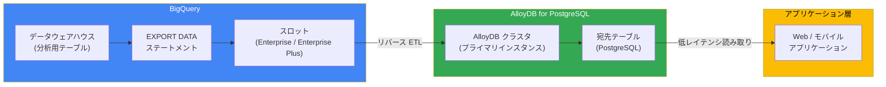

# BigQuery: EXPORT DATA to AlloyDB (Preview) およびマテリアライズドビューのセキュリティ修正

**リリース日**: 2026-04-15

**サービス**: BigQuery

**機能**: EXPORT DATA to AlloyDB (Reverse ETL) / マテリアライズドビューのアクセス制御バグ修正

**ステータス**: Preview (EXPORT DATA to AlloyDB) / 修正完了 (マテリアライズドビュー)

[このアップデートのインフォグラフィックを見る](https://takech9203.github.io/google-cloud-news-summary/20260415-bigquery-export-data-alloydb.html)

## 概要

2026 年 4 月 15 日、BigQuery に関する 2 つの重要なアップデートが発表されました。1 つ目は、`EXPORT DATA` ステートメントを使用して BigQuery のデータを AlloyDB にエクスポートするリバース ETL 機能が Preview として利用可能になったことです。2 つ目は、マテリアライズドビューのリフレッシュ時にきめ細かいアクセス制御 (Fine-Grained Access Control) ポリシーで保護されたマスク済みまたはフィルタ済みデータがエラーメッセージに露出する可能性があった既知の問題が修正されたことです。

EXPORT DATA to AlloyDB は、BigQuery の強力な分析機能と AlloyDB の PostgreSQL 互換の低レイテンシデータベースを組み合わせることで、分析結果をアプリケーション層に直接フィードバックするワークフローを実現します。これまで Cloud Storage、Spanner、Bigtable、Pub/Sub に対応していた EXPORT DATA の対応先に AlloyDB が加わり、BigQuery のリバース ETL エコシステムが拡大しました。

マテリアライズドビューのセキュリティ修正については、ユーザー側での追加対応は不要です。

**アップデート前の課題**

- BigQuery の分析結果を AlloyDB に反映するには、Dataflow、Cloud Functions、またはカスタムスクリプトなどの中間パイプラインを独自に構築・管理する必要があった
- PostgreSQL 互換データベースへのリバース ETL には外部ツールやサードパーティのサービスが必要で、運用の複雑さとコストが増大していた
- マテリアライズドビューのリフレッシュ時に、きめ細かいアクセス制御ポリシーで保護されたデータがエラーメッセージを通じて意図せず露出するリスクがあった

**アップデート後の改善**

- `EXPORT DATA` ステートメント一つで BigQuery から AlloyDB への直接データエクスポートが可能になった
- BigQuery の SQL だけでリバース ETL パイプラインを構築でき、中間的なデータパイプラインの構築・管理が不要になった
- マテリアライズドビューのリフレッシュにおけるデータ露出の問題が解消され、きめ細かいアクセス制御の信頼性が向上した

## アーキテクチャ図



BigQuery が Enterprise 以上のスロットリザベーションを使用してデータを抽出・変換し、EXPORT DATA ステートメントを通じて AlloyDB のテーブルに直接データを書き込みます。AlloyDB に格納されたデータは、PostgreSQL 互換インターフェースを通じてアプリケーションから低レイテンシで読み取ることができます。

## サービスアップデートの詳細

### 主要機能

1. **EXPORT DATA to AlloyDB (Preview)**
   - `EXPORT DATA` ステートメントを使用して、BigQuery のクエリ結果を AlloyDB のテーブルに直接エクスポートできる新機能
   - BigQuery のリバース ETL 対応先として、Cloud Storage、Spanner、Bigtable、Pub/Sub に続き AlloyDB が追加された
   - Preview ステータスであり、本番環境での使用は制約がある可能性がある

2. **リバース ETL ワークフローの実現**
   - BigQuery の分析結果をアプリケーションのサービング層 (AlloyDB) に直接フィードバックすることで、分析と運用のギャップを解消
   - AlloyDB の PostgreSQL 互換性により、既存の PostgreSQL ベースのアプリケーションとシームレスに統合可能
   - AlloyDB のカラムナエンジンやインデックスアドバイザーなどの機能と組み合わせることで、高度な分析ワークロードにも対応

3. **マテリアライズドビューのセキュリティ修正 (Announcement)**
   - マテリアライズドビューのリフレッシュ時に、きめ細かいアクセス制御 (Fine-Grained Access Control) ポリシーで保護されたマスク済みまたはフィルタ済みのデータがエラーメッセージに露出する可能性があった問題を修正
   - ユーザー側での追加アクションは不要
   - データマスキングやカラムレベルのアクセス制御を使用しているすべてのユーザーに影響する修正

## 技術仕様

### EXPORT DATA to AlloyDB の要件

| 項目 | 詳細 |
|------|------|
| BigQuery エディション | Enterprise または Enterprise Plus が必要 |
| オンデマンド/Standard エディション | 対応なし |
| ステータス | Preview |
| エクスポート方式 | `EXPORT DATA` ステートメント (SQL) |
| 宛先 | AlloyDB for PostgreSQL テーブル |

### BigQuery EXPORT DATA 対応先一覧

| エクスポート先 | ステータス | フォーマット |
|---------------|-----------|-------------|
| Cloud Storage | GA | Avro, CSV, JSON, Parquet |
| Amazon S3 / Azure Blob Storage | GA | Avro, CSV, JSON, Parquet |
| Cloud Spanner | GA | CLOUD_SPANNER |
| Cloud Bigtable | GA | CLOUD_BIGTABLE |
| Pub/Sub | Preview | CLOUD_PUBSUB |
| AlloyDB | Preview (新規) | 未公開 |

### マテリアライズドビューのセキュリティ修正

| 項目 | 詳細 |
|------|------|
| 問題の種類 | セキュリティ (データ露出) |
| 影響範囲 | きめ細かいアクセス制御ポリシー使用時のマテリアライズドビューリフレッシュ |
| 露出経路 | エラーメッセージ内にマスク済み/フィルタ済みデータが含まれる |
| 必要なアクション | なし (自動修正済み) |

## 設定方法

### EXPORT DATA to AlloyDB の前提条件

1. BigQuery Enterprise または Enterprise Plus エディションのスロットリザベーションが必要
2. AlloyDB クラスタおよびデータ受信用のテーブルが事前に作成されていること
3. 適切な IAM ロールの付与 (BigQuery Data Viewer、BigQuery User、AlloyDB への書き込み権限)

### 手順

#### ステップ 1: AlloyDB クラスタとテーブルの準備

AlloyDB にエクスポート先のテーブルを作成します。AlloyDB は PostgreSQL 互換のため、標準的な DDL を使用できます。

```sql
-- AlloyDB 上でテーブルを作成
CREATE TABLE analytics_results (
    user_id BIGINT PRIMARY KEY,
    segment VARCHAR(255),
    lifetime_value NUMERIC,
    last_updated TIMESTAMP
);
```

#### ステップ 2: BigQuery から AlloyDB へのデータエクスポート

`EXPORT DATA` ステートメントを使用して BigQuery のクエリ結果を AlloyDB にエクスポートします。

```sql
-- BigQuery から AlloyDB へのエクスポート (構文はプレビュー公式ドキュメントを参照)
EXPORT DATA
OPTIONS (
  uri='alloydb://PROJECT_ID/REGION/CLUSTER_ID/DATABASE_ID',
  format='ALLOYDB',
  alloydb_options="""{ "table": "analytics_results" }"""
)
AS
SELECT
  user_id,
  segment,
  lifetime_value,
  CURRENT_TIMESTAMP() AS last_updated
FROM `my_project.my_dataset.user_analytics`;
```

> **注意**: 上記の構文は Spanner への EXPORT DATA の構文を参考にした推定です。実際の AlloyDB 向け構文は Preview の公式ドキュメントで確認してください。

## メリット

### ビジネス面

- **分析結果の迅速なアプリケーション反映**: BigQuery で得られたインサイトを AlloyDB 経由でアプリケーションに即座に反映でき、意思決定のスピードが向上する
- **運用コストの削減**: 中間パイプライン (Dataflow、Cloud Functions など) の構築・運用が不要になり、インフラコストと管理工数を削減できる
- **PostgreSQL エコシステムの活用**: AlloyDB の PostgreSQL 互換性により、既存の PostgreSQL ツールやライブラリをそのまま使用してデータにアクセスできる

### 技術面

- **SQL のみでリバース ETL を実現**: `EXPORT DATA` ステートメントだけでパイプラインが完結し、追加のコード開発が不要
- **AlloyDB の高性能な読み取り**: AlloyDB のカラムナエンジンやリードプールインスタンスにより、アプリケーションからの高スループット・低レイテンシ読み取りが可能
- **セキュリティ強化**: マテリアライズドビューのセキュリティ修正により、きめ細かいアクセス制御の信頼性が向上

## デメリット・制約事項

### 制限事項

- EXPORT DATA to AlloyDB は Preview ステータスのため、本番ワークロードでの使用には注意が必要。SLA の対象外となる可能性がある
- BigQuery Enterprise または Enterprise Plus エディションが必要であり、Standard エディションやオンデマンド課金では利用不可
- AlloyDB 側にエクスポート先テーブルを事前に作成しておく必要がある

### 考慮すべき点

- Preview から GA に移行する際に、構文やオプションが変更される可能性がある
- BigQuery と AlloyDB のリージョンを一致させることで、データ転送料金を抑えることが推奨される
- 大規模データのエクスポート時には BigQuery のジョブ実行時間上限 (6 時間) に注意が必要

## ユースケース

### ユースケース 1: ML モデルの予測結果をアプリケーションに反映

**シナリオ**: BigQuery ML でトレーニングしたモデルの予測結果 (ユーザーセグメント、レコメンデーションスコアなど) を、AlloyDB を経由して Web アプリケーションのパーソナライゼーション機能に反映する。

**実装例**:
```sql
EXPORT DATA
OPTIONS (...)
AS
SELECT
  user_id,
  ML.PREDICT(MODEL `my_project.my_dataset.churn_model`,
    STRUCT(feature1, feature2, feature3)) AS churn_probability,
  CURRENT_TIMESTAMP() AS prediction_time
FROM `my_project.my_dataset.user_features`;
```

**効果**: 分析環境と本番アプリケーションの間のデータ伝搬が自動化され、最新の ML 予測結果を低レイテンシでユーザーに提供できる。

### ユースケース 2: BI ダッシュボード用のサマリーテーブルの生成

**シナリオ**: BigQuery で集計した大規模データのサマリーを AlloyDB にエクスポートし、Grafana や Metabase などの BI ツールから PostgreSQL 互換の接続で参照する。

**効果**: BigQuery のクォータや同時実行制限を回避しつつ、多数のダッシュボードユーザーに対して高速なクエリレスポンスを提供できる。

### ユースケース 3: リアルタイムフィーチャーストア

**シナリオ**: BigQuery で計算した特徴量を AlloyDB にエクスポートし、オンラインの推論パイプラインからリアルタイムにフィーチャーを参照する。

**効果**: BigQuery のバッチ処理能力と AlloyDB の低レイテンシ読み取りを組み合わせた、コスト効率の高いフィーチャーストアアーキテクチャを実現できる。

## 料金

EXPORT DATA を使用したデータエクスポートでは、BigQuery のキャパシティコンピュート料金が発生します。

| 項目 | 詳細 |
|------|------|
| BigQuery コンピュート | Enterprise/Enterprise Plus のスロットリザベーション料金 (スロット時間ベース) |
| AlloyDB ストレージ | エクスポートされたデータの AlloyDB 側のストレージ料金 |
| ネットワーク | リージョン間のデータ転送が発生する場合、BigQuery のデータ抽出料金が適用される |

> **コスト最適化のヒント**: BigQuery のスロットリザベーションでベースラインを 0 に設定しオートスケーリングを有効にすることで、一回限りのエクスポートにおけるコンピュートコストを最小化できます。

## 関連サービス・機能

- **[AlloyDB for PostgreSQL](https://docs.cloud.google.com/alloydb/docs/overview)**: PostgreSQL 互換のフルマネージドデータベース。カラムナエンジン、インデックスアドバイザー、AI 統合機能を備える
- **[BigQuery EXPORT DATA to Spanner](https://docs.cloud.google.com/bigquery/docs/export-to-spanner)**: 同様のリバース ETL 機能を Spanner 向けに提供 (GA)
- **[BigQuery EXPORT DATA to Bigtable](https://docs.cloud.google.com/bigquery/docs/export-to-bigtable)**: 同様のリバース ETL 機能を Bigtable 向けに提供 (GA)
- **[BigQuery カラムレベルアクセス制御](https://docs.cloud.google.com/bigquery/docs/column-level-security-intro)**: ポリシータグを使用したきめ細かいアクセス制御
- **[BigQuery データマスキング](https://docs.cloud.google.com/bigquery/docs/column-data-masking-intro)**: 機密データのマスキング機能

## 参考リンク

- [このアップデートのインフォグラフィック](https://takech9203.github.io/google-cloud-news-summary/20260415-bigquery-export-data-alloydb.html)
- [公式リリースノート](https://docs.cloud.google.com/release-notes#April_15_2026)
- [BigQuery EXPORT DATA ドキュメント](https://docs.cloud.google.com/bigquery/docs/reference/standard-sql/export-statements)
- [AlloyDB にエクスポートする (ドキュメント)](https://docs.cloud.google.com/bigquery/docs/export-to-alloydb)
- [AlloyDB for PostgreSQL 概要](https://docs.cloud.google.com/alloydb/docs/overview)
- [BigQuery エディション](https://docs.cloud.google.com/bigquery/docs/editions-intro)
- [BigQuery 料金](https://cloud.google.com/bigquery/pricing)
- [AlloyDB 料金](https://cloud.google.com/alloydb/pricing)

## まとめ

今回のアップデートにより、BigQuery のリバース ETL エコシステムに AlloyDB が新たに加わり、分析結果を PostgreSQL 互換のアプリケーションデータベースに直接エクスポートできるようになりました。現時点では Preview ステータスですが、BigQuery と AlloyDB を組み合わせた分析駆動型アプリケーションの構築が大幅に簡素化されます。また、マテリアライズドビューにおけるきめ細かいアクセス制御のセキュリティ修正により、データガバナンスの信頼性も向上しています。Enterprise / Enterprise Plus エディションを使用している組織は、Preview 段階で AlloyDB へのエクスポート機能を検証し、GA 移行に備えることを推奨します。

---

**タグ**: #BigQuery #AlloyDB #ReverseETL #EXPORT_DATA #Preview
