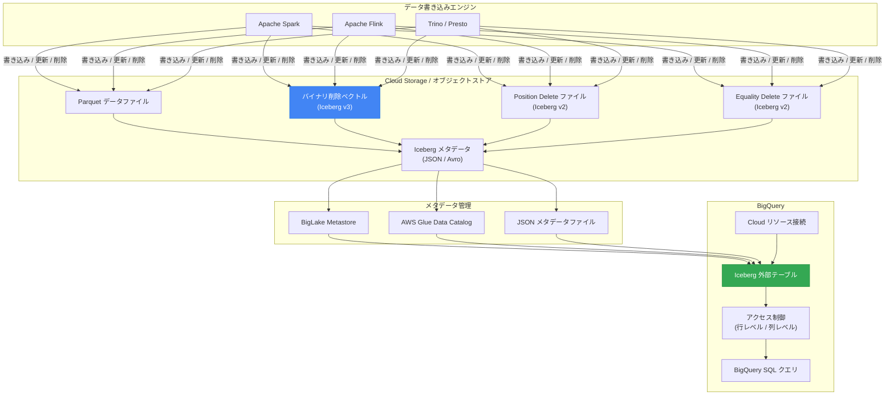

# BigQuery: Apache Iceberg 外部テーブルが Iceberg バージョン 3 (バイナリ削除ベクトル対応) をサポート

**リリース日**: 2026-04-15

**サービス**: BigQuery

**機能**: Apache Iceberg 外部テーブルにおける Iceberg バージョン 3 およびバイナリ削除ベクトルのサポート

**ステータス**: Preview

[このアップデートのインフォグラフィックを見る](https://takech9203.github.io/google-cloud-news-summary/20260415-bigquery-iceberg-v3-support.html)

## 概要

BigQuery の Apache Iceberg 外部テーブルが、Iceberg バージョン 3 (v3) をサポートした。これにより、バイナリ削除ベクトル (binary deletion vectors) を含む Iceberg v3 形式のテーブルを BigQuery から直接クエリできるようになった。従来の Iceberg v2 では merge-on-read 方式による行レベル削除がサポートされていたが、v3 ではより効率的なバイナリ削除ベクトルが導入され、削除処理のパフォーマンスが大幅に向上している。

Apache Iceberg はペタバイト規模のデータテーブルをサポートするオープンソーステーブルフォーマットであり、オブジェクトストアに保存された単一のデータコピーに対して複数のクエリエンジンからアクセスできる。BigQuery が Iceberg v3 をサポートすることで、Google Cloud のオープンレイクハウス戦略がさらに強化され、Spark、Trino、Flink などの OSS エンジンとの相互運用性が向上する。

本機能は現在 Preview ステータスであり、フィードバックや質問は biglake-help@google.com まで連絡可能である。対象ユーザーは、マルチエンジン環境でデータレイクを運用するデータエンジニア、および BigQuery を中心としたオープンレイクハウスアーキテクチャを構築するデータプラットフォームチームである。

**アップデート前の課題**

- BigQuery の Iceberg 外部テーブルは Iceberg v2 までのサポートに限定されており、v3 形式のテーブルにアクセスできなかった
- Iceberg v2 の merge-on-read 方式では、各データファイルに最大 10,000 個の削除ファイルが関連付けられ、等値削除は最大 100,000 個という制限があり、大量の削除操作がパフォーマンスに影響を与えていた
- 他のエンジン (Spark など) で Iceberg v3 のバイナリ削除ベクトルを使用してデータを管理している場合、BigQuery からはそのテーブルを正しく読み取ることができなかった

**アップデート後の改善**

- Iceberg v3 形式のテーブルを BigQuery の外部テーブルとして登録し、クエリできるようになった
- バイナリ削除ベクトルにより、従来の position delete ファイルや equality delete ファイルと比較して、削除行の追跡がよりコンパクトかつ効率的になった
- マルチエンジン環境において、Iceberg v3 を採用する OSS エンジンと BigQuery 間でシームレスなデータ共有が可能になった

## アーキテクチャ図



このフローチャートは、OSS エンジンが Iceberg v3 のバイナリ削除ベクトルを含むデータを Cloud Storage に書き込み、BigQuery が BigLake Metastore や AWS Glue Data Catalog を経由して Iceberg 外部テーブルとしてそのデータにアクセスする全体のアーキテクチャを示している。Iceberg v3 のバイナリ削除ベクトル (青色) と BigQuery Iceberg 外部テーブル (緑色) が今回のアップデートのポイントである。

## サービスアップデートの詳細

### 主要機能

1. **Iceberg バージョン 3 サポート**
   - Iceberg v3 仕様 (Extended Types and Capabilities) に準拠したテーブルの読み取りが可能
   - v3 で導入された拡張型やケイパビリティのうち、バイナリ削除ベクトルが主要なサポート対象
   - 既存の Iceberg v2 テーブル (merge-on-read 対応) も引き続きサポートされる

2. **バイナリ削除ベクトル (Binary Deletion Vectors)**
   - Iceberg v3 で新たに導入された削除行追跡メカニズム
   - 従来の position delete ファイルや equality delete ファイルに代わり、各データファイルに対してビットマップベースのバイナリベクトルで削除行を記録する
   - データファイルの書き換え (rewrite) なしに行レベルの削除を効率的に処理でき、削除ファイルの数やサイズを大幅に削減する
   - クエリ実行時に削除ベクトルを読み込んで対象行をスキップするため、merge-on-read のオーバーヘッドが軽減される

3. **マルチエンジン相互運用性の強化**
   - BigLake Metastore、AWS Glue Data Catalog、JSON メタデータファイルのいずれを経由しても Iceberg v3 テーブルにアクセス可能
   - Spark、Flink、Trino など OSS エンジンが生成した Iceberg v3 テーブルを BigQuery から直接クエリ可能
   - BigQuery Storage API を介した Managed Service for Apache Spark および Serverless Spark からのアクセスでもアクセス制御ポリシーが適用される

## 技術仕様

### Iceberg バージョン比較

| 項目 | Iceberg v2 | Iceberg v3 |
|------|-----------|-----------|
| 行レベル削除方式 | Position delete / Equality delete (merge-on-read) | バイナリ削除ベクトル |
| 削除ファイルの制限 | データファイルあたり最大 10,000 delete ファイル、等値削除は最大 100,000 | バイナリベクトルにより制限が大幅に緩和 |
| 削除の効率性 | 削除ファイルが増加するとクエリ性能が低下 | ビットマップベースで一定のサイズを維持 |
| 拡張データ型 | - | ナノ秒 timestamp(tz)、unknown、variant、geometry、geography (BigQuery では未サポート) |
| Initial default values | 未対応 | 対応 (BigQuery では未サポート) |
| テーブル暗号化キー | 未対応 | 対応 (BigQuery では未サポート) |
| BigQuery サポートステータス | GA | Preview |

### Iceberg v3 の BigQuery における制限事項

現時点で以下の Iceberg v3 機能は BigQuery でサポートされていない。

| 機能 | ステータス |
|------|----------|
| ナノ秒 timestamp / timestamptz | 未サポート |
| unknown 型 | 未サポート |
| variant 型 | 未サポート |
| geometry 型 | 未サポート |
| geography 型 | 未サポート |
| Initial default values | 未サポート |
| テーブル暗号化キー | 未サポート |
| バイナリ削除ベクトル | サポート (Preview) |

### Iceberg 外部テーブルの作成方法

```sql
-- BigLake Metastore 経由の場合
CREATE EXTERNAL TABLE myproject.mydataset.my_iceberg_table
  WITH CONNECTION `myproject.us.myconnection`
  OPTIONS (
    format = 'ICEBERG',
    uris = ["gs://mybucket/mydata/mytable/metadata/iceberg.metadata.json"]
  );
```

## 設定方法

### 前提条件

1. BigQuery Connection API と BigQuery Reservation API が有効化されていること
2. Cloud Storage バケットが作成済みで、Iceberg テーブルのデータおよびメタデータが格納されていること
3. Cloud リソース接続が作成され、適切なアクセス権限が設定されていること
4. 以下の IAM ロールが付与されていること: BigQuery Admin (`roles/bigquery.admin`) および Storage Object Admin (`roles/storage.objectAdmin`)

### 手順

#### ステップ 1: Cloud リソース接続の作成

```bash
# bq コマンドで接続を作成
bq mk --connection --connection_type='CLOUD_RESOURCE' \
  --project_id=PROJECT_ID \
  --location=REGION \
  CONNECTION_ID
```

接続のサービスアカウントに対して、Iceberg データが格納された Cloud Storage バケットへのアクセス権限を付与する。

#### ステップ 2: Iceberg 外部テーブルの作成 (JSON メタデータファイル方式)

```sql
CREATE EXTERNAL TABLE PROJECT_ID.DATASET.TABLE_NAME
  WITH CONNECTION `PROJECT_ID.REGION.CONNECTION_ID`
  OPTIONS (
    format = 'ICEBERG',
    uris = ["gs://BUCKET/PATH/metadata/XXXXX.metadata.json"]
  );
```

`uris` には Iceberg テーブルの最新の JSON メタデータファイルのパスを指定する。テーブル更新時にはメタデータファイルのパスを手動で更新する必要がある。

#### ステップ 3: Iceberg 外部テーブルの作成 (BigLake Metastore 方式 - 推奨)

```sql
-- BigLake Metastore を使用する場合 (推奨)
-- BigLake Metastore はメタデータの自動同期を提供するため
-- 手動でのメタデータ更新が不要になる
CREATE EXTERNAL TABLE PROJECT_ID.DATASET.TABLE_NAME
  WITH CONNECTION `PROJECT_ID.REGION.CONNECTION_ID`
  OPTIONS (
    format = 'ICEBERG',
    uris = ["gs://BUCKET/PATH/metadata/iceberg.metadata.json"]
  );
```

BigLake Metastore は統合されたマネージドメタストアであり、Google Cloud 上のレイクハウスデータを BigQuery と OSS エンジンの両方に接続する推奨の方法である。

#### ステップ 4: クエリの実行

```sql
-- Iceberg v3 テーブルへのクエリ (バイナリ削除ベクトルが自動的に適用される)
SELECT *
FROM PROJECT_ID.DATASET.TABLE_NAME
WHERE partition_column = 'value'
LIMIT 100;

-- タイムトラベル (過去のスナップショットへのアクセス)
SELECT *
FROM PROJECT_ID.DATASET.TABLE_NAME
FOR SYSTEM_TIME AS OF '2026-04-14 00:00:00 UTC';
```

Iceberg v3 のバイナリ削除ベクトルはクエリ実行時に自動的に適用され、削除済みの行はクエリ結果から除外される。ユーザー側で特別な設定は不要である。

## メリット

### ビジネス面

- **オープンレイクハウス戦略の加速**: Iceberg v3 という最新のオープンフォーマットをサポートすることで、ベンダーロックインを回避しつつ BigQuery の分析能力を活用できる
- **マルチエンジン環境の統合**: Spark や Flink で書き込んだ Iceberg v3 データを BigQuery で分析できるため、データのコピーや ETL パイプラインの構築コストを削減できる
- **将来への投資保護**: Iceberg コミュニティが v3 を主軸に開発を進めているため、早期に v3 を採用することで将来の移行コストを抑えられる

### 技術面

- **クエリパフォーマンスの向上**: バイナリ削除ベクトルにより、従来の merge-on-read 方式と比較して削除行のスキップが高速化される。特に大量の行削除が発生するテーブルで効果が顕著である
- **ストレージ効率の改善**: 個別の position delete ファイルや equality delete ファイルの代わりに、コンパクトなバイナリベクトルを使用するため、メタデータのサイズが削減される
- **削除ファイル制限の緩和**: Iceberg v2 ではデータファイルあたりの削除ファイル数に制限があったが、v3 のバイナリ削除ベクトルではこの制限が大幅に緩和される

## デメリット・制約事項

### 制限事項

- 本機能は Preview ステータスであり、本番環境での使用には注意が必要。SLA の適用外となる可能性がある
- Iceberg v3 の拡張データ型 (ナノ秒 timestamp、unknown、variant、geometry、geography) は BigQuery でサポートされていない
- Iceberg v3 の Initial default values およびテーブル暗号化キーは BigQuery でサポートされていない
- VPC Service Controls を使用するクエリはサポートされておらず、`NO_MATCHING_ACCESS_LEVEL` エラーが発生する
- Iceberg 外部テーブルは読み取り専用であり、BigQuery から直接 Iceberg v3 形式でデータを書き込むことはできない

### 考慮すべき点

- merge-on-read のコスト: オンデマンド課金の場合、データファイルの全論理バイト数 (削除済みの行を含む) と削除ベクトルファイルの読み込みバイト数の合計が課金対象となる
- BigLake Metastore の使用が推奨されるが、JSON メタデータファイル方式を使用する場合はテーブル更新時に手動でメタデータファイルの URI を更新する必要がある
- Preview 機能であるため、API やサポート範囲が GA までに変更される可能性がある
- Iceberg v3 のバイナリ削除ベクトルを使用するには、書き込み側のエンジン (Spark など) も Iceberg v3 をサポートしている必要がある

## ユースケース

### ユースケース 1: マルチエンジンデータレイクでのリアルタイム分析

**シナリオ**: 大規模 EC サイトが Apache Spark を使用して注文データを Iceberg v3 テーブルに書き込み、キャンセルや返品による行削除をバイナリ削除ベクトルで管理している。ビジネスアナリストは BigQuery から同じデータをクエリして売上分析レポートを作成したい。

**実装例**:
```sql
-- BigQuery から Iceberg v3 テーブルを直接クエリ
-- バイナリ削除ベクトルにより、キャンセル済み注文は自動的に除外される
SELECT
  DATE(order_timestamp) AS order_date,
  product_category,
  SUM(order_amount) AS total_sales,
  COUNT(*) AS order_count
FROM myproject.datalake.orders_iceberg_v3
WHERE order_timestamp >= '2026-04-01'
GROUP BY order_date, product_category
ORDER BY order_date, total_sales DESC;
```

**効果**: データのコピーや ETL パイプラインを構築することなく、Spark が管理する Iceberg v3 テーブルを BigQuery から直接分析できる。バイナリ削除ベクトルにより、大量のキャンセル処理がある場合でもクエリパフォーマンスが安定する。

### ユースケース 2: GDPR / データプライバシー対応のデータ削除

**シナリオ**: ユーザーからのデータ削除リクエスト (GDPR の「忘れられる権利」) に対応するため、Spark ジョブで定期的に対象ユーザーの行を Iceberg v3 テーブルから削除している。BigQuery からのクエリでも削除が反映されていることを確認したい。

**効果**: バイナリ削除ベクトルにより、データファイル全体の書き換えなしに行レベルの削除が記録され、BigQuery からのクエリでも削除が即座に反映される。これにより、プライバシーコンプライアンスの要件を満たしつつ、分析ワークロードへの影響を最小限に抑えられる。

### ユースケース 3: 段階的な Iceberg v2 から v3 への移行

**シナリオ**: 既存の Iceberg v2 テーブルを運用しているが、削除ファイルの増加によるクエリパフォーマンスの低下が課題となっている。段階的に Iceberg v3 へ移行し、バイナリ削除ベクトルのメリットを享受したい。

**効果**: BigQuery は Iceberg v2 と v3 の両方をサポートしているため、テーブル単位で段階的に v3 へ移行できる。移行後はバイナリ削除ベクトルにより、削除ファイルの管理オーバーヘッドが軽減され、クエリパフォーマンスが向上する。

## 料金

Iceberg 外部テーブルのクエリ料金は、BigQuery の標準的な外部テーブル料金モデルに従う。

- **オンデマンド料金**: クエリで処理されたバイト数に基づいて課金 (1 TiB あたりの料金)
- **キャパシティ料金**: スロット消費に基づいて課金 (スロット時間あたりの料金)

### merge-on-read (削除ベクトル含む) のコスト計算

merge-on-read データに対するオンデマンド課金は以下の合計となる。

| 項目 | 課金対象 |
|------|---------|
| データファイル読み取り | 全論理バイト数 (削除済み行を含む) |
| 削除ベクトルファイル読み取り | 削除行を特定するために読み込む論理バイト数 |
| クエリあたり最小課金 | 10 MiB |
| テーブルあたり最小課金 | 10 MiB |

また、Cloud Storage 上のデータストレージ料金 (データ保存、データ取得、ネットワーク転送) が別途発生する。

## 利用可能リージョン

Iceberg 外部テーブルは BigQuery がサポートするすべてのリージョンおよびマルチリージョンで利用可能である。メタストアの方式により、利用可能なリージョンが異なる場合がある。

- **BigLake Metastore**: Google Cloud リージョン (推奨)
- **AWS Glue Data Catalog**: AWS リージョン
- **JSON メタデータファイル**: Cloud Storage、Amazon S3、Azure Blob Storage のいずれかに配置可能

## 関連サービス・機能

- **BigLake Metastore**: Iceberg テーブルのメタデータを統合的に管理するマネージドメタストア。複数のエンジンからの同時アクセスに対応
- **BigLake Iceberg テーブル (BigQuery マネージドテーブル)**: BigQuery が直接管理する Iceberg テーブル。外部テーブルとは異なり、BigQuery から直接書き込みが可能で、Iceberg v2 スナップショットのエクスポートに対応
- **Cloud Storage**: Iceberg テーブルのデータファイルおよびメタデータの格納先
- **Managed Service for Apache Spark / Serverless Spark**: BigQuery Storage API を介して Iceberg 外部テーブルにアクセス可能。アクセス制御ポリシーも適用される
- **Dataproc**: Apache Spark や Flink のクラスタを提供し、Iceberg v3 テーブルの読み書きに使用

## 参考リンク

- [インフォグラフィック](https://takech9203.github.io/google-cloud-news-summary/20260415-bigquery-iceberg-v3-support.html)
- [公式リリースノート](https://cloud.google.com/release-notes#April_15_2026)
- [Apache Iceberg 外部テーブル ドキュメント](https://docs.cloud.google.com/bigquery/docs/iceberg-external-tables)
- [BigLake Iceberg テーブル ドキュメント](https://docs.cloud.google.com/bigquery/docs/biglake-iceberg-tables-in-bigquery)
- [Apache Iceberg v3 仕様](https://iceberg.apache.org/spec/#version-3-extended-types-and-capabilities)
- [BigQuery 料金ページ](https://cloud.google.com/bigquery/pricing)

## まとめ

BigQuery の Apache Iceberg 外部テーブルが Iceberg v3 をサポートしたことで、バイナリ削除ベクトルによる効率的な行レベル削除処理が BigQuery のクエリでも活用可能になった。これはオープンレイクハウスアーキテクチャを採用する組織にとって重要な進展であり、マルチエンジン環境におけるデータの一元管理と分析の効率化を実現する。現在 Preview ステータスであるため、本番環境への適用に際しては GA を待つか、十分な検証を行った上での導入が推奨される。

---

**タグ**: #BigQuery #ApacheIceberg #Iceberg_v3 #外部テーブル #バイナリ削除ベクトル #オープンレイクハウス #Preview #データレイク #merge-on-read #BigLake
