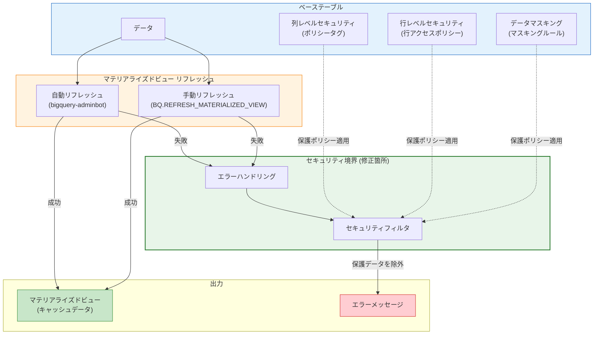

# BigQuery: マテリアライズドビューのリフレッシュにおけるきめ細かいアクセス制御のセキュリティ修正

**リリース日**: 2026-04-15

**サービス**: BigQuery

**機能**: マテリアライズドビューリフレッシュ時のきめ細かいアクセス制御ポリシーに関するセキュリティ修正

**ステータス**: セキュリティ修正 (対応完了)

[このアップデートのインフォグラフィックを見る](https://takech9203.github.io/google-cloud-news-summary/20260415-bigquery-materialized-view-security-fix.html)

## 概要

2026 年 4 月 15 日、Google Cloud は BigQuery のマテリアライズドビューリフレッシュ処理に存在していた既知のセキュリティ問題の修正を発表した。この問題は、マテリアライズドビューのリフレッシュ時に、きめ細かいアクセス制御 (Fine-Grained Access Control) ポリシーによってマスクまたはフィルタリングされるべきデータが、エラーメッセージ内に露出する可能性があったというものである。

BigQuery のきめ細かいアクセス制御は、列レベルセキュリティ (Column-Level Security) と行レベルセキュリティ (Row-Level Security) を組み合わせてデータへのアクセスを制御する仕組みである。列レベルセキュリティではポリシータグを使用して特定の列へのアクセスを制限し、Data Catalog Fine-Grained Reader ロールを持つユーザーのみが保護されたデータにアクセスできる。また、データマスキング機能により、権限のないユーザーにはマスクされた値が返される。行レベルセキュリティでは、行アクセスポリシーにより特定の条件に合致する行のみがユーザーに表示される。

本修正は Google Cloud 側で既に完了しており、ユーザー側での追加対応は不要である。セキュリティを重視する組織にとって、アクセス制御ポリシーの一貫した適用が確認されたことは重要な情報である。

**修正前の問題**

マテリアライズドビューのリフレッシュ処理において、以下の問題が存在していた。

- リフレッシュ処理がエラーとなった場合、エラーメッセージ内にきめ細かいアクセス制御ポリシーで保護されたデータが含まれる可能性があった
- 列レベルセキュリティでマスクされるべきデータがエラーメッセージに露出する可能性があった
- 行レベルセキュリティでフィルタリングされるべきデータがエラーメッセージに露出する可能性があった

**修正後の改善**

本セキュリティ修正により、以下が改善された。

- マテリアライズドビューリフレッシュ時のエラーメッセージにおいて、保護されたデータが適切にフィルタリングされるようになった
- きめ細かいアクセス制御ポリシーがリフレッシュ処理のエラーハンドリングにも一貫して適用されるようになった
- ユーザー側での追加対応は一切不要で、自動的に修正が適用されている

## アーキテクチャ図

マテリアライズドビューのリフレッシュが失敗した際、エラーメッセージが生成される前にセキュリティフィルタが適用され、きめ細かいアクセス制御ポリシーで保護されたデータがエラーメッセージに含まれないようになった。

## セキュリティ修正の詳細

### 問題の背景

1. **マテリアライズドビューのリフレッシュ処理**
   - マテリアライズドビューは、ベーステーブルのデータをキャッシュとして保持し、クエリパフォーマンスを向上させる機能である
   - 自動リフレッシュはデフォルトでベーステーブル変更後 5~30 分以内に実行され、`bigquery-adminbot@system.gserviceaccount.com` サービスアカウントによって処理される
   - 手動リフレッシュは `BQ.REFRESH_MATERIALIZED_VIEW` システムプロシージャを呼び出して実行する
   - リフレッシュ処理が失敗した場合、エラーメッセージが `INFORMATION_SCHEMA.MATERIALIZED_VIEWS` の `last_refresh_status` フィールドやジョブ履歴に記録される

2. **きめ細かいアクセス制御の仕組み**
   - **列レベルセキュリティ**: ポリシータグをテーブル列に割り当て、Data Catalog Fine-Grained Reader ロールを持つユーザーのみがデータにアクセスできる
   - **データマスキング**: BigQuery Masked Reader ロールを持つユーザーには、SHA-256 ハッシュやNULL 置換などのマスキングルールが適用されたデータが返される
   - **行レベルセキュリティ**: 行アクセスポリシーにより、`FILTER USING` 句で指定された条件に合致する行のみがユーザーに表示される

3. **データ露出の経路**
   - リフレッシュ処理の過程でエラーが発生した場合、内部的に処理されたデータの一部がエラーメッセージの文脈情報として含まれる可能性があった
   - このエラーメッセージはジョブ履歴やログに記録されるため、本来アクセス権限のないユーザーがエラーメッセージを通じて保護データの断片を閲覧できる可能性があった

### 影響範囲

| 項目 | 詳細 |
|------|------|
| 影響を受ける機能 | マテリアライズドビューのリフレッシュ (自動/手動) |
| 影響を受ける条件 | きめ細かいアクセス制御ポリシーが設定されたベーステーブルを参照するマテリアライズドビュー |
| データ露出の経路 | リフレッシュ失敗時のエラーメッセージ |
| 露出する可能性があったデータ | マスクされた列データ、フィルタリングされた行データの断片 |
| 修正状況 | Google Cloud 側で修正完了済み |
| ユーザーの対応 | 不要 |

### 関連する IAM ロール

| ロール | 説明 |
|--------|------|
| Data Catalog Fine-Grained Reader | 列レベルセキュリティで保護された生データへのアクセスを付与 |
| BigQuery Masked Reader | マスクされたデータへのアクセスを付与 |
| BigQuery Data Policy Admin | データポリシーの作成と管理 |
| Data Catalog Policy Tag Admin | ポリシータグの分類体系の作成と管理 |
| BigQuery Admin / Data Owner | マテリアライズドビューの管理およびアクセス制御の設定 |

## メリット

### セキュリティ面

- **データ漏洩リスクの排除**: リフレッシュエラー時にもアクセス制御ポリシーが一貫して適用されるようになり、意図しないデータ露出のリスクが排除された
- **コンプライアンス強化**: PII (個人識別情報) や機密データが保護されていることの信頼性が向上し、GDPR や HIPAA などの規制準拠に貢献する
- **多層防御の完全性**: 列レベルセキュリティ、データマスキング、行レベルセキュリティの各レイヤーがエラー処理を含む全ての処理パスで正しく機能することが保証された

### 運用面

- **対応不要**: ユーザー側での設定変更やコード修正は一切不要であり、運用負荷が発生しない
- **自動適用**: 修正は Google Cloud 側で既に適用されており、全ての BigQuery ユーザーに自動的に反映されている

## 考慮すべき点

### セキュリティ監査の推奨

- 本問題が存在していた期間中にマテリアライズドビューのリフレッシュエラーが発生していた場合、エラーログに保護データの断片が含まれている可能性がある
- セキュリティ要件が厳格な組織では、`INFORMATION_SCHEMA.JOBS` を使用して過去のリフレッシュジョブのエラーメッセージを確認し、必要に応じて監査ログのレビューを実施することを推奨する
- Cloud Logging に保存されたリフレッシュ関連のログエントリも確認対象とすることが望ましい

### ベストプラクティス

- マテリアライズドビューのリフレッシュ状態を定期的に監視し、エラーが発生した場合は速やかに原因を調査する
- きめ細かいアクセス制御ポリシーを使用している場合は、`INFORMATION_SCHEMA.MATERIALIZED_VIEWS` の `last_refresh_status` を定期的にチェックする
- Cloud Logging と Cloud Monitoring を活用して、マテリアライズドビューのリフレッシュ失敗を検知するアラートを設定する

## ユースケース

### ユースケース 1: PII データを含むテーブルでのマテリアライズドビュー運用

**シナリオ**: 顧客情報テーブルに氏名、メールアドレス、電話番号などの PII 列が存在し、列レベルセキュリティとデータマスキングで保護している。分析チームはマテリアライズドビューを使用して集計クエリのパフォーマンスを向上させている。

**修正前のリスク**: マテリアライズドビューのリフレッシュがスキーマ変更等で失敗した場合、エラーメッセージに PII データの断片が含まれ、ジョブ履歴を閲覧できるユーザーに露出する可能性があった。

**修正後の状態**: リフレッシュエラーが発生しても、PII データはエラーメッセージから適切に除外される。

### ユースケース 2: 行レベルセキュリティを適用したマルチテナントデータ分析

**シナリオ**: 複数のテナントのデータを単一テーブルに格納し、行アクセスポリシーで各テナントが自身のデータのみにアクセスできるよう制御している。マテリアライズドビューでテナントごとの集計を高速化している。

**修正前のリスク**: リフレッシュエラー時に、他テナントのデータがエラーメッセージに含まれる可能性があった。

**修正後の状態**: エラーメッセージにおいても行レベルセキュリティが適用され、テナント間のデータ分離が保証される。

## 関連サービス・機能

- **BigQuery 列レベルセキュリティ**: ポリシータグを使用したテーブル列単位のアクセス制御。Data Catalog Fine-Grained Reader ロールによるアクセス管理を提供
- **BigQuery データマスキング**: 列データのマスキング (SHA-256、NULL 置換、カスタムマスキングルーチンなど) を適用し、異なる権限レベルのユーザーに適切なデータビューを提供
- **BigQuery 行レベルセキュリティ**: 行アクセスポリシーによるテーブル行単位のアクセス制御。`FILTER USING` 句で条件を指定し、ユーザーごとに表示行を制限
- **Data Catalog**: ポリシータグの分類体系 (taxonomy) の管理、データガバナンスおよびメタデータ管理の基盤
- **Cloud Logging / Cloud Monitoring**: BigQuery ジョブの監査ログ記録およびリフレッシュ失敗のアラート設定に使用

## 参考リンク

- [このアップデートのインフォグラフィック](https://takech9203.github.io/google-cloud-news-summary/20260415-bigquery-materialized-view-security-fix.html)
- [公式リリースノート](https://cloud.google.com/release-notes#April_15_2026)
- [BigQuery マテリアライズドビューの管理](https://cloud.google.com/bigquery/docs/materialized-views-manage)
- [BigQuery 列レベルセキュリティの概要](https://cloud.google.com/bigquery/docs/column-level-security-intro)
- [BigQuery 列レベルセキュリティの設定](https://cloud.google.com/bigquery/docs/column-level-security)
- [BigQuery データマスキングの概要](https://cloud.google.com/bigquery/docs/column-data-masking-intro)
- [BigQuery 行レベルセキュリティの概要](https://cloud.google.com/bigquery/docs/row-level-security-intro)
- [BigQuery マテリアライズドビューのモニタリング](https://cloud.google.com/bigquery/docs/materialized-views-monitor)

## まとめ

本セキュリティ修正は、BigQuery のマテリアライズドビューリフレッシュ処理においてきめ細かいアクセス制御ポリシーがエラーメッセージにも一貫して適用されるようにしたものである。ユーザー側での対応は不要だが、セキュリティ要件が厳格な組織では、過去のリフレッシュエラーログを確認し、必要に応じて監査を行うことを推奨する。BigQuery のきめ細かいアクセス制御機能を使用している全ての組織にとって、データ保護の信頼性が向上した重要なセキュリティ改善である。

---

**タグ**: #BigQuery #Security #MaterializedView #FineGrainedAccessControl #ColumnLevelSecurity #DataMasking #RowLevelSecurity #SecurityFix
