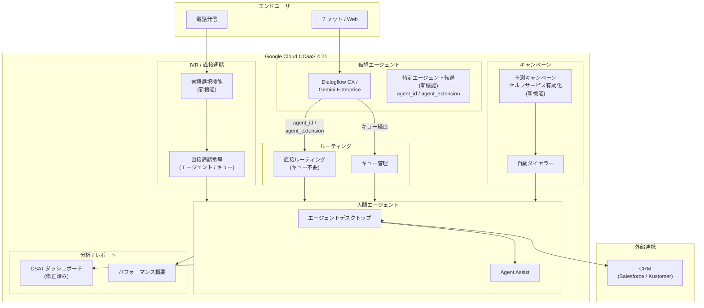

# Google Cloud CCaaS: バージョン 4.21 リリース - 直接通話の言語選択、予測キャンペーンのセルフサービス化、仮想エージェントから特定エージェントへの転送

**リリース日**: 2026-04-15

**サービス**: Google Cloud Contact Center as a Service (CCaaS)

**機能**: CCaaS 4.21 リリース - 複数の新機能およびバグ修正

**ステータス**: 複数 (Feature / Fixed)

[このアップデートのインフォグラフィックを見る](https://takech9203.github.io/google-cloud-news-summary/20260415-ccaas-4-21-release.html)

## 概要

Google Cloud CCaaS (Contact Center as a Service) のバージョン 4.21 がリリースされました。CCaaS は Google Cloud のネイティブ AI 駆動型コンタクトセンタープラットフォームであり、Gemini Enterprise for CX の一部として音声・デジタルチャネル全体でのオムニチャネルルーティング、仮想エージェント、Agent Assist、インサイト機能を統合的に提供しています。

今回のリリースでは、3 つの主要な新機能が追加されました。第一に、直接通話における言語選択サポートにより、エンドユーザーがエージェントの電話番号や内線番号に直接発信した際に通話開始時に言語を選択できるようになりました。第二に、予測キャンペーンの改善されたコントロールが Google アカウントチームの支援なしにセルフサービスで利用可能になりました。第三に、仮想エージェントがエージェント ID またはエージェント内線番号を使用して特定の人間エージェントに通話を直接転送できるようになりました。

加えて、CSAT スコアの不一致、仮想エージェントチャットトランスクリプトの不整合、仮想エージェント音声セッションの 15 分タイムアウト、リアルタイムリダクション有効時のチャットトランスクリプト PDF 生成不可など、コンタクトセンター運用の信頼性に直結する多数のバグ修正が含まれています。コンタクトセンター管理者、スーパーバイザー、および CX (カスタマーエクスペリエンス) チームにとって重要なアップデートです。

**アップデート前の課題**

- 直接通話でエージェントの電話番号や内線番号に発信した際、エンドユーザーが言語を選択する手段がなく、デフォルト言語で対応する必要があった
- 予測キャンペーンの改善されたコントロール機能を利用するには Google アカウントチームに依頼して有効化してもらう必要があり、迅速なキャンペーン設定変更ができなかった
- 仮想エージェントが特定の人間エージェントに通話を転送する場合、一旦キューに転送してからエージェントに割り当てる必要があり、待ち時間が発生していた
- CSAT スコアがパフォーマンス概要ダッシュボードと CSAT ダッシュボードで一致しない問題があった
- 仮想エージェントの音声セッションが 15 分で終了し、予期しないエスカレーションが発生していた

**アップデート後の改善**

- 直接通話番号に言語設定を構成でき、エンドユーザーが通話開始時に希望する言語を選択可能になった
- 予測キャンペーンの改善されたコントロールが管理者自身でセルフサービスで利用可能になり、運用の自律性が向上した
- 仮想エージェントが `agent_id` または `agent_extension` フィールドを使用して特定の人間エージェントに直接転送でき、キューを経由する中間ステップが不要になった
- CSAT スコアの不一致、チャットトランスクリプトの不整合、音声セッションのタイムアウトなど、運用品質に影響する多数の問題が修正された

## アーキテクチャ図



CCaaS 4.21 のアーキテクチャ図です。エンドユーザーの電話発信は新しい言語選択機能を経由して直接通話番号に接続され、仮想エージェントは新しい直接転送機能により `agent_id` または `agent_extension` を指定してキューを介さず特定の人間エージェントに転送できます。予測キャンペーンは管理者がセルフサービスで有効化・設定可能になりました。

## サービスアップデートの詳細

### 主要機能

1. **直接通話の言語選択サポート**
   - エンドユーザーがエージェントの電話番号や内線番号に直接発信した際に、通話開始時に言語を選択可能
   - 管理者は Settings > Call > Phone Numbers > Phone Number Management の「Add Number」または「Edit a Number」ダイアログで、「Set as a direct number」チェックボックス選択時に表示される「Set languages」チェックボックスで言語を設定
   - 言語未選択の場合はライブ言語一覧が再生され、1 言語選択の場合は言語選択メッセージなしでその言語でメニューが読み上げられ、複数言語選択の場合は選択した言語のみが案内される
   - 多言語対応が必要なグローバルコンタクトセンターにおいて、直接通話でも適切な言語でサービスを提供可能

2. **予測キャンペーンの改善されたコントロール (セルフサービス化)**
   - 2026 年 3 月 24 日にアナウンスされた予測キャンペーンの改善されたコントロール機能が、Google アカウントチームの支援なしで利用可能に
   - 管理者が自律的にキャンペーン設定を変更でき、ダイヤル比率の調整、放棄率の管理、ターゲットエージェント占有率の設定をセルフサービスで実行可能
   - 予測ダイヤラーは利用可能なエージェント数と接続率に基づいてダイヤル比率を自動調整し、ビジー信号、切断番号、FAX 番号、ボイスメールを自動スクリーニング
   - Google アカウントチームへの依頼が不要になることで、キャンペーンの迅速な立ち上げと設定変更が可能

3. **仮想エージェントから特定の人間エージェントへの直接転送**
   - 仮想サポートエージェントが `agent_id` または `agent_extension` フィールドを転送ペイロードに含めることで、特定の人間エージェントに通話を直接転送可能
   - キューに転送してからエージェントに割り当てる中間ステップが排除され、待ち時間の短縮と顧客満足度の向上に寄与
   - エージェント内線番号を使用した転送はキューレベルのデフレクション (営業時間外や容量超過時の対応) をサポートするため、Google は `agent_extension` の使用を推奨
   - 転送失敗時には、まず現在のセッションのキューにフォールバックし、それも失敗した場合はカスタムペイロードで指定された `fallback_menu` のキューにフォールバックする二段階のフォールバック機構を搭載

### バグ修正

今回のリリースでは多数のバグ修正が含まれており、特に以下が運用に大きく影響する修正です。

1. **CSAT スコアの不一致修正**
   - パフォーマンス概要ダッシュボードと CSAT ダッシュボードの間でスコアが一致しない問題を修正
   - 正確な顧客満足度の把握とレポーティングが可能に

2. **仮想エージェントチャットトランスクリプトの不整合修正**
   - 仮想エージェントのチャットトランスクリプトが実際の会話内容と一致しない問題を修正
   - 品質保証やコンプライアンス監査における記録の信頼性が向上

3. **仮想エージェント音声セッションの 15 分タイムアウト修正**
   - 仮想エージェントの音声セッションが 15 分後に終了し、予期しないエスカレーションが発生する問題を修正
   - 長時間の対話が必要なサポートケースでも安定した仮想エージェントの運用が可能に

4. **チャットトランスクリプト PDF 生成の修正**
   - リアルタイムリダクション有効時で、会話にインラインボタンやコンテンツカードなどの非テキストメッセージタイプが含まれる場合に PDF が生成されない問題を修正

5. **その他の主要な修正**
   - バックスラッシュ文字がチャットショートカットやメッセージで正しく表示されない問題
   - 仮想エージェントからの人間エージェントエスカレーション時のセッションメタデータにおける通話時間の不正確な記録
   - マイクロフォン権限エラー発生時にもエージェントがカンファレンスコールに参加できてしまう問題
   - Twilio 番号への直接着信が継続的にリングしエージェントに到達しない問題
   - ボイスメールがエージェントのキューから消失し履歴やレポートに表示されない問題
   - 仮想エージェントが送信したコンテンツカードが PDF チャットトランスクリプトに含まれない問題
   - チャットディスポジション選択が Agent Assist 有効時のラップアップ中にリセットされる問題
   - メールアダプターが起動しない問題

## 技術仕様

### 仮想エージェントから人間エージェントへの直接転送ペイロード

| 項目 | 詳細 |
|------|------|
| 転送方式 | カスタムペイロード (Dialogflow CX / Gemini Enterprise for CX) |
| エージェント特定方法 | `agent_extension` (推奨) または `agent_id` |
| デフレクション対応 | `agent_extension` のみ対応 |
| フォールバック | 二段階 (セッションキュー → `fallback_menu` 指定キュー) |
| 会話履歴 | 転送後、人間エージェントのコールアダプターに表示 |

### 直接通話の言語選択設定

| 項目 | 詳細 |
|------|------|
| 設定場所 | Settings > Call > Phone Numbers > Phone Number Management |
| 前提条件 | 「Set as a direct number」チェックボックスの選択 |
| 言語未設定時の動作 | ライブ言語一覧の再生 |
| 単一言語設定時の動作 | 言語選択メッセージなし、設定言語でメニュー読み上げ |
| 複数言語設定時の動作 | 設定した言語のみ案内 |

### 仮想エージェント転送 - カスタムペイロード例

```json
{
  "ujet": {
    "type": "action",
    "action": "direct",
    "escalation_reason": "by_virtual_agent",
    "allow_virtual_agent": false,
    "agent_extension": 1234,
    "fallback_menu": 5678,
    "language": "ja"
  }
}
```

`agent_extension` の代わりに `agent_id` を使用する場合:

```json
{
  "ujet": {
    "type": "action",
    "action": "direct",
    "escalation_reason": "by_virtual_agent",
    "allow_virtual_agent": false,
    "agent_id": 9012,
    "fallback_menu": 5678,
    "language": "ja"
  }
}
```

## 設定方法

### 前提条件

1. Google Cloud CCaaS インスタンスが稼働中であること
2. CCAI Platform Admin ロールおよび Service Usage Admin ロールが付与されていること
3. デプロイメントスケジュールに基づき 4.21 がインスタンスに適用されていること

### 手順

#### ステップ 1: 直接通話番号の言語選択を設定する

1. CCAI Platform ポータルで Settings > Call > Phone Numbers > Phone Number Management に移動
2. 「Add Number」をクリックして新しい番号を追加、または既存の番号の「Edit」をクリック
3. 「Set as a direct number」チェックボックスを選択
4. 「Set languages」チェックボックスを選択
5. 「Select languages」リストから対応言語を選択
6. 「Save」をクリック

```
設定パス: Settings > Call > Phone Numbers > Phone Number Management
  → Add Number / Edit a Number
    → Set as a direct number (チェック)
      → Set languages (チェック)
        → Select languages (言語選択)
```

#### ステップ 2: 予測キャンペーンを設定する

1. CCAI Platform ポータルで Campaigns に移動
2. 「Add Campaign」をクリック
3. Campaign Name に一意の名前を入力
4. Mode リストから「Predictive」を選択
5. CSV / XLS / XLSX 形式のキャンペーンファイルをアップロード
6. Assign Queue でキャンペーンを割り当てるキューを選択
7. タイムゾーンスキーマ、放棄コールメッセージ、リンギングタイムアウト、エージェントあたりの最大コール数、ターゲットエージェント占有率を設定
8. 「Create」をクリック

```
設定パス: Campaigns > Add Campaign
  → Campaign Name (入力)
  → Mode: Predictive (選択)
  → Choose Files (キャンペーンリストアップロード)
  → Assign Queue (キュー選択)
  → 各種パラメータ設定
  → Create
```

#### ステップ 3: 仮想エージェントの転送ペイロードを設定する

1. Dialogflow CX または Gemini Enterprise for CX の仮想エージェント設定を開く
2. 転送を実行するインテントまたはフローにカスタムペイロードを追加
3. `agent_extension` (推奨) または `agent_id` フィールドで転送先エージェントを指定
4. `fallback_menu` でフォールバック先のキュー ID を設定
5. `escalation_reason` を適切に設定 (`by_virtual_agent`: 計画的転送、`by_consumer`: ユーザー要求によるエスカレーション)

## メリット

### ビジネス面

- **多言語サポートの強化**: 直接通話における言語選択により、グローバル顧客が母国語でサポートを受けられ、顧客満足度 (CSAT) の向上と初回解決率 (FCR) の改善が期待できる
- **キャンペーン運用の自律性向上**: 予測キャンペーンのセルフサービス化により、Google アカウントチームへの依頼待ち時間が解消され、マーケティングキャンペーンの迅速な立ち上げと調整が可能
- **顧客待ち時間の短縮**: 仮想エージェントから特定エージェントへの直接転送により、キューでの待ち時間が排除され、VIP 顧客や複雑なケースの迅速な対応が可能
- **レポーティング精度の向上**: CSAT スコアの不一致修正により、データドリブンな意思決定の信頼性が向上

### 技術面

- **仮想エージェントの安定性向上**: 音声セッションの 15 分タイムアウト修正により、長時間対話の安定性が大幅に改善
- **転送フローの簡素化**: カスタムペイロードに `agent_id` / `agent_extension` を含めるだけで直接転送が実現し、複雑なキュールーティング設定が不要
- **二段階フォールバック機構**: 転送失敗時の耐障害性が確保され、エンドユーザーが接続先を失うリスクを最小化
- **コンプライアンス対応**: チャットトランスクリプトの正確性向上とリアルタイムリダクション有効時の PDF 生成修正により、監査ログの信頼性が向上

## デメリット・制約事項

### 制限事項

- `agent_id` を使用した転送はキューレベルのデフレクション (営業時間外、容量超過) をサポートしないため、デフレクション設定がある場合は `agent_extension` の使用が必須
- 直接通話番号は CCaaS インスタンス全体で一意である必要があり、1 つの番号は単一のエージェントまたはキューにのみ割り当て可能
- エージェントあたりの直接通話番号は最大 5 つまで
- デプロイメントスケジュール (Standard / Delayed) に基づきインスタンスへの適用タイミングが異なるため、即座に利用できない場合がある
- 予測キャンペーンの放棄率制限は国によって異なり (米国では 30 日間で 3% 以下)、コンプライアンス要件を確認する必要がある

### 考慮すべき点

- 仮想エージェントから特定エージェントへの直接転送を利用する場合、転送先エージェントがオフラインの場合のフォールバックフローを事前に設計・テストすることを推奨
- 言語選択設定で「Skip language selections」が有効な場合、言語選択メッセージは再生されないため、言語設定ページの構成との整合性を確認する必要がある
- 予測キャンペーンのダイヤル比率はシステムが自動調整するが、ターゲットエージェント占有率と最大放棄率の適切なバランスを見極めるための初期チューニングが必要

## ユースケース

### ユースケース 1: 多言語グローバルサポートセンター

**シナリオ**: グローバルに展開する SaaS 企業が、日本語、英語、フランス語のサポートを提供している。VIP 顧客には専任エージェントの直接通話番号を提供しているが、これまで直接通話では言語選択ができなかった。

**実装例**:
```
1. Settings > Call > Phone Numbers > Phone Number Management で直接通話番号を編集
2. Set languages で日本語、英語、フランス語を選択
3. VIP 顧客に直接通話番号を案内
4. 顧客が発信すると言語選択メッセージが再生され、選択した言語でサポートを受けられる
```

**効果**: VIP 顧客がエージェントへの直接通話時にも母国語を選択でき、言語ミスマッチによる再転送や顧客不満を解消。CSAT スコアの向上が期待される。

### ユースケース 2: VIP 顧客の専任エージェントへの即時接続

**シナリオ**: 金融サービス企業で、プレミアム顧客が仮想エージェント (Dialogflow CX) に電話した際、本人確認後に専任の人間エージェントに直接転送したい。

**実装例**:
```json
{
  "ujet": {
    "type": "action",
    "action": "direct",
    "escalation_reason": "by_virtual_agent",
    "allow_virtual_agent": false,
    "agent_extension": 3001,
    "fallback_menu": 100,
    "language": "ja"
  }
}
```

**効果**: キューでの待ち時間がゼロになり、VIP 顧客の体験が大幅に向上。フォールバック機構により、専任エージェントが不在の場合も一般キューで対応可能。

### ユースケース 3: アウトバウンドセールスキャンペーンの迅速な立ち上げ

**シナリオ**: EC 企業がセール期間に合わせてアウトバウンドの予測キャンペーンを即座に立ち上げたい。以前は Google アカウントチームへの依頼に数日を要していた。

**効果**: 管理者がセルフサービスでキャンペーンを作成・開始でき、マーケティング施策のタイムリーな実行が可能。ダイヤル比率の自動調整により、エージェント稼働率の最適化と放棄率の管理を両立。

## 料金

Google Cloud CCaaS はサブスクリプションベースの料金体系です。具体的な料金は Google Cloud のセールスチームまたは認定パートナーにお問い合わせください。

### 料金に関する考慮事項

| 項目 | 詳細 |
|------|------|
| 課金モデル | サブスクリプション (エージェントシート数ベース) |
| 今回の新機能追加料金 | なし (既存サブスクリプションに含まれる) |
| 予測キャンペーン | 通話料は別途発生 |
| 仮想エージェント | Dialogflow CX / Gemini Enterprise for CX の利用料が別途適用 |

## 利用可能リージョン

Google Cloud CCaaS は複数の国と Google Cloud リージョンで利用可能です。利用可能な国およびリージョンの最新の一覧については、[CCAI Platform のロケーションページ](https://cloud.google.com/contact-center/ccai-platform/docs/localities)を参照してください。デプロイメントスケジュール (Standard または Delayed) に基づき、バージョン 4.21 のインスタンスへの適用タイミングが異なります。詳細は [Deployment schedules](https://cloud.google.com/contact-center/ccai-platform/docs/deployment-schedules) を参照してください。

## 関連サービス・機能

- **Dialogflow CX**: 高度な仮想エージェントの構築プラットフォーム。今回の転送ペイロードのカスタマイズに使用
- **Gemini Enterprise for CX**: CCaaS の上位ソリューション。仮想エージェント、Agent Assist、Customer Experience Insights を統合
- **Agent Assist**: エージェントの通話・チャット中にリアルタイムで支援を提供。セッション要約機能も搭載
- **Customer Experience Insights**: 自然言語処理を用いたコンタクトセンター分析。コールドライバーの特定やセンチメント分析
- **Salesforce / Kustomer 連携**: CRM 統合によりエージェントが顧客情報にアクセスし、パーソナライズされたサービスを提供

## 参考リンク

- [インフォグラフィック](https://takech9203.github.io/google-cloud-news-summary/20260415-ccaas-4-21-release.html)
- [公式リリースノート](https://cloud.google.com/release-notes#April_15_2026)
- [CCAI Platform ドキュメント](https://cloud.google.com/contact-center/ccai-platform/docs)
- [直接通話番号の設定](https://cloud.google.com/contact-center/ccai-platform/docs/call-settings#create-direct-phone-number)
- [予測キャンペーン](https://cloud.google.com/contact-center/ccai-platform/docs/campaign-predictive)
- [仮想エージェントから人間エージェントへの転送](https://cloud.google.com/contact-center/ccai-platform/docs/virtual-agent-to-human-agent-transfers)
- [デプロイメントスケジュール](https://cloud.google.com/contact-center/ccai-platform/docs/deployment-schedules)

## まとめ

Google Cloud CCaaS 4.21 は、多言語対応の強化、キャンペーン管理の自律性向上、仮想エージェントから特定エージェントへの直接転送という 3 つの主要機能追加に加え、CSAT スコアの正確性、仮想エージェントの安定性、チャットトランスクリプトの信頼性に関する重要なバグ修正を含む包括的なリリースです。特に、仮想エージェントの直接転送機能は待ち時間の大幅な短縮を実現し、顧客体験を向上させる重要なアップデートです。コンタクトセンター管理者は、デプロイメントスケジュールを確認のうえ、新機能の設定とテストを計画的に進めることを推奨します。

---

**タグ**: #GoogleCloud #CCaaS #CCAI #ContactCenter #コンタクトセンター #VirtualAgent #仮想エージェント #PredictiveCampaign #予測キャンペーン #DirectCalls #言語選択 #バグ修正 #CustomerExperience #CX
