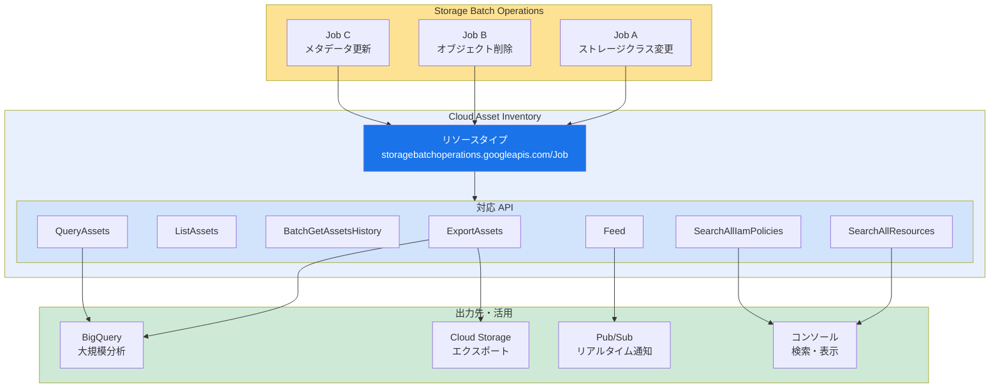

# Cloud Asset Inventory: Storage Batch Operations API リソースタイプのサポート追加

**リリース日**: 2026-04-15

**サービス**: Cloud Asset Inventory

**機能**: Storage Batch Operations API リソースタイプのサポート

**ステータス**: 機能追加

[このアップデートのインフォグラフィックを見る](https://takech9203.github.io/google-cloud-news-summary/20260415-cloud-asset-inventory-storage-batch-operations.html)

## 概要

Google Cloud は、Cloud Asset Inventory (CAI) において Storage Batch Operations API のリソースタイプ `storagebatchoperations.googleapis.com/Job` の一般公開サポートを開始した。これにより、Cloud Storage のバッチ操作ジョブを CAI の主要な API 群を通じて検索、エクスポート、監視できるようになった。

Storage Batch Operations は、Cloud Storage オブジェクトに対する大規模な一括操作 (ストレージクラスの変更、削除、メタデータ更新など) をジョブとして管理するサービスである。今回のアップデートにより、このサービスのジョブリソースが CAI のアセットインベントリに統合され、組織全体のストレージバッチ操作の可視性とガバナンスが大幅に向上する。

対象となる CAI API は ExportAssets、ListAssets、BatchGetAssetsHistory、QueryAssets、Feed、SearchAllResources、SearchAllIamPolicies の 7 つであり、既存の CAI ワークフローにシームレスに統合できる。ストレージ管理者、セキュリティチーム、コンプライアンス担当者にとって、組織横断的なバッチ操作の把握と監査が容易になる重要なアップデートである。

**アップデート前の課題**

- Storage Batch Operations のジョブを組織全体で横断的に把握するには、各プロジェクトの Storage Batch Operations API を個別に呼び出す必要があった
- CAI を使用した統合的なアセット管理において、ストレージバッチ操作ジョブが対象外であり、資産インベントリに含まれなかった
- バッチ操作ジョブに関する IAM ポリシーの監査や変更履歴の追跡を CAI 経由で実施できなかった

**アップデート後の改善**

- CAI の SearchAllResources API を使用して、組織全体の Storage Batch Operations ジョブを一括検索できるようになった
- ExportAssets API により、バッチ操作ジョブの情報を BigQuery や Cloud Storage にエクスポートし、大規模な分析が可能になった
- Feed を設定することで、バッチ操作ジョブの作成・変更・削除をリアルタイムに Pub/Sub 経由で監視できるようになった

## アーキテクチャ図



Storage Batch Operations のジョブリソースが Cloud Asset Inventory に登録され、7 つの CAI API を通じてアクセス可能になる構成を示す。エクスポート先として BigQuery や Cloud Storage、リアルタイム監視として Pub/Sub Feed が利用でき、組織全体のバッチ操作を統合管理できる。

## サービスアップデートの詳細

### 主要機能

1. **7 つの CAI API での完全サポート**
   - ExportAssets: バッチ操作ジョブを BigQuery テーブルまたは Cloud Storage にエクスポート
   - ListAssets: 指定したスコープ内のバッチ操作ジョブをページネーション付きで一覧表示
   - BatchGetAssetsHistory: 指定期間内のバッチ操作ジョブの変更履歴を取得
   - QueryAssets: BigQuery 互換 SQL でバッチ操作ジョブを柔軟にクエリ
   - Feed: Pub/Sub を通じたバッチ操作ジョブの変更通知
   - SearchAllResources: 組織全体でバッチ操作ジョブを高速検索
   - SearchAllIamPolicies: バッチ操作ジョブに関連する IAM ポリシーを検索

2. **組織横断的な可視性**
   - 組織、フォルダ、プロジェクトの各レベルでスコープを指定してバッチ操作ジョブを検索・エクスポート可能
   - 複数プロジェクトに分散するジョブを一元的に管理できる
   - タグやラベルによるフィルタリングにも対応

3. **リアルタイム監視とコンプライアンス**
   - Feed を使用して、バッチ操作ジョブの作成・完了・キャンセルをリアルタイムで検知
   - BatchGetAssetsHistory を活用して、過去のジョブ状態の変遷を監査
   - SearchAllIamPolicies でバッチ操作に対するアクセス権限を組織全体で監査可能

## 技術仕様

### サポートされるリソースタイプ

| 項目 | 詳細 |
|------|------|
| リソースタイプ | `storagebatchoperations.googleapis.com/Job` |
| サービス API | `storagebatchoperations.googleapis.com` |
| リソースパス | `projects/{project}/locations/global/jobs/{job_id}` |
| コンテンツタイプ | RESOURCE, IAM_POLICY |

### 対応する CAI API と用途

| API | 主な用途 | コンテンツタイプ |
|-----|---------|----------------|
| ExportAssets | BigQuery / GCS へのエクスポート | RESOURCE, IAM_POLICY |
| ListAssets | ページネーション付き一覧取得 | RESOURCE, IAM_POLICY |
| BatchGetAssetsHistory | 変更履歴の取得 | RESOURCE, IAM_POLICY |
| QueryAssets | SQL によるクエリ | RESOURCE |
| Feed | Pub/Sub による変更通知 | RESOURCE, IAM_POLICY |
| SearchAllResources | リソースの高速検索 | RESOURCE |
| SearchAllIamPolicies | IAM ポリシーの検索 | IAM_POLICY |

### 必要な IAM 権限

```json
{
  "SearchAllResources / SearchAllIamPolicies": [
    "cloudasset.assets.searchAllResources",
    "cloudasset.assets.searchAllIamPolicies"
  ],
  "ExportAssets / BatchGetAssetsHistory": [
    "cloudasset.assets.exportResource",
    "cloudasset.assets.exportIamPolicy"
  ],
  "ListAssets": [
    "cloudasset.assets.listResource",
    "cloudasset.assets.listIamPolicy"
  ],
  "Feed": [
    "cloudasset.feeds.create",
    "cloudasset.feeds.get",
    "cloudasset.feeds.list"
  ],
  "共通": [
    "serviceusage.services.use"
  ]
}
```

## 設定方法

### 前提条件

1. Google Cloud プロジェクトで Cloud Asset API (`cloudasset.googleapis.com`) が有効化されていること
2. Storage Batch Operations API (`storagebatchoperations.googleapis.com`) が有効化されていること
3. 適切な IAM ロール (`roles/cloudasset.viewer` など) が付与されていること

### 手順

#### ステップ 1: Storage Batch Operations ジョブの検索

```bash
# 組織全体で Storage Batch Operations ジョブを検索
gcloud asset search-all-resources \
  --scope="organizations/ORGANIZATION_ID" \
  --asset-types="storagebatchoperations.googleapis.com/Job" \
  --format="table(name, assetType, project, state)"
```

組織配下のすべてのプロジェクトに存在する Storage Batch Operations ジョブが一覧表示される。

#### ステップ 2: BigQuery へのエクスポート

```bash
# Storage Batch Operations ジョブを BigQuery にエクスポート
gcloud asset export \
  --organization=ORGANIZATION_ID \
  --asset-types="storagebatchoperations.googleapis.com/Job" \
  --content-type="resource" \
  --bigquery-table="projects/PROJECT_ID/datasets/DATASET_ID/tables/TABLE_NAME" \
  --output-bigquery-force
```

エクスポートされたデータに対して BigQuery SQL でクエリを実行し、ジョブの状態やパターンを分析できる。

#### ステップ 3: リアルタイム監視用 Feed の作成

```bash
# Pub/Sub トピックの作成
gcloud pubsub topics create storage-batch-ops-feed

# CAI Feed の作成
gcloud asset feeds create storage-batch-ops-monitor \
  --organization=ORGANIZATION_ID \
  --asset-types="storagebatchoperations.googleapis.com/Job" \
  --content-type="resource" \
  --pubsub-topic="projects/PROJECT_ID/topics/storage-batch-ops-feed"
```

Feed が作成されると、バッチ操作ジョブの作成・更新・削除のたびに Pub/Sub メッセージが発行される。

#### ステップ 4: IAM ポリシーの監査

```bash
# Storage Batch Operations に関連する IAM ポリシーを検索
gcloud asset search-all-iam-policies \
  --scope="organizations/ORGANIZATION_ID" \
  --query="policy:storagebatchoperations" \
  --format="table(resource, policy.bindings.role, policy.bindings.members)"
```

組織全体で Storage Batch Operations に対するアクセス権限を持つユーザーやサービスアカウントを特定できる。

## メリット

### ビジネス面

- **ガバナンスの強化**: 組織全体の Storage Batch Operations ジョブを一元的に把握でき、不正なバッチ操作やポリシー違反を迅速に検出可能
- **コンプライアンス対応の効率化**: BigQuery へのエクスポートと組み合わせることで、監査レポートの自動生成が実現し、規制対応の工数を削減
- **運用コストの削減**: 個別プロジェクトごとの手動確認が不要になり、運用チームの負荷が大幅に軽減

### 技術面

- **統合的なアセット管理**: 既存の CAI ベースのアセット管理パイプラインに Storage Batch Operations ジョブが自動的に含まれるようになり、追加開発が不要
- **リアルタイム検知**: Feed による変更通知と Cloud Functions を組み合わせることで、大規模なバッチ削除操作の自動検知・アラート機能を構築可能
- **SQL ベースの柔軟な分析**: QueryAssets API により BigQuery 互換 SQL でジョブの状態分析やトレンド把握が容易

## デメリット・制約事項

### 制限事項

- CAI の API クォータ (SearchAllResources: 100 QPS、ExportAssets: 1 回/プロジェクト/同時実行) に従う。大量のジョブがある場合はエクスポート方式が推奨される
- BatchGetAssetsHistory のタイムウィンドウには制限があり、非常に古い履歴は取得できない場合がある
- リソースタイプは `storagebatchoperations.googleapis.com/Job` のみが対象であり、個別のオペレーション (`operations`) リソースは現時点では対象外

### 考慮すべき点

- Storage Batch Operations API 自体の有効化と CAI の有効化の両方が必要であり、事前にサービスの有効化状況を確認すること
- CAI のエクスポートデータには Storage Batch Operations ジョブのメタデータ (ジョブ名、状態、作成日時など) が含まれるが、ジョブの実行対象となる個別オブジェクトの詳細は含まれない
- 大規模組織では SearchAllResources のレスポンスサイズが大きくなる可能性があるため、適切なフィルタ条件やページサイズの設定を検討すること

## ユースケース

### ユースケース 1: 組織全体のバッチ操作の監査

**シナリオ**: セキュリティチームが、組織全体で実行された Storage Batch Operations ジョブを定期的に監査し、不正なオブジェクト削除操作が行われていないか確認したい。

**実装例**:
```bash
# 過去 7 日間のバッチ操作ジョブを BigQuery にエクスポート
gcloud asset export \
  --organization=123456789 \
  --asset-types="storagebatchoperations.googleapis.com/Job" \
  --content-type="resource" \
  --snapshot-time="$(date -u +%Y-%m-%dT%H:%M:%SZ)" \
  --bigquery-table="projects/audit-project/datasets/asset_audit/tables/batch_ops_jobs" \
  --output-bigquery-force

# BigQuery で削除ジョブを分析
bq query --use_legacy_sql=false '
  SELECT
    name,
    resource.data.state AS job_state,
    resource.data.createTime AS created,
    resource.data.description AS description
  FROM `audit-project.asset_audit.batch_ops_jobs`
  WHERE resource.data.deleteObject IS NOT NULL
  ORDER BY resource.data.createTime DESC
'
```

**効果**: 組織全体のバッチ削除操作を一覧で把握でき、ポリシーに反する操作を迅速に検知して対応できる。

### ユースケース 2: バッチ操作ジョブのリアルタイムアラート

**シナリオ**: 運用チームが、大規模なバッチ操作ジョブが作成された際に即座に通知を受け取り、意図しない操作を早期に検知したい。

**実装例**:
```bash
# Feed を作成して Pub/Sub に変更通知を送信
gcloud asset feeds create batch-ops-alert \
  --organization=123456789 \
  --asset-types="storagebatchoperations.googleapis.com/Job" \
  --content-type="resource" \
  --pubsub-topic="projects/ops-project/topics/batch-ops-alerts" \
  --condition-expression="temporal_asset.asset.resource.data.state == 'RUNNING'"
```

**効果**: バッチ操作ジョブが RUNNING 状態に遷移した時点で自動通知が発行され、Cloud Functions や Cloud Run と連携して Slack 通知やチケット作成を自動化できる。

### ユースケース 3: IAM ポリシーの棚卸し

**シナリオ**: コンプライアンスチームが、Storage Batch Operations に対するアクセス権限を持つユーザーやサービスアカウントを組織全体で棚卸しし、最小権限の原則に従っているかを確認したい。

**実装例**:
```bash
# Storage Batch Operations に関連する IAM ポリシーを検索
gcloud asset search-all-iam-policies \
  --scope="organizations/123456789" \
  --query="policy:roles/storage.admin" \
  --format="json" | jq '[.[] | select(.resource | contains("storagebatchoperations"))]'
```

**効果**: 過剰な権限が付与されているアカウントを特定し、最小権限への是正を実施できる。

## 料金

Cloud Asset Inventory の利用料金は API 呼び出し回数に基づく。Storage Batch Operations ジョブのアセットタイプが追加されたことによる追加のサービス料金は発生しない。

### 料金例

| API | 料金 (概算) |
|-----|------------|
| ExportAssets | 無料 (BigQuery / GCS の保存料金は別途) |
| ListAssets | 無料 |
| SearchAllResources | 無料 |
| SearchAllIamPolicies | 無料 |
| QueryAssets | 無料 (BigQuery スロットの利用料金は別途) |
| Feed | Pub/Sub のメッセージ料金が別途発生 |

Cloud Asset Inventory の主要な API は無料で利用できる。ただし、エクスポート先の BigQuery テーブルのストレージ料金、Pub/Sub のメッセージ料金、Cloud Storage のストレージ料金は通常通り発生する。

## 利用可能リージョン

Cloud Asset Inventory はグローバルサービスであり、すべての Google Cloud リージョンで利用可能である。Storage Batch Operations API のリソースパスは `projects/{project}/locations/global/jobs/{job_id}` であり、グローバルロケーションとして管理される。CAI からのアクセスもリージョンの制約なく利用できる。

## 関連サービス・機能

- **[Cloud Asset Inventory](https://cloud.google.com/asset-inventory/docs/overview)**: Google Cloud リソースのメタデータと履歴を管理するサービス。今回のアップデートの基盤
- **[Storage Batch Operations](https://cloud.google.com/storage/docs/batch-operations/overview)**: Cloud Storage オブジェクトに対する大規模な一括操作をジョブとして管理するサービス
- **[Cloud Storage](https://cloud.google.com/storage/docs)**: Storage Batch Operations のジョブが操作対象とするオブジェクトストレージサービス
- **[Storage Intelligence](https://cloud.google.com/storage/docs/storage-intelligence/overview)**: Storage Batch Operations を利用するための前提条件となるストレージインテリジェンス機能
- **[Security Command Center](https://cloud.google.com/security-command-center/docs)**: CAI のデータを活用してセキュリティ態勢を評価・改善するサービス

## 参考リンク

- [インフォグラフィック](https://takech9203.github.io/google-cloud-news-summary/20260415-cloud-asset-inventory-storage-batch-operations.html)
- [公式リリースノート](https://cloud.google.com/release-notes#April_15_2026)
- [Cloud Asset Inventory サポート対象アセットタイプ](https://cloud.google.com/asset-inventory/docs/asset-types)
- [Cloud Asset Inventory API リファレンス](https://cloud.google.com/asset-inventory/docs/reference/rpc)
- [Storage Batch Operations 概要](https://cloud.google.com/storage/docs/batch-operations/overview)
- [Storage Batch Operations ジョブの作成・管理](https://cloud.google.com/storage/docs/batch-operations/create-manage-batch-operation-jobs)
- [Cloud Asset Inventory の権限とロール](https://cloud.google.com/asset-inventory/docs/roles-permissions)

## まとめ

今回のアップデートにより、Storage Batch Operations API の Job リソースが Cloud Asset Inventory の 7 つの主要 API で完全にサポートされるようになった。これにより、組織全体のストレージバッチ操作ジョブの可視性、監査、リアルタイム監視が CAI のエコシステム内で統合的に実現できる。ストレージ管理やセキュリティガバナンスを担当するチームは、既存の CAI ベースの運用パイプラインにこの新しいリソースタイプを追加し、バッチ操作の監視体制を強化することを推奨する。

---

**タグ**: #CloudAssetInventory #StorageBatchOperations #CloudStorage #AssetManagement #Governance
