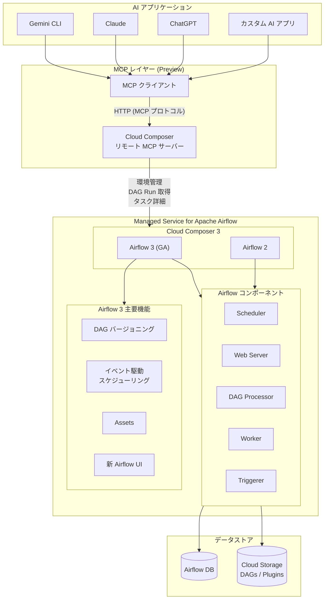

# Cloud Composer: Managed Service for Apache Airflow への改名、Airflow 3 GA、MCP サーバー対応

**リリース日**: 2026-04-15

**サービス**: Cloud Composer (Managed Service for Apache Airflow)

**機能**: サービス名変更、Airflow 3 GA、リモート MCP サーバー

**ステータス**: GA (Airflow 3) / Preview (MCP サーバー)

[このアップデートのインフォグラフィックを見る](https://takech9203.github.io/google-cloud-news-summary/20260415-cloud-composer-airflow3-ga-mcp-server.html)

## 概要

2026 年 4 月 15 日、Google Cloud は Cloud Composer に関する 3 つの重要なアップデートを同時に発表した。第一に、Cloud Composer は「Managed Service for Apache Airflow」へと正式に改名される。これは OSS ソリューションへのコミットメントを強化し、顧客がサービスのポートフォリオをより直感的に理解できるようにするための戦略的な変更である。第二に、Apache Airflow 3 が Cloud Composer 3 において一般提供 (GA) となった。これにより、DAG バージョニング、イベント駆動スケジューリング、新しい UI など Airflow 3 の革新的な機能を本番環境で利用できるようになった。第三に、Cloud Composer リモート MCP (Model Context Protocol) サーバーが Preview として提供開始された。

今回のアップデートは、ワークフローオーケストレーション領域における Google Cloud の方向性を明確に示すものである。サービス名の変更は、Google Cloud が「最もオープンなクラウドエコシステム」であるという姿勢を強調するとともに、Apache Airflow コミュニティとの連携をさらに深める意思表示である。Airflow 3 の GA 化は、2024 年 6 月の Cloud Composer 3 パブリックプレビュー、2024 年 12 月の Cloud Composer 3 GA、そして Airflow 3 Preview を経て、ようやく到達した重要なマイルストーンである。

MCP サーバーの提供は、AI アプリケーションとワークフローオーケストレーションの統合という新しいパラダイムを切り開くものであり、Gemini CLI、ChatGPT、Claude などの AI アプリケーションから Cloud Composer 環境を直接管理し、DAG 実行結果を取得できるようになる。

**アップデート前の課題**

- Cloud Composer という名称では、Apache Airflow のマネージドサービスであることが直感的に伝わりにくかった
- Airflow 3 は Preview ステータスであり、本番環境での利用が推奨されていなかった。スナップショットを使った Airflow 2 から Airflow 3 への移行や Workforce Identity Federation も未サポートだった
- AI アプリケーションから Cloud Composer 環境を操作するには、REST API や gcloud CLI を個別に呼び出す必要があり、自然言語での対話的な管理ができなかった

**アップデート後の改善**

- 「Managed Service for Apache Airflow」という名称により、OSS Apache Airflow のマネージドサービスであることが一目で理解できるようになった
- Airflow 3 が GA となり、DAG バージョニング、イベント駆動スケジューリング、Assets、新 UI などの機能を本番ワークロードで安心して利用できるようになった
- MCP サーバーにより、AI エージェントから Cloud Composer 環境の管理、DAG 実行状況の確認、タスクの詳細取得が自然言語で可能になった

## アーキテクチャ図



Cloud Composer (Managed Service for Apache Airflow) の全体アーキテクチャ。AI アプリケーションが MCP サーバーを介して Cloud Composer 環境と対話し、Airflow 3 GA の新機能群を活用するワークフローを示す。

## サービスアップデートの詳細

### 主要機能

1. **サービス名変更: Managed Service for Apache Airflow**
   - Cloud Composer は「Managed Service for Apache Airflow」に改名される
   - OSS ソリューションの成功と顧客の支持を踏まえた戦略的な変更
   - Google Cloud が「最もオープンなクラウドエコシステム」であるというコミットメントを強化
   - サービスのポートフォリオにおける位置づけを顧客が直感的に理解できるようになる
   - 既に「Managed Service for Apache Kafka」などの命名規則に揃えた形式

2. **Airflow 3 の一般提供 (GA)**
   - Cloud Composer 3 において Airflow 3 が GA ステータスに昇格
   - 本番環境でのワークロードに対する SLA が適用される
   - Airflow 3 の主要機能:
     - **Airflow 3.0 UI**: 完全にリデザインされた新しいユーザーインターフェース
     - **DAG バージョニング**: DAG の変更履歴を追跡し、特定バージョンの DAG Run を確認可能
     - **イベント駆動スケジューリング**: 時間ベースに加え、外部イベントに基づく DAG のトリガーが可能
     - **Assets**: データセットの概念を拡張し、DAG 間の依存関係をより柔軟に管理
     - **Backfills の改善**: Airflow UI から直接バックフィルを実行可能
     - **推論実行とハイパーパラメータチューニング**: ML ワークフローの効率化
     - **airflowctl コマンドラインツール**: 新しい CLI ツールによる環境管理

3. **Cloud Composer リモート MCP サーバー (Preview)**
   - Model Context Protocol (MCP) に準拠したリモートサーバーを提供
   - Gemini CLI、ChatGPT、Claude などの AI アプリケーションから Cloud Composer に接続可能
   - 主な機能:
     - Cloud Composer 環境の管理操作
     - 実行済み DAG Run の詳細取得
     - Airflow タスクの情報取得
   - Google Cloud の他の MCP サーバー (BigQuery、Cloud SQL、Compute Engine など) と同様のアーキテクチャ
   - IAM による認証・認可、Model Armor によるセキュリティ保護に対応

## 技術仕様

### Airflow 3 で利用可能な機能 (Cloud Composer 3 GA)

| 機能 | ステータス |
|------|-----------|
| Airflow 3.0 UI | サポート |
| DAG バージョニング | サポート |
| Backfills (Airflow UI から) | サポート |
| イベント駆動スケジューリング | サポート |
| Assets | サポート |
| 推論実行・ハイパーパラメータチューニング | サポート |
| airflowctl コマンドラインツール | サポート |
| DAG bundles (LocalDagBundle 以外) | 未サポート |
| Edge Executor / 他言語タスク | 未サポート |

### MCP サーバー仕様

| 項目 | 詳細 |
|------|------|
| プロトコル | Model Context Protocol (MCP) |
| 通信方式 | リモート MCP サーバー (HTTP エンドポイント) |
| 認証 | Google Cloud IAM / MCP 認可仕様準拠 |
| ステータス | Preview |
| 対応 AI クライアント | Gemini CLI、ChatGPT、Claude、カスタム AI アプリケーション |
| 提供ツール | 環境管理、DAG Run 詳細取得、Airflow タスク情報取得 |

### Cloud Composer バージョン構成

| バージョン | 対応 Airflow | Executor | 特徴 |
|-----------|-------------|----------|------|
| Cloud Composer 3 | Airflow 3 (GA)、Airflow 2 | CeleryKubernetes Executor | テナントプロジェクトでの実行、自動スケーリング |
| Cloud Composer 2 | Airflow 2 | Celery Executor | Autopilot GKE クラスタ |

### MCP クライアント設定例

```json
{
  "mcpServers": {
    "cloud-composer": {
      "url": "https://composer.googleapis.com/mcp"
    }
  }
}
```

## 設定方法

### 前提条件

1. Cloud Composer API が有効化された Google Cloud プロジェクト
2. 適切な IAM ロール (Composer Admin または Composer User)
3. MCP サーバーを利用する場合は、MCP 対応の AI アプリケーション

### 手順

#### ステップ 1: Airflow 3 GA 環境の作成

```bash
# Airflow 3 で Cloud Composer 3 環境を作成
gcloud composer environments create my-airflow3-env \
  --location us-central1 \
  --image-version composer-3-airflow-3.1.0-build.latest \
  --service-account my-composer-sa@my-project.iam.gserviceaccount.com
```

新しい環境は Airflow 3 GA の全機能を利用可能な状態で作成される。

#### ステップ 2: 既存環境の確認

```bash
# 現在の環境のバージョンを確認
gcloud composer environments describe my-environment \
  --location us-central1 \
  --format="value(config.softwareConfig.imageVersion)"
```

#### ステップ 3: MCP サーバーへの接続 (Preview)

MCP 対応の AI アプリケーションで、Cloud Composer MCP サーバーのエンドポイントを設定する。Google Cloud の認証情報を使用して接続を確立する。

```bash
# gcloud で認証情報を設定
gcloud auth application-default login
```

## メリット

### ビジネス面

- **ブランドの明確化**: 「Managed Service for Apache Airflow」という名称により、OSS Airflow のフルマネージドサービスであることが明確になり、導入検討時の理解が容易になる
- **本番利用の承認**: Airflow 3 GA により、エンタープライズ顧客が本番環境での Airflow 3 利用を正式に承認できる根拠が整った。SLA 適用による安心感が大きい
- **AI 統合による生産性向上**: MCP サーバーにより、運用チームが AI アシスタントを通じて Cloud Composer 環境を管理できるようになり、運用効率が大幅に向上する

### 技術面

- **DAG バージョニング**: DAG の変更を追跡でき、特定バージョンの実行結果を確認できるため、デバッグと監査が容易になる
- **イベント駆動スケジューリング**: 時間ベースのスケジューリングに加え、外部イベント (Cloud Storage へのファイルアップロード、Pub/Sub メッセージなど) に基づく柔軟なワークフロートリガーが可能になる
- **Assets による DAG 間連携**: DAG 間のデータ依存関係を宣言的に定義でき、上流 DAG の出力を下流 DAG が自動的に検知してスケジューリングされる
- **MCP によるプログラマブルな管理**: AI エージェントやカスタムアプリケーションから標準化されたプロトコルで環境を操作でき、自動化の幅が広がる

## デメリット・制約事項

### 制限事項

- Airflow 3 GA において DAG bundles (LocalDagBundle 以外) は未サポート。リモート DAG ストレージの利用は今後のアップデートを待つ必要がある
- Airflow 3 GA において Edge Executor および他言語でのタスク実行は未サポート
- MCP サーバーは Preview ステータスであり、本番環境での利用は Pre-GA 条件が適用される
- Airflow 2 から Airflow 3 への既存環境のインプレースアップグレードおよびスナップショットを使ったアップグレードは GA 時点でのサポート状況を確認する必要がある

### 考慮すべき点

- サービス名の変更に伴い、ドキュメントや社内手順書、IaC テンプレートでの名称更新が必要になる可能性がある。API エンドポイントや gcloud コマンドの変更有無を確認すること
- Airflow 2 から Airflow 3 への移行には、DAG の互換性確認が必須。Airflow 3 での破壊的変更 (API の変更、非推奨機能の削除など) を事前に検証する必要がある
- MCP サーバーの利用には適切な IAM 権限の設定が必要。過剰な権限付与は環境の不正操作リスクにつながるため、最小権限の原則を遵守すること

## ユースケース

### ユースケース 1: AI エージェントによる Airflow 運用自動化

**シナリオ**: 運用チームが Gemini CLI や Claude を使って、Cloud Composer 環境の状態確認や障害対応を行いたい

**実装例**:
```
# AI アプリケーションでの対話例
ユーザー: 「本番環境の Cloud Composer で失敗した DAG Run を確認して」
AI: MCP サーバーを通じて環境に接続し、失敗した DAG Run の一覧と
    各タスクのエラーログを取得して表示
```

**効果**: 運用担当者が Google Cloud コンソールや Airflow UI にアクセスすることなく、AI アシスタントとの対話で迅速に状況を把握し、対応策を検討できる

### ユースケース 2: Airflow 3 の DAG バージョニングを活用した CI/CD パイプライン

**シナリオ**: データエンジニアリングチームが DAG の変更をバージョン管理し、特定バージョンの実行結果を追跡したい

**実装例**:
```python
from airflow.decorators import dag, task
from datetime import datetime

@dag(
    schedule="@daily",
    start_date=datetime(2026, 4, 15),
    catchup=False,
)
def etl_pipeline():
    @task
    def extract():
        # データ抽出ロジック
        return {"source": "bigquery", "rows": 10000}

    @task
    def transform(data: dict):
        # データ変換ロジック
        return {"transformed_rows": data["rows"]}

    @task
    def load(data: dict):
        # データロードロジック
        print(f"Loaded {data['transformed_rows']} rows")

    raw = extract()
    transformed = transform(raw)
    load(transformed)

etl_pipeline()
```

**効果**: DAG の各バージョンが自動的に追跡され、変更前後の実行結果を比較できる。問題が発生した場合、どのバージョンの変更が原因かを特定しやすい

### ユースケース 3: Assets を活用したデータパイプラインの連携

**シナリオ**: 複数の DAG が生成するデータの依存関係を宣言的に管理し、上流データの更新を自動検知して下流処理をトリガーしたい

**実装例**:
```python
from airflow.sdk import Asset, DAG, task

# Asset の定義
sales_data = Asset("gs://my-bucket/sales/daily/")
report_data = Asset("gs://my-bucket/reports/daily/")

# 上流 DAG: 売上データを生成
with DAG(
    dag_id="produce_sales_data",
    schedule="@daily",
):
    @task(outlets=[sales_data])
    def generate_sales():
        # 売上データを生成して Cloud Storage に保存
        pass

# 下流 DAG: 売上データの更新を検知してレポートを生成
with DAG(
    dag_id="generate_report",
    schedule=[sales_data],  # Asset ベースのスケジューリング
):
    @task(outlets=[report_data])
    def create_report():
        # 売上データからレポートを生成
        pass
```

**効果**: DAG 間の依存関係が Asset として明示的に定義され、上流処理の完了を自動的に検知して下流処理が開始される。時間ベースのスケジューリングと比較して、不要な待機時間が削減され、データの鮮度が向上する

## 料金

Cloud Composer 3 (Managed Service for Apache Airflow) の料金は、環境のコンピューティングリソース使用量に基づく。Airflow 3 GA 環境と Airflow 2 環境の料金モデルに変更はない。MCP サーバーの利用に関する追加料金は、Preview 時点では発表されていない。

詳細は [Cloud Composer 料金ページ](https://cloud.google.com/composer/pricing) を参照。

## 関連サービス・機能

- **Google Cloud MCP サーバー**: Cloud Composer MCP サーバーは Google Cloud の MCP サーバー群の一つ。BigQuery、Cloud SQL、Compute Engine、GKE など多数のサービスで同様の MCP サーバーが提供されている
- **Managed Service for Apache Kafka**: 同様の「Managed Service for ...」命名規則を採用した Google Cloud サービス。OSS エコシステムへのコミットメントを共有
- **Cloud Monitoring / Cloud Logging**: Cloud Composer 環境のメトリクス監視とログ管理。MCP サーバー経由の操作も監査ログに記録される
- **Cloud Storage**: DAG ファイル、プラグイン、データの保存に使用。Airflow 3 の Assets 機能とも連携
- **Secret Manager**: Airflow 接続情報やシークレットの安全な管理に推奨

## 参考リンク

- [インフォグラフィック](https://takech9203.github.io/google-cloud-news-summary/20260415-cloud-composer-airflow3-ga-mcp-server.html)
- [公式リリースノート](https://docs.cloud.google.com/release-notes#April_15_2026)
- [Cloud Composer ドキュメント](https://docs.cloud.google.com/composer/docs)
- [Cloud Composer バージョニング概要](https://docs.cloud.google.com/composer/docs/composer-versioning-overview)
- [Airflow 3 機能サポート状況](https://docs.cloud.google.com/composer/docs/composer-versioning-overview#comparison-airflow)
- [Google Cloud MCP サーバー概要](https://docs.cloud.google.com/mcp/overview)
- [Google Cloud MCP 対応プロダクト一覧](https://docs.cloud.google.com/mcp/supported-products)
- [Cloud Composer 料金](https://docs.cloud.google.com/composer/pricing)

## まとめ

今回のアップデートは、Google Cloud のワークフローオーケストレーション戦略における最大級の転換点である。Cloud Composer から Managed Service for Apache Airflow への改名は、OSS ファーストの姿勢を明確にし、Airflow 3 の GA 化は次世代ワークフロー管理の本番利用を可能にした。MCP サーバーの Preview 提供により、AI アプリケーションとワークフローオーケストレーションの融合という新しい運用モデルが幕を開けた。既存の Cloud Composer ユーザーは、Airflow 3 への移行計画を策定し、MCP サーバーによる AI 統合の検証を開始することが推奨される。

---

**タグ**: #CloudComposer #ManagedServiceForApacheAirflow #Airflow3 #MCP #GA #Preview
