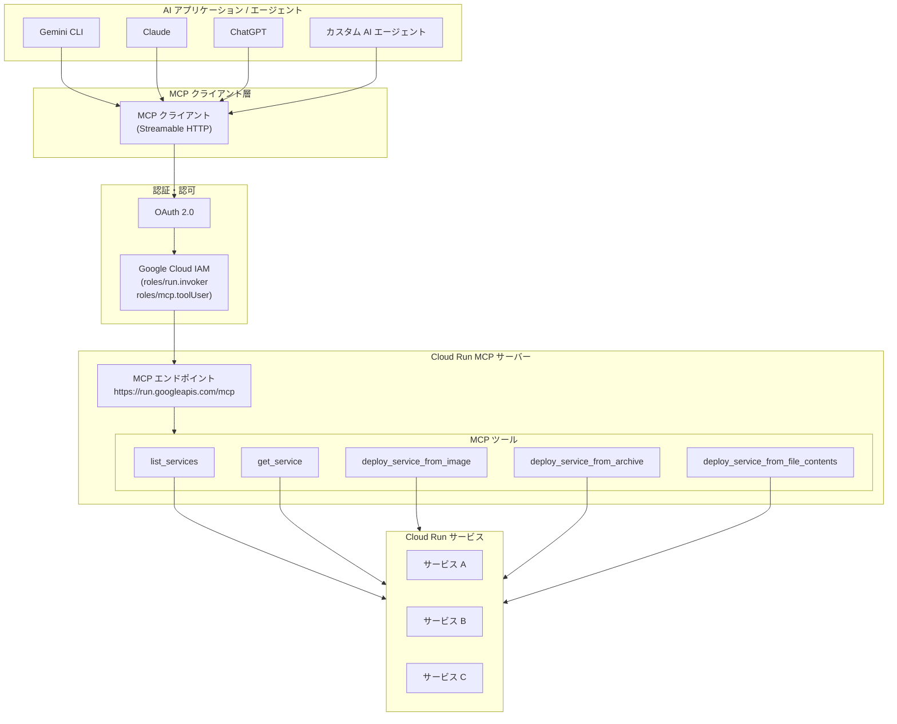

# Cloud Run: リモート MCP サーバーが GA (一般提供) に昇格

**リリース日**: 2026-04-15

**サービス**: Cloud Run

**機能**: Cloud Run リモート MCP サーバーの一般提供 (GA)

**ステータス**: GA

[このアップデートのインフォグラフィックを見る](https://takech9203.github.io/google-cloud-news-summary/20260415-cloud-run-mcp-server-ga.html)

## 概要

Cloud Run リモート MCP (Model Context Protocol) サーバーが General Availability (GA) となり、本番環境での利用が正式にサポートされるようになりました。MCP は AI エージェントが外部データソースやツールと標準化された方法でやり取りするためのオープンプロトコルであり、Cloud Run 上で MCP サーバーをホストすることで、AI アプリケーションやエージェントが Cloud Run サービスのデプロイや管理を自然言語で実行できるようになります。

この GA リリースにより、Cloud Run の MCP サーバーは Google Cloud の SLA に基づくサポートの対象となり、エンタープライズグレードの本番ワークロードで安心して利用できるようになりました。MCP サーバーのエンドポイント (`https://run.googleapis.com/mcp`) を通じて、Gemini CLI、Claude、ChatGPT などの主要な AI アプリケーションから Cloud Run サービスの操作が可能です。

このアップデートは、AI を活用したアプリケーション開発ワークフローの自動化を推進する開発者や DevOps エンジニア、また MCP プロトコルを活用してクラウドインフラストラクチャの管理を効率化したい組織にとって重要な進展です。

**アップデート前の課題**

- Cloud Run リモート MCP サーバーはプレビュー段階であり、本番環境での利用に SLA が適用されなかった
- MCP サーバーを Cloud Run にデプロイする際の手順やベストプラクティスが限定的だった
- AI エージェントから Cloud Run サービスを操作するには、手動で gcloud CLI やコンソールを使用する必要があった
- MCP クライアントの認証方法が確立されておらず、セキュリティ面での不安があった

**アップデート後の改善**

- GA として正式にリリースされ、Google Cloud SLA の対象となり本番環境で安心して利用可能に
- Streamable HTTP トランスポートによるリモート MCP サーバーのホスティングが完全サポート
- AI エージェント (Gemini CLI、Claude、ChatGPT 等) から自然言語で Cloud Run サービスのデプロイ・管理が可能に
- OAuth 2.0 と IAM による堅牢な認証・認可フレームワークが確立

## アーキテクチャ図



AI アプリケーションが MCP クライアントを通じて Cloud Run MCP サーバーのエンドポイントに接続し、標準化された MCP ツールを呼び出すことで Cloud Run サービスの一覧取得、詳細確認、デプロイなどの操作を実行します。すべての通信は OAuth 2.0 と IAM による認証・認可を経由して安全に行われます。

## サービスアップデートの詳細

### 主要機能

1. **Cloud Run MCP サーバーエンドポイント**
   - マネージド HTTP エンドポイント (`https://run.googleapis.com/mcp`) を提供
   - Cloud Run Admin API を有効化するだけで利用可能
   - Streamable HTTP トランスポートをサポートし、複数のクライアント接続を同時に処理
   - 追加のインフラストラクチャ構築は不要

2. **MCP ツール群 (Cloud Run 操作)**
   - `list_services`: 指定したプロジェクトとリージョンの Cloud Run サービス一覧を取得
   - `get_service`: サービスの URI やデプロイ状況などの詳細情報を取得
   - `deploy_service_from_image`: Artifact Registry や Docker Hub のコンテナイメージから Cloud Run サービスをデプロイ
   - `deploy_service_from_archive`: ソースコードアーカイブ (.tar.gz) から直接デプロイ (最大 250MiB)
   - `deploy_service_from_file_contents`: ローカルソースファイルから直接デプロイ (最大 50MiB、Python/Node.js 向け)

3. **カスタム MCP サーバーのホスティング**
   - 独自に開発した MCP サーバーを Cloud Run 上にデプロイ可能
   - コンテナイメージまたはソースコードからのデプロイに対応
   - FastMCP や公式 MCP SDK (TypeScript、Python、Go、Kotlin、Java、C#、Ruby、Rust) を使用した開発をサポート
   - サイドカーデプロイ、Service-to-Service 認証、Cloud Service Mesh との連携に対応

4. **ツールセット (Toolsets)**
   - MCP サーバーのツール群からサブセットを定義し、個別のエンドポイントとして公開可能
   - エージェントが過剰なツール数で過負荷にならないよう、必要なツールだけを選択的に提供
   - ツールセットは MCP クライアントから独立した MCP サーバーとして認識される

## 技術仕様

### MCP トランスポート

| 項目 | 詳細 |
|------|------|
| サポートするトランスポート | Streamable HTTP、Server-Sent Events (SSE) |
| サポートしないトランスポート | Standard Input/Output (stdio) -- Cloud Run では非対応 |
| MCP エンドポイント (グローバル) | `https://run.googleapis.com/mcp` |
| MCP エンドポイント (リージョナル) | `https://run.REGION.rep.googleapis.com/mcp` (プレビュー) |
| プロトコルバージョン | MCP 仕様 2025-03-26 準拠 |

### 必要な IAM ロール

| ロール | 説明 |
|--------|------|
| `roles/run.developer` | Cloud Run サービスの作成 |
| `roles/iam.serviceAccountUser` | サービスアカウントとしてのオペレーション実行 |
| `roles/artifactregistry.reader` | デプロイ済みコンテナイメージへのアクセス |
| `roles/mcp.toolUser` | MCP ツール呼び出しの実行 |
| `roles/iam.serviceAccountTokenCreator` | クロスプロジェクトのサービスアカウント使用 (必要な場合) |

### OAuth スコープ

```json
{
  "scopes": [
    "https://www.googleapis.com/auth/run.readonly",
    "https://www.googleapis.com/auth/run"
  ]
}
```

- `run.readonly`: 読み取り専用アクセス (サービス一覧、詳細取得)
- `run`: 読み取りおよび書き込みアクセス (サービスのデプロイ、更新)

## 設定方法

### 前提条件

1. Google Cloud プロジェクトの作成と Cloud Run Admin API の有効化
2. gcloud CLI のインストールと初期化
3. 必要な IAM ロールの付与 (`roles/run.developer`、`roles/mcp.toolUser` など)

### 手順

#### ステップ 1: Cloud Run Admin API の有効化

```bash
gcloud services enable run.googleapis.com \
  --project=PROJECT_ID
```

Cloud Run MCP サーバーは Cloud Run Admin API を有効化すると自動的に利用可能になります。

#### ステップ 2: 必要な IAM ロールの付与

```bash
# MCP ツールの呼び出し権限
gcloud projects add-iam-policy-binding PROJECT_ID \
  --member="user:USER_EMAIL" \
  --role="roles/mcp.toolUser"

# Cloud Run サービスの作成権限
gcloud projects add-iam-policy-binding PROJECT_ID \
  --member="user:USER_EMAIL" \
  --role="roles/run.developer"

# サービスアカウントの使用権限
gcloud projects add-iam-policy-binding PROJECT_ID \
  --member="user:USER_EMAIL" \
  --role="roles/iam.serviceAccountUser"
```

プロジェクトに対して適切な IAM ロールを付与します。

#### ステップ 3: Gemini CLI での設定例

```json
{
  "name": "cloud-run-mcp",
  "version": "1.0.0",
  "mcpServers": {
    "cloud_run": {
      "httpUrl": "https://run.googleapis.com/mcp",
      "authProviderType": "google_credentials",
      "oauth": {
        "scopes": ["https://www.googleapis.com/auth/run"]
      },
      "timeout": 30000,
      "headers": {
        "x-goog-user-project": "PROJECT_ID"
      }
    }
  }
}
```

このファイルを `~/.gemini/extensions/cloud-run-mcp/gemini-extension.json` に保存します。

#### ステップ 4: Claude Desktop での設定例

```json
{
  "mcpServers": {
    "cloud_run": {
      "url": "https://run.googleapis.com/mcp",
      "transport": "http"
    }
  }
}
```

MCP クライアントの設定で Cloud Run MCP サーバーのエンドポイント URL を指定します。

#### ステップ 5: カスタム MCP サーバーの Cloud Run へのデプロイ (オプション)

```bash
# ソースコードからのデプロイ
gcloud run deploy mcp-server \
  --no-allow-unauthenticated \
  --region=us-central1 \
  --source .

# コンテナイメージからのデプロイ
gcloud run deploy mcp-server \
  --image us-central1-docker.pkg.dev/PROJECT_ID/remote-mcp-servers/mcp-server:latest \
  --region=us-central1 \
  --no-allow-unauthenticated
```

独自の MCP サーバーを Cloud Run にデプロイする場合は、コンテナイメージまたはソースコードからデプロイ可能です。

## メリット

### ビジネス面

- **AI 駆動の開発ワークフロー**: AI エージェントを通じた自然言語でのインフラストラクチャ管理により、DevOps の生産性を大幅に向上
- **標準化されたプロトコル**: MCP というオープンプロトコルに準拠することで、特定の AI ベンダーにロックインされずに複数の AI アプリケーションから一貫したインターフェースで操作可能
- **迅速なプロトタイピング**: `deploy_service_from_file_contents` ツールにより、AI エージェントとの対話を通じてソースコードから直接デプロイ可能で、バイブコーディングのワークフローを実現

### 技術面

- **マネージドインフラストラクチャ**: MCP サーバーのエンドポイントは Google によって管理され、インフラ構築・運用の負担がない
- **堅牢なセキュリティ**: OAuth 2.0 と IAM による認証・認可に加え、Model Armor によるプロンプト/レスポンスセキュリティのオプション
- **柔軟なデプロイオプション**: コンテナイメージ、ソースコードアーカイブ、インラインソースコードの 3 つのデプロイ方法をサポート
- **スケーラブルな設計**: Cloud Run のオートスケーリング (ゼロスケール対応) を活用し、トラフィックに応じた自動スケーリングが可能

## デメリット・制約事項

### 制限事項

- Cloud Run の MCP サーバーは stdio トランスポートをサポートしていないため、ローカル MCP サーバーの直接ホスティングには対応しない (ローカル用途には別途 [Cloud Run MCP server on GitHub](https://github.com/GoogleCloudPlatform/cloud-run-mcp) を参照)
- `deploy_service_from_archive` でのアーカイブサイズは最大 250MiB に制限
- `deploy_service_from_file_contents` でのリクエストサイズは最大 50MiB に制限
- リージョナルエンドポイント (`run.REGION.rep.googleapis.com/mcp`) はプレビュー段階のままであり、GA 対象はグローバルエンドポイントのみ
- API キーによる認証は非対応であり、OAuth 2.0 + IAM による認証が必須

### 考慮すべき点

- MCP クライアントの認証設定は AI アプリケーションごとに異なるため、各アプリケーションのドキュメントを確認する必要がある
- AI エージェントに過剰なツールを公開すると性能劣化の原因となるため、ツールセット機能を活用して必要最小限のツールに絞ることを推奨
- エージェント用のアイデンティティはユーザーアカウントとは別に作成し、アクセス制御と監査を適切に行うことが推奨される
- ヘッドレス環境や SSH セッションでは OAuth フローのブラウザリダイレクトが動作しないため、サービスアカウントベースの認証を検討する必要がある

## ユースケース

### ユースケース 1: AI エージェントによる Cloud Run サービスの自動デプロイ

**シナリオ**: 開発者が Gemini CLI を使って新しい Web サービスを Cloud Run にデプロイする場合。Docker Hub のコンテナイメージを指定するだけで、AI エージェントが MCP ツールを使用して自動的にデプロイを実行する。

**実装例**:
```
# Gemini CLI でのプロンプト例
"Deploy a private Cloud Run service named my-api
 from the Docker image us-docker.pkg.dev/cloudrun/container/hello
 to project my-project in us-central1 region"
```

**効果**: gcloud CLI のコマンド構文を覚えることなく、自然言語でインフラストラクチャ操作が完了し、デプロイ時間の短縮と人的ミスの削減を実現。

### ユースケース 2: カスタム MCP サーバーのホスティング

**シナリオ**: 社内のデータベースや外部 API と連携するカスタム MCP サーバーを開発し、Cloud Run 上にホスティング。AI エージェントがこの MCP サーバーを通じてビジネスロジックを実行する。

**実装例**:
```python
from fastmcp import FastMCP
import os

mcp = FastMCP("Custom Business MCP Server")

@mcp.tool()
def query_inventory(product_id: str) -> dict:
    """在庫情報を取得する"""
    # ビジネスロジックの実装
    return {"product_id": product_id, "stock": 150}

if __name__ == "__main__":
    import asyncio
    asyncio.run(
        mcp.run_async(
            transport="streamable-http",
            host="0.0.0.0",
            port=os.getenv("PORT", 8080),
        )
    )
```

**効果**: AI エージェントが社内システムのデータにアクセスし、業務の自動化を実現。Cloud Run のスケーラブルな基盤により、高負荷時にも安定した応答を提供。

### ユースケース 3: バイブコーディングによる高速プロトタイピング

**シナリオ**: AI エージェントとの対話を通じて Web アプリケーションのコードを生成し、`deploy_service_from_file_contents` ツールを使って即座に Cloud Run にデプロイ。開発と検証のサイクルを極めて短縮する。

**効果**: コンテナイメージのビルド工程をスキップして数秒でデプロイが完了し、アイデアの検証スピードが飛躍的に向上。

## 料金

Cloud Run MCP サーバーのエンドポイント (`run.googleapis.com/mcp`) の利用自体に追加料金は発生しません。Cloud Run Admin API の一部として提供されます。料金が発生するのは、Cloud Run サービスの実行コストです。

### 料金例

| 項目 | 月額料金 (概算) |
|------|-----------------|
| Cloud Run MCP エンドポイント利用 | 無料 (Cloud Run Admin API に含まれる) |
| Cloud Run vCPU (インスタンスベース課金) | $0.0648 / vCPU 時間 |
| Cloud Run メモリ (インスタンスベース課金) | $0.0072 / GiB 時間 |
| Cloud Run vCPU (リクエストベース課金) | $0.0526 / vCPU 時間 + リクエスト料 |
| Artifact Registry ストレージ | $0.10 / GB 月 (カスタム MCP サーバーのイメージ保存) |

Cloud Run には寛大な無料枠が用意されており、毎月 180,000 vCPU 秒と 360,000 GiB 秒の無料利用分があります。MCP サーバーの利用頻度が低い開発・テスト用途であれば、無料枠内で運用可能です。

## 利用可能リージョン

Cloud Run MCP サーバーのグローバルエンドポイント (`https://run.googleapis.com/mcp`) は、Cloud Run がサポートするすべてのリージョンで利用可能です。主要なリージョンは以下の通りです。

- **北米**: us-central1、us-east1、us-east4、us-west1 など
- **ヨーロッパ**: europe-west1、europe-west4、europe-north1 など
- **アジア太平洋**: asia-northeast1 (東京)、asia-northeast2 (大阪)、asia-southeast1 など

リージョナルエンドポイント (`https://run.REGION.rep.googleapis.com/mcp`) はプレビュー段階です。

## 関連サービス・機能

- **Model Context Protocol (MCP)**: AI エージェントが外部ツールやデータソースと標準化された方法で通信するためのオープンプロトコル。Cloud Run MCP サーバーはこのプロトコルに準拠
- **Google Cloud MCP サーバー群**: BigQuery、Spanner、Vertex AI など他の Google Cloud サービスも MCP サーバーを提供しており、統一的なインターフェースで複数サービスを操作可能
- **Agent Development Kit (ADK)**: MCP サーバーと連携した AI エージェントの構築フレームワーク。Cloud Run 上の MCP サーバーを ADK エージェントから利用するコードラボも提供
- **Cloud Service Mesh**: MCP クライアントと MCP サーバーを Cloud Run 上でホストする際の認証・トラフィック管理を自動化
- **Model Armor**: MCP サーバーへのプロンプトやレスポンスのセキュリティ保護を提供するオプション機能

## 参考リンク

- [インフォグラフィック](https://takech9203.github.io/google-cloud-news-summary/20260415-cloud-run-mcp-server-ga.html)
- [公式リリースノート](https://cloud.google.com/release-notes#April_15_2026)
- [Cloud Run で MCP サーバーをホストする](https://docs.cloud.google.com/run/docs/host-mcp-servers)
- [Cloud Run MCP サーバーを使用する](https://docs.cloud.google.com/run/docs/use-cloud-run-mcp)
- [Cloud Run MCP リファレンス](https://docs.cloud.google.com/run/docs/reference/mcp)
- [リモート MCP サーバーのデプロイチュートリアル](https://docs.cloud.google.com/run/docs/tutorials/deploy-remote-mcp-server)
- [AI アプリケーションで MCP を設定する](https://docs.cloud.google.com/mcp/configure-mcp-ai-application)
- [Cloud Run 料金ページ](https://cloud.google.com/run/pricing)

## まとめ

Cloud Run リモート MCP サーバーの GA リリースは、AI エージェントとクラウドインフラストラクチャの統合における重要なマイルストーンです。Gemini CLI、Claude、ChatGPT などの主要 AI アプリケーションから Cloud Run サービスを自然言語で操作できるようになり、開発者の生産性向上とインフラ管理の自動化が大きく前進します。まずは Gemini CLI に Cloud Run MCP サーバーを設定し、既存のプロジェクトでサービスの一覧取得やデプロイを試してみることをお勧めします。

---

**タグ**: #CloudRun #MCP #ModelContextProtocol #GA #AIエージェント #サーバーレス #Gemini #Claude #ChatGPT #デプロイ自動化
