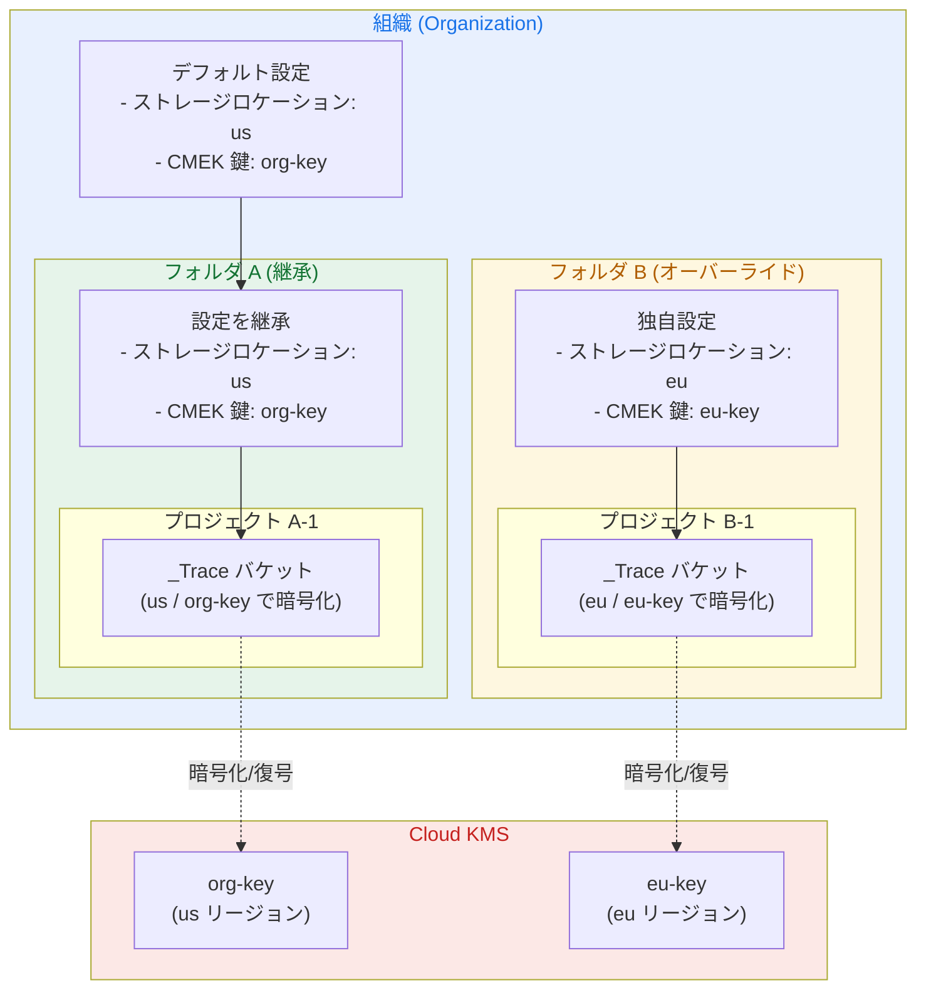

# Cloud Trace: CMEK 暗号化サポートおよびオブザーバビリティバケットのデフォルトストレージロケーション設定

**リリース日**: 2026-04-15

**サービス**: Cloud Trace

**機能**: 顧客管理暗号鍵 (CMEK) による暗号化サポート / オブザーバビリティバケットのデフォルトストレージロケーション設定

**ステータス**: Feature

[このアップデートのインフォグラフィックを見る](https://takech9203.github.io/google-cloud-news-summary/20260415-cloud-trace-cmek-storage-location.html)

## 概要

2026 年 4 月 15 日、Cloud Trace に 2 つの重要なセキュリティ・データガバナンス機能が追加されました。1 つ目は、トレースデータを顧客管理暗号鍵 (CMEK: Customer-Managed Encryption Key) で暗号化する機能です。2 つ目は、オブザーバビリティバケットのデフォルトストレージロケーションを制御する機能です。これらの機能により、トレースデータの暗号化と保存場所を組織のコンプライアンス要件に合わせて管理できるようになりました。

CMEK を有効にするには、まずデフォルトストレージロケーションを設定し、そのロケーションに対してデフォルトの Cloud Key Management Service (Cloud KMS) 鍵を設定します。これらのデフォルト設定は、組織、フォルダ、またはプロジェクトのいずれのレベルでも構成可能であり、組織やフォルダに設定した場合はそのリソースとすべての子孫リソースに自動的に適用されます。

このアップデートは、金融機関、医療機関、政府機関など、厳格なデータ暗号化要件やデータレジデンシー要件を持つ組織にとって特に重要です。これまで Cloud Logging では CMEK がサポートされていましたが、Cloud Trace のトレースデータには同様の暗号化制御が提供されていませんでした。今回のアップデートにより、オブザーバビリティスタック全体で一貫したデータ保護ポリシーを適用できるようになります。

**アップデート前の課題**

- Cloud Trace のトレースデータは Google 管理の暗号鍵のみで暗号化されており、顧客側で暗号鍵を管理・制御する手段がなかった
- トレースデータの保存先リージョンを明示的に指定する方法がなく、データレジデンシー要件への対応が困難だった
- 組織全体で統一的なトレースデータの暗号化・保存ポリシーを階層的に適用する仕組みが存在しなかった

**アップデート後の改善**

- Cloud KMS の顧客管理暗号鍵を使用してトレースデータを暗号化でき、暗号鍵のライフサイクルを完全に制御可能になった
- オブザーバビリティバケットのデフォルトストレージロケーションを指定でき、新規バケットの作成先リージョンを制御可能になった
- 組織・フォルダ・プロジェクトの階層に沿ったデフォルト設定の継承により、大規模環境でも一貫したポリシー適用が可能になった

## アーキテクチャ図



組織レベルで設定されたデフォルトのストレージロケーションと CMEK 鍵は、子孫リソースに自動的に継承されます。フォルダやプロジェクトで個別に設定をオーバーライドすることも可能で、異なるリージョンや鍵を使用する柔軟な構成が実現できます。

## サービスアップデートの詳細

### 主要機能

1. **CMEK によるトレースデータ暗号化**
   - Cloud KMS で管理する顧客所有の暗号鍵を使用して、オブザーバビリティバケット内のトレースデータを暗号化
   - 暗号鍵のローテーション、無効化、破棄を顧客側で制御でき、クリプトシュレッディング (鍵の破棄によるデータ消去) にも対応
   - Observability サービスエージェントが暗号化・復号を自動的に処理するため、エンドユーザーの操作体験に変更はない

2. **デフォルトストレージロケーションの設定**
   - オブザーバビリティバケットの作成先リージョンをデフォルトで指定可能
   - eu、us のマルチリージョンのほか、us-central1、europe-west1、asia-northeast2 など多数のリージョンをサポート
   - 新規作成されるオブザーバビリティバケットにのみ適用され、既存のバケットには影響しない

3. **階層的なデフォルト設定の継承**
   - 組織 → フォルダ → プロジェクトの階層に沿ってデフォルト設定が自動継承
   - 子孫リソースで個別に設定をオーバーライドした場合、そのリソースとさらにその子孫にはオーバーライドされた設定が適用される
   - 大規模な組織でも一括設定と例外的なオーバーライドの両方に対応可能

## 技術仕様

### CMEK 暗号化の詳細

| 項目 | 詳細 |
|------|------|
| 暗号化方式 | AES-256-GCM (対称暗号化、エンベロープ暗号化モデル) |
| 鍵の保護レベル | SOFTWARE または HSM (Cloud HSM) から選択可能 |
| 対応する鍵の種類 | Cloud KMS で作成した対称暗号鍵 |
| 鍵のリージョン要件 | Cloud KMS 鍵とオブザーバビリティバケットは同一リージョンに配置が必要 |
| サービスエージェント | `service-{PROJECT_NUMBER}@gcp-sa-observability.iam.gserviceaccount.com` (プロジェクト) / `service-org-{ORG_ID}@gcp-sa-observability.iam.gserviceaccount.com` (組織) |
| 必要な IAM ロール | Cloud KMS CryptoKey Encrypter/Decrypter (`roles/cloudkms.cryptoKeyEncrypterDecrypter`) |

### オブザーバビリティバケットのストレージモデル

| 項目 | 詳細 |
|------|------|
| バケット名 | `_Trace` (システム自動作成) |
| データセット名 | `Spans` (システム自動作成) |
| ビュー名 | `_AllSpans` (システム自動作成) |
| バケット作成トリガー | Cloud Trace API または Telemetry API を通じてトレースデータが送信された時 |
| 適用範囲 | 新規作成されるオブザーバビリティバケットのみ (既存バケットには適用されない) |

### gcloud CLI 要件

| 項目 | 詳細 |
|------|------|
| 最小バージョン | gcloud CLI 563.0.0 以降 |
| コマンド | `gcloud beta observability settings update` |
| Terraform サポート | あり (Cloud KMS 鍵の設定) |

## 設定方法

### 前提条件

1. gcloud CLI バージョン 563.0.0 以降がインストールされていること
2. Cloud KMS API が有効化されていること
3. 対象リソース (組織、フォルダ、またはプロジェクト) に対する `roles/observability.admin` ロールが付与されていること
4. CMEK を使用する場合、Cloud KMS 鍵が対象ストレージロケーションと同一リージョンに作成されていること

### 手順

#### ステップ 1: Cloud KMS 鍵リングと鍵の作成

CMEK を使用する場合、まず Cloud KMS に鍵リングと暗号鍵を作成します。

```bash
# 鍵リングの作成 (us リージョンの例)
gcloud kms keyrings create trace-keyring \
  --location=us \
  --project=MY_KMS_PROJECT_ID

# 暗号鍵の作成
gcloud kms keys create trace-cmek-key \
  --keyring=trace-keyring \
  --location=us \
  --purpose=encryption \
  --project=MY_KMS_PROJECT_ID
```

Cloud KMS 鍵はオブザーバビリティバケットと同一リージョンに配置する必要があります。

#### ステップ 2: サービスエージェントへの IAM ロール付与

Observability サービスエージェントに Cloud KMS 鍵へのアクセス権限を付与します。

```bash
# サービスエージェントの確認
gcloud beta observability settings describe \
  --location=global \
  --project=MY_PROJECT_ID

# サービスエージェントに CryptoKey Encrypter/Decrypter ロールを付与
gcloud kms keys add-iam-policy-binding trace-cmek-key \
  --project=MY_KMS_PROJECT_ID \
  --member=serviceAccount:service-PROJECT_NUMBER@gcp-sa-observability.iam.gserviceaccount.com \
  --role=roles/cloudkms.cryptoKeyEncrypterDecrypter \
  --location=us \
  --keyring=trace-keyring
```

組織レベルで設定する場合は、`service-org-ORGANIZATION_ID@gcp-sa-observability.iam.gserviceaccount.com` をサービスエージェントとして使用します。

#### ステップ 3: デフォルト Cloud KMS 鍵の設定

対象リソースとロケーションに対して、デフォルトの Cloud KMS 鍵を設定します。

```bash
# プロジェクトの us ロケーションにデフォルト CMEK 鍵を設定
gcloud beta observability settings update \
  --kms-key-name=projects/MY_KMS_PROJECT_ID/locations/us/keyRings/trace-keyring/cryptoKeys/trace-cmek-key \
  --update-mask=kms-key-name \
  --location=us \
  --project=MY_PROJECT_ID
```

組織レベルで設定する場合は `--organization=ORGANIZATION_ID` を、フォルダレベルの場合は `--folder=FOLDER_ID` を使用します。

#### ステップ 4: デフォルトストレージロケーションの設定

デフォルトのストレージロケーションを設定します。

```bash
# プロジェクトのデフォルトストレージロケーションを us に設定
gcloud beta observability settings update \
  --default-storage-location=us \
  --update-mask=default-storage-location \
  --location=global \
  --project=MY_PROJECT_ID
```

このコマンドにより、以降に作成される新しいオブザーバビリティバケットは指定したリージョンに配置されます。

#### ステップ 5: 設定の確認

設定が正しく適用されたことを確認します。

```bash
# デフォルトストレージロケーションの確認
gcloud beta observability settings describe \
  --location=global \
  --project=MY_PROJECT_ID

# 特定ロケーションの CMEK 鍵設定の確認
gcloud beta observability settings describe \
  --location=us \
  --project=MY_PROJECT_ID
```

## メリット

### ビジネス面

- **コンプライアンス要件への対応**: GDPR、HIPAA、PCI DSS、金融規制など、顧客管理暗号鍵を求めるコンプライアンスフレームワークに対応できる
- **データレジデンシーの確保**: トレースデータの保存先リージョンを明示的に制御でき、データ主権の要件を満たすことが可能
- **統一的なセキュリティポリシーの適用**: 組織階層に沿ったデフォルト設定の継承により、大規模環境でもガバナンスの一貫性を維持できる
- **クリプトシュレッディング**: 鍵を破棄することでトレースデータを確実に消去でき、データライフサイクル管理が強化される

### 技術面

- **エンベロープ暗号化**: Cloud KMS のエンベロープ暗号化モデルにより、鍵材料が Cloud KMS システム外に出ることなく安全に暗号化・復号が行われる
- **透過的な暗号化処理**: サービスエージェントが暗号化・復号を自動的に処理するため、Trace Explorer やクエリの操作体験に影響がない
- **鍵使用状況の監査**: Cloud Audit Logs により、暗号鍵へのアクセスと使用状況を監査でき、セキュリティモニタリングが強化される
- **Autokey との統合**: Cloud KMS Autokey を使用すれば、鍵の作成と割り当てを自動化し、運用負荷を軽減できる

## デメリット・制約事項

### 制限事項

- 既存のオブザーバビリティバケットにはデフォルト設定が適用されない。CMEK やストレージロケーションの設定は新規に作成されるバケットにのみ有効
- オブザーバビリティバケットは変更・削除ができないため、一度作成されたバケットの暗号化設定やロケーションは変更不可
- データセットやビューの作成、削除、変更もユーザー側では行えない
- Google Cloud コンソールからバケット、データセット、ビュー、リンクの一覧表示は行えない (gcloud CLI または API を使用する必要がある)
- Cloud KMS 鍵はオブザーバビリティバケットと同一リージョンに配置する必要がある
- gcloud CLI バージョン 563.0.0 以降が必要

### 考慮すべき点

- CMEK 鍵を無効化または破棄すると、その鍵で暗号化されたトレースデータにアクセスできなくなる。一部のサービスでは、鍵が長期間アクセス不能な場合にデータの永久的な喪失が発生する可能性がある
- Cloud KMS の使用量に応じた追加料金が発生する (鍵バージョン数と暗号化操作回数に基づく)
- デフォルト設定はオブザーバビリティバケットにのみ適用され、ログバケットには適用されない。ログバケットの CMEK やロケーション設定は Cloud Logging のデフォルトリソース設定で別途構成が必要
- Gemini Cloud Assist など、クエリ結果をグローバルロケーションに保存するサービスを有効にしている場合、データレジデンシー要件に違反する可能性がある

## ユースケース

### ユースケース 1: 金融機関におけるトレースデータの暗号化制御

**シナリオ**: 金融機関が PCI DSS および社内セキュリティポリシーに準拠するため、Cloud Trace で収集するマイクロサービス間のトレースデータを顧客管理の暗号鍵で暗号化する必要がある。組織レベルで CMEK ポリシーを設定し、すべてのプロジェクトに自動適用する。

**実装例**:
```bash
# 組織レベルでデフォルト CMEK 鍵を設定
gcloud beta observability settings update \
  --kms-key-name=projects/kms-project/locations/us/keyRings/finance-keyring/cryptoKeys/trace-key \
  --update-mask=kms-key-name \
  --location=us \
  --organization=ORGANIZATION_ID

# 組織レベルでデフォルトストレージロケーションを設定
gcloud beta observability settings update \
  --default-storage-location=us \
  --update-mask=default-storage-location \
  --location=global \
  --organization=ORGANIZATION_ID
```

**効果**: 組織内のすべてのプロジェクトで新規に作成されるオブザーバビリティバケットが自動的に CMEK で暗号化され、PCI DSS のデータ暗号化要件を満たすことができる。

### ユースケース 2: 欧州データレジデンシー要件への対応

**シナリオ**: GDPR に準拠するため、EU 圏内のサービスから収集されるトレースデータを EU リージョン内に保存する必要がある。EU 向けフォルダにはストレージロケーションを `eu` に設定し、他のリージョンとは異なる CMEK 鍵を使用する。

**実装例**:
```bash
# EU フォルダにデフォルト CMEK 鍵を設定
gcloud beta observability settings update \
  --kms-key-name=projects/kms-project/locations/eu/keyRings/eu-keyring/cryptoKeys/eu-trace-key \
  --update-mask=kms-key-name \
  --location=eu \
  --folder=EU_FOLDER_ID

# EU フォルダにデフォルトストレージロケーションを設定
gcloud beta observability settings update \
  --default-storage-location=eu \
  --update-mask=default-storage-location \
  --location=global \
  --folder=EU_FOLDER_ID
```

**効果**: EU フォルダ配下のすべてのプロジェクトのトレースデータが EU リージョン内に保存され、EU 固有の CMEK 鍵で暗号化される。GDPR のデータ越境制限に準拠した運用が可能になる。

### ユースケース 3: マルチリージョン環境での差別化されたデータ保護

**シナリオ**: グローバルに展開する SaaS 企業が、リージョンごとに異なるデータ保護要件に対応する。組織全体のデフォルトは `us` に設定しつつ、日本の顧客データを扱うフォルダは `asia-northeast2` (大阪) にオーバーライドする。

**効果**: 各リージョンの規制要件に合わせたストレージロケーションと暗号化ポリシーを、組織階層のデフォルト設定の継承とオーバーライドにより効率的に管理できる。

## 料金

CMEK の使用には Cloud KMS の料金が発生します。Cloud Trace 自体のスパン取り込みやストレージの料金は CMEK の使用有無に関わらず同一です。

### Cloud KMS 料金

| 項目 | 料金 (概算) |
|------|------------|
| ソフトウェア保護レベルの鍵バージョン | $0.06 /月 /鍵バージョン |
| HSM 保護レベルの鍵バージョン | $1.00 /月 /鍵バージョン |
| 暗号化オペレーション (ソフトウェア) | $0.03 /10,000 オペレーション |
| 暗号化オペレーション (HSM) | $0.03 ~ $0.15 /オペレーション (鍵の種類による) |

### Cloud Trace 料金 (参考)

| 項目 | 料金 |
|------|------|
| 最初の 250 万スパン/月 | 無料 |
| 250 万スパン超過分 | $0.20 /100 万スパン |

> **注意**: 料金は変更される可能性があります。最新の料金は [Cloud KMS 料金ページ](https://cloud.google.com/kms/pricing) および [Cloud Trace 料金ページ](https://cloud.google.com/stackdriver/pricing#trace-costs) をご確認ください。

## 利用可能リージョン

オブザーバビリティバケットは以下のリージョンで利用可能です。

| 地域 | リージョン |
|------|-----------|
| マルチリージョン | `eu`、`us` |
| アフリカ | `africa-south1` (ヨハネスブルグ) |
| 北米 | `northamerica-northeast2` (トロント)、`northamerica-south1` (メキシコ)、`us-central1` (アイオワ)、`us-east1` (サウスカロライナ)、`us-east5` (コロンバス)、`us-south1` (ダラス)、`us-west1` (オレゴン)、`us-west2` (ロサンゼルス)、`us-west3` (ソルトレイクシティ) |
| 南米 | `southamerica-west1` (サンティアゴ) |
| アジア太平洋 | `asia-east1` (台湾)、`asia-east2` (香港)、`asia-northeast2` (大阪)、`asia-northeast3` (ソウル)、`asia-south1` (ムンバイ)、`asia-south2` (デリー)、`asia-southeast2` (ジャカルタ)、`asia-southeast3` (バンコク)、`australia-southeast2` (メルボルン) |
| ヨーロッパ | `europe-north2` (ストックホルム)、`europe-west1` (ベルギー)、`europe-west3` (フランクフルト)、`europe-west4` (オランダ)、`europe-west6` (チューリッヒ)、`europe-west8` (ミラノ) |
| 中東 | `me-central1` (ドーハ) |

## 関連サービス・機能

- **[Cloud KMS](https://docs.cloud.google.com/kms/docs/cmek)**: 顧客管理暗号鍵の作成・管理・ローテーションを行うサービス。CMEK によるトレースデータ暗号化の基盤
- **[Cloud KMS Autokey](https://docs.cloud.google.com/kms/docs/autokey-overview)**: CMEK の鍵作成と割り当てを自動化する機能。オブザーバビリティバケットの CMEK 設定を簡素化
- **[Cloud Logging CMEK](https://docs.cloud.google.com/logging/docs/routing/managed-encryption-storage)**: ログバケットの CMEK 暗号化。オブザーバビリティバケットの CMEK とは別に設定が必要
- **[Cloud Trace ストレージ管理](https://docs.cloud.google.com/trace/docs/storage-manage)**: オブザーバビリティバケットの一覧表示やリンク作成など、トレースストレージの管理機能
- **[組織ポリシー](https://docs.cloud.google.com/kms/docs/cmek-org-policy)**: CMEK の使用を組織全体で強制するための組織ポリシー制約

## 参考リンク

- [このアップデートのインフォグラフィック](https://takech9203.github.io/google-cloud-news-summary/20260415-cloud-trace-cmek-storage-location.html)
- [公式リリースノート](https://cloud.google.com/release-notes#April_15_2026)
- [Set defaults for observability buckets](https://docs.cloud.google.com/stackdriver/docs/observability/set-defaults-for-observability-buckets)
- [Cloud Trace ストレージ概要](https://docs.cloud.google.com/trace/docs/storage-overview)
- [オブザーバビリティバケットのロケーション](https://docs.cloud.google.com/stackdriver/docs/observability/observability-bucket-locations)
- [CMEK 概要 (Cloud KMS)](https://docs.cloud.google.com/kms/docs/cmek)
- [Cloud KMS 料金](https://cloud.google.com/kms/pricing)
- [Cloud Trace 料金](https://cloud.google.com/stackdriver/pricing#trace-costs)

## まとめ

今回のアップデートにより、Cloud Trace のトレースデータを顧客管理暗号鍵 (CMEK) で暗号化し、保存先リージョンを明示的に制御できるようになりました。組織・フォルダ・プロジェクトの階層に沿ったデフォルト設定の継承メカニズムにより、大規模環境でも一貫したデータ保護ポリシーを効率的に適用できます。コンプライアンス要件やデータレジデンシー要件を持つ組織は、オブザーバビリティバケットのデフォルト設定を構成し、トレースデータの暗号化と保存場所を組織ポリシーに沿って管理することを推奨します。なお、これらの設定は新規作成されるバケットにのみ適用されるため、既存環境への影響はありません。

---

**タグ**: #CloudTrace #CMEK #CloudKMS #データレジデンシー #オブザーバビリティ #セキュリティ #暗号化
