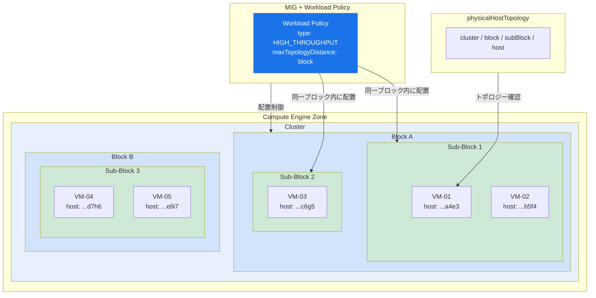

# Compute Engine: MIG ワークロードポリシーの GA およびインスタンストポロジー表示機能

**リリース日**: 2026-04-15

**サービス**: Compute Engine

**機能**: Workload Policies for MIGs (GA) / Instance Topology View

**ステータス**: 一般提供開始 (GA) / 新機能

[このアップデートのインフォグラフィックを見る](https://takech9203.github.io/google-cloud-news-summary/20260415-compute-engine-workload-policies-ga.html)

## 概要

Google Cloud は、Compute Engine において 2 つの重要なアップデートを発表した。1 つ目は、ゾーン内の Compute Engine インスタンスの物理的な配置場所 (トポロジー) を確認できる新機能であり、2 つ目は、マネージドインスタンスグループ (MIG) におけるワークロードポリシーの一般提供 (GA) 開始である。

インスタンストポロジー表示機能により、ユーザーはゾーン内でインスタンスがどのクラスタ、ブロック、サブブロック、ホストに配置されているかを確認できるようになった。この情報を活用することで、インスタンス間のネットワークレイテンシを把握し、ワークロードの最適化に役立てることができる。

MIG ワークロードポリシーの GA では、MIG 内のインスタンスの物理的な配置を制御できるようになった。ワークロードポリシーを適用することで、例えば AI/ML ワークロードを実行する際にインスタンスを物理的に近接配置し、ネットワークレイテンシを最小化できる。これにより、大規模な分散学習や高スループットを要求する HPC ワークロードのパフォーマンスが向上する。

**アップデート前の課題**

- MIG 内のインスタンスの物理的な配置を制御する手段はプレビュー段階であり、本番ワークロードでの利用に制約があった
- インスタンスがゾーン内のどの物理位置に配置されているかを確認する方法が限定的であり、レイテンシの原因特定が困難だった
- AI/ML の分散学習ワークロードにおいて、インスタンス間の通信レイテンシが不均一になる場合があり、パフォーマンスの予測が難しかった

**アップデート後の改善**

- MIG ワークロードポリシーが GA となり、本番環境で SLA に基づいたインスタンス配置の制御が可能になった
- `physicalHostTopology` フィールドを通じて、インスタンスのクラスタ、ブロック、サブブロック、ホストの物理位置を確認できるようになった
- ワークロードポリシーの `maxTopologyDistance` 設定により、インスタンス間の最大物理距離を厳密に制御できるようになった

## アーキテクチャ図



MIG ワークロードポリシーによるインスタンス配置制御とトポロジー階層構造を示す。ワークロードポリシーを適用すると、Compute Engine はインスタンスを指定された物理距離内 (例: 同一ブロック内) に配置する。トポロジー表示機能により、各インスタンスの cluster / block / subBlock / host の階層情報を確認できる。

## サービスアップデートの詳細

### 主要機能

1. **インスタンストポロジー表示**
   - ゾーン内の Compute Engine インスタンスの物理的な配置場所をクラスタトポロジーとして確認可能
   - `physicalHostTopology` フィールドにより cluster、block、subBlock、host の 4 階層で位置を特定
   - 複数インスタンス間でトポロジー情報を比較することで、物理的な近接度を判定可能
   - 共有するサブフィールドが多いほど、インスタンスが物理的に近い位置にあることを示す

2. **MIG ワークロードポリシー (GA)**
   - MIG 内のインスタンスの物理配置を制御するリソースポリシー
   - ワークロードタイプとして `HIGH_THROUGHPUT` を指定すると、ベストエフォートでインスタンスを近接配置
   - `maxTopologyDistance` を指定することで、厳密なコロケーションを実現 (`block` = 同一ブロック内、`cluster` = 隣接ブロック内)
   - `acceleratorTopology` の指定により、GPU 間の特殊な相互接続構成 (NVLink Domain など) に最適化可能

3. **コンパクト配置ポリシーとの使い分け**
   - コンパクト配置ポリシー: 個別インスタンスやバルク作成時に使用
   - ワークロードポリシー: MIG に対して使用
   - MIG を利用する場合はワークロードポリシーが推奨される

## 技術仕様

### トポロジー階層構造

| 階層 | フィールド | 説明 |
|------|-----------|------|
| クラスタ | `cluster` | ゾーン内のクラスタのグローバル名 |
| ブロック | `block` | 組織固有のブロック ID |
| サブブロック | `subBlock` | 組織固有のサブブロック ID |
| ホスト | `host` | インスタンスが稼働するホストの組織固有 ID |

### ワークロードポリシーの maxTopologyDistance

| maxTopologyDistance | 説明 | 対応マシンシリーズ | 最大 VM 数 |
|---------------------|------|-------------------|-----------|
| 未指定 | ベストエフォートで近接配置 (最大距離制限なし) | A4, A3 Ultra, A3 Mega, A3 High (8 GPU) | 1,500 |
| `cluster` | 隣接ブロック内に配置 | A4 | 1,500 |
| `block` | 同一ブロック内に配置 | A4, A3 Ultra | A4: 150 / A3 Ultra, A3 Mega, A3 High: 256 |

### 対応マシンタイプ

| マシンシリーズ | GPU | ワークロードポリシー対応 |
|--------------|-----|----------------------|
| A4X | NVIDIA H200 (NVLink Domain) | 対応 |
| A4 | NVIDIA H200 | 対応 |
| A3 Ultra | NVIDIA H200 | 対応 |
| A3 Mega | NVIDIA H100 80GB | 対応 |
| A3 High (8 GPU) | NVIDIA H100 80GB | 対応 |

## 設定方法

### 前提条件

1. Google Cloud プロジェクトで Compute Engine API が有効化されていること
2. `compute.instanceAdmin.v1` ロール (トポロジー表示)、`compute.resourcePolicies.create` 権限 (ワークロードポリシー作成) を持つ IAM ユーザーであること
3. ワークロードポリシーを使用する場合、対応するマシンタイプ (A4X, A4, A3 Ultra, A3 Mega, A3 High) が利用可能なリージョンであること

### 手順

#### ステップ 1: インスタンストポロジーの確認

```bash
# 単一インスタンスのトポロジーを確認
gcloud compute instances describe INSTANCE_NAME \
  --flatten=resourceStatus.physicalHostTopology \
  --zone=ZONE
```

出力例:

```
--- cluster: europe-west1-cluster-jfhb
    block: 3e3056e23cf91a5cb4a8621b6a52c100
    subBlock: 0fc09525cbd5abd734342893ca1c083f
    host: 1215168a4ecdfb434fd4d28056589059
```

#### ステップ 2: ワークロードポリシーの作成

```bash
# ベストエフォート配置のワークロードポリシー
gcloud compute resource-policies create workload-policy WORKLOAD_POLICY_NAME \
  --type=high-throughput \
  --region=REGION

# 厳密なコロケーション (同一ブロック内) のワークロードポリシー
gcloud compute resource-policies create workload-policy WORKLOAD_POLICY_NAME \
  --type=high-throughput \
  --max-topology-distance=block \
  --region=REGION
```

#### ステップ 3: ワークロードポリシーを MIG に適用

```bash
# ワークロードポリシーを指定して MIG を作成
gcloud compute instance-groups managed create MIG_NAME \
  --template=INSTANCE_TEMPLATE_URL \
  --size=TARGET_SIZE \
  --workload-policy=WORKLOAD_POLICY_URL \
  --zone=ZONE
```

#### ステップ 4: REST API によるトポロジーの一括確認

```bash
# ゾーン内の全稼働インスタンスのトポロジーを一覧表示
GET https://compute.googleapis.com/compute/v1/projects/PROJECT_ID/zones/ZONE/instances?fields=items.name,items.machineType,items.resourceStatus.physicalHostTopology&filter=status=RUNNING
```

REST API を使用すると、ゾーン内の複数インスタンスのトポロジーを一度に確認でき、配置の検証を効率的に行える。

## メリット

### ビジネス面

- **AI/ML ワークロードの高速化**: インスタンスの近接配置により、分散学習のオールリデュース (all-reduce) 通信のレイテンシが削減され、学習時間の短縮とコスト削減が可能
- **本番利用の信頼性**: GA となったことで Google Cloud の SLA が適用され、ミッションクリティカルな AI/ML パイプラインで安心して利用可能
- **運用効率の向上**: トポロジー表示機能により、パフォーマンス問題のトラブルシューティングが迅速化し、運用チームの負荷を軽減

### 技術面

- **レイテンシの予測可能性**: `maxTopologyDistance` の指定により、インスタンス間の物理距離を保証でき、ワークロードのパフォーマンスが安定
- **トポロジー可視化**: `physicalHostTopology` による 4 階層の位置情報により、ネットワークパフォーマンスの分析と最適化が容易
- **GPU ワークロードの最適化**: `acceleratorTopology` の指定により、NVLink Domain を活用した GPU 間通信の最適化が可能

## デメリット・制約事項

### 制限事項

- ワークロードポリシーは作成後に更新できない。設定を変更する場合は新しいポリシーを作成する必要がある
- 対応マシンシリーズは GPU マシン (A4X, A4, A3 Ultra, A3 Mega, A3 High) に限定されている
- `maxTopologyDistance` を指定した厳密なコロケーションでは、キャパシティ制約によりインスタンスが作成されない場合がある
- `block` レベルのコロケーションでは最大 VM 数が 150 (A4) または 256 (A3 Ultra/Mega/High) に制限される

### 考慮すべき点

- ワークロードポリシーを複数の MIG で共有する場合、各 MIG のインスタンスが個別に近接配置される。異なるワークロード間の分離が必要な場合に適している
- コンパクト配置ポリシーとワークロードポリシーは用途が異なる。個別インスタンスにはコンパクト配置ポリシー、MIG にはワークロードポリシーを使用すること
- トポロジー表示には `compute.instances.get` または `compute.instances.list` 権限が必要

## ユースケース

### ユースケース 1: 大規模言語モデルの分散学習

**シナリオ**: 数百台の A3 Ultra GPU インスタンスで構成される MIG を使用して、大規模言語モデルの分散学習を行う。インスタンス間の all-reduce 通信のレイテンシが学習効率に直結するため、インスタンスを同一ブロック内に配置したい。

**実装例**:
```bash
# 同一ブロック内配置のワークロードポリシーを作成
gcloud compute resource-policies create workload-policy llm-training-policy \
  --type=high-throughput \
  --max-topology-distance=block \
  --region=us-central1

# MIG を作成してワークロードポリシーを適用
gcloud compute instance-groups managed create llm-training-mig \
  --template=a3-ultra-template \
  --size=64 \
  --workload-policy=llm-training-policy \
  --zone=us-central1-a
```

**効果**: 同一ブロック内にインスタンスが配置されることで、インスタンス間のネットワークレイテンシが最小化され、分散学習のスループットが向上する。

### ユースケース 2: レイテンシ問題のトラブルシューティング

**シナリオ**: HPC ワークロードにおいて一部のインスタンス間通信で予期しないレイテンシが発生している。トポロジー表示機能を使用して、問題のあるインスタンスの物理的な配置を確認したい。

**実装例**:
```bash
# REST API でゾーン内の全インスタンスのトポロジーを確認
curl -H "Authorization: Bearer $(gcloud auth print-access-token)" \
  "https://compute.googleapis.com/compute/v1/projects/my-project/zones/us-central1-a/instances?fields=items(name,resourceStatus.physicalHostTopology)&filter=status=RUNNING"
```

**効果**: インスタンスのトポロジー情報を比較することで、レイテンシが高いインスタンスペアが異なるブロックに配置されていることを特定できる。ワークロードポリシーの適用やインスタンスの再配置により、問題を解決できる。

## 関連サービス・機能

- **[コンパクト配置ポリシー](https://docs.cloud.google.com/compute/docs/instances/use-compact-placement-policies)**: 個別インスタンスやバルク作成時にインスタンスの物理配置を制御するポリシー。MIG を使用しない場合はこちらを利用
- **[AI Hypercomputer](https://docs.cloud.google.com/ai-hypercomputer/docs)**: GPU/TPU インスタンスの大規模クラスタ管理。ワークロードポリシーと組み合わせてパフォーマンスを最適化
- **[MIG (マネージドインスタンスグループ)](https://docs.cloud.google.com/compute/docs/instance-groups)**: 同一構成のインスタンス群を管理する機能。オートスケーリング、自動修復と組み合わせて利用可能
- **[Flex-Start](https://docs.cloud.google.com/compute/docs/instances/flex-start-overview)**: MIG リサイズリクエストと連携して GPU リソースを取得する機能。ワークロードポリシーと併用可能

## 参考リンク

- [インフォグラフィック](https://takech9203.github.io/google-cloud-news-summary/20260415-compute-engine-workload-policies-ga.html)
- [公式リリースノート](https://docs.cloud.google.com/release-notes#April_15_2026)
- [配置ポリシーとワークロードポリシーの概要](https://docs.cloud.google.com/ai-hypercomputer/docs/placement-policy-and-workload-policy)
- [インスタンストポロジーの表示](https://docs.cloud.google.com/ai-hypercomputer/docs/manage/instance-topology)
- [HPC MIG の作成とワークロードポリシー](https://docs.cloud.google.com/compute/docs/hpc/create-hpc-migs-gsc-reservations)
- [コンパクト配置ポリシーの使用](https://docs.cloud.google.com/compute/docs/instances/use-compact-placement-policies)

## まとめ

今回のアップデートにより、Compute Engine の MIG ワークロードポリシーが GA となり、AI/ML や HPC ワークロードにおけるインスタンスの物理配置制御が本番環境で利用可能になった。同時に追加されたインスタンストポロジー表示機能と組み合わせることで、配置の検証やレイテンシのトラブルシューティングが容易になる。GPU を活用した大規模分散処理を行うユーザーは、ワークロードポリシーの適用を検討し、まずは既存インスタンスのトポロジーを確認してネットワーク最適化の余地を把握することを推奨する。

---

**タグ**: #ComputeEngine #WorkloadPolicies #MIG #InstanceTopology #GA
